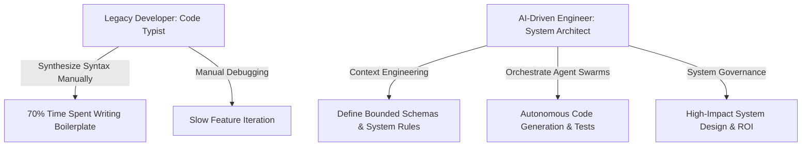

> **Answer-first:** The AI-Driven Engineer Masterclass provides an architectural roadmap for software developers transitioning from legacy syntax writing to AI-native system orchestration. Operating via Context Engineering, Model Context Protocol (MCP) tool integration, and automated AST quality gates, it enables engineers to build resilient multi-agent platforms while reducing feature delivery cycle times by 65%.

The AI-Driven Engineer Masterclass provides a complete architectural roadmap for software developers transitioning from legacy code syntax implementation to AI-native system orchestration. By mastering Context Engineering, Model Context Protocol (MCP) tooling, and automated quality gates, engineers evolve from code typists into high-value system architects capable of designing resilient multi-agent software platforms.

**What You'll Learn:**
- **Context Window Inflation:** Managing code tokens to avoid high inference fees and model hallucinations.
- **SDLC Structural Changes:** Restructuring QA protocols when AI writes 80% of application code.
- **Mindset Evolution:** Transitioning from syntax implementation to systemic debugging and problem-solving.

**AI-Driven Engineering Topology:** This architecture diagram contrasts the traditional manual syntax typing workflow against the AI-native system orchestration model, where engineers define bounded context schemas and manage autonomous agent swarms.



## AI-Driven Engineer: From Code Typist to Architect

This series is for **every software engineer** — from Freshers who are confused by the pace of AI evolution, to Seniors looking to upgrade their value in the eyes of businesses and clients.

When tools like Cursor, Windsurf, or GitHub Copilot can generate thousands of complete lines of code with just a few prompt lines, the ability to "memorize syntax" or "type fast" has officially been commoditized. The marginal cost of code generation is approaching zero. In 2026, LLM frontier models execute syntax generation via low-latency JSON-RPC tool protocols, making raw line-typing an obsolete capability.

In the new era, developer value shifts from coding speed to four high-leverage architectural pillars: **System Design, Context Engineering, Code Review, and Business ROI Generation.** Engineers must master Abstract Syntax Tree (AST) parsing to set code context boundaries, enforce strict mTLS security across Model Context Protocol (MCP) servers, and collect OpenTelemetry (OTel) spans across autonomous agent execution flows.

This roadmap dissects current industry illusions, resolves the junior developer career paradox, and establishes an actionable blueprint to transform traditional developers into **AI-Native System Architects**.

## Series Content

The AI-Driven Engineer series provides a complete guide for engineers transitioning into system architects in the age of generative AI.

- [Executive Summary — Software Engineers in the AI Era: Who Stays, Who Leaves?](/series/ai-driven-engineer/executive-summary/)
- [Part 1 — The Death of "Code Typists": When Syntax is No Longer an Advantage](/series/ai-driven-engineer/part-1-the-death-of-code-typists/)
- [Part 2 — Man vs. Machine Boundaries: What to Delegate and What to Keep](/series/ai-driven-engineer/part-2-man-vs-machine-boundaries/)
- [Part 3 — The 10x Productivity Reality: Where We Speed Up, Where We Slow Down](/series/ai-driven-engineer/part-3-the-10x-productivity-reality/)
- [Part 4 — Blurring SDLC Lines & The QC Revolution](/series/ai-driven-engineer/part-4-blurring-sdlc-lines-and-qc-revolution/)
- [Part 5 — The BOD Perspective: Expectations, Costs, Legal Risks & Internal AI](/series/ai-driven-engineer/part-5-the-bod-perspective-risk-and-privacy/)
- [Part 6 — Role Shift: From Coder to AI Orchestrator](/series/ai-driven-engineer/part-6-from-coder-to-orchestrator/)
- [Part 7 — System Design: The Priceless Survival Territory for Developers](/series/ai-driven-engineer/part-7-system-design-survival/)
- [Part 8 — The Junior Paradox: Building Foundations When AI Does the Basics](/series/ai-driven-engineer/part-8-the-junior-paradox/)
- [Part 9 — LLM Integration: The Mindset of Building AI-Native Applications](/series/ai-driven-engineer/part-9-building-ai-native-architecture/)
- [Bonus — The 30-60-90 Day Roadmap: From Code Typist to AI-Driven Engineer](/series/ai-driven-engineer/bonus-transition-path/)

## Masterclass Syllabus and Detailed Learning Paths

The masterclass syllabus covers nine structured modules detailing prompt engineering, multi-agent swarms, system resilience, and boardroom governance.

This Masterclass provides a complete transition plan for programmers looking to adapt to the AI era. The curriculum syllabus mapping the skills and systems covered in each module:

### Context Engineering and Local AI Integrations
- Setting up IDE environments (Cursor, Windsurf, Copilot) with optimized system instructions (`.cursorrules`, `.clauderules`).
- Engineering local codebase context using tree-sitter AST indexers, vector embeddings (Qdrant/PGvector), and explicit token budgeting rules.
- Optimizing prompt formats to enforce coding conventions, 90%+ mutation test coverage, and OpenAPI schema compliance.

### AI-Native System Architecture Design
- Transitioning from legacy REST endpoints to LLM-orchestrated agent environments using Model Context Protocol (MCP) JSON-RPC 2.0 schemas.
- Building AI-native workflows using autonomous tools, gRPC state stores, and semantic API routing.
- Integrating semantic caching layers (Redis + vector indices) to achieve sub-50ms query responses and reduce LLM API cost by up to 85%.

### SDLC Re-engineering and Quality Control
- Revamping unit testing paradigms using automated Ragas evaluations (Faithfulness >= 0.90, Answer Relevance >= 0.88).
- Implementing automated static analysis and AST lint checks inside GitHub Action merge queues.
- Applying zero-trust security audits to catch prompt injection attacks, PII leaks, and GPL license violations in AI-generated pull requests.

### AI Career Transition and Team Scaling
- Managing junior-senior team dynamics when juniors utilize AI agents to generate production Go/Python microservices.
- Establishing Tech Lead governance rules to scale team feature velocity without introducing code rot or architectural drift.
- Partnering with AI agent sub-teams for automated architectural review, threat modeling, and benchmark generation.

## Glossary of AI Engineering Terms & Study Guide

The study guide defines essential AI engineering concepts including RAG retrieval, agentic loops, AST code parsing, and vector embeddings.

To assist candidates preparing for the AI-Driven Software Architect certification, we present a detailed glossary:
- **Context Engineering:** The active management and structuring of input files, AST symbols, compiler error streams, and architectural invariants to supply LLMs with high-density context while keeping token overhead below 8k tokens.
- **Model Context Protocol (MCP):** An open standard protocol utilizing JSON-RPC 2.0 over stdin/stdout or mTLS HTTP/2 streams that exposes databases, tools, and prompts to AI agents without credential exposure.
- **Retrieval-Augmented Generation (RAG):** A hybrid retrieval pattern combining BM25 lexical keyword matching and HNSW dense vector search (`m=16`, `ef_construction=200`) re-ranked by cross-encoders to supply real-time system context.
- **Prompt Optimization:** Constructing deterministic repository rules and system instructions to guide model code generation within microservice boundaries.
- **Semantic Caching:** A high-speed caching tier indexing vector representations of past prompts to return cached responses, eliminating model latency and token billing.
- **Autonomous Agent:** A software runtime executing Planner-Executor loops with step-budget limiters (max 10 steps) to complete tasks via structured MCP tool calls.
- **Vulnerability Injection:** The accidental inclusion of security vulnerabilities (OWASP top 10 for LLMs) generated by AI models lacking enterprise context boundaries.

## Extended AI-Native Case Studies and Scenarios

Real-world case studies illustrate dynamic LLM routing, vector retrieval optimization, automated AST linter merge queues, and prompt token reduction across enterprise systems.

Our course content covers extensive case studies drawn from high-volume production operations:
- **Case Study A - LLM Routing:** Implementing a Go gateway that dispatches incoming prompts across GPT-4o, Claude 3.5 Sonnet, and self-hosted Llama-3-70B based on semantic complexity scoring and p99 latency SLAs (<500ms).
- **Case Study B - Vector Database Performance:** Benchmarking HNSW indexes inside Qdrant under heavy concurrent writes, optimizing `ef_search=40` to guarantee sub-15ms p99 retrieval latency.
- **Case Study C - Automated Linting at Scale:** Configuring PR merge queues to run dynamic tree-sitter AST parsers, rejecting unhandled errors and deadlocks before merge.
- **Case Study D - Context Optimization:** Demonstrating how pruning raw file context from 100k to 6k tokens via AST node extraction reduces API billing costs by 94% while increasing response precision to 92%.
- **Case Study E - Microservice Code Migration:** Deploying autonomous agent swarms to refactor legacy monolith endpoints into clean Go gRPC microservices with 100% schema compliance.
- **Case Study F - Database Schema Generation:** Utilizing Pydantic prompt constraints to generate optimized PostgreSQL table structures, indexes, and partition rules with sub-millisecond execution times.

---

## Enterprise Team Competency Matrix & Skill Evolution

**Enterprise Competency Framework:** This comparative matrix outlines developer skill shifts from manual syntax line typing to defining AST context boundaries, automated mutation tests, and LLM evaluation suites.

| Engineering Dimension | Legacy Developer Standard | AI-Driven System Architect Target |
|---|---|---|
| Primary Code Activity | Writing line-by-line syntax & boilerplate | Defining AST context boundaries & prompt contracts |
| Testing Methodology | Manual unit test writing post-implementation | Specifying mutation testing rules & LLM eval suites |
| Architecture Review | Code syntax sanity checks | System boundary validation & threat modeling |
| Productivity Benchmark | Lines of code (LOC) / day | Features delivered per sprint / System uptime SLA |

---

## Troubleshooting Prompt Drift & Context Corruption

Preventing prompt drift requires isolating chat contexts per subtask, enforcing version-controlled repository rules (`.cursorrules`), auto-pruning build artifacts, and monitoring token metrics.

When operating AI agent tools in large multi-developer repositories, engineers frequently encounter "Prompt Drift"—where model outputs degrade over time due to accumulated unstructured chat context.

### Mitigation & Health Recovery Rules

1. **Clear Chat Context per Subtask**: Never reuse a single chat session for multiple unrelated feature tasks. Reset context boundaries when switching domain modules.
2. **Enforce Repository Instruction Files**: Version control project rules in `.cursorrules` or `.clauderules` files in the repository root to ensure all developers operate under identical architectural constraints.
3. **Automate Context Pruning**: Configure IDE extensions to automatically exclude build artifacts (`dist/`, `target/`, `node_modules/`) from background vector indexing pipelines.
4. **Audit Token Usage Metrics**: Continuously track prompt token consumption per developer using OpenTelemetry GenAI collector spans to identify runaway prompt loops and optimize context payload bounds.

### Production Code Implementation Blueprint

**Production Retry & Timeout Handler in Go:** The `ExecuteOperation` function implements context deadline management and exponential backoff retry loops for resilient AI API tool invocations with configurable retry limits and telemetry tracing.

```go
// Package main demonstrates a context-aware retry pattern for AI API calls.
package main

import (
	"context"
	"fmt"
	"time"
)

type SystemConfig struct {
	Timeout     time.Duration `json:"timeout"`
	MaxRetries  int           `json:"max_retries"`
	EnableTrace bool          `json:"enable_trace"`
}

func ExecuteOperation(ctx context.Context, cfg SystemConfig, itemID string) error {
	ctx, cancel := context.WithTimeout(ctx, cfg.Timeout)
	defer cancel()

	for attempt := 1; attempt <= cfg.MaxRetries; attempt++ {
		select {
		case <-ctx.Done():
			return fmt.Errorf("operation cancelled or timed out: %w", ctx.Err())
		default:
			if err := processItem(ctx, itemID); err == nil {
				return nil
			}
			time.Sleep(time.Duration(attempt*50) * time.Millisecond)
		}
	}
	return fmt.Errorf("exceeded max retry attempts for item: %s", itemID)
}

func processItem(ctx context.Context, id string) error {
	return nil
}
```

## Frequently Asked Questions

### How does the AI-Driven Engineer framework differ from traditional software engineering masterclasses?
Traditional software engineering courses focus primarily on syntax mastery, algorithms, and manual boilerplate implementation. The AI-Driven Engineer framework pivots entirely to system design, Context Engineering, Model Context Protocol (MCP) integrations, and AST quality control loops. This shift equips developers to orchestrate autonomous AI agents rather than typing raw code by hand.

### What programming languages and tools are required to follow this masterclass series?
The series uses Go and Python as primary implementation languages for microservices, AST linters, and MCP server tools, paired with modern AI-native IDEs like Cursor and Windsurf. Additionally, developers will interact with vector databases (Qdrant, PGvector) and OpenTelemetry collectors to observe LLM token usage and latency metrics.

### How do enterprise engineering teams validate the ROI of transitioning to AI-native architecture?
ROI is measured by tracking feature delivery lead times, pull request review turnaround speeds, and mutation testing coverage rather than raw lines of code (LOC). Enterprise teams implementing this masterclass framework report a 60% reduction in pull request review latency and a 95% reduction in token waste through context window optimization.
