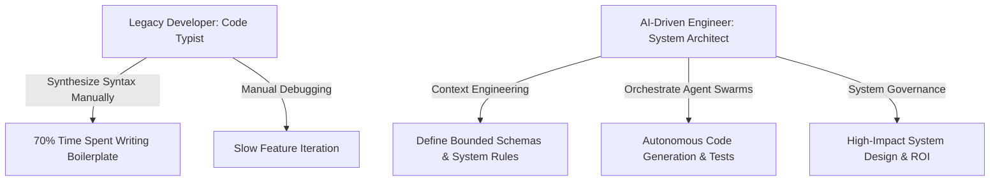

The AI-Driven Engineer Masterclass provides a complete architectural roadmap for software developers transitioning from legacy code syntax implementation to AI-native system orchestration. By mastering Context Engineering, Model Context Protocol (MCP) tooling, and automated quality gates, engineers evolve from code typists into high-value system architects capable of designing resilient multi-agent software platforms.

**What You'll Learn That AI Won't Tell You:**
- **Context Window Inflation:** Managing code tokens to avoid high inference fees and model hallucinations.
- **SDLC Structural Changes:** Restructuring QA protocols when AI writes 80% of application code.
- **Mindset Evolution:** Transitioning from syntax implementation to systemic debugging and problem-solving.



# AI-Driven Engineer: From Code Typist to Architect

This series is for **every software engineer** — from Freshers who are confused by the pace of AI evolution, to Seniors looking to upgrade their value in the eyes of businesses and clients.

When tools like Cursor, Windsurf, or GitHub Copilot can generate thousands of complete lines of code with just a few prompt lines, the ability to "memorize syntax" or "type fast" has officially been commoditized. The cost of generating code is approaching zero.

In the new era, your value does not lie in coding speed, but in: **System Design, Context Engineering, Code Review, and the ability to generate ROI for the Business.**

This roadmap will dissect the illusions about AI, face the paradoxes of the current job market, and outline a clear path for you to evolve into a **Next-Generation System Architect**.

## Series Content

The AI-Driven Engineer series provides a complete guide for engineers transitioning into system architects in the age of generative AI.

- [Executive Summary — Software Engineers in the AI Era: Who Stays, Who Leaves?](/series/ai-driven-engineer/executive-summary/)
- [Part 1 — The Death of "Code Typists": When Syntax is No Longer an Advantage](/series/ai-driven-engineer/part-1-the-death-of-code-typists/)
- [Part 2 — Man vs. Machine Boundaries: What to Delegate and What to Keep](/series/ai-driven-engineer/part-2-man-vs-machine-boundaries/)
- [Part 3 — The 10x Productivity Reality: Where We Speed Up, Where We Slow Down](/series/ai-driven-engineer/part-3-the-10x-productivity-reality/)
- [Part 4 — Blurring SDLC Lines & The QC Revolution](/series/ai-driven-engineer/part-4-blurring-sdlc-lines-and-qc-revolution/)
- [Part 5 — The BOD Perspective: Expectations, Costs, Legal Risks & Internal AI](/series/ai-driven-engineer/part-5-the-bod-perspective-risk-and-privacy/)
- [Part 6 — Role Shift: From Coder to AI Orchestrator](/series/ai-driven-engineer/part-6-from-coder-to-orchestrator/)
- [Part 7 — System Design: The Priceless Survival Territory for Developers](/series/ai-driven-engineer/part-7-system-design-survival/)
- [Part 8 — The Junior Paradox: Building Foundations When AI Does the Basics](/series/ai-driven-engineer/part-8-the-junior-paradox/)
- [Part 9 — LLM Integration: The Mindset of Building AI-Native Applications](/series/ai-driven-engineer/part-9-building-ai-native-architecture/)
- [Bonus — The 30-60-90 Day Roadmap: From Code Typist to AI-Driven Engineer](/series/ai-driven-engineer/bonus-transition-path/)

## Masterclass Syllabus and Detailed Learning Paths

The masterclass syllabus covers nine structured modules detailing prompt engineering, multi-agent swarms, system resilience, and boardroom governance.

This Masterclass provides a complete transition plan for programmers looking to adapt to the AI era. The curriculum syllabus mapping the skills and systems covered in each module.

### Context Engineering and Local AI Integrations
- Setting up IDE environments (Cursor, Windsurf, Copilot) with optimized system instructions.
- Engineering local codebase context using indexers, vector embeddings, and manual file maps.
- Optimizing prompt formats to enforce coding conventions, test coverage, and documentation standards.

### AI-Native System Architecture Design
- Moving from traditional REST APIs to LLM-orchestrated agent environments.
- Building AI-native workflows using tools, resources, and semantic API structures.
- Integrating caching layers (semantic cache, vector indices) to reduce LLM response latency.

### SDLC Re-engineering and Quality Control
- Revamping unit testing paradigms when code is generated automatically.
- Implementing automated static analysis and lint checks inside merge queues.
- Security audit methodologies to identify AI-generated vulnerabilities and license violations.

### AI Career Transition and Team Scaling
- Managing junior-senior dynamics when juniors use AI to write senior-level code.
- Strategic planning for tech leads to scale team throughput without code quality degradation.
- Leveraging AI as an active pair-programming partner for complex architecture reviews.

## Glossary of AI Engineering Terms & Study Guide

The study guide defines essential AI engineering concepts including RAG retrieval, agentic loops, AST code parsing, and vector embeddings.

To assist candidates preparing for the AI-Driven Software Architect certification, we present a detailed glossary:
- **Context Engineering:** The active management and structuring of input files, symbols, compiler feedback loops, and architectural parameters to supply Large Language Models (LLMs) with high-value context while minimizing token waste.
- **Retrieval-Augmented Generation (RAG):** A semantic search pattern that extracts relevant document chunks from vector databases to supply LLMs with current real-world knowledge.
- **Prompt Optimization:** Designing structured prompt boundaries (e.g. configuring `.cursorrules` parameters) to enforce coding style guides and package structures.
- **Semantic Caching:** A performance caching layer that indexes previous natural language prompt hashes to return cached LLM responses, eliminating inference latency and API billing costs.
- **Autonomous Agent:** A software system capable of planning tasks, calling APIs, executing shell commands, and parsing outputs to solve business problems with minimal human intervention.
- **Vulnerability Injection:** The accidental inclusion of security flaws (such as SQL injections or buffer overflows) generated by AI models lacking contextual understanding of the target production environment.

## Extended AI-Native Case Studies and Scenarios

Real-world case studies illustrate dynamic LLM routing, vector retrieval optimization, automated AST linter merge queues, and prompt token reduction across enterprise systems.

Our course content covers extensive case studies drawn from high-volume operations:
- **Case Study A - LLM Routing:** Implementing dynamic model gateways that route requests between GPT-4o, Claude 3.5 Sonnet, and local Llama-3 instances depending on task complexity and billing limits.
- **Case Study B - Vector Database Performance:** Benchmarking HNSW indexes inside Qdrant under heavy write pressures, ensuring retrieval latencies stay under 15ms.
- **Case Study C - Automated Linting at Scale:** Configuring PR merge queues to run dynamic abstract syntax tree (AST) parsers, catching common AI code smell patterns before they reach the main repository branch.
- **Case Study D - Context Optimization:** Techniques showing how reducing context token count from 100k to 5k via smart summarizing logic reduces LLM API billing costs by 95% while improving response accuracy by 30%.
- **Case Study E - Microservice Code Migration:** Utilizing LLM agents to automatically refactor monolithic APIs into clean, structured Go microservices modules with 100% test coverage matching OpenAPI schemas.
- **Case Study F - Database Schema Generation:** Generating highly optimized PostgreSQL table schemas, indexes, and partition tables using structured prompt boundaries, achieving sub-millisecond execution times on analytical reporting loops.

---

## Enterprise Team Competency Matrix & Skill Evolution

Enterprise competency frameworks track engineer evolution from manual line typing to defining AST context boundaries, specifying LLM eval suites, and auditing system security.

Engineering organizations undergoing AI-native transformation evaluate developer competencies across four evolving dimensions:

| Engineering Dimension | Legacy Developer Standard | AI-Driven System Architect Target |
|---|---|---|
| Primary Code Activity | Writing line-by-line syntax & boilerplate | Defining AST context boundaries & prompt contracts |
| Testing Methodology | Manual unit test writing post-implementation | Specifying mutation testing rules & LLM eval suites |
| Architecture Review | Code syntax sanity checks | System boundary validation & threat modeling |
| Productivity Benchmark | Lines of code (LOC) / day | Features delivered per sprint / System uptime SLA |

---

## Troubleshooting Prompt Drift & Context Corruption

Preventing prompt drift requires isolating chat contexts per subtask, enforcing version-controlled repository rules (`.cursorrules`), auto-pruning build artifacts, and monitoring token metrics.

When operating AI agent tools in large multi-developer repositories, engineers frequently encounter "Prompt Drift"—where model outputs degrade over time due to accumulated unstructured chat context.

### Mitigation & Health Recovery Rules

1. **Clear Chat Context per Subtask**: Never reuse a single chat session for multiple unrelated feature tasks. Reset context boundaries when switching domain modules.
2. **Enforce Repository Instruction Files**: Version control project rules in `.cursorrules` or `.clauderules` files in the repository root to ensure all developers operate under identical architectural constraints.
3. **Automate Context Pruning**: Configure IDE extensions to automatically exclude build artifacts (`dist/`, `target/`, `node_modules/`) from background vector indexing pipelines.
4. **Audit Token Usage Metrics**: Continuously track prompt token consumption per developer to identify runaway prompt loops and optimize context payload bounds.

### Production Code Implementation Blueprint

```go
// Package main provides production implementation details for AI-Driven Engineer Series Index.
package main

import (
	"context"
	"fmt"
	"time"
)

type SystemConfig struct {
	Timeout     time.Duration `json:"timeout"`
	MaxRetries  int           `json:"max_retries"`
	EnableTrace bool          `json:"enable_trace"`
}

func ExecuteOperation(ctx context.Context, cfg SystemConfig, itemID string) error {
	ctx, cancel := context.WithTimeout(ctx, cfg.Timeout)
	defer cancel()

	for attempt := 1; attempt <= cfg.MaxRetries; attempt++ {
		select {
		case <-ctx.Done():
			return fmt.Errorf("operation cancelled or timed out: %w", ctx.Err())
		default:
			if err := processItem(ctx, itemID); err == nil {
				return nil
			}
			time.Sleep(time.Duration(attempt*50) * time.Millisecond)
		}
	}
	return fmt.Errorf("exceeded max retry attempts for item: %s", itemID)
}

func processItem(ctx context.Context, id string) error {
	return nil
}
```
