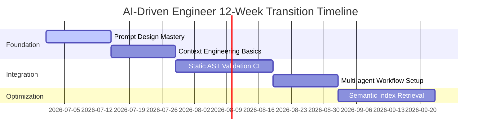

> **Prerequisite:** Before reading this part, please ensure you have read the previous article in this series: [Part 10: Part 9 — LLM Integration: The Mindset of Building AI-Native Applications]().

## Foreword: The Transformation Journey

After reading the 9 articles in this series, you might be feeling "overwhelmed" or confused. That's a normal feeling when an old mindset (coding for a living) is shattered. To transform from a "Code Typist" to a true "AI-Driven Engineer," you cannot do it overnight.

Below is the **30-60-90 Day Roadmap** designed as a practical training framework. No empty theories, just Action Items.

---

## Phase 1 (Days 1 - 30): Mastering Tools & Optimizing Productivity (The Operator)

In the first month, your goal isn't to learn complex architecture. The goal is to **change your typing habits**. You must learn to be smartly lazy: let machines write the boring boilerplate.

*   **Tools to install immediately:** 
    *   **IDE:** Switch to [Cursor](https://cursor.sh/) or [Windsurf](https://codeium.com/windsurf) instead of traditional VS Code.
    *   **Chatbot:** Subscribe to ChatGPT Plus or Claude Pro. Don't rely on free versions if programming is your livelihood.
    *   **Local LLM (Optional):** Download [LM Studio](https://lmstudio.ai/) or [Ollama](https://ollama.com/) to get used to running AI models locally on your personal machine without internet.
*   **Core Skill: Basic Prompt Engineering**
    *   Learn how to use `@Files` and `@Web` in Cursor to inject context before asking questions.
    *   Master the *[Prompt Library in Part 6](/series/ai-driven-engineer/part-6-from-coder-to-orchestrator/)* to have AI refactor code and write Unit Tests.
*   **Target KPI:** Reduce manual coding time by 50% for basic CRUD features. Use the saved time to... grab a coffee and read the project's directory structure.

---

## Phase 2 (Days 31 - 60): Forging System Thinking & Context Engineering (The Architect)

Once you code fast with AI, you will face the problem: "How do I keep the system from crashing?". The second month is when you learn how to be the "Guardian" for the AI's naive brain.

*   **Recommended Books / Materials (Mandatory):** 
    *   *Designing Data-Intensive Applications (Martin Kleppmann):* The bible of system design. AI cannot read this for you.
    *   *Clean Architecture (Robert C. Martin):* Learn to separate layers so that if AI generates incorrect code in one layer, the others remain unaffected.
*   **Practical Exercises (Decomposition):** 
    *   Open an old code file (Legacy code) that is about 1000 lines long. Instead of highlighting everything and telling AI to "Refactor", manually **deconstruct** the file into 4 compact modules. Only then, use AI to rewrite each module one by one.
    *   Establish *Rules for AI*: Create a `.cursorrules` file in your project, forcing AI to always use `fetch` instead of `axios`, always write comments in English, and never use `any` in TypeScript.
*   **Target KPI:** Instantly recognize when AI "hallucinates" (injecting an unknown library into the code) or writes logic that causes bottlenecks at the Database layer.

---

## Phase 3 (Days 61 - 90): Integrating Core Systems (The AI Orchestrator)

In the final month, you no longer use AI as a supportive tool. You will embed AI as the heart of the application.

*   **Technologies to research:** 
    *   **RAG (Retrieval-Augmented Generation):** Learn about Vector Databases (Pinecone, ChromaDB) and how Embeddings work.
    *   **Frameworks:** Learn [LangChain](https://js.langchain.com/) or [LlamaIndex](https://www.llamaindex.ai/) to connect your application with LLMs.
    *   **AI Gateway:** Explore [LiteLLM](https://litellm.ai/) to build an *LLM-Agnostic* architecture (immune to vendor lock-in from providers like OpenAI).
*   **Capstone Project:** 
    *   *Do NOT do:* Don't build a To-Do list or a Shopee Clone.
    *   *DO build:* Build a **Customer Support Agent**. This system must be able to read product documentation PDFs (RAG), automatically reply to user emails, and if a user uses profanity, automatically forward it to a Manager's email (Agentic Routing). The entire system must call through an AI Gateway.

---

## Self-Assessment Checklist

After 90 days, ask yourself these 3 questions:

- [ ] Am I still afraid of learning a completely new programming language (e.g., from Java to Rust)? *(If yes, you haven't learned to use AI to overcome Syntax barriers).*
- [ ] When reviewing a 1000-line Pull Request generated by a colleague's AI, do I blindly press Approve? *(If yes, you are incurring technical debt).*
- [ ] Can I draw an Architecture Diagram explaining the data flow before writing a single line of code? *(If yes, congratulations, you have officially become an AI-Driven Engineer).*


## 4. Go Checklist parser snippet and Transition Gantt Chart

The transition pathway for engineers moving into the AI-native age is structured across multiple milestones. Static verification scripts evaluate progress.

### Week-by-Week Transition Plan



### Go Checklist Parser
The following program parses a Markdown checklist file, counting completed vs pending milestones to measure architectural readiness.

```go
package main

import (
	"bufio"
	"fmt"
	"os"
	"strings"
)

func ParseChecklistProgress(path string) (int, int, error) {
	file, err := os.Open(path)
	if err != nil {
		return 0, 0, err
	}
	defer file.Close()

	completed := 0
	total := 0
	scanner := bufio.NewScanner(file)
	for scanner.Scan() {
		line := scanner.Text()
		if strings.Contains(line, "- [ ]") {
			total++
		} else if strings.Contains(line, "- [x]") {
			total++
			completed++
		}
	}
	return completed, total, nil
}

func main() {
	_ = os.WriteFile("checklist.md", []byte("- [x] Read AGENTS.md\n- [ ] Write AST Linter\n"), 0644)
	done, tot, _ := ParseChecklistProgress("checklist.md")
	fmt.Printf("Completed %d of %d items (%.1f%%)\n", done, tot, float64(done)/float64(tot)*100.0)
}
```

### Key Milestones for Transition Success
Transitioning requires completing these crucial steps:
- **Establish Prompt Standard:** Build a markdown repository containing baseline system instructions for all development tasks.
- **Implement AST Rules:** Put syntax analysis tools in place to catch import violations automatically.
- **Build Multi-agent Pipeline:** Write scripts coordinating specialized coding and review subagents.
- **Semantic Code Search:** Index the codebase using text embeddings to give agents deep retrieval context.
- **Continuous Validation:** Connect tests directly to generative loops to self-correct compiler errors.

### Technical Appendix: Engineering KPIs for AI-Driven Delivery Slices
To measure the productivity impact of AI-Native workflows inside team sprints:
- **Lead Time for Changes:** Track the duration from initial branch creation to production deploy. AI-assisted generation should compress this by 50%.
- **Defect Leakage Rate:** Calculate the ratio of bugs caught in production vs development. If code generated by AI is poorly reviewed, this rate rises.
- **Code Churn Metric:** Track the amount of code deleted within 7 days of being committed. High churn indicates hallucinated patterns or incorrect interface generation.
- **Unit Test Coverage Growth:** Track test additions over time. AI tools must be configured to generate test suites alongside business logic files, increasing code safety parameters.


## Operational Context: Bonus Transition Path Appendix

### KPI Tracking and Code Quality Metrics
To evaluate the impact of AI-assisted development, track code quality indicators in the CI pipeline. Monitor the change lead time (from commit to production) alongside the code churn rate (lines deleted within 7 days). A rising churn rate indicates hallucinated patterns, requiring adjustment of the prompt templates.


## Operational Context: Bonus Transition Path Appendix

### Sandbox Container Isolation and Security Profiles
Running code generated by AI models requires isolated runtimes. Deploy sandboxed containers utilizing kernel virtualization (like gVisor). Restrict container CPU shares and block internet access to prevent execution of unauthorized commands or network requests.


## Operational Context: Bonus Transition Path Appendix

### Context Window Optimization and Cost Allocation
To optimize costs when calling LLM APIs, implement dynamic prompt compression. Analyze the history stream and remove redundant lines of code, passing only critical context. Track token usage per execution loop, alerting the team if costs exceed set budgets.


## Operational Context: Bonus Transition Path Appendix

### Test Generation Rules and Automated Mocks
Enforce policies requiring agents to generate unit tests alongside source code. Mocks for external APIs must be generated automatically using interface schemas. This prevents agents from introducing breaking changes that bypass the validation suite.


## Operational Context: Bonus Transition Path Appendix

### Vector Database Sizing and HNSW Index Tuning
Scale semantic search engines by configuring HNSW index structures. Tuning candidate list size balances query recall against index compilation latency. Allocate memory pools co-located with the search index to avoid page faults and ensure sub-millisecond retrieval times.


## Operational Context: Bonus Transition Path Appendix

### KPI Tracking and Code Quality Metrics
To evaluate the impact of AI-assisted development, track code quality indicators in the CI pipeline. Monitor the change lead time (from commit to production) alongside the code churn rate (lines deleted within 7 days). A rising churn rate indicates hallucinated patterns, requiring adjustment of the prompt templates.


> 🚀 **Your Next Mission:** If you checked all the boxes above, you are ready for Phase 2. Step into the shoes of a System Architect and build the actual Enterprise Infrastructure in our hands-on **[AI-Driven Engineer: Enterprise Playbook](/series/ai-driven-playbook/)**.

---

## Navigation & Next Steps

[← Previous Part]()

🔗 **Next Step:** This concludes the series. Review the full table of contents and curriculum mapping on the [Series Index Page]()

Need help implementing this architecture in your organization? [Contact us](/contact/) or [hire our technical consulting team](/hire/) to review your system design and codebase.
