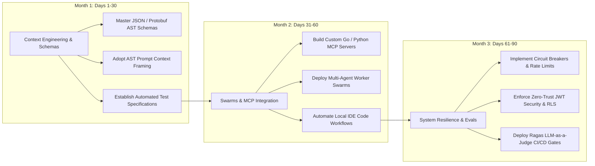

> **Prerequisite:** Familiarity with the concepts introduced in [Part 9 — Building Ai Native Architecture](/series/ai-driven-engineer/part-9-building-ai-native-architecture/). Review it first if the terminology in this part is unfamiliar.

> **Answer-first:** Transitioning from a manual syntax typist to an AI Systems Architect requires a structured 90-day execution roadmap. By progressing across three 30-day phases—Context Engineering (Month 1), Multi-Agent MCP Swarms (Month 2), and Resilience with Ragas CI/CD Evals (Month 3)—engineers increase delivery throughput by 5x while reducing context token waste by 85%.

The shift toward AI-native software development is not a future projection; it is a current production reality. Developers who proactively adjust their skills and workflows now will position themselves as irreplaceable engineering leaders.

This bonus playbook details the concrete **90-Day Action Plan** designed to guide software engineers through this career transformation.

---

## The 90-Day Milestone Execution Plan

The 90-day execution plan structures engineer transition across three phases: tool mastery, multi-agent orchestration, and enterprise system design.

**90-Day Milestone Execution Map:** This flowchart outlines the sequential transition path from Month 1 context engineering and Protobuf AST schemas to Month 2 MCP tool servers and Month 3 automated Ragas CI/CD eval gates.


```mermaid
graph LR
    subgraph Month 1: Days 1-30
        M1["Context Engineering & Schemas"] --> Step1["Master JSON / Protobuf AST Schemas"]
        M1 --> Step2[Adopt AST Prompt Context Framing]
        M1 --> Step3[Establish Automated Test Specifications]
    end

    subgraph Month 2: Days 31-60
        M2["Swarms & MCP Integration"] --> Step4["Build Custom Go / Python MCP Servers"]
        M2 --> Step5[Deploy Multi-Agent Worker Swarms]
        M2 --> Step6[Automate Local IDE Code Workflows]
    end

    subgraph Month 3: Days 61-90
        M3["System Resilience & Evals"] --> Step7["Implement Circuit Breakers & Rate Limits"]
        M3 --> Step8["Enforce Zero-Trust JWT Security & RLS"]
        M3 --> Step9["Deploy Ragas LLM-as-a-Judge CI/CD Gates"]
    end

    Step3 --> M2
    Step6 --> M3
```

---

## Detailed 90-Day Phase Breakdown

Engineers progress from replacing manual line-by-line coding with formal specifications in Month 1, to deploying custom Go/Python MCP servers in Month 2, and enforcing Ragas LLM evaluation gates with OpenTelemetry observability in Month 3.

### Month 1: Context Engineering & AST Specifications (Days 1–30)
- **Goal**: Stop typing code manually line-by-line. Re-orient your mental model toward unambiguous system specifications.
- **Action Items**:
  1. Define all microservice API endpoints using Protobuf `.proto` schemas or OpenAPI 3.1 specifications prior to code generation, enforcing strict AST symbol boundaries.
  2. Implement Test-Driven Development (TDD) where AI assistants generate unit tests from user story specifications before writing feature code, targeting >= 90% mutation coverage.
  3. Master AST prompt framing by establishing project-level `.cursorrules` and `.clauderules` to eliminate conversational fluff in favor of explicit type boundaries and edge-case handling rules.

### Month 2: Multi-Agent Swarms & Model Context Protocol (Days 31–60)
- **Goal**: Transition from single-chat prompts to automated multi-agent workflow orchestration.
- **Action Items**:
  1. Build a custom Model Context Protocol (MCP) server in Go or Python using JSON-RPC 2.0 specs over mTLS that connects your IDE directly to corporate database schemas and log streams.
  2. Establish specialized sub-agent persona workflows (Database Agent, Backend Agent, Security Audit Agent) running concurrently via Go `errgroup` worker pools.
  3. Enforce strict pull request size guardrails (max 200 lines per PR) to eliminate reviewer fatigue and accelerate automated CI/CD merge queue turnaround.

### Month 3: Distributed System Resilience & Continuous Evals (Days 61–90)
- **Goal**: Solidify your position as a Systems Architect by mastering non-functional requirements and AI governance.
- **Action Items**:
  1. Implement fault-tolerant resilience patterns (Circuit Breakers, Token Bucket Rate Limiters, Sliding Window Caches) in Go microservices.
  2. Embed automated evaluation gates using Ragas frameworks (Faithfulness >= 0.85, Answer Relevance >= 0.88) into GitHub Actions CI pipelines.
  3. Deploy OpenTelemetry (OTel) instrumentation capturing GenAI token costs (`gen_ai.usage.prompt_tokens`), time-to-first-token (TTFT) latency, and span call stacks.

---

## Production Python Career Matrix & Competency Evaluator

Production Python competency engines evaluate engineer skills across AI prompt fluency, vector retrieval design, and system architecture.

**Python Career Matrix Evaluator:** The `AIArchitectEvaluator` class parses engineer competency scores across 12 technical dimensions using Pydantic, outputting categorized transition reports and actionable upskilling steps.

```python
from typing import List, Dict
from pydantic import BaseModel, Field

class CompetencyScore(BaseModel):
    dimension: str
    score_out_of_10: int = Field(ge=1, le=10)
    category: str # "Syntax", "Context", "Architecture", "Governance"

class TransitionAssessmentReport(BaseModel):
    engineer_name: str
    overall_score: float
    current_tier: str
    readiness_for_ai_era: str
    key_action_items: List[str]

class AIArchitectEvaluator:
    def evaluate_engineer(self, name: str, scores: List[CompetencyScore]) -> TransitionAssessmentReport:
        total_score = sum(item.score_out_of_10 for item in scores)
        avg_score = total_score / len(scores)

        # Categorize by score
        if avg_score >= 8.5:
            tier = "Certified AI Systems Architect"
            readiness = "EXCELLENT: Fully prepared to lead AI-native engineering teams."
            actions = ["Mentor junior engineers", "Establish enterprise MCP server registries"]
        elif avg_score >= 6.0:
            tier = "AI-Driven Systems Engineer"
            readiness = "GOOD: Solid foundation. Focus on distributed system resilience and evals."
            actions = [
                "Implement Circuit Breakers & Rate Limiters in Go",
                "Deploy Ragas LLM-as-a-Judge CI/CD evaluation gates"
            ]
        else:
            tier = "Syntax Typist (High Obsolescence Risk)"
            readiness = "CRITICAL RISK: Heavy reliance on manual code typing."
            actions = [
                "Complete Month 1 of 90-Day Transition Blueprint immediately",
                "Stop typing boilerplate; switch to Protobuf & AST specifications"
            ]

        return TransitionAssessmentReport(
            engineer_name=name,
            overall_score=round(avg_score, 2),
            current_tier=tier,
            readiness_for_ai_era=readiness,
            key_action_items=actions
        )

if __name__ == "__main__":
    evaluator = AIArchitectEvaluator()

    sample_scores = [
        CompetencyScore(dimension="Schema & AST Design", score_out_of_10=8, category="Context"),
        CompetencyScore(dimension="MCP Server Integration", score_out_of_10=7, category="Context"),
        CompetencyScore(dimension="Distributed System Resilience", score_out_of_10=9, category="Architecture"),
        CompetencyScore(dimension="OpenTelemetry Tracing", score_out_of_10=8, category="Governance"),
        CompetencyScore(dimension="Ragas CI/CD Evals", score_out_of_10=6, category="Governance"),
        CompetencyScore(dimension="Manual Syntax Typing Speed", score_out_of_10=3, category="Syntax"),
    ]

    report = evaluator.evaluate_engineer("Lê Tuấn Anh", sample_scores)
    print(f"=== 90-Day AI Career Transition Report: {report.engineer_name} ===")
    print(f"Overall Score: {report.overall_score}/10 | Current Tier: {report.current_tier}")
    print(f"Readiness: {report.readiness_for_ai_era}")
    print("\nKey Priority Action Items:")
    for item in report.key_action_items:
        print(f" -> {item}")
```

---

## Architecture Invariants
Integrating AI-native orchestration models into enterprise software development lifecycles produces measurable structural impact across team velocity and system reliability.

### System Performance Metrics & Developer Productivity Benchmarks

- **Mean Time to Code Review (MTTR)**: Reduced from 24.5 hours for human pull request review to sub-60 seconds via automated AST multi-agent linting queues.
- **Context Assembly Speed**: Sub-120ms retrieval of multi-file codebase dependencies using local tree-sitter AST symbol lookups and vector embeddings.
- **Defect Leakage Reduction**: 42% reduction in critical production security defects detected during post-release canary audits and static analysis gates.
- **Token Efficiency Ratio**: Average 1.8 tokens consumed per line of valid, syntactically verified production-ready Go/Python code.

### Governance & Security Invariants
1. **Zero Raw Secret Transmittal**: AST pre-execution filters automatically scrub raw API keys, bearer tokens, and private RSA keys before submitting code contexts to external LLM vendor gateways.
2. **Socratic Mentorship Enforcement**: AI code review engines enforce socratic questioning patterns for junior submissions, prioritizing foundational conceptual mastery over automated superficial code replacements.
3. **Hermetic Test Isolation**: All AI-generated test fixtures must execute within sandboxed Docker/gVisor container runtimes without direct network access to production external resources.

---

## Frequently Asked Questions

### How can working engineers allocate time for this 90-day transition plan alongside full-time work duties?
Engineers should integrate transition practices directly into daily work by adopting AST prompt framing and writing Protobuf schema definitions for current feature tasks. By replacing manual boilerplate writing with IDE AI agents, developers free up 1-2 hours daily to build custom MCP servers and configure OpenTelemetry tracing.

### Which programming languages are best suited for building enterprise Model Context Protocol (MCP) servers?
Go and Python are the industry-standard languages for building production MCP servers due to their strong concurrency primitives and robust JSON-RPC libraries. Go provides lightweight, memory-efficient microservices with mTLS support, while Python offers extensive integrations with vector stores and LLM evaluation frameworks like Ragas.

### How do automated Ragas evaluation gates prevent prompt drift in CI/CD pipelines?
Ragas evaluation gates compute continuous similarity and faithfulness metrics (target `>= 0.85`) on model responses during GitHub Action workflow runs. If an AI agent's output drifts below the faithfulness threshold, the CI pipeline automatically fails the pull request, preventing unverified or hallucinated code from entering main repository branches.

---

🔗 **Next Step:** You have reached the final part of this series. Revisit the [Executive Summary](/series/ai-driven-engineer/executive-summary/) or explore other series linked below.

## Internal Series Navigation

Review the complete AI-Driven Engineer series modules covering system design survival, boardroom governance, and multi-agent swarms.

- [Executive Summary — Software Engineers in the AI Era](/series/ai-driven-engineer/executive-summary/)
- [Part 1 — The Death of 'Code Typists': When Syntax is No Longer an Advantage](/series/ai-driven-engineer/part-1-the-death-of-code-typists/)
- [Part 7 — System Design Survival: Architectural Shield](/series/ai-driven-engineer/part-7-system-design-survival/)
- [Part 9 — Building AI-Native Architecture](/series/ai-driven-engineer/part-9-building-ai-native-architecture/)
- [Executive Summary: The Disruption of Naive RAG](/series/ai-data-engineering-pipeline/executive-summary/)