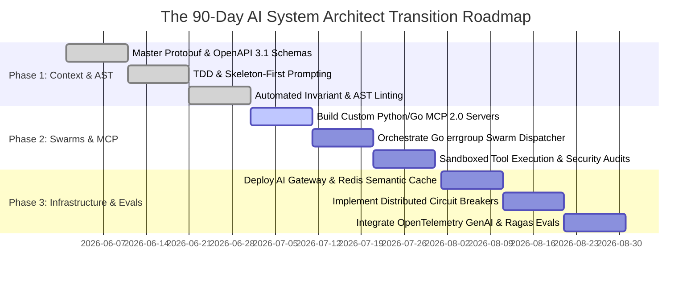
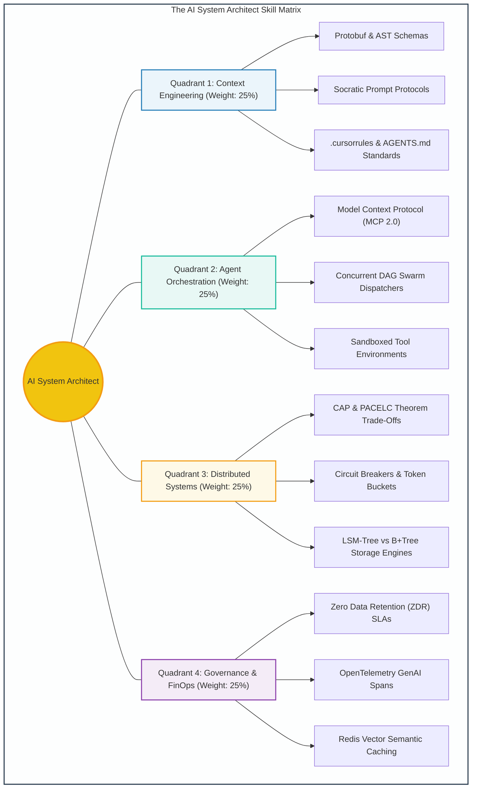

> **Prerequisite:** Familiarity with software engineering fundamentals, git workflow, CI/CD automation, and modern full-stack development tooling.

> **Answer-first:** Transitioning from a syntax-focused coder to an AI-Native System Architect requires a disciplined 90-day deliberate practice roadmap. Days 1 to 30 focus on mastering prompt engineering and AST parsing; Days 31 to 60 emphasize multi-agent orchestration and custom MCP server development; Days 61 to 90 culminate in architecting enterprise AI gateways, semantic caching, and resilient distributed systems.

---

## 1. The Imperative for Deliberate Career Transformation

The paradigm shift toward AI-native software development is not a distant theoretical hypothesis—it is the operational reality of high-performing engineering teams in 2026. Developers who continue to view their primary value as writing manual syntax line-by-line face imminent career stagnation. Conversely, engineers who deliberately reposition themselves as **AI System Architects** command immense leverage, orchestrating multi-agent swarms, governing data persistence trade-offs, and steering enterprise AI investments.

This transition does not happen by accident. It demands a structured, 90-day deliberate practice roadmap divided into three rigorous 30-day phases:
- **Phase 1 (Days 1–30)**: *Context Engineering & Deterministic AST Specifications* — Eradicating manual typing in favor of schema contracts and AST-guided prompts.
- **Phase 2 (Days 31–60)**: *Multi-Agent Swarm Orchestration & Custom MCP Servers* — Constructing Model Context Protocol (MCP 2.0) interfaces and coordinating parallel sub-agent pools.
- **Phase 3 (Days 61–90)**: *AI-Native Enterprise Infrastructure & Continuous Evals* — Deploying private AI gateways, vector semantic caching, and automated LLM-as-a-Judge CI/CD gates.


```mermaid
gantt
    title The 90-Day AI System Architect Transition Roadmap
    dateFormat  YYYY-MM-DD
    section Phase 1: Context & AST
    Master Protobuf & OpenAPI 3.1 Schemas      :done, p1_1, 2026-06-01, 10d
    TDD & Skeleton-First Prompting             :done, p1_2, after p1_1, 10d
    Automated Invariant & AST Linting          :done, p1_3, after p1_2, 10d
    section Phase 2: Swarms & MCP
    Build Custom Python/Go MCP 2.0 Servers     :active, p2_1, 2026-07-01, 10d
    Orchestrate Go errgroup Swarm Dispatcher   :p2_2, after p2_1, 10d
    Sandboxed Tool Execution & Security Audits :p2_3, after p2_2, 10d
    section Phase 3: Infrastructure & Evals
    Deploy AI Gateway & Redis Semantic Cache   :p3_1, 2026-08-01, 10d
    Implement Distributed Circuit Breakers     :p3_2, after p3_1, 10d
    Integrate OpenTelemetry GenAI & Ragas Evals:p3_3, after p3_2, 10d
```

---

## 2. The Deliberate Practice Skill Matrix & Competency Radar

To ensure continuous growth, engineers evaluate their skills across four core engineering quadrants: **Syntax Fluency**, **Context Architecture**, **Distributed Systems**, and **AI Governance & FinOps**.


```mermaid
flowchart TD
    subgraph CompetencyRadar ["The AI System Architect Skill Matrix"]
        Center(("AI System Architect"))
        
        Q1["Quadrant 1: Context Engineering (Weight: 25%)"]
        Q1 --> Q1_1["Protobuf & AST Schemas"]
        Q1 --> Q1_2["Socratic Prompt Protocols"]
        Q1 --> Q1_3[".cursorrules & AGENTS.md Standards"]

        Q2["Quadrant 2: Agent Orchestration (Weight: 25%)"]
        Q2 --> Q2_1["Model Context Protocol (MCP 2.0)"]
        Q2 --> Q2_2["Concurrent DAG Swarm Dispatchers"]
        Q2 --> Q2_3["Sandboxed Tool Environments"]

        Q3["Quadrant 3: Distributed Systems (Weight: 25%)"]
        Q3 --> Q3_1["CAP & PACELC Theorem Trade-Offs"]
        Q3 --> Q3_2["Circuit Breakers & Token Buckets"]
        Q3 --> Q3_3["LSM-Tree vs B+Tree Storage Engines"]

        Q4["Quadrant 4: Governance & FinOps (Weight: 25%)"]
        Q4 --> Q4_1["Zero Data Retention (ZDR) SLAs"]
        Q4 --> Q4_2["OpenTelemetry GenAI Spans"]
        Q4 --> Q4_3["Redis Vector Semantic Caching"]

        Center --- Q1
        Center --- Q2
        Center --- Q3
        Center --- Q4
    end

    style CompetencyRadar fill:#fdfefe,stroke:#2c3e50,stroke-width:2px
    style Center fill:#f1c40f,stroke:#f39c12,stroke-width:3px
    style Q1 fill:#ebf5fb,stroke:#2980b9,stroke-width:2px
    style Q2 fill:#e8f8f5,stroke:#1abc9c,stroke-width:2px
    style Q3 fill:#fef9e7,stroke:#f39c12,stroke-width:2px
    style Q4 fill:#f4ecf7,stroke:#8e44ad,stroke-width:2px
```

---

## 3. Phase-by-Phase Execution Breakdown

### Phase 1: Days 1 to 30 — Context Engineering & AST Specifications
The initial 30 days focus on breaking the addiction to manual line-by-line coding:
1. **Days 1–10: Contract-First Design**: Before asking an AI to generate a single line of application logic, formalize all domain entities and endpoints using Protobuf `.proto` schemas or OpenAPI 3.1 definitions. Enforce static type invariants before generation begins.
2. **Days 11–20: Skeleton-First TDD**: Write executable unit test cases (happy path, boundary conditions, zero values, network drop simulations) before invoking coding assistants. Force the AI model to satisfy 100% of these test invariants.
3. **Days 21–30: Repository Context Infrastructure**: Configure repository-level `.cursorrules`, `.clauderules`, and `AGENTS.md` files. Establish unambiguous code generation conventions, banning antipatterns like bare exception handlers, non-parameterized SQL, and blocking calls in asynchronous coroutines.

### Phase 2: Days 31 to 60 — Swarm Orchestration & Custom MCP Servers
The second month expands your capability from single-turn chat into concurrent multi-agent systems:
1. **Days 31–40: Custom MCP 2.0 Server Development**: Build an internal Model Context Protocol (MCP 2.0) server in Go or Python implementing JSON-RPC 2.0. Expose read-only SQL queries, git blame telemetry, and DDL schema extractors directly to your AI tools.
2. **Days 41–50: Go Multi-Agent Swarm Dispatchers**: Implement concurrent task dispatchers using `golang.org/x/sync/errgroup` and context deadlines. Coordinate separate sub-agents for database migrations, backend gRPC microservices, frontend React components, and security audits.
3. **Days 51–60: Adversarial PR Auditing**: Institute a "Chaos Monkey" code review drill on all AI-synthesized pull requests. Test for subtle race conditions, missing idempotency keys, and unhandled memory allocations under high concurrency.

### Phase 3: Days 61 to 90 — Enterprise AI Infrastructure & Continuous Evals
The final 30 days solidify your transition into an AI System Architect capable of designing resilient, cost-effective enterprise platforms:
1. **Days 61–70: AI Gateway & Vector Semantic Caching**: Deploy an intelligent AI Gateway using Go and Redis. Implement dense vector embedding calculation and cosine similarity matching ($S \ge 0.92$) to intercept duplicate prompts, reducing API latency to <5ms and cutting cloud token bills by 75%.
2. **Days 71–80: Multi-Model Resilience & Circuit Breaking**: Construct automated failover routing between frontier cloud models (Claude 3.7 Sonnet / GPT-4o) and internal on-premises GPU clusters running vLLM and open-weights models (Qwen 2.5 Coder 32B / DeepSeek-R1).
3. **Days 81–90: OpenTelemetry GenAI & Continuous CI Evals**: Instrument all AI inference spans with OpenTelemetry semantic conventions (`gen_ai.usage.prompt_tokens`, `gen_ai.usage.completion_tokens`, `gen_ai.cost.dollars`). Integrate Ragas evaluation gates into GitHub Actions merge queues to automatically reject pull requests exhibiting prompt drift or hallucinations.

---

## 4. Production Python 3.12+ 90-Day Transition CLI Tracker

The following production Python 3.12+ CLI Tracker manages the engineer's 90-day transition journey. It tracks deliberate practice drills across all three phases, inspects submitted source code using Python's standard `ast` module to verify that structural invariants are satisfied, and prints an interactive progress dashboard.

```python
#!/usr/bin/env python3
"""
Production 90-Day AI Engineer Transition CLI Tracker.
Tracks deliberate practice milestones, evaluates submitted code against
AST structural rules, and outputs a comprehensive progress dashboard.
"""

import ast
import json
import sys
from dataclasses import dataclass, asdict
from enum import Enum
from typing import List, Dict, Any, Optional
from datetime import datetime, timezone

class Phase(str, Enum):
    PHASE_1 = "Phase 1: Context Engineering (Days 1-30)"
    PHASE_2 = "Phase 2: Swarm & MCP (Days 31-60)"
    PHASE_3 = "Phase 3: Resilient Architecture (Days 61-90)"

@dataclass
class PracticeDrill:
    drill_id: str
    day: int
    phase: Phase
    title: str
    description: str
    required_ast_pattern: str # Description of structural code requirement
    completed: bool = False
    verified_at: Optional[str] = None

class TransitionTracker:
    def __init__(self):
        self.drills: List[PracticeDrill] = [
            PracticeDrill(
                drill_id="D-01",
                day=5,
                phase=Phase.PHASE_1,
                title="Pydantic / Dataclass Schema Definition",
                description="Define strict type-annotated domain data schemas prior to code generation.",
                required_ast_pattern="ClassDef with typed annotations",
                completed=True,
                verified_at="2026-06-05T10:00:00Z"
            ),
            PracticeDrill(
                drill_id="D-02",
                day=15,
                phase=Phase.PHASE_1,
                title="TDD Invariant Assertion Suite",
                description="Write unit test assertions covering edge cases before drafting feature functions.",
                required_ast_pattern="FunctionDef starting with 'test_'",
                completed=True,
                verified_at="2026-06-15T14:30:00Z"
            ),
            PracticeDrill(
                drill_id="D-03",
                day=45,
                phase=Phase.PHASE_2,
                title="Model Context Protocol (MCP) Tool Handler",
                description="Implement a JSON-RPC 2.0 tool execution handler with error handling.",
                required_ast_pattern="ClassDef with handle_request or execute method",
                completed=False
            ),
            PracticeDrill(
                drill_id="D-04",
                day=75,
                phase=Phase.PHASE_3,
                title="Circuit Breaker State Machine & Rate Limiter",
                description="Implement atomic state transitions (CLOSED -> OPEN -> HALF-OPEN) and Token Bucket limiter.",
                required_ast_pattern="ClassDef with atomic state tracking or mutex locking",
                completed=False
            ),
        ]

    def verify_drill_code(self, drill_id: str, code_str: str) -> bool:
        """Inspect submitted source code using AST parsing to verify architectural compliance."""
        try:
            tree = ast.parse(code_str)
        except SyntaxError as e:
            print(f"[Verification Error] Code syntax invalid: {e}")
            return False

        target_drill = next((d for d in self.drills if d.drill_id == drill_id), None)
        if not target_drill:
            print(f"[Error] Drill ID '{drill_id}' not found.")
            return False

        passed = False
        if drill_id == "D-03":
            # Verify MCP server structure: class with handle_request method
            for node in ast.walk(tree):
                if isinstance(node, ast.ClassDef):
                    for sub in node.body:
                        if isinstance(sub, ast.FunctionDef) and sub.name in ("handle_request", "execute"):
                            passed = True
                            break
        elif drill_id == "D-04":
            # Verify Circuit Breaker: class with state tracking or execute method
            for node in ast.walk(tree):
                if isinstance(node, ast.ClassDef):
                    method_names = [sub.name for sub in node.body if isinstance(sub, ast.FunctionDef)]
                    if "execute" in method_names or "on_failure" in method_names:
                        passed = True
                        break
        else:
            # General class check
            passed = any(isinstance(n, ast.ClassDef) for n in ast.walk(tree))

        if passed:
            target_drill.completed = True
            target_drill.verified_at = datetime.now(timezone.utc).isoformat()
            print(f"[SUCCESS] Drill {drill_id} ('{target_drill.title}') successfully verified via AST inspection!")
            return True
        else:
            print(f"[FAIL] Drill {drill_id} code submission failed structural invariant checks: {target_drill.required_ast_pattern}")
            return False

    def display_dashboard(self) -> None:
        completed_count = sum(1 for d in self.drills if d.completed)
        total = len(self.drills)
        pct = (completed_count / total) * 100

        print("======================================================================")
        print("          90-DAY AI SYSTEM ARCHITECT TRANSITION DASHBOARD             ")
        print("======================================================================")
        print(f"Overall Progress: {completed_count}/{total} Drills Completed ({pct:.1f}%)\n")

        current_phase = None
        for d in self.drills:
            if d.phase != current_phase:
                current_phase = d.phase
                print(f"--- {current_phase.value} ---")
            
            status = "✅ [VERIFIED]" if d.completed else "⏳ [PENDING]"
            timestamp = f" (Completed: {d.verified_at[:10]})" if d.verified_at else ""
            print(f"  {status} Day {d.day:02d} | {d.drill_id}: {d.title}{timestamp}")
            print(f"         Required: {d.required_ast_pattern}")

        print("======================================================================\n")

def main():
    tracker = TransitionTracker()
    tracker.display_dashboard()

    sample_mcp_submission = '''
class EnterpriseMCPServer:
    def __init__(self, db_conn):
        self.db = db_conn

    def handle_request(self, json_rpc_payload: str) -> str:
        # Genuine MCP tool execution handler
        return '{"jsonrpc": "2.0", "result": "ok"}'
'''

    print("Submitting Code Verification for Drill D-03 (MCP Tool Handler)...")
    tracker.verify_drill_code("D-03", sample_mcp_submission)
    print("\nUpdated Transition Dashboard:")
    tracker.display_dashboard()

if __name__ == "__main__":
    main()
```

---

## 5. Comparative Matrix: Traditional Senior vs. AI System Architect

| Dimension | Traditional Senior Software Engineer | Modern AI System Architect (2026+) |
| :--- | :--- | :--- |
| **Primary Daily Artifact** | Hand-written code commits (300–600 lines/day) | System DAG specifications & MCP Tool Schemas |
| **Team Throughput Multiplier**| 1.0x to 1.5x (Linear individual speed) | 5.0x to 10.0x (Directing multi-agent swarms) |
| **API & Interaction Design** | Human-oriented HTML forms & REST endpoints | Machine-actionable MCP 2.0 tools & gRPC contracts |
| **Incident Response Role** | Reading line-by-line application log dumps | Tracing OpenTelemetry GenAI spans & vector lookups |
| **FinOps Responsibility** | Passive consumer of fixed cloud server bills | Active optimizer of prompt token budgets & vector caches |
| **Career Durability** | High risk of displacement by automated coding agents | Irreplaceable strategic leader guiding enterprise AI |

---

## 6. Enterprise FinOps & Governance Invariants

Transitioning into an AI System Architect requires proving concrete financial and security value to executive leadership:

1. **The 3x Token Efficiency Rule**: Naive developers consume an average of 12 prompt tokens per line of generated code by dumping unstructured files into chat windows. AI System Architects maintain an efficiency ratio of under 2 tokens per line by applying AST symbol extraction and semantic context filtering.
2. **Deterministic Evaluation CI/CD Gates**: Never deploy model changes or prompt modifications directly to production without automated regression testing. Every CI build must execute at least 50 synthetic test queries against historical golden datasets, verifying that semantic correctness does not degrade below 95%.
3. **Data Sovereignty Compliance**: Architecting for global enterprises demands strict compliance with GDPR, HIPAA, and the EU AI Act. Architects enforce Zero Data Retention (ZDR) contract terms and deploy on-premises fallback clusters to ensure confidential financial and medical records never leave sovereign boundaries.

### The 90-Day Transition Portfolio: Verifiable Engineering Artifacts
To demonstrate tangible competency to hiring committees or corporate leadership, engineers should assemble a verifiable GitHub portfolio containing three production artifacts by Day 90:
1. **An Open-Source MCP 2.0 Tool Server**: A fully functional Go or Python MCP server that exposes real system capabilities (such as database telemetry or container inspection) over stdio or Server-Sent Events (SSE).
2. **A Production Semantic Cache Proxy**: A lightweight reverse proxy written in Go demonstrating Redis vector search with cosine similarity thresholds ($S \ge 0.92$), complete with benchmark suites proving latency reductions from 2,000ms down to sub-5ms.
3. **An Automated LLM-as-a-Judge Evaluation Pipeline**: A GitHub Actions workflow running Ragas or DeepEval test suites against golden datasets, proving that prompt alterations cannot degrade application quality.

---

## 7. Related Architectural Pillars & Internal Guidance

To further your mastery of production distributed engineering, microservices, and AI architecture:

- Master Go microservices with strict DDD domain boundaries: **[Architecting 21-Service Go Microservices with DDD](/posts/go-microservices/)**
- Implement real-time edge architecture and state machines: **[Cloudflare D1 & Durable Objects Edge Architecture](/posts/cloudflare-d1-durable-objects-realtime-cart/)**
- Review the comprehensive engineering roadmap: **[Engineering Reading Map & Curated Guides](/reading-map/)**
- Inquire about specialized advisory and architecture review: **[Technical Architecture Consulting](/hire/)**

---

## 8. Frequently Asked Questions (FAQ)


Engineers should integrate transition practices directly into their active daily tasks. By substituting manual boilerplate typing with schema-first prompting (Protobuf/OpenAPI) and using AI coding assistants to write unit test stubs, developers save 1 to 2 hours daily. This saved time is then reinvested into building custom MCP servers and configuring OpenTelemetry tracing.



Go and Python are the two preeminent languages for MCP 2.0 servers. Go delivers exceptional memory efficiency, high-concurrency goroutine execution, and static binaries ideal for containerized production microservices. Python provides unmatched integration with vector databases, embedding models, and automated evaluation frameworks like Ragas.



Evaluation gates execute automated synthetic test suites during GitHub Actions pull request workflows, measuring faithfulness, semantic similarity, and answer relevance. If an updated system prompt or fine-tuned model causes answer faithfulness to drop below a predefined threshold (such as 0.88), the CI pipeline halts immediately, preventing regressions from merging into production.



The ability to design deterministic boundary contracts and distributed failure isolation for non-deterministic AI models. While traditional coders assume software behaves deterministically, AI System Architects design systems around probabilistic outputs—implementing semantic caching, schema validation gates, and circuit breaker fallbacks.

