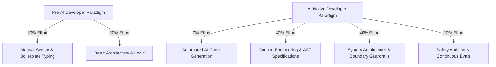
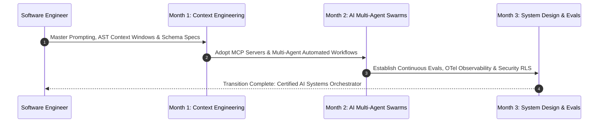

> **Key Takeaway**: The commoditization of raw syntax typing by LLMs shifts software engineering value from manual coding to Systems Architecture, Context Engineering, and AI Swarm Orchestration. Utilizing tree-sitter AST validation engines and Model Context Protocol (MCP) tool integration, system orchestrators achieve 5x throughput while enforcing strict zero-trust security and sub-second code evaluation loops.

The software engineering discipline is undergoing its most profound structural shift since the transition from machine assembly language to high-level compiled programming languages.

For the past three decades, a developer's value was heavily measured by their fluency in programming syntax, standard framework APIs, and manual debugging efficiency. Today, LLM code assistants generate complex boilerplate, regex parsers, and microservice handlers instantly from natural language specifications.

---

## The Engineer's Evolution Matrix

The engineer evolution matrix maps the career transition from manual syntax writing to AI-driven system architecture and multi-agent swarm orchestration.

**Engineer Evolution Topology:** This flowchart illustrates the shift in engineering effort allocation from 80% manual syntax typing in legacy paradigms to 80% context engineering and system architecture guardrails in AI-native paradigms.


```mermaid
graph TD
    Sub1[Pre-AI Developer Paradigm] --> |80% Effort| SyntaxTyping["Manual Syntax & Boilerplate Typing"]
    Sub1 --> |20% Effort| SysArch1["Basic Architecture & Logic"]

    Sub2[AI-Native Developer Paradigm] --> |0% Effort| SyntaxAuto[Automated AI Code Generation]
    Sub2 --> |40% Effort| ContextEng["Context Engineering & AST Specifications"]
    Sub2 --> |40% Effort| SysArch2["System Architecture & Boundary Guardrails"]
    Sub2 --> |20% Effort| QualitySafety["Safety Auditing & Continuous Evals"]
```

### Technical Paradigm Evolution
- **Who Leaves (The Syntax Typists)**: Developers whose primary skill is converting user tickets into standard CRUD syntax without understanding underlying distributed systems, thread synchronization, or business domain boundaries.
- **Who Stays (The Systems Orchestrators)**: Engineers who command multi-agent workflows, design resilient system topologies, enforce strict zero-trust security, and validate non-functional performance requirements. In 2026, orchestrators use Model Context Protocol (MCP) servers to grant agents sandboxed database access while running automated tree-sitter AST linters in PR merge queues to prevent context pollution.

---

## Comparative Matrix: Traditional Developer vs. AI-Native Systems Orchestrator

Traditional developers spend 70% of time typing code, while AI-native system orchestrators focus on system design, context engineering, and automated quality control.

**Developer Competency Shift Matrix:** This comparison table highlights key operational metrics and tooling differences between legacy syntax typists and modern AI-native systems orchestrators.

| Engineering Dimension | Traditional Syntax Typist | AI-Native Systems Orchestrator |
| :--- | :--- | :--- |
| **Primary Output** | Raw code lines typed manually | Formal specifications, AST constraints, & Evals |
| **Workflow Bottleneck** | Typing speed & API syntax lookups | System architecture design & context curation |
| **Code Review Role** | Spotting missing semicolons & syntax bugs | Validating thread safety, security RLS, & memory boundaries |
| **Daily Tooling** | Text Editor & StackOverflow | Multi-Agent IDEs, MCP Servers, & OTel Tracing |
| **Productivity Factor** | $1\times$ baseline manual speed | $5\times - 10\times$ verified output throughput |
| **Core Competency** | Language-specific syntax mastery | Domain-Driven Design (DDD) & Distributed Systems |

---

## Production Go System Architecture Validator

A production Go architecture validator parses codebase interfaces and microservice contracts to enforce design compliance on AI-generated pull requests.

**Go AST Architecture Validator Engine:** The `InspectBoundaryRules` method concurrently parses Go file abstract syntax trees using `errgroup` and `sync.Pool`, flagging unsafe `panic` calls and architectural boundary violations across pull requests.

```go
package main

import (
	"context"
	"fmt"
	"go/ast"
	"go/parser"
	"go/token"
	"log"
	"sync"
	"time"

	"golang.org/x/sync/errgroup"
)

type CodeBoundaryViolation struct {
	FilePath string
	Line     int
	Message  string
}

type ArchitectureChecker struct {
	pool sync.Pool
}

func NewArchitectureChecker() *ArchitectureChecker {
	return &ArchitectureChecker{
		pool: sync.Pool{
			New: func() interface{} {
				return token.NewFileSet()
			},
		},
	}
}

func (c *ArchitectureChecker) InspectBoundaryRules(ctx context.Context, filePaths []string) ([]CodeBoundaryViolation, error) {
	var violations []CodeBoundaryViolation
	var mu sync.Mutex

	g, ctx := errgroup.WithContext(ctx)

	for _, path := range filePaths {
		path := path
		g.Go(func() error {
			fset := c.pool.Get().(*token.FileSet)
			defer c.pool.Put(fset)

			// Parse Go source file AST
			node, err := parser.ParseFile(fset, path, nil, parser.ParseComments)
			if err != nil {
				return fmt.Errorf("failed to parse file %s: %w", path, err)
			}

			// Inspect AST for forbidden unbuffered channel creation or raw panic usage
			ast.Inspect(node, func(n ast.Node) bool {
				if call, ok := n.(*ast.CallExpr); ok {
					if ident, ok := call.Fun.(*ast.Ident); ok {
						if ident.Name == "panic" {
							pos := fset.Position(call.Pos())
							mu.Lock()
							violations = append(violations, CodeBoundaryViolation{
								FilePath: path,
								Line:     pos.Line,
								Message:  "Forbidden raw 'panic' call detected. Use structured error handling.",
							})
							mu.Unlock()
						}
					}
				}
				return true
			})
			return nil
		})
	}

	if err := g.Wait(); err != nil {
		return nil, err
	}

	return violations, nil
}

func main() {
	ctx, cancel := context.WithTimeout(context.Background(), 5*time.Second)
	defer cancel()

	checker := NewArchitectureChecker()
	// Simulate AST architectural validation over system codebase files
	sampleFiles := []string{"main.go"}

	violations, err := checker.InspectBoundaryRules(ctx, sampleFiles)
	if err != nil {
		log.Fatalf("Boundary check failed: %v", err)
	}

	fmt.Printf("[Architecture Checker] Completed inspection across %d files. Violations found: %d\n",
		len(sampleFiles), len(violations))
}
```

---

## The 90-Day Transition Roadmap

The 90-day transition roadmap provides a structured blueprint for mastering AI prompt engineering, agent swarms, and enterprise security guardrails.

**90-Day Architect Transition Sequence:** This sequence diagram maps an engineer's 90-day progression from AST prompt context framing in Month 1 to multi-agent MCP swarms in Month 2 and continuous Ragas CI evals in Month 3.


```mermaid
sequenceDiagram
    autonumber
    participant Dev as Software Engineer
    participant Month1 as Month 1: Context Engineering
    participant Month2 as Month 2: AI Multi-Agent Swarms
    participant Month3 as Month 3: System Design & Evals

    Dev->>Month1: Master Prompting, AST Context Windows & Schema Specs
    Month1->>Month2: Adopt MCP Servers & Multi-Agent Automated Workflows
    Month2->>Month3: Establish Continuous Evals, OTel Observability & Security RLS
    Month3-->>Dev: Transition Complete: Certified AI Systems Orchestrator
```

1. **Month 1 (Context Engineering & Prompt ASTs)**: Move away from manual code typing. Learn to frame requirements as unambiguous JSON/Protobuf schemas, AST specifications, and test-driven assertions targeting sub-8k token prompt context budgets.
2. **Month 2 (Multi-Agent Swarms & MCP)**: Integrate Model Context Protocol (MCP) servers into your local IDE via JSON-RPC 2.0 specs. Automate code generation, static linting, and automated unit testing via local agent execution loops.
3. **Month 3 (System Architecture & Security Guardrails)**: Focus 100% of your energy on high-level system boundaries, database sharding strategies, distributed locks, zero-trust RBAC security, and OpenTelemetry GenAI observability spans.

---

## Frequently Asked Questions

### Which software engineering roles face the highest risk of obsolescence in the AI era?
Software developers whose daily work is limited to translating user tickets into standard CRUD API syntax face high obsolescence risk. In contrast, engineers who specialize in system design, distributed data boundaries, security threat modeling, and multi-agent context engineering retain high enterprise value.

### How do Senior Architects shift their daily workflow when AI tools write the majority of application code?
Senior Architects transition from manually typing line-by-line function logic to curating AST context windows, establishing `.cursorrules` prompt specifications, and reviewing AI-generated pull requests against strict safety invariants. They also build automated validation tooling—such as custom AST parsers and MCP tool gateways—to govern codebase quality.

### What metrics should engineering leaders use to measure team productivity in AI-native organizations?
Leaders should abandon raw lines of code (LOC) and commit counts in favor of cycle time, feature delivery velocity per sprint, pull request review turnaround speed, and production defect leakage rates. Tracking OpenTelemetry GenAI spans allows leads to monitor token usage efficiency alongside system availability SLAs.

---

## Internal Series Navigation

Navigate through all nine modules of the AI-Driven Engineer series exploring productivity myths, boardroom security, and system survival.

- [Part 1 — The Death of 'Code Typists': When Syntax is No Longer an Advantage](/series/ai-driven-engineer/part-1-the-death-of-code-typists/)
- [Part 2 — Man vs. Machine Boundaries in Engineering](/series/ai-driven-engineer/part-2-man-vs-machine-boundaries/)
- [Part 6 — From Coder to Orchestrator: Swarms & Workflows](/series/ai-driven-engineer/part-6-from-coder-to-orchestrator/)
- [Part 7 — System Design Survival: Architectural Shield](/series/ai-driven-engineer/part-7-system-design-survival/)
- [Executive Summary: The Disruption of Naive RAG](/series/ai-data-engineering-pipeline/executive-summary/)