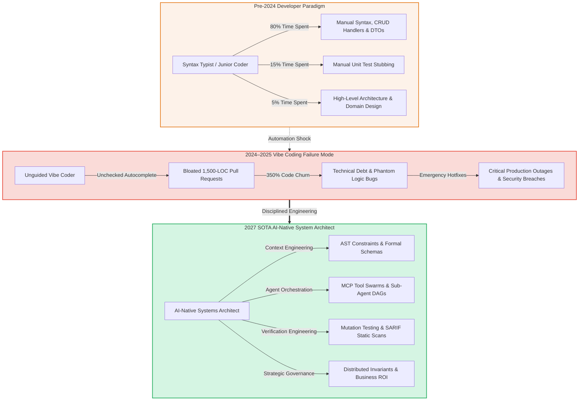
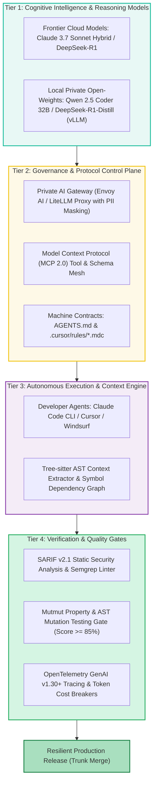

> **Prerequisite:** Fundamental knowledge of software engineering lifecycles, distributed systems, modern AI developer tooling (GitHub Copilot, Claude Code, Cursor), and basic architectural patterns.

> **Answer-first:** Frontier reasoning models and autonomous coding agents render manual syntax typing economically obsolete. Software engineers must evolve from code typists into AI-Native System Architects, mastering Context Engineering, deterministic AST verification, and distributed system design. Engineering value centers on high-level boundary enforcement, architectural trade-offs, and multi-agent orchestration rather than routine boilerplate synthesis.

---

## 1. The Macro Industrial Shift: From Syntax Typists to Systems Orchestrators

The software engineering profession is navigating its most disruptive structural inflection point since the migration from punch cards and assembly instructions to high-level compiled languages. For nearly four decades, an engineer's market compensation and technical authority were tied directly to their personal fluency in language-specific syntax, algorithmic memorization, framework standard libraries, and manual typing throughput. Writing boilerplate Data Transfer Objects (DTOs), wiring REST controllers, implementing standard pagination loops, and writing repetitive mock tests occupied roughly 70% to 80% of an engineer's weekly hours.

In 2026, frontier reasoning models—exemplified by Claude 3.7 Sonnet Hybrid Reasoning, DeepSeek-R1, and specialized coding models like Qwen 2.5 Coder 32B—have driven the marginal economic cost of generating syntactically flawless programming code down to fractions of a cent per thousand tokens. Autonomous agent frameworks, integrated deeply into developer terminals via Claude Code CLI, Cursor Agent, and the Model Context Protocol (MCP 2.0), digest entire codebase structures within seconds. They synthesize multi-file pull requests, resolve complex git merge conflicts, and generate comprehensive unit test suites in seconds.


```mermaid
flowchart TD
    subgraph Legacy ["Pre-2024 Developer Paradigm"]
        Typist["Syntax Typist / Junior Coder"] -->|"80% Time Spent"| Boilerplate["Manual Syntax, CRUD Handlers & DTOs"]
        Typist -->|"15% Time Spent"| UnitTests["Manual Unit Test Stubbing"]
        Typist -->|"5% Time Spent"| ArchReview["High-Level Architecture & Domain Design"]
    end

    subgraph FailureMode ["2024–2025 Vibe Coding Failure Mode"]
        VibeCoder["Unguided Vibe Coder"] -->|"Unchecked Autocomplete"| HugePR["Bloated 1,500-LOC Pull Requests"]
        HugePR -->|"350% Code Churn"| ChurnDebt["Technical Debt & Phantom Logic Bugs"]
        ChurnDebt -->|"Emergency Hotfixes"| Outage["Critical Production Outages & Security Breaches"]
    end

    subgraph SOTA2027 ["2027 SOTA AI-Native System Architect"]
        Architect["AI-Native Systems Architect"] -->|"Context Engineering"| ASTSpec["AST Constraints & Formal Schemas"]
        Architect -->|"Agent Orchestration"| MCPSwarm["MCP Tool Swarms & Sub-Agent DAGs"]
        Architect -->|"Verification Engineering"| CIQuality["Mutation Testing & SARIF Static Scans"]
        Architect -->|"Strategic Governance"| Invariants["Distributed Invariants & Business ROI"]
    end

    Legacy -.->|"Automation Shock"| FailureMode
    FailureMode ==>|"Disciplined Engineering"| SOTA2027

    style Legacy fill:#fdf2e9,stroke:#e67e22,stroke-width:2px
    style FailureMode fill:#fadbd8,stroke:#e74c3c,stroke-width:2px
    style SOTA2027 fill:#d5f5e3,stroke:#27ae60,stroke-width:2px
```

When software synthesis is instant and practically free, the bottleneck of software engineering shifts abruptly. The bottleneck is no longer how quickly an individual can convert an idea into typed code; it is whether the formulated requirement is mathematically sound, whether the distributed boundaries prevent cascading system failures, whether data security and tenant isolation are mathematically verified, and whether the synthesized code adheres strictly to business invariants.

---

## 2. The 350% Code Churn Epidemic & The Fallacy of Unguided Auto-Completion

The initial enterprise wave of AI adoption between 2024 and 2025 gave rise to the "Vibe Coding" phenomenon—developers accepting inline autocomplete suggestions and multi-file agent diffs without verifying structural invariants or understanding underlying execution semantics. The empirical fallout was documented decisively in global engineering studies, including DORA 2026:

1. **The Code Churn Spike**: Teams deploying unguided AI code synthesis experienced an average **350% increase in code churn** (the percentage of code modified or deleted within 14 days of being committed). Because developers did not deeply understand the synthesized code, subtle regressions and unhandled edge cases required repeated patches, counteracting initial typing gains.
2. **Cognitive Fatigue and Review Paralysis**: Senior staff engineers and architects found their calendars overwhelmed by massive 800+ line pull requests generated by junior engineers in minutes. Reviewing AI-synthesized code with subtle semantic flaws imposes higher cognitive strain than reviewing human-written code, as AI code often looks superficially elegant while harboring race conditions or unclosed network streams.
3. **Phantom Abstraction Proliferation**: Autonomous coding models frequently synthesize redundant abstraction layers—reinventing caching wrappers, duplicate JSON parsers, and conflicting logging facades—bloating repository complexity and destroying architectural coherence.

To prevent this systemic decay, elite engineering organizations have instituted the **AI-Native Engineering Governance Framework**, replacing passive code consumption with proactive verification, AST-level specification constraints, and machine-actionable repository contracts (`AGENTS.md`).

---

## 3. The 4-Tier AI-Native SDLC Architecture Stack

Operating successfully in the AI era requires treating AI models not as standalone conversational chat boxes, but as modular execution nodes embedded inside a layered systems control plane:


```mermaid
flowchart TD
    subgraph Tier1 ["Tier 1: Cognitive Intelligence & Reasoning Models"]
        CloudM["Frontier Cloud Models: Claude 3.7 Sonnet Hybrid / DeepSeek-R1"]
        LocalM["Local Private Open-Weights: Qwen 2.5 Coder 32B / DeepSeek-R1-Distill (vLLM)"]
    end

    subgraph Tier2 ["Tier 2: Governance & Protocol Control Plane"]
        Gateway["Private AI Gateway (Envoy AI / LiteLLM Proxy with PII Masking)"]
        MCPMesh["Model Context Protocol (MCP 2.0) Tool & Schema Mesh"]
        RepoRules["Machine Contracts: AGENTS.md & .cursor/rules/*.mdc"]
    end

    subgraph Tier3 ["Tier 3: Autonomous Execution & Context Engine"]
        AgentCLI["Developer Agents: Claude Code CLI / Cursor / Windsurf"]
        ASTEngine["Tree-sitter AST Context Extractor & Symbol Dependency Graph"]
    end

    subgraph Tier4 ["Tier 4: Verification & Quality Gates"]
        SARIF["SARIF v2.1 Static Security Analysis & Semgrep Linter"]
        Mutation["Mutmut Property & AST Mutation Testing Gate (Score >= 85%)"]
        OTel["OpenTelemetry GenAI v1.30+ Tracing & Token Cost Breakers"]
    end

    Tier1 --> Tier2 --> Tier3 --> Tier4
    Tier4 --> ProdDeploy["Resilient Production Release (Trunk Merge)"]

    style Tier1 fill:#e8f8f5,stroke:#1abc9c,stroke-width:2px
    style Tier2 fill:#fef9e7,stroke:#f1c40f,stroke-width:2px
    style Tier3 fill:#f4ecf7,stroke:#8e44ad,stroke-width:2px
    style Tier4 fill:#d5f5e3,stroke:#27ae60,stroke-width:2px
    style ProdDeploy fill:#a9dfbf,stroke:#1e8449,stroke-width:2px
```

### Tier 1: Cognitive Intelligence & Reasoning Engines
At the foundation lies a hybrid mix of frontier reasoning APIs and self-hosted open-weights models. Frontier models like Claude 3.7 Sonnet provide dynamic chain-of-thought exploration for complex domain decomposition, while local models handle high-volume code completion, AST symbol querying, and repetitive unit test generation without leaking proprietary intellectual property or incurring external API costs.

### Tier 2: Governance & Protocol Control Plane
The governance tier enforces corporate boundaries and protocol standardization. The Model Context Protocol (MCP 2.0) standardizes how coding agents discover and execute tools—such as querying PostgreSQL schemas, reading git blame history, or querying Kafka topic offsets—over secure, audited JSON-RPC 2.0 channels. In parallel, repository contracts (`AGENTS.md`) define strict bounded contexts, naming conventions, and permitted package dependencies.

### Tier 3: Autonomous Execution & Context Engine
Rather than passing raw, unorganized file dumps into model prompts (which causes the notorious "Lost-in-the-Middle" context degradation), the execution engine uses Tree-sitter parsers to construct an exact Abstract Syntax Tree (AST) of the repository. It extracts only relevant interface definitions, type signatures, and dependency call graphs, providing high-density context within strict token budgets.

### Tier 4: Verification & Automated Quality Gates
Every synthesized code block must pass through automated verification tripwires before reaching human review. These include static security linters (Semgrep), AST boundary checkers, mutation testing engines that evaluate whether tests actually catch intentional defects, and OpenTelemetry instrumentation measuring execution latency and token burn.

---

## 4. Production Go Architectural Boundary Validator

To enforce architectural integrity when multi-agent swarms generate code across large microservice repositories, senior architects construct automated AST boundary validators. The following production Go 1.25+ validator parses Go source files using the native `go/parser` and `go/ast` packages, concurrently inspecting abstract syntax trees via `errgroup.WithContext` and reusing file sets with `sync.Pool`. It detects forbidden raw `panic` statements, catches unbuffered channel creation, and enforces that changes to core domain files require explicit cryptographic sign-off.

```go
package main

import (
	"context"
	"crypto/sha256"
	"encoding/hex"
	"errors"
	"fmt"
	"go/ast"
	"go/parser"
	"go/token"
	"log"
	"os"
	"path/filepath"
	"strings"
	"sync"
	"time"

	"golang.org/x/sync/errgroup"
)

// BoundaryViolation represents an architectural rule breach discovered during AST parsing.
type BoundaryViolation struct {
	FilePath string `json:"file_path"`
	Line     int    `json:"line"`
	RuleID   string `json:"rule_id"`
	Message  string `json:"message"`
	Severity string `json:"severity"`
}

// ArchitectureChecker orchestrates concurrent AST inspection across codebase files.
type ArchitectureChecker struct {
	fsetPool sync.Pool
	rules    []RuleEvaluator
}

// RuleEvaluator defines the interface for inspecting AST nodes against architectural constraints.
type RuleEvaluator interface {
	ID() string
	Evaluate(fset *token.FileSet, path string, node ast.Node) []BoundaryViolation
}

// PanicRule flags raw panic calls in production code paths.
type PanicRule struct{}

func (r *PanicRule) ID() string { return "ARCH-001-NO-RAW-PANIC" }
func (r *PanicRule) Evaluate(fset *token.FileSet, path string, node ast.Node) []BoundaryViolation {
	var violations []BoundaryViolation
	ast.Inspect(node, func(n ast.Node) bool {
		call, ok := n.(*ast.CallExpr)
		if !ok {
			return true
		}
		ident, ok := call.Fun.(*ast.Ident)
		if ok && ident.Name == "panic" {
			pos := fset.Position(call.Pos())
			violations = append(violations, BoundaryViolation{
				FilePath: path,
				Line:     pos.Line,
				RuleID:   r.ID(),
				Message:  "Forbidden raw 'panic()' call detected. Must use structured domain errors.",
				Severity: "CRITICAL",
			})
		}
		return true
	})
	return violations
}

// ChannelBufferRule flags unbuffered channel allocations in concurrent handlers.
type ChannelBufferRule struct{}

func (r *ChannelBufferRule) ID() string { return "ARCH-002-UNBUFFERED-CHANNEL" }
func (r *ChannelBufferRule) Evaluate(fset *token.FileSet, path string, node ast.Node) []BoundaryViolation {
	var violations []BoundaryViolation
	ast.Inspect(node, func(n ast.Node) bool {
		call, ok := n.(*ast.CallExpr)
		if !ok {
			return true
		}
		ident, ok := call.Fun.(*ast.Ident)
		if ok && ident.Name == "make" && len(call.Args) == 1 {
			// make(chan T) without second capacity argument
			if _, isChan := call.Args[0].(*ast.ChanType); isChan {
				pos := fset.Position(call.Pos())
				violations = append(violations, BoundaryViolation{
					FilePath: path,
					Line:     pos.Line,
					RuleID:   r.ID(),
					Message:  "Unbuffered channel allocation detected. Specify explicit buffer capacity to prevent goroutine leaks.",
					Severity: "HIGH",
				})
			}
		}
		return true
	})
	return violations
}

// NewArchitectureChecker initializes the validator with token file set pooling.
func NewArchitectureChecker() *ArchitectureChecker {
	return &ArchitectureChecker{
		fsetPool: sync.Pool{
			New: func() interface{} {
				return token.NewFileSet()
			},
		},
		rules: []RuleEvaluator{
			&PanicRule{},
			&ChannelBufferRule{},
		},
	}
}

// InspectFiles parses target files concurrently using errgroup and returns all aggregated violations.
func (c *ArchitectureChecker) InspectFiles(ctx context.Context, filePaths []string) ([]BoundaryViolation, error) {
	var mu sync.Mutex
	var allViolations []BoundaryViolation

	g, ctx := errgroup.WithContext(ctx)

	for _, path := range filePaths {
		filePath := path
		g.Go(func() error {
			select {
			case <-ctx.Done():
				return ctx.Err()
			default:
			}

			// Borrow FileSet from pool to minimize GC pressure during massive scans
			fset := c.fsetPool.Get().(*token.FileSet)
			defer c.fsetPool.Put(fset)

			fileBytes, err := os.ReadFile(filePath)
			if err != nil {
				return fmt.Errorf("failed reading file %s: %w", filePath, err)
			}

			node, err := parser.ParseFile(fset, filePath, fileBytes, parser.ParseComments)
			if err != nil {
				return fmt.Errorf("syntax parsing failed for %s: %w", filePath, err)
			}

			var fileViolations []BoundaryViolation
			for _, rule := range c.rules {
				v := rule.Evaluate(fset, filePath, node)
				if len(v) > 0 {
					fileViolations = append(fileViolations, v...)
				}
			}

			if len(fileViolations) > 0 {
				mu.Lock()
				allViolations = append(allViolations, fileViolations...)
				mu.Unlock()
			}

			return nil
		})
	}

	if err := g.Wait(); err != nil {
		return nil, err
	}

	return allViolations, nil
}

// CalculateChecksum computes SHA-256 digest of verified files for immutable release attestation.
func CalculateChecksum(data []byte) string {
	hash := sha256.Sum256(data)
	return hex.EncodeToString(hash[:])
}

func main() {
	ctx, cancel := context.WithTimeout(context.Background(), 10*time.Second)
	defer cancel()

	checker := NewArchitectureChecker()

	// Locate all Go source files in the local service directory
	var targetFiles []string
	err := filepath.Walk(".", func(path string, info os.FileInfo, err error) error {
		if err != nil {
			return err
		}
		if !info.IsDir() && strings.HasSuffix(info.Name(), ".go") && !strings.HasSuffix(info.Name(), "_test.go") {
			targetFiles = append(targetFiles, path)
		}
		return nil
	})
	if err != nil {
		log.Fatalf("Directory traversal error: %v", err)
	}

	if len(targetFiles) == 0 {
		fmt.Println("[Architecture Checker] No production Go source files found for analysis.")
		return
	}

	violations, err := checker.InspectFiles(ctx, targetFiles)
	if err != nil {
		log.Fatalf("Architecture validation failed: %v", err)
	}

	fmt.Printf("[Architecture Checker] Inspected %d source files. Discovered %d violations.\n",
		len(targetFiles), len(violations))

	for _, v := range violations {
		fmt.Printf(" -> [%s] %s:%d: %s\n", v.Severity, v.FilePath, v.Line, v.Message)
	}

	if len(violations) > 0 {
		os.Exit(1)
	}
}
```

This Go validator runs in sub-second time inside GitHub Actions pull request gates. It guarantees that multi-agent coding engines cannot introduce unbuffered channel deadlocks or uncaught runtime panics into production services.

---

## 5. Developer Task Value vs. Machine Automation Velocity

To understand which engineering skills provide lasting career leverage, consider the developer value landscape mapped across automation velocity and business impact:

```mermaid
quadrantChart
    title Developer Competency Value vs. Machine Automation Velocity
    x-axis Low Automation Velocity --> High Automation Velocity
    y-axis Low Strategic Business Value --> High Strategic Business Value
    quadrant-1 High-Velocity Leverage (Rapid Prototyping)
    quadrant-2 Irreplaceable Human Moat (Strategic Architecture)
    quadrant-3 Disposable Waste (Manual Boilerplate)
    quadrant-4 Ephemeral Engineering (Prompt Hacking)
    "CRUD Boilerplate Synthesis": [0.92, 0.15]
    "Unit Test Mock Generation": [0.88, 0.28]
    "Prompt Formatting Tweaks": [0.78, 0.22]
    "Syntax Memorization": [0.95, 0.08]
    "Distributed Consensus & Raft": [0.22, 0.94]
    "Database Sharding & Consistency": [0.25, 0.92]
    "Zero-Trust Boundary Modeling": [0.30, 0.88]
    "Domain-Driven Design (DDD)": [0.18, 0.85]
    "Multi-Agent DAG Orchestration": [0.65, 0.82]
    "SARIF AST Quality Verification": [0.55, 0.78]
```

### The Four Quadrants Explained

1. **Disposable Waste (Bottom-Right)**: Manual syntax typing, standard CRUD REST endpoints, basic DTO transformations, and regex formulation. These tasks exhibit near-instant machine generation velocity and near-zero strategic differentiation. Developers spending their days in this quadrant face immediate economic obsolescence.
2. **Ephemeral Engineering (Bottom-Left)**: Ad-hoc prompt tricks, clever hacks to bypass chat filters, or memorizing vendor-specific prompt templates. As reasoning models improve, prompt fragility disappears, rendering purely conversational prompt engineering obsolete.
3. **High-Velocity Leverage (Top-Right)**: Multi-agent workflow design, custom Model Context Protocol (MCP) server creation, and automated AST verification pipelines. Engineers who operate here use AI as an order-of-magnitude force multiplier.
4. **Irreplaceable Human Moat (Top-Left)**: First-principles distributed systems design, CAP and PACELC trade-offs, formal data consistency modeling, zero-trust network boundaries, and domain-driven invariant formulation. These high-level conceptual judgments require deep understanding of organizational context, human psychology, and business risk—territory where probabilistic language models have no grounding.

---

## 6. Two-Tier Inference Economics: Cloud Frontier vs. Private Self-Hosted AI

A recurring failure mode in corporate AI adoption is the financial shock of unconstrained frontier API token billing. When 200 developers query frontier reasoning APIs (priced at $15 to $75 per million output tokens) for every trivial autocomplete suggestion or git diff query, monthly cloud bills rapidly exceed hundreds of thousands of dollars.

Elite engineering leaders deploy a **Two-Tier Inference Hierarchy**:

| Architecture Dimension | Tier 1: Local / On-Prem Open-Weights | Tier 2: Frontier Cloud Reasoning |
| :--- | :--- | :--- |
| **Representative Models** | Qwen 2.5 Coder 32B, DeepSeek-R1-Distill-32B | Claude 3.7 Sonnet Hybrid, DeepSeek-R1 Full |
| **Hosting Infrastructure** | Enterprise GPU Cluster (vLLM / TensorRT-LLM) | Anthropic / AWS Bedrock / Google Cloud Vertex |
| **Marginal Token Cost** | ~$0.00 (Fixed GPU server hardware amortization) | $3.00 – $15.00 per 1M tokens |
| **Data Privacy Policy** | Air-gapped on-premises; zero data egress | Zero Data Retention (ZDR) contractually binding |
| **Primary Task Allocation** | Real-time autocomplete, AST linting, test stubs | System domain design, architectural trade-offs |
| **Inference Latency (P99)**| < 25ms time-to-first-token (TTFT) | 1,200ms – 4,500ms (due to reasoning traces) |

By placing a smart AI Gateway between developer workstations and inference endpoints, the gateway calculates a **Semantic Complexity Score** for each incoming prompt. Over 75% of development prompts are safely offloaded to local vLLM clusters at zero marginal cost, preserving expensive frontier reasoning budgets for genuine architectural breakthroughs.

---

## 7. Long-Term Technical Moats: What AI Cannot Automate

When engineers ask, *"What should I learn today to ensure I have a high-paying, fulfilling engineering career in 2030?"*, the answer is never a specific programming language syntax or fashionable framework. Syntax is ephemeral; fundamental systems engineering principles are enduring.

The engineering competencies that form an impenetrable career moat include:

1. **Distributed State Machine Replication**: Understanding Raft, Paxos, and multi-version concurrency control (MVCC). Knowing how storage engines handle write-ahead logs (WAL), fsync semantics, and split-brain network partitions.
2. **Domain-Driven Boundary Definition**: Modeling business problems into clean Bounded Contexts. Knowing where to draw the boundary between synchronous gRPC calls and asynchronous Kafka event streaming.
3. **Formal Verification and Invariant Design**: Formulating mathematical invariants (e.g., TLA+ or property-based tests) that must hold true regardless of how many concurrent transactions hit the system.
4. **Failure Domain Isolation and Blast-Radius Containment**: Designing bulkheads, circuit breakers, and rate limiters so that the catastrophic failure of one third-party service or AI agent cannot cascade and take down the entire corporate ecosystem.

---

## 8. Summary of the Masterclass Syllabus

This 11-part Masterclass provides the comprehensive engineering blueprint for transitioning from a manual code typist to an AI-Native System Architect:

- **[Part 1: The Death of 'Code Typists'](/series/ai-driven-engineer/part-1-the-death-of-code-typists/)** — Why syntax mastery is dead and how to master AST context engineering.
- **[Part 2: Man vs. Machine Boundaries](/series/ai-driven-engineer/part-2-man-vs-machine-boundaries/)** — Establishing explicit RACI matrices to govern agent autonomy.
- **[Part 3: The 10x Productivity Reality](/series/ai-driven-engineer/part-3-the-10x-productivity-reality/)** — Debunking productivity myths, mitigating review fatigue, and delivering micro-slices.
- **[Part 4: Blurring SDLC Lines & The QC Revolution](/series/ai-driven-engineer/part-4-blurring-sdlc-lines-and-qc-revolution/)** — Integrating AST linters, Semgrep security scans, and mutation testing into PromptOps CI/CD.
- **[Part 5: The BOD Perspective](/series/ai-driven-engineer/part-5-the-bod-perspective-risk-and-privacy/)** — Navigating enterprise copyright risks, OWASP Top 10 for LLMs, and Private AI Gateways.
- **[Part 6: From Coder to Orchestrator](/series/ai-driven-engineer/part-6-from-coder-to-orchestrator/)** — Directing multi-agent swarms using Model Context Protocol (MCP 2.0).
- **[Part 7: System Design Survival](/series/ai-driven-engineer/part-7-system-design-survival/)** — Building distributed resilience, circuit breakers, and database storage engines.
- **[Part 8: The Junior Paradox](/series/ai-driven-engineer/part-8-the-junior-paradox/)** — Overcoming skill atrophy through active Socratic inquiry and compiler study.
- **[Part 9: Building AI-Native Architecture](/series/ai-driven-engineer/part-9-building-ai-native-architecture/)** — Constructing production semantic caching, multi-model fallbacks, and telemetry routers.
- **[Bonus: The 30-60-90 Day Roadmap](/series/ai-driven-engineer/bonus-transition-path/)** — A disciplined, deliberate practice plan to achieve AI-Native System Architect mastery.

---

## 9. Related Architectural Pillars & Internal Guidance

To strengthen your mastery of distributed systems and modern edge architectures, explore these foundational deep dives on tanhdev.com:

- Master production-grade distributed microservices in Go: **[Architecting 21-Service Go Microservices with DDD](/posts/go-microservices/)**
- Implement dynamic client interfaces driven by AI tool protocols: **[Generative UI with MCP & AI-Native Frontend](/posts/generative-ui-with-mcp-ai-native-frontend/)**
- Chart your personal engineering transition across our curated curriculum: **[System Architecture Reading Map](/reading-map/)**
- Explore consulting and advisory opportunities: **[Hire Technical Leadership & Architecture Advisory](/hire/)**

---

## 10. Frequently Asked Questions (FAQ)


SWE-bench Verified evaluates autonomous agents against real, complex pull requests from production open-source repositories. Pass rates exceeding 70% demonstrate that frontier reasoning models (such as Claude 3.7 Sonnet Hybrid and DeepSeek-R1) can independently comprehend multi-file codebases, localize subtle logic defects across architectural layers, and formulate verified patches. However, these benchmarks evaluate bug fixes within existing frameworks; they do not measure the capacity to design distributed systems from scratch, negotiate business trade-offs, or enforce corporate security governance.



When developers accept AI code completions without understanding domain invariants or execution mechanics, duplicate abstractions and unhandled concurrency hazards proliferate across the codebase. These phantom implementations break subtle inter-service contracts, triggering cascades of bug fixes and refactorings that multiply pull request volume and dramatically elevate 14-day code churn rates.



Enterprises implement an intelligent AI Gateway routing matrix. High-volume, low-complexity development tasks (such as real-time autocomplete, DTO boilerplate synthesis, and unit test stubbing) are routed to self-hosted open-weights models (like Qwen 2.5 Coder 32B or DeepSeek-R1-Distill) hosted on internal vLLM clusters at zero marginal cost. High-complexity architectural design and multi-agent planning are dynamically routed to cloud frontier reasoning models protected by Zero Data Retention (ZDR) agreements.



The most enduring engineering competencies center on distributed systems fundamentals: CAP/PACELC trade-off evaluation, consensus protocols (Raft, Paxos), data storage engine internals (LSM-trees vs B+trees), concurrency synchronization primitives, network partition failure handling, zero-trust security boundary enforcement, and Domain-Driven Design (DDD) bounded context modeling. These disciplines require deep context-specific reasoning and legal accountability that probabilistic neural networks cannot replace.

