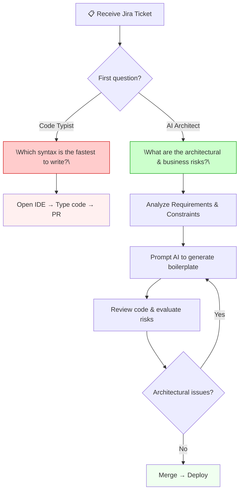

For years, the image of a talented programmer was often associated with blazing fast typing speeds, the ability to memorize dozens of API libraries, and writing code without a single syntax error. We called them pure "Coders". But as AI enters the playing field, a harsh reality has emerged: **Writing code is only the easiest part of building software.**

## Who are "Code Typists"?

"Code Typists" is not a derogatory term, but a way to describe a common working state. You are in this state if:
- You spend 80% of your time writing boilerplate code (repetitive code like initializing classes, setting up databases, creating controllers).
- Your greatest value to the company is the ability to convert a meticulously detailed requirement (by a BA/PM) into machine language (Java, Python, JS).
- You evaluate your competence by memorizing React Hooks syntax or complex SQL statements without needing to Google them.

In the pre-AI era, this ability was highly valuable because computers are incredibly strict. Missing a semicolon (;) could crash the entire system. Humans were paid high salaries to act as "human compilers".

## The Commoditization of Code

The emergence of LLMs (Large Language Models) and Agents like Cursor and Windsurf has completely shattered this status quo.

Today, a simple prompt: *"Create a Node.js REST API connecting to PostgreSQL, with JWT authentication and role-based authorization"* can generate hundreds of lines of accurate code, neatly organized into folder architectures within 10 seconds.

When something can be created at the speed of light and with a cost approaching zero, it becomes "commoditized". **Code has become too cheap.**

If your daily job is just taking a Jira ticket like *"Create a login form with email validation"* and you spend 4 hours typing it out, you are directly competing with a $20/month tool that finishes it in 3 seconds. Sadly, in this typing race, humans will definitely lose.

## Syntax is No Longer a Competitive Advantage

Previously, the biggest barrier when moving from Backend to Frontend, or from Java to Go, was learning the new syntax. AI has obliterated this barrier.

A solid Backend Developer (with good logic) can now easily write a beautiful React/Tailwind application by asking AI to "translate" their ideas into Frontend syntax. The division "I am a Language A developer, I don't know Language B" is no longer a valid excuse.

**Programming language syntax is now just an implementation detail.** It is no longer a professional barrier, and certainly not something you can leverage to demand a higher salary.

## Visual Case Study: The Contrast

To truly "absorb" the difference between the two eras, let's look at a basic example: **Building an API to upload images to AWS S3**.

| Criteria | "Code Typist" Era (Pre-AI) | "Architect" Era (AI-Driven) |
| :--- | :--- | :--- |
| **Main Actions** | Read AWS docs, struggle to install SDK, manually write catch error blocks, configure stream buffers to avoid RAM overflow. | Write a prompt: *"Write a function to upload file to S3 using Node.js handling stream buffers"* → Receive standard code in 10 seconds. |
| **Time Spent** | **2 hours** of typing and debugging. | **10 seconds** to generate code. But spend the remaining **1 hour 59 minutes** asking architectural questions. |

This is the core difference. In the same amount of time, the "Architect" will use their brain to design and mitigate risks:
- *"If a user uploads a 2GB file, will the server crash? Should we use Presigned URLs to upload directly from the Client to S3?"*
- *"How do we validate a fake .jpg file that contains malware?"*
- *"How to configure IAM Policy so we don't expose bucket admin privileges?"*

### Mindset Diagram: Receiving a Jira Ticket — What's Your First Thought?



## Technical Implementation: AI Code Example

To illustrate, here is how an "Architect" interacts with an AI IDE (like Cursor) to solve the above problem without memorizing syntax.

**Prompt (Input Requirement):**
```text
Create a function to upload files to AWS S3 using Node.js (AWS SDK v3). 
Mandatory requirements:
1. Use stream buffers to handle large files and prevent RAM overflow.
2. Return a Presigned URL that expires in 15 minutes.
3. Validate: Only allow .jpg, .png and size < 5MB.
```

**AI Generated Code:**
```javascript
import { S3Client, PutObjectCommand } from "@aws-sdk/client-s3";
import { getSignedUrl } from "@aws-sdk/s3-request-presigner";
import { PassThrough } from "stream";

const s3Client = new S3Client({ region: "ap-southeast-1" });

export const uploadToS3 = async (fileStream, fileName, mimeType) => {
  // 1. Validation logic
  const allowedTypes = ['image/jpeg', 'image/png'];
  if (!allowedTypes.includes(mimeType)) throw new Error("Invalid file type");
  
  // 2. Stream Buffer Optimization
  const pass = new PassThrough();
  fileStream.pipe(pass);

  const command = new PutObjectCommand({
    Bucket: process.env.S3_BUCKET_NAME,
    Key: `uploads/${Date.now()}-${fileName}`,
    Body: pass,
    ContentType: mimeType,
  });

  await s3Client.send(command);

  // 3. Presigned URL (15 minutes expiry)
  const presignedCommand = new PutObjectCommand({ /*...*/ });
  return getSignedUrl(s3Client, presignedCommand, { expiresIn: 900 });
};
```
*The programmer doesn't type this code. They read it, evaluate risks (is the validation sufficient?), and approve it.*

## Shifting Focus: Returning to the Essence of Software Engineering

The fall of the "Code Typist" does not mean the programmer profession disappears. On the contrary, it brings the profession back to its true essence: **A software engineer is someone who uses technology to solve business problems, not a typist.**

But the burning question arises: If AI can generate code, test code, and even write documentation... then **what is the ultimate boundary** that keeps programmers from being completely phased out? What is the "fatal" limit of AI that, if entrusted to it, could crash your system or expose the company to million-dollar lawsuits?

The truth about this life-or-death boundary will be revealed in detail in **[Part 2: Man vs. Machine Boundaries: What to Delegate and What to Keep](/series/ai-driven-engineer/part-2-man-vs-machine-boundaries/)**.

---
### 🛠 Practical Exercise: Experience the "AI Shock"
1. **Challenge:** Open an old project of yours. Find a complex function you once spent a whole day writing.
2. **Action:** Delete that function. Use a tool like [Cursor](https://cursor.sh) or GitHub Copilot, write exactly 3 lines of comments describing the function's logic, and hit `Tab`.
3. **Analysis:** Measure the time it takes AI to generate the result compared to the time you spent hand-coding. Observe if AI handles the edge cases as well as you did.

### 📚 External Resources & Tooling
- **Recommended Tools:** [Cursor IDE](https://cursor.sh/) (For AI-first coding), [Windsurf](https://codeium.com/windsurf) (AI Agent IDE).
- **Further Reading:** [The End of Programming](https://cacm.acm.org/magazines/2023/1/267976-the-end-of-programming/fulltext) (ACM Magazine) - Discussing the decline of pure "code typing".
- **Related Documentation:** Refer to our [AI-Driven Playbook](/series/ai-driven-playbook/) to see how to deploy AI into Agile processes.

---
💬 **Discussion Corner:** Have you ever witnessed a colleague (or yourself) spend hours typing a piece of code that modern AI can do in 5 seconds? Share that "enlightenment" feeling in the comments below!

<div style="display: flex; justify-content: space-between; margin-top: 2rem;">
  <div></div>
  <div><a href="/series/ai-driven-engineer/part-2-man-vs-machine-boundaries/">Next Article: Part 2 →</a></div>
</div>
