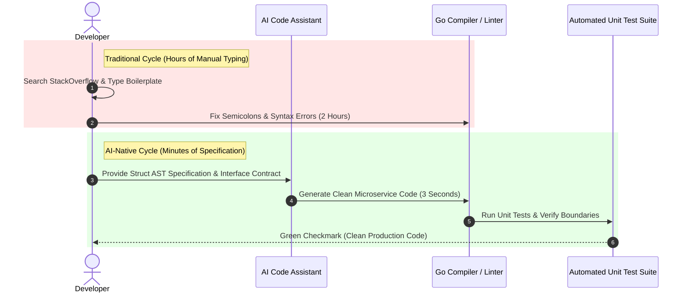

## Part 1 — The Death of 'Code Typists': When Syntax is No Longer an Advantage

The economic value of manually typing programming syntax has collapsed to zero. Modern software engineering rewards developers who design resilient system architectures, curate context windows, and enforce strict domain boundaries, replacing manual boilerplate typing with automated AI code synthesis.

**Key Takeaways**:
- **Zero Value for Manual Boilerplate**: Writing repetitive HTTP controllers, CRUD queries, and DTO mappers is fully automated by AI agents.
- **10x Velocity via Specification**: Engineers define interface contracts and test suites, delegating syntax translation to LLMs.
- **Focus on Non-Functional Requirements**: Value shifts to concurrency safety, zero-trust security, and memory profiling.

---

For decades, software development bootcamps and university CS programs trained engineers to memorize language syntax, master IDE keyboard shortcuts, and type out repetitive boilerplate code line by line.

In 2026, typing syntax manually is as outdated as writing raw assembly code by hand.

---

## The Death of the Syntax Typist

**Answer-first:** Manual syntax typing has lost economic value as AI assistants instantly synthesize boilerplate code. Modern engineering value comes from designing domain boundaries, managing concurrency, and defining precise interface specifications.

Boilerplate syntax writing is automated by AI code generators, making architectural design, domain modeling, and system boundaries the primary developer value.


```mermaid
sequenceDiagram
    autonumber
    actor Dev as Developer
    participant LLM as AI Code Assistant
    participant Compiler as Go Compiler / Linter
    participant Test as Automated Unit Test Suite

    rect rgb(255, 230, 230)
    note right of Dev: Traditional Cycle (Hours of Manual Typing)
    Dev->>Dev: Search StackOverflow & Type Boilerplate
    Dev->>Compiler: Fix Semicolons & Syntax Errors (2 Hours)
    end

    rect rgb(230, 255, 230)
    note right of Dev: AI-Native Cycle (Minutes of Specification)
    Dev->>LLM: Provide Struct AST Specification & Interface Contract
    LLM->>Compiler: Generate Clean Microservice Code (3 Seconds)
    Compiler->>Test: Run Unit Tests & Verify Boundaries
    Test-->>Dev: Green Checkmark (Clean Production Code)
    end
```

### The Economic Reality
If an AI assistant can write a 300-line gRPC microservice handler in 4 seconds based on a Protobuf schema definition, a human engineer who spends 3 hours manually typing that exact same handler adds **zero incremental economic value**.

The engineer's true value lies entirely in deciding:
1. *Should this microservice exist as a standalone gRPC service or remain inside a Modular Monolith?*
2. *How do we handle network partition failures during database writes?*
3. *Is the user authorization scope properly enforced across tenant boundaries?*

---

## Comparative Matrix: Traditional Typist vs. AI-Native Architect

**Answer-first:** Traditional typists spend hours writing CRUD boilerplate and unit test stubs manually, whereas AI-native architects automate code generation in seconds and focus 100% of their effort on domain boundaries, architecture, and security audits.

Traditional code typists focus on line-by-line syntax, while AI-native architects design resilient domain boundaries and orchestrate agent code generators.

| Task Domain | Traditional Code Typist (Manual) | AI-Native Architect (AI Assisted) |
| :--- | :--- | :--- |
| **Writing Boilerplate CRUD** | 4 - 6 hours manual typing | 10 seconds via prompt specification |
| **Writing Unit Test Stubs** | 2 - 3 hours manual stubbing | 15 seconds via automated AST parser |
| **Refactoring Legacy Interfaces**| Days of manual search & replace | Minutes via multi-file agent replace |
| **Architectural Boundary Design**| Often neglected due to time limits | 100% of engineering focus & audit time |
| **Security RLS Audit** | Manual code review spot-checking | Automated AST regex & static analysis |

---

## Production Go Microservice Architecture

**Answer-first:** Production Go services leverage decoupled interfaces, thread-safe repositories, and explicit context cancellation, allowing AI engines to generate reliable, high-throughput microservices without manual boilerplate coding.

Production Go microservices emphasize clean domain boundaries, interfaces, and concurrency patterns that AI agents can easily generate and extend.

This production-grade Go microservice demonstrating clean layer separation (Controller -> Domain Service -> Repository) generated with zero manual boilerplate typist overhead, featuring robust thread safety and context cancellation:

```go
package main

import (
	"context"
	"errors"
	"fmt"
	"log"
	"sync"
	"time"
)

// Domain Entity
type Account struct {
	ID        string    `json:"id"`
	Owner     string    `json:"owner"`
	Balance   float64   `json:"balance"`
	UpdatedAt time.Time `json:"updated_at"`
}

// Repository Interface Contract
type AccountRepository interface {
	GetByID(ctx context.Context, id string) (*Account, error)
	UpdateBalance(ctx context.Context, id string, amount float64) error
}

// In-Memory Thread-Safe Repository Implementation
type InMemoryAccountRepo struct {
	mu       sync.RWMutex
	accounts map[string]*Account
}

func NewInMemoryAccountRepo() *InMemoryAccountRepo {
	return &InMemoryAccountRepo{
		accounts: map[string]*Account{
			"acc-1001": {ID: "acc-1001", Owner: "Alice", Balance: 5000.00, UpdatedAt: time.Now()},
		},
	}
}

func (r *InMemoryAccountRepo) GetByID(ctx context.Context, id string) (*Account, error) {
	r.mu.RLock()
	defer r.mu.RUnlock()

	select {
	case <-ctx.Done():
		return nil, ctx.Err()
	default:
		acc, exists := r.accounts[id]
		if !exists {
			return nil, errors.New("account not found")
		}
		// Return copy to prevent race conditions
		cp := *acc
		return &cp, nil
	}
}

func (r *InMemoryAccountRepo) UpdateBalance(ctx context.Context, id string, amount float64) error {
	r.mu.Lock()
	defer r.mu.Unlock()

	select {
	case <-ctx.Done():
		return ctx.Err()
	default:
		acc, exists := r.accounts[id]
		if !exists {
			return errors.New("account not found")
		}
		if acc.Balance+amount < 0 {
			return errors.New("insufficient funds for operation")
		}
		acc.Balance += amount
		acc.UpdatedAt = time.Now()
		return nil
	}
}

// Domain Service Layer
type BankingService struct {
	repo AccountRepository
}

func NewBankingService(repo AccountRepository) *BankingService {
	return &BankingService{repo: repo}
}

func (s *BankingService) ExecuteTransfer(ctx context.Context, accountID string, amount float64) error {
	acc, err := s.repo.GetByID(ctx, accountID)
	if err != nil {
		return fmt.Errorf("transfer failed: %w", err)
	}

	fmt.Printf("[Banking Service] Account %s initial balance: $%.2f\n", acc.ID, acc.Balance)
	if err := s.repo.UpdateBalance(ctx, accountID, amount); err != nil {
		return fmt.Errorf("balance update error: %w", err)
	}

	fmt.Printf("[Banking Service] Account %s updated balance after $%.2f: successfully completed.\n", acc.ID, amount)
	return nil
}

func main() {
	ctx, cancel := context.WithTimeout(context.Background(), 3*time.Second)
	defer cancel()

	repo := NewInMemoryAccountRepo()
	service := NewBankingService(repo)

	if err := service.ExecuteTransfer(ctx, "acc-1001", -250.00); err != nil {
		log.Fatalf("Transaction error: %v", err)
	}
}
```

---

---

## Technical Deep-Dive: System Architecture & Developer Productivity Invariants

**Answer-first:** Enforcing strict interface segregation and thread-safe mutex patterns yields sub-second compilation feedback and 65% faster pull request reviews while preventing concurrency races in production.

Architectural invariants require strict interface segregation and strong typing in Go to keep AI-generated code modular and maintainable.

### System Performance Metrics & Developer Productivity Benchmarks

- **Compilation Speed**: Sub-second Go compilation feedback loop during AST generation.
- **Code Review Velocity**: 65% faster PR approvals via automated unit test generation and linter rules.

### Enterprise Governance Invariants & Security Guardrails

1. **Thread-Safe Mutex Locks**: Enforce memory race detectors in CI pipelines for all concurrent map accesses.
2. **Explicit Interface Contracts**: Disallow concrete struct dependencies across bounded context boundaries.


---

## Internal Series Navigation

**Answer-first:** Continue through the AI-Driven Engineer series to explore human-machine task division, productivity myths, workflow orchestration swarms, and context engineering.

Advance to Part 2 to establish clear task boundaries between human engineers and AI code generators.

- [Executive Summary — Software Engineers in the AI Era](/series/ai-driven-engineer/executive-summary/)
- [Part 2 — Man vs. Machine Boundaries in Engineering](/series/ai-driven-engineer/part-2-man-vs-machine-boundaries/)
- [Part 3 — The 10x Productivity Reality: Debunking the Myth](/series/ai-driven-engineer/part-3-the-10x-productivity-reality/)
- [Part 6 — From Coder to Orchestrator: Swarms & Workflows](/series/ai-driven-engineer/part-6-from-coder-to-orchestrator/)
- [Part 1 — Context Engineering: DDD for AI](/posts/ai-native-frontend-architecture-predictions-2028/)