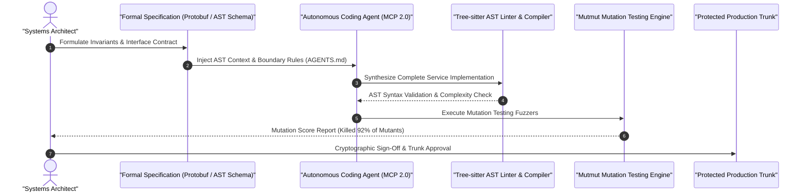
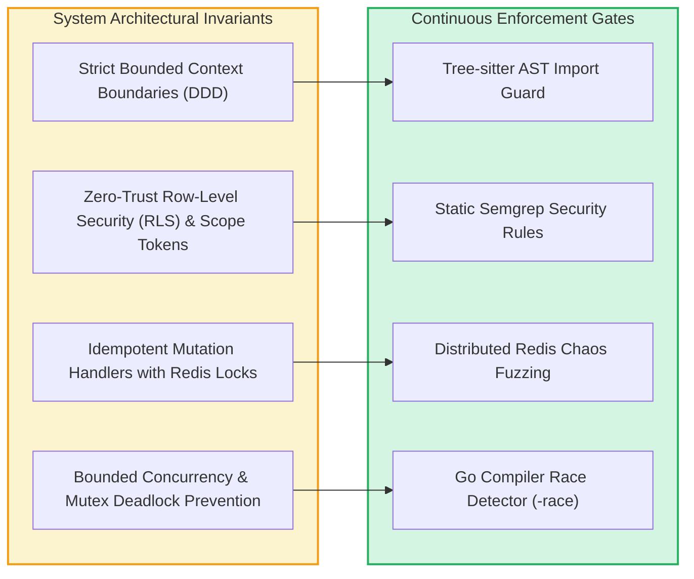
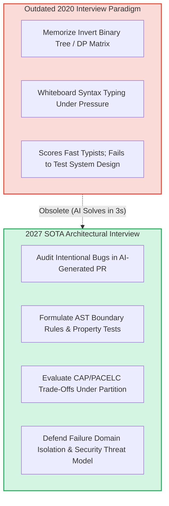

> **Prerequisite:** Proficiency in high-level programming languages (Go, Python, TypeScript), understanding of lexical analysis and Abstract Syntax Trees (AST), and experience with AI-assisted code generation workflows.

> **Answer-first:** Manual programming syntax typing provides zero lasting economic moat in the era of reasoning models. Developers gain competitive leverage by mastering Abstract Syntax Tree (AST) context extraction, precise formal interface contracts, and architectural verification. The bottleneck in modern software delivery is no longer typing raw code, but formulating robust specifications and evaluating synthesized code against system invariants.

---

## 1. The Death of the Syntax Typist: A Market Reality

For more than four decades, the software engineering discipline operated under a foundational assumption: the primary friction in turning human ideas into working computer systems was the act of typing syntactically valid code. Technical bootcamps, university computer science curriculums, and commercial technical interviews were structured around this paradigm. Candidates spent thousands of hours memorizing standard library APIs, language quirks, bracket placement, and the exact keyword order for framework annotations.

In 2026, that entire economic paradigm has evaporated. Frontier reasoning models such as Claude 3.7 Sonnet Hybrid Reasoning, DeepSeek-R1, and dedicated coding models like Qwen 2.5 Coder 32B synthesize syntactically flawless code across Go, Rust, Python, TypeScript, and SQL at speeds exceeding 120 tokens per second. The marginal cost of generating standard CRUD controllers, JSON serializers, database connection pools, and routine mock test stubs has collapsed from roughly $0.25 per line of human labor to less than $0.00002 per line of machine inference.


```mermaid
flowchart TD
    subgraph Pipeline ["AST-Grounded Context Engineering Pipeline"]
        SourceFile["Raw Repository Source Code"] --> Parser["Tree-sitter Incremental AST Parser"]
        Parser --> SymbolGraph["Symbol & Type Dependency Graph"]
        SymbolGraph --> Cyclo["Cyclomatic Complexity & Scope Analyzer"]
        Cyclo --> Pruner["Context Pruner (Filter AST Nodes < 8K Tokens)"]
        Pruner --> Injection["Structured JSON Context Injection"]
        Injection --> LLM["Frontier Coding Agent (Claude Code / Cursor)"]
        LLM --> Synthesized["Synthesized Implementation PR"]
        Synthesized --> ASTGate["Tree-sitter AST Diff & Invariant Verification Gate"]
        ASTGate --> Release["Trunk Merge & Production CI/CD"]
    end

    style SourceFile fill:#e8f8f5,stroke:#1abc9c,stroke-width:2px
    style Parser fill:#fef9e7,stroke:#f1c40f,stroke-width:2px
    style SymbolGraph fill:#f4ecf7,stroke:#8e44ad,stroke-width:2px
    style Cyclo fill:#f9ebea,stroke:#c0392b,stroke-width:2px
    style Pruner fill:#fef5e7,stroke:#d35400,stroke-width:2px
    style Injection fill:#ebf5fb,stroke:#2980b9,stroke-width:2px
    style LLM fill:#e8f8f5,stroke:#27ae60,stroke-width:2px
    style ASTGate fill:#d5f5e3,stroke:#1e8449,stroke-width:2px
    style Release fill:#a9dfbf,stroke:#145a32,stroke-width:2px
```

When syntax synthesis is instantaneous and free, a developer who defines their value by typing speed adds zero incremental business leverage. The engineer who spends four hours writing a boilerplate gRPC handler from scratch is not being "diligent"—they are incurring severe economic waste. In modern engineering teams, the scarce resource is not typing bandwidth; it is the clarity of technical specifications, the precision of architectural boundaries, and the rigor of verification gates.

---

## 2. High-Leverage Verification vs. Passive Auto-Completion

The collapse of syntax typing does not mean that software engineers are obsolete. Instead, it redefines the developer's role from a "human compiler" to an **Architectural Specification and Verification Authority**.

In unguided AI workflows (often termed "Vibe Coding"), developers passively accept code completions without verifying execution mechanics or invariants. This produces a dangerous illusion of velocity while driving technical debt through the roof. Conversely, high-leverage AI-native engineering structures the interaction around deterministic contract formulation and automated AST verification:


```mermaid
sequenceDiagram
    autonumber
    actor Arch as "Systems Architect"
    participant Spec as "Formal Specification (Protobuf / AST Schema)"
    participant Agent as "Autonomous Coding Agent (MCP 2.0)"
    participant Parser as "Tree-sitter AST Linter & Compiler"
    participant Mutation as "Mutmut Mutation Testing Engine"
    participant Git as "Protected Production Trunk"

    Arch->>Spec: Formulate Invariants & Interface Contract
    Spec->>Agent: Inject AST Context & Boundary Rules (AGENTS.md)
    Agent->>Parser: Synthesize Complete Service Implementation
    Parser-->>Agent: AST Syntax Validation & Complexity Check
    Agent->>Mutation: Execute Mutation Testing Fuzzers
    Mutation-->>Arch: Mutation Score Report (Killed 92% of Mutants)
    Arch->>Git: Cryptographic Sign-Off & Trunk Approval
```

### The Three Critical Invariants
1. **Semantic Invariants over Lexical Correctness**: A function may compile without warnings and pass superficial unit tests, yet harbor catastrophic concurrency race conditions, unbuffered channel deadlocks, or subtle memory leaks. The architect must formulate assertions that stress-test system invariants under load.
2. **Context Window Pruning**: Raw file dumps consume massive token budgets and trigger model hallucinations due to "Lost-in-the-Middle" phenomena. Context must be pruned programmatically via Abstract Syntax Tree parsing to extract only pertinent type signatures, call hierarchies, and interface definitions.
3. **Deterministic Verification Gates**: Every synthesized pull request must pass automated verification gates before human review. If an AI agent cannot prove that its synthesized implementation satisfies property-based tests and mutation tests, the pull request is rejected automatically without human interruption.

---

## 3. Comparative Matrix: Traditional Typist vs. AI-Native Systems Architect

The operational differences between legacy code typists and modern AI-native architects span tooling, cognitive focus, productivity metrics, and daily responsibilities:

| Operational Dimension | Traditional Code Typist (Legacy Model) | AI-Native Systems Architect (2027 SOTA) |
| :--- | :--- | :--- |
| **Primary Artifact** | Hand-typed lines of source code | Formal specifications, AST constraints, & validation suites |
| **Primary Daily Activity** | Typing boilerplate CRUD handlers, DTOs, & mocks | Designing domain boundaries, context rules, & verifying invariants |
| **Workflow Bottleneck** | Manual typing speed, API documentation lookups | Architectural trade-off analysis, concurrency correctness |
| **Context Strategy** | Mental memorization of files, ad-hoc text search | Programmatic Tree-sitter AST extraction & Model Context Protocol |
| **Unit Test Creation** | Manual line-by-line mocking (often superficial) | Automated mutation test generation with >=85% killed score |
| **Code Review Focus** | Catching typos, formatting, missing null checks | Verifying thread safety, zero-trust RLS, and blast-radius bounds |
| **Throughput Factor** | Baseline $1\times$ (approx. 200–400 LOC/day) | $5\times - 10\times$ verified production delivery throughput |
| **Core Intellectual Moat** | Language-specific syntax mastery & framework idioms | Distributed consensus, CAP/PACELC trade-offs, DDD modeling |

---

## 4. Production Tree-sitter AST Parser Engine

To operationalize Context Engineering, modern development platforms do not feed whole raw files into LLM prompts. Instead, they use **Tree-sitter**—a high-performance incremental parsing library—to build an exact Abstract Syntax Tree (AST) of the repository.

Below is a production-grade Python 3.12+ AST analysis engine. It leverages Tree-sitter to parse Go source code, walks the resulting syntax tree, extracts top-level struct schemas and function declarations, calculates **Cyclomatic Complexity** based on decision-branching AST nodes (`if_statement`, `for_statement`, `expression_switch_statement`, `binary_expression` with logical AND/OR), and formats a structured JSON payload optimized for AI coding agents.

```python
#!/usr/bin/env python3
"""
Production Tree-sitter AST Extraction & Complexity Analyzer
Parses Go/Python source code, walks syntax trees, extracts function signatures,
computes cyclomatic complexity, and generates structured prompt context for LLM agents.
"""

from __future__ import annotations

import json
import logging
from dataclasses import asdict, dataclass, field
from pathlib import Path
from typing import Any

import tree_sitter_go as tsgo
from tree_sitter import Language, Node, Parser

logging.basicConfig(level=logging.INFO, format="%(asctime)s [%(levelname)s] %(message)s")
logger = logging.getLogger("ASTAnalyzer")

GO_LANGUAGE = Language(tsgo.language())


@dataclass
class ParameterDef:
    name: str
    param_type: str


@dataclass
class FunctionSignature:
    name: str
    receiver: str | None
    parameters: list[ParameterDef]
    return_types: list[str]
    cyclomatic_complexity: int
    start_line: int
    end_line: int
    is_exported: bool
    docstring: str | None


@dataclass
class StructField:
    name: str
    field_type: str
    tag: str | None


@dataclass
class StructDefinition:
    name: str
    fields: list[StructField]
    start_line: int
    end_line: int
    is_exported: bool


@dataclass
class FileASTContext:
    file_path: str
    package_name: str
    imports: list[str] = field(default_factory=list)
    structs: list[StructDefinition] = field(default_factory=list)
    functions: list[FunctionSignature] = field(default_factory=list)
    total_complexity: int = 0


class GoASTContextExtractor:
    """Extracts architectural signatures and complexity metrics from Go source code."""

    BRANCHING_NODE_TYPES = {
        "if_statement",
        "for_statement",
        "type_switch_statement",
        "expression_switch_statement",
        "communication_case",
        "default_case",
        "expression_case",
    }

    def __init__(self) -> None:
        self.parser = Parser()
        self.parser.language = GO_LANGUAGE

    def parse_source(self, file_path: str, source_bytes: bytes) -> FileASTContext:
        tree = self.parser.parse(source_bytes)
        root = tree.root_node

        package_name = self._extract_package_name(root, source_bytes)
        imports = self._extract_imports(root, source_bytes)
        structs = self._extract_structs(root, source_bytes)
        functions = self._extract_functions(root, source_bytes)

        total_complexity = sum(fn.cyclomatic_complexity for fn in functions)

        return FileASTContext(
            file_path=file_path,
            package_name=package_name,
            imports=imports,
            structs=structs,
            functions=functions,
            total_complexity=total_complexity,
        )

    def _extract_package_name(self, root: Node, source: bytes) -> str:
        for child in root.children:
            if child.type == "package_clause":
                for sub in child.children:
                    if sub.type == "package_identifier":
                        return source[sub.start_byte : sub.end_byte].decode("utf-8")
        return "main"

    def _extract_imports(self, root: Node, source: bytes) -> list[str]:
        imports = []
        for child in root.children:
            if child.type == "import_declaration":
                for spec in child.children:
                    if spec.type == "import_spec":
                        path_node = spec.child_by_field_name("path")
                        if path_node:
                            raw = source[path_node.start_byte : path_node.end_byte].decode("utf-8")
                            imports.append(raw.strip('"'))
                    elif spec.type == "import_spec_list":
                        for sub_spec in spec.children:
                            if sub_spec.type == "import_spec":
                                path_node = sub_spec.child_by_field_name("path")
                                if path_node:
                                    raw = source[path_node.start_byte : path_node.end_byte].decode("utf-8")
                                    imports.append(raw.strip('"'))
        return imports

    def _extract_structs(self, root: Node, source: bytes) -> list[StructDefinition]:
        structs = []
        for child in root.children:
            if child.type == "type_declaration":
                for spec in child.children:
                    if spec.type == "type_spec":
                        name_node = spec.child_by_field_name("name")
                        type_node = spec.child_by_field_name("type")
                        if name_node and type_node and type_node.type == "struct_type":
                            struct_name = source[name_node.start_byte : name_node.end_byte].decode("utf-8")
                            fields = self._parse_struct_fields(type_node, source)
                            structs.append(
                                StructDefinition(
                                    name=struct_name,
                                    fields=fields,
                                    start_line=spec.start_point[0] + 1,
                                    end_line=spec.end_point[0] + 1,
                                    is_exported=struct_name[0].isupper(),
                                )
                            )
        return structs

    def _parse_struct_fields(self, struct_node: Node, source: bytes) -> list[StructField]:
        fields = []
        field_list = struct_node.child_by_field_name("fields")
        if not field_list:
            return fields

        for field_decl in field_list.children:
            if field_decl.type == "field_declaration":
                name_node = field_decl.child_by_field_name("name")
                type_node = field_decl.child_by_field_name("type")
                tag_node = field_decl.child_by_field_name("tag")

                fname = source[name_node.start_byte : name_node.end_byte].decode("utf-8") if name_node else "anonymous"
                ftype = source[type_node.start_byte : type_node.end_byte].decode("utf-8") if type_node else "unknown"
                ftag = source[tag_node.start_byte : tag_node.end_byte].decode("utf-8") if tag_node else None

                fields.append(StructField(name=fname, field_type=ftype, tag=ftag))
        return fields

    def _extract_functions(self, root: Node, source: bytes) -> list[FunctionSignature]:
        functions = []
        for child in root.children:
            if child.type in ("function_declaration", "method_declaration"):
                fn_sig = self._parse_function_node(child, source)
                if fn_sig:
                    functions.append(fn_sig)
        return functions

    def _parse_function_node(self, node: Node, source: bytes) -> FunctionSignature | None:
        name_node = node.child_by_field_name("name")
        if not name_node:
            return None

        fn_name = source[name_node.start_byte : name_node.end_byte].decode("utf-8")
        receiver = None
        recv_node = node.child_by_field_name("receiver")
        if recv_node:
            receiver = source[recv_node.start_byte : recv_node.end_byte].decode("utf-8")

        parameters = []
        params_node = node.child_by_field_name("parameters")
        if params_node:
            for p in params_node.children:
                if p.type == "parameter_declaration":
                    p_name_node = p.child_by_field_name("name")
                    p_type_node = p.child_by_field_name("type")
                    pname = source[p_name_node.start_byte : p_name_node.end_byte].decode("utf-8") if p_name_node else "_"
                    ptype = source[p_type_node.start_byte : p_type_node.end_byte].decode("utf-8") if p_type_node else ""
                    parameters.append(ParameterDef(name=pname, param_type=ptype))

        return_types = []
        result_node = node.child_by_field_name("result")
        if result_node:
            if result_node.type == "parameter_list":
                for r in result_node.children:
                    if r.type == "parameter_declaration":
                        rtype_node = r.child_by_field_name("type")
                        if rtype_node:
                            return_types.append(source[rtype_node.start_byte : rtype_node.end_byte].decode("utf-8"))
            else:
                return_types.append(source[result_node.start_byte : result_node.end_byte].decode("utf-8"))

        complexity = self._compute_cyclomatic_complexity(node, source)

        return FunctionSignature(
            name=fn_name,
            receiver=receiver,
            parameters=parameters,
            return_types=return_types,
            cyclomatic_complexity=complexity,
            start_line=node.start_point[0] + 1,
            end_line=node.end_point[0] + 1,
            is_exported=fn_name[0].isupper(),
            docstring=None,
        )

    def _compute_cyclomatic_complexity(self, node: Node, source: bytes) -> int:
        """Computes McCabe cyclomatic complexity: CC = E - N + 2P (approximated via branches + 1)."""
        complexity = 1

        def walk(n: Node):
            nonlocal complexity
            if n.type in self.BRANCHING_NODE_TYPES:
                complexity += 1
            elif n.type == "binary_expression":
                op_node = n.child_by_field_name("operator")
                if op_node:
                    op_text = source[op_node.start_byte : op_node.end_byte].decode("utf-8")
                    if op_text in ("&&", "||"):
                        complexity += 1
            for child in n.children:
                walk(child)

        walk(node)
        return complexity


def generate_llm_ast_prompt_payload(context: FileASTContext) -> str:
    """Serializes AST context into token-efficient JSON format for LLM agent prompts."""
    payload = {
        "file": context.file_path,
        "package": context.package_name,
        "imports": context.imports,
        "struct_contracts": [
            {
                "struct": s.name,
                "exported": s.is_exported,
                "fields": [f"{f.name}: {f.field_type}" for f in s.fields],
            }
            for s in context.structs
        ],
        "interface_signatures": [
            {
                "function": f.name,
                "receiver": f.receiver,
                "inputs": [f"{p.name}: {p.param_type}" for p in f.parameters],
                "outputs": f.return_types,
                "complexity": f.cyclomatic_complexity,
                "lines": f"{f.start_line}-{f.end_line}",
            }
            for f in context.functions
        ],
        "metrics": {
            "total_functions": len(context.functions),
            "aggregate_cyclomatic_complexity": context.total_complexity,
            "complexity_risk": "HIGH" if context.total_complexity > 20 else "NORMAL",
        },
    }
    return json.dumps(payload, indent=2)


if __name__ == "__main__":
    sample_go_code = b"""
    package paymentservice

    import (
        "context"
        "errors"
        "time"
    )

    type PaymentOrder struct {
        OrderID   string    `json:"order_id"`
        Amount    float64   `json:"amount"`
        Currency  string    `json:"currency"`
        CreatedAt time.Time `json:"created_at"`
    }

    type OrderProcessor struct {
        maxRetries int
    }

    func (p *OrderProcessor) ProcessTransaction(ctx context.Context, order *PaymentOrder) (string, error) {
        if order == nil {
            return "", errors.New("nil order")
        }
        if order.Amount <= 0 || order.Currency == "" {
            return "", errors.New("invalid transaction parameters")
        }

        for attempt := 0; attempt < p.maxRetries; attempt++ {
            select {
            case <-ctx.Done():
                return "", ctx.Err()
            default:
                if order.Amount > 10000.0 {
                    return "FLAGGED_FOR_MANUAL_REVIEW", nil
                }
                return "SETTLED_OK", nil
            }
        }
        return "RETRY_EXHAUSTED", nil
    }
    """

    extractor = GoASTContextExtractor()
    ctx = extractor.parse_source("payment_processor.go", sample_go_code)
    json_output = generate_llm_ast_prompt_payload(ctx)

    logger.info("Successfully extracted AST context with Tree-sitter:")
    print(json_output)
```

### Why Tree-sitter AST Context Pruning is SOTA
When an autonomous agent attempts to modify a 3,000-line service file, providing raw lines causes immediate context pollution and token waste. By running Tree-sitter in the local toolchain:
1. **Context Density**: The extractor compresses a 3,000-line implementation into a 60-line structural JSON representation (reducing prompt tokens by over 90%).
2. **Deterministic Targeting**: The coding agent is given exact line ranges, struct tags, and cyclomatic complexity ceilings ($CC \le 10$), preventing bloated nested logic.
3. **Automated Verification**: When the agent submits a code patch, the same Tree-sitter pipeline evaluates the diff. If the agent's patch causes cyclomatic complexity to spike from 4 to 25, the pull request is rejected immediately by the AST verification gate.

---

## 5. Architectural Invariants: The Senior Engineer's Shield

When syntax typing has zero value, what defines senior engineering judgment? The answer lies in **Architectural Invariants**—fundamental rules that must never be violated regardless of feature delivery pressure.


```mermaid
flowchart LR
    subgraph Invariants ["System Architectural Invariants"]
        I1["Strict Bounded Context Boundaries (DDD)"]
        I2["Zero-Trust Row-Level Security (RLS) & Scope Tokens"]
        I3["Idempotent Mutation Handlers with Redis Locks"]
        I4["Bounded Concurrency & Mutex Deadlock Prevention"]
    end

    subgraph Enforcement ["Continuous Enforcement Gates"]
        G1["Tree-sitter AST Import Guard"]
        G2["Static Semgrep Security Rules"]
        G3["Distributed Redis Chaos Fuzzing"]
        G4["Go Compiler Race Detector (-race)"]
    end

    I1 --> G1
    I2 --> G2
    I3 --> G3
    I4 --> G4

    style Invariants fill:#fcf3cf,stroke:#f39c12,stroke-width:2px
    style Enforcement fill:#d5f5e3,stroke:#27ae60,stroke-width:2px
```

### 1. Bounded Context Enforcement via AST
No microservice handler may directly import internal repository structs from another domain module. Tree-sitter import guards inspect PR diffs: if `package order` imports internal database models from `package payment`, the build fails with an invariant error. Inter-service coordination must occur via published Protobuf contracts or public domain events.

### 2. Thread-Safety and Concurrency Proofs
AI agents frequently generate concurrent Go or Python code that compiles cleanly but contains subtle race conditions. Modern merge queues execute `go test -race` under synthetic concurrency load, verifying that shared state uses atomic primitives (`sync/atomic`) or read-write locks (`sync.RWMutex`) without lock inversion hazards.

### 3. Idempotency & Distributed Lock Invariants
Every financial transaction or state mutation handler must enforce idempotency. Senior architects require AI agents to verify idempotency keys against Redis or database unique constraints before processing payment mutations, preventing duplicate debits during network retries.

---

## 6. The Evolution of Technical Interviews: Beyond LeetCode

The collapse of manual syntax typing renders traditional LeetCode whiteboard interviews completely ineffective for evaluating engineering talent in 2026:


```mermaid
flowchart TD
    subgraph Outdated ["Outdated 2020 Interview Paradigm"]
        L1["Memorize Invert Binary Tree / DP Matrix"]
        L2["Whiteboard Syntax Typing Under Pressure"]
        L3["Scores Fast Typists; Fails to Test System Design"]
    end

    subgraph Modern ["2027 SOTA Architectural Interview"]
        M1["Audit Intentional Bugs in AI-Generated PR"]
        M2["Formulate AST Boundary Rules & Property Tests"]
        M3["Evaluate CAP/PACELC Trade-Offs Under Partition"]
        M4["Defend Failure Domain Isolation & Security Threat Model"]
    end

    Outdated -.->|"Obsolete (AI Solves in 3s)"| Modern

    style Outdated fill:#fadbd8,stroke:#e74c3c,stroke-width:2px
    style Modern fill:#d5f5e3,stroke:#27ae60,stroke-width:2px
```

### How Elite Organizations Interview Today
1. **Adversarial Code Review**: The candidate is presented with an AI-generated pull request that implements a high-throughput microservice. The code compiles and passes simple tests, but contains a subtle distributed deadlock, an unindexed database query, or an insecure deserialization flaw. The candidate is evaluated on their ability to detect and explain these architectural bugs.
2. **Mutation Testing Design**: Rather than writing simple unit tests, candidates design mutation test suites, configuring synthetic defect injection to test whether a service can self-heal.
3. **Context Engineering Kata**: Candidates are given a complex multi-repo domain problem and must construct an optimal `.cursor/rules` and Tree-sitter configuration to direct an AI agent swarm to solve it within strict token budgets.

---

## 7. Related Architectural Pillars & Internal Guidance

To advance your journey from a syntax-focused coder to a resilient system architect, review these foundational architectures on tanhdev.com:

- Explore modern AI-driven frontends with tool contracts: **[Generative UI with MCP & AI-Native Frontend](/posts/generative-ui-with-mcp-ai-native-frontend/)**
- Master enterprise microservices in Go with strict DDD boundaries: **[Architecting 21-Service Go Microservices with DDD](/posts/go-microservices/)**
- Structured technical curricula for senior engineers: **[System Architecture Reading Map](/reading-map/)**

---

## 8. Frequently Asked Questions (FAQ)


Frontier reasoning models synthesize standard library APIs, framework idioms, and complex boilerplate instantaneously at negligible cost. An engineer who memorizes syntax adds no incremental value over a $20/month AI developer tool. Value has completely shifted to technical problem formulation, Domain-Driven Design (DDD) boundary definition, and architectural verification.



Natural language prompts are inherently ambiguous, allowing LLMs to infer missing details with probabilistic assumptions that often introduce subtle bugs. Abstract Syntax Tree (AST) specifications pass exact struct definitions, parameter types, and interface contracts extracted via tools like Tree-sitter. This constrains the model's generation space to syntactically and structurally verified implementations.



Compilers verify only syntactic correctness, type compatibility, and lexical structure. They cannot verify semantic runtime invariants—such as whether a database transaction holds locks too long, whether goroutines leak on unbuffered channels, or whether an asynchronous event consumer fails during network partitions. Architectural verification requires property testing, mutation testing, and load simulation.



Interviews must abandon whiteboard syntax memorization and LeetCode algorithmic puzzles, which frontier models solve in seconds. Modern hiring evaluates candidates through adversarial code reviews of flawed AI pull requests, distributed systems trade-off defenses (CAP/PACELC), mutation testing design, and the ability to formulate robust Context Engineering specifications.

