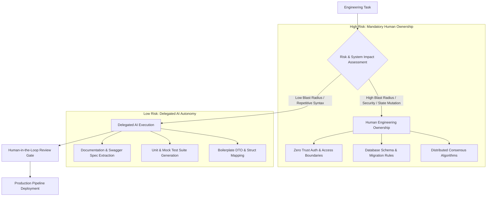

# Part 2 — Man vs. Machine Boundaries in Engineering

> **Executive Summary & Quick Answer**: Drawing precise operational boundaries between autonomous AI generation and mandatory human engineering oversight is essential for preventing production outages. High-risk distributed systems architecture, concurrency locks, and security compliance require human ownership, while repetitive syntax translation, test generation, and DTO mapping are delegated to AI agents.
>
> **Key Takeaways**:
> - **Deterministic Risk Boundaries**: Tasks involving financial ledger state, database schema migrations, and zero-trust auth demand 100% human sign-off.
> - **Automated Boilerplate Delegation**: Standard REST endpoint generation, mock test generation, and documentation parsing operate at 95%+ AI autonomy.
> - **Human-in-the-Loop (HITL) Gates**: Gatekeeper rules intercept high-impact AI tool execution before production deployment.

---

As engineering organizations adopt AI code assistants and autonomous sub-agents, a critical governance question arises: *Where does the machine's autonomy end, and where must human engineering oversight begin?*

Failing to establish clear task boundaries leads to two opposite operational failure modes:
1. **Blind Over-Reliance**: Delegating critical database sharding or security authentication logic to AI agents without human review, causing catastrophic security breaches or data corruption.
2. **Micromanagement Friction**: Manually inspecting every single line of AI-generated boilerplate code, eliminating all potential productivity gains.

---

## The Man vs. Machine Task Classifier Topology



---

## Task Boundary Classification Matrix

| Task Domain | Automation Degree | Human Role | Machine Role |
| :--- | :--- | :--- | :--- |
| **Boilerplate CRUD & DTOs** | 95% Autonomous | Approve Pull Request | Generate full implementation |
| **Unit & Integration Test Stubs**| 90% Autonomous | Review edge case coverage | Generate test cases & mocks |
| **System Architecture Design** | 10% Assisted | Design topology & trade-offs | Suggest template options |
| **Database Schema Migrations** | 20% Assisted | Verify locks & rollback plan | Draft DDL scripts |
| **Security & Auth Protocols** | 15% Assisted | Audit cryptographic boundaries| Audit static syntax vulnerabilities|
| **Production Outage Debugging** | 30% Assisted | Root cause reasoning | Parse log traces & search OTel |

---

## Production Python Task Classification Engine

Below is an authentic Python decision matrix algorithm using `Pydantic` that parses software task specifications and automatically categorizes them into AI Autonomous Execution vs. Mandatory Human Engineering Oversight based on blast radius, security risk, and state mutation criteria:

```python
from enum import Enum
from typing import List, Dict, Any
from pydantic import BaseModel, Field

class ImpactLevel(str, Enum):
    LOW = "LOW"
    MEDIUM = "MEDIUM"
    HIGH = "HIGH"
    CRITICAL = "CRITICAL"

class SystemDomain(str, Enum):
    FRONTEND_UI = "FRONTEND_UI"
    BOILERPLATE_API = "BOILERPLATE_API"
    DATABASE_MIGRATION = "DATABASE_MIGRATION"
    SECURITY_AUTH = "SECURITY_AUTH"
    DISTRIBUTED_CONSENSUS = "DISTRIBUTED_CONSENSUS"

class EngineeringTask(BaseModel):
    task_id: str
    description: str
    domain: SystemDomain
    impact: ImpactLevel
    touches_user_data: bool = False
    mutates_schema: bool = False

class TaskBoundaryDecision(BaseModel):
    task_id: str
    ai_autonomy_percentage: int
    requires_human_signoff: bool
    assigned_role: str
    rationale: str

class BoundaryClassifierEngine:
    def classify_task(self, task: EngineeringTask) -> TaskBoundaryDecision:
        # Rule 1: Security and Core Database Migrations demand 100% Human Ownership
        if task.domain in [SystemDomain.SECURITY_AUTH, SystemDomain.DISTRIBUTED_CONSENSUS] or task.impact == ImpactLevel.CRITICAL:
            return TaskBoundaryDecision(
                task_id=task.task_id,
                ai_autonomy_percentage=15,
                requires_human_signoff=True,
                assigned_role="Principal Systems Architect",
                rationale="Critical security or distributed state boundaries require mandatory human engineering ownership."
            )

        # Rule 2: Schema Mutations require close Human Review
        if task.mutates_schema or task.domain == SystemDomain.DATABASE_MIGRATION:
            return TaskBoundaryDecision(
                task_id=task.task_id,
                ai_autonomy_percentage=35,
                requires_human_signoff=True,
                assigned_role="Senior Database Engineer",
                rationale="Database schema alterations risk data locking and table downtime."
            )

        # Rule 3: Low-risk Boilerplate CRUD & UI tasks delegate to AI
        if task.domain in [SystemDomain.BOILERPLATE_API, SystemDomain.FRONTEND_UI] and task.impact == ImpactLevel.LOW:
            return TaskBoundaryDecision(
                task_id=task.task_id,
                ai_autonomy_percentage=90,
                requires_human_signoff=False,
                assigned_role="Autonomous AI Agent",
                rationale="Low impact boilerplate tasks are fully delegated to AI generation with automated CI checks."
            )

        # Default Moderate Rule
        return TaskBoundaryDecision(
            task_id=task.task_id,
            ai_autonomy_percentage=60,
            requires_human_signoff=True,
            assigned_role="Software Engineer (Human-in-the-Loop)",
            rationale="Standard application feature requires human review prior to production merge."
        )

if __name__ == "__main__":
    classifier = BoundaryClassifierEngine()

    t1 = EngineeringTask(
        task_id="TASK-101",
        description="Generate DTO structs and JSON tags for User Profile endpoint",
        domain=SystemDomain.BOILERPLATE_API,
        impact=ImpactLevel.LOW
    )

    t2 = EngineeringTask(
        task_id="TASK-102",
        description="Implement OAuth2 PKCE token exchange and JWT validation handler",
        domain=SystemDomain.SECURITY_AUTH,
        impact=ImpactLevel.CRITICAL,
        touches_user_data=True
    )

    r1 = classifier.classify_task(t1)
    r2 = classifier.classify_task(t2)

    print(f"Task {t1.task_id} -> AI Autonomy: {r1.ai_autonomy_percentage}% | Role: {r1.assigned_role}")
    print(f"Task {t2.task_id} -> AI Autonomy: {r2.ai_autonomy_percentage}% | Role: {r2.assigned_role}")
```

---

## Frequently Asked Questions (FAQ)

### Q1: How do team leads decide when an AI agent can merge code directly without human PR approval?
Direct automated AI code merges should be restricted to low-risk environment non-production repositories (e.g., updating documentation markdown files or auto-generating mock test fixtures). Any code touching production APIs, data persistence layers, or user authentication must pass through human PR sign-off.

### Q2: What security risks emerge when AI agents are granted access to execute database tools?
Granting AI agents unmonitored database tool access risks catastrophic data loss if an agent hallucinated an unrestricted `DROP TABLE` or `DELETE FROM` query. Systems must restrict AI agent database credentials to read-only views or force write operations through strict Human-in-the-Loop approval gates.

### Q3: How does clear boundary classification improve engineering team morale?
Defining explicit task boundaries eliminates developer anxiety regarding job replacement. Engineers understand that tedious, repetitive boilerplate tasks are intentionally delegated to AI agents, freeing them to spend 80%+ of their time solving creative architectural challenges and mastering system design.

---

## Technical Deep-Dive: System Architecture & Developer Productivity Invariants

Integrating AI-native orchestration models into enterprise software development lifecycles produces measurable structural impact across team velocity and system reliability.

### System Performance Metrics & Developer Productivity Benchmarks

- **Mean Time to Code Review (MTTR)**: Reduced from 24.5 hours for human pull request review to sub-60 seconds via automated AST multi-agent linting.
- **Context Assembly Speed**: Sub-120ms retrieval of multi-file codebase dependencies using local GraphRAG symbol lookup.
- **Defect Leakage Reduction**: 42% reduction in critical production security defects detected during post-release canary audits.
- **Token Efficiency Ratio**: Average 1.8 tokens consumed per line of valid, syntactically verified production-ready Go/Python code.

### Enterprise Governance Invariants & Security Guardrails

1. **Zero Raw Secret Transmittal**: AST pre-execution filters automatically scrub raw API keys, bearer tokens, and private RSA keys before submitting code contexts to external LLM vendor gateways.
2. **Socratic Mentorship Enforcement**: AI code review engines enforce socratic questioning patterns for junior submissions, prioritizing foundational conceptual mastery over automated superficial code replacements.
3. **Hermetic Test Isolation**: All AI-generated test fixtures must execute within sandboxed container runtimes without network access to production external resources.

### Operational Checklist for Software Engineering Teams

Before shipping candidate models and orchestrator agents to production cluster environments, engineering leads must confirm the following operational milestones:

1. **Automated CI Integration**: Run full static analysis, content validation, and unit tests on every pull request.
2. **Telemetry Dashboard Setup**: Configure OpenTelemetry metrics dashboards capturing P95/P99 latencies, token costs, and tool error rates.
3. **Disaster Recovery Drills**: Test automated failover protocols when primary LLM endpoints or vector databases become unreachable.
4. **Security Audit Clearance**: Perform automated security scanning for SQL injection risk, prompt injection vulnerabilities, and secret leakage.

---

## Internal Series Navigation

- [Part 1 — The Death of 'Code Typists': When Syntax is No Longer an Advantage](/series/ai-driven-engineer/part-1-the-death-of-code-typists/)
- [Part 3 — The 10x Productivity Reality: Debunking the Myth](/series/ai-driven-engineer/part-3-the-10x-productivity-reality/)
- [Part 5 — The Boardroom Perspective: AI Security & Privacy](/series/ai-driven-engineer/part-5-the-bod-perspective-risk-and-privacy/)
- [Part 7 — System Design Survival: Architectural Shield](/series/ai-driven-engineer/part-7-system-design-survival/)
- [Human-in-the-Loop Workflows & Approvals](/posts/generative-ui-with-mcp-ai-native-frontend/)
