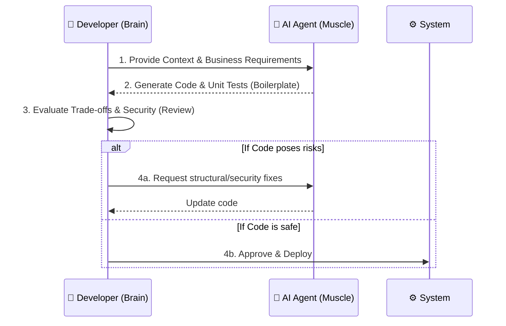

Upon realizing that typing speed has been defeated by AI (as discussed in Part 1), an invisible fear engulfs programmers: *"So what will I do if AI does everything?"*

The answer lies in clearly defining the boundary: AI doesn't do "everything". AI only handles the **technical muscle work**, while humans retain the **brains and responsibility**. To optimize the software development process without losing control, we need to draw a red line between the "Machine's Territory" and the "Human's Territory".

## The Machine's Territory (The Executor)

AI is like a "Super Junior" intern — possessing unmatched typing speed and remembering all the technical documentation in the world, but incredibly naive about business contexts. Delegate repetitive tasks, pattern matching, and syntax-heavy work to AI:

1. **Boilerplate Code:** Initializing projects, creating Entity/DTO classes, setting up database connections, basic CRUD. These are "manual" tasks that no one should write from scratch in 2026.
2. **Unit Tests and Mocking:** AI is incredibly good at reading a function and generating dozens of test cases covering every logic branch (if/else), including creating mock data.
3. **Regex and String Manipulation:** Instead of pulling your hair out for 2 hours writing a Regex to validate international phone numbers, AI can write it in 2 seconds along with code explaining it in detail.
4. **Language/Framework Translation:** Converting a config file from JSON to YAML, rewriting code from Python to Go, or migrating from React Class Components to Functional Components.

*In this territory, humans provide the Input (Prompt), and Machines are the Executors.*

### Technical Example: Regex and Initialization Boundary

Instead of writing complex Regex manually, the Programmer asks AI to generate the code, but they themselves must establish the "Boundary" (Business context):

```javascript
// [AI EXECUTES] - AI automatically writes Regex based on prompt
// Prompt: Write Regex to validate VN company tax code (10 or 13 digits)
const taxCodeRegex = /^(\d{10}|\d{10}-\d{3})$/;

// [HUMAN DECIDES] - Programmer decides the business flow
function validateCompanyInfo(taxCode) {
  if (!taxCodeRegex.test(taxCode)) {
    // Human decision: Don't throw an error and crash the app,
    // instead return an HTTP 400 code and log it to DataDog for tracking.
    logger.warn(`Invalid Tax Code Attempt: ${taxCode}`);
    return res.status(400).json({ error: "Invalid tax code" });
  }
  // Continue logic processing...
}
```

## The Human's Territory (The Architect & The Brain)

A programmer's true power doesn't lie in their fingers, but in their brain and contextual empathy. These are things AI cannot "learn" from GitHub:

1. **Understanding Business Logic:** AI doesn't know why your company has a "weird" business rule where VIP customers have to wait 5 seconds to apply a discount code (possibly due to an organizational anti-fraud process). Programmers must deeply understand the business to weave this context into the software architecture.
2. **Trade-off Decisions:** Choose Consistency or Availability? Use SQL or NoSQL for this case? AI can list pros and cons, but **Humans** are the final decision-makers based on budgets, team capabilities, and the BOD's business strategy.
3. **Security Context:** AI is prone to stepping on "Security Landmines" (as analyzed in Part 5). Programmers must maintain perimeter control: What data is public? Which Environment variables (Env) must not appear in the code?
4. **Review & Validation:** This is the most crucial skill. When AI finishes writing 500 lines of code, the Human must act as a strict Reviewer: *Does this code actually solve the problem? Is there Technical Debt? Can it be maintained for the next 3 years?*

### Flowchart: Human and Machine Interaction Workflow



## Visual Case Study: Role Division in Authentication Systems

To clearly see this role division, consider the problem: **Building a login and authorization module (Auth & RBAC)**.

| Criteria | Machine's Role (AI) | Human's Role (Developer) |
| :--- | :--- | :--- |
| **Execution** | Write a password hashing function using `bcrypt`. Generate and decode JWT tokens. Write a token-checking middleware. Generate 50 Unit tests for the module. | Decide whether to use Stateless JWT or Stateful Session-based depending on the project model. |
| **Thinking** | Follow standard syntax and existing patterns. | Decide how long the Token lives (Expiration time)? How does the Refresh Token mechanism work so users don't get logged out during payment? |
| **Security** | Import libraries and use functions without syntax errors. | Decide whether to store Tokens in `localStorage` or `httpOnly cookie` to prevent XSS/CSRF attacks? |

AI can code the entire `auth.js` file in 30 seconds. But if no Developer decides to store it in an `httpOnly cookie`, a hacker injects an XSS script and steals the Admin's token, your company goes bankrupt.

## The Core Difference: Accountability

Beyond skills, there is a legal and ethical boundary that AI can never cross: **AI does not have legal standing and cannot be held accountable.**

If the payment system crashes costing the company $1 million, or 100,000 customer credit card details are leaked, the Board of Directors (BOD) cannot fire... ChatGPT or sue GitHub Copilot. **The person who has to face the music is You — the Engineer who clicked `Approve Pull Request` and `Deploy`.**

That is why the programmer profession will never die. Society and businesses pay you highly not because you type fast, but so you can **vouch** for complex computer systems. When you understand this boundary, you will stop fearing being "replaced by AI". Instead, you turn AI into an engine, while you firmly hold the steering wheel.

However, a dangerous illusion is spreading in the Tech world: "Just use AI and coding speed increases 10x". The truth is, a highly powerful engine (AI) can help you reach the finish line early, but it can also drive the project straight off a cliff into Technical Debt if you don't know how to brake. Ultimately, does AI really bring breakthrough productivity, or is it just a media hoax? The naked truth will be exposed in **[Part 3: The 10x Productivity Reality: Where We Speed Up, Where We Slow Down](/series/ai-driven-engineer/part-3-the-10x-productivity-reality/)**.

---
### 🛠 Practical Exercise: Practice Redrawing the Boundary
1. **Challenge:** Open a payment processing logic file (or similar module) in your project.
2. **Action:** Highlight in green the code segments that AI can write well on its own (Data Fetching, Mapping, Formatting). Highlight in red the "Life-or-Death" code lines (Summing totals, Deducting funds, Authorization).
3. **Analysis:** You will realize 80% of your typing time is spent on the green parts, but 80% of the project's risk lies in the red parts. Let AI do the green, and you focus on protecting the red.

### 📚 External Resources & Related Links
- **Review Tools:** Use [SonarQube](https://www.sonarqube.org/) combined with AI to automatically detect technical debt.
- **Related in series:** See how to turn red work (architecture) into a strength in [Part 7: System Design Survival](/series/ai-driven-engineer/part-7-system-design-survival/).

---
💬 **Discussion Corner:** In your current project, where does the "Human territory" (decisions you don't dare hand over to AI) lie? (Payments, authorization, or database architecture?)

<div style="display: flex; justify-content: space-between; margin-top: 2rem;">
  <div><a href="/series/ai-driven-engineer/part-1-the-death-of-code-typists/">← Previous: Part 1</a></div>
  <div><a href="/series/ai-driven-engineer/part-3-the-10x-productivity-reality/">Next Article: Part 3 →</a></div>
</div>
