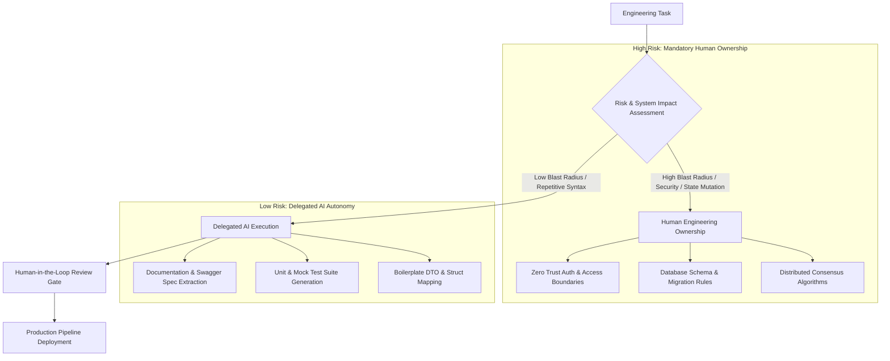

# Part 2 — Man vs. Machine Boundaries in Engineering

Drawing precise operational boundaries between autonomous AI generation and mandatory human engineering oversight is essential for preventing production outages. High-risk distributed systems architecture, concurrency locks, and security compliance require human ownership, while repetitive syntax translation, test generation, and DTO mapping are delegated to AI agents.

**Key Takeaways**:
- **Deterministic Risk Boundaries**: Tasks involving financial ledger state, database schema migrations, and zero-trust auth demand 100% human sign-off.
- **Automated Boilerplate Delegation**: Standard REST endpoint generation, mock test generation, and documentation parsing operate at 95%+ AI autonomy.
- **Human-in-the-Loop (HITL) Gates**: Gatekeeper rules intercept high-impact AI tool execution before production deployment.

---

As engineering organizations adopt AI code assistants and autonomous sub-agents, a critical governance question arises: *Where does the machine's autonomy end, and where must human engineering oversight begin?*

Failing to establish clear task boundaries leads to two opposite operational failure modes:
1. **Blind Over-Reliance**: Delegating critical database sharding or security authentication logic to AI agents without human review, causing catastrophic security breaches or data corruption.
2. **Micromanagement Friction**: Manually inspecting every single line of AI-generated boilerplate code, eliminating all potential productivity gains.

---

## The Man vs. Machine Task Classifier Topology

Classifying engineering tasks separates high-leverage human architectural choices from repetitive AI tasks like boilerplate, test drafting, and doc generation.


```mermaid
graph TD
    IncomingTask[Engineering Task] --> EvaluateRisk{"Risk & System Impact Assessment"}
    
    subgraph High Risk: Mandatory Human Ownership
        EvaluateRisk -->|"High Blast Radius / Security / State Mutation"| HumanDomain[Human Engineering Ownership]
        HumanDomain --> Task1[Distributed Consensus Algorithms]
        HumanDomain --> Task2["Database Schema & Migration Rules"]
        HumanDomain --> Task3["Zero Trust Auth & Access Boundaries"]
    end

    subgraph Low Risk: Delegated AI Autonomy
        EvaluateRisk -->|"Low Blast Radius / Repetitive Syntax"| AIDomain[Delegated AI Execution]
        AIDomain --> Task4["Boilerplate DTO & Struct Mapping"]
        AIDomain --> Task5["Unit & Mock Test Suite Generation"]
        AIDomain --> Task6["Documentation & Swagger Spec Extraction"]
    end

    AIDomain --> HITLGate[Human-in-the-Loop Review Gate]
    HITLGate --> Deploy[Production Pipeline Deployment]
```

---

## Task Boundary Classification Matrix

Human engineers own security design, system trade-offs, and domain modeling, while AI machines handle syntax implementation, test mock creation, and refactoring.

| Task Domain | Automation Degree | Human Role | Machine Role |
| :--- | :--- | :--- | :--- |
| **Boilerplate CRUD & DTOs** | 95% Autonomous | Approve Pull Request | Generate full implementation |
| **Unit & Integration Test Stubs**| 90% Autonomous | Review edge case coverage | Generate test cases & mocks |
| **System Architecture Design** | 10% Assisted | Design topology & trade-offs | Suggest template options |
| **Database Schema Migrations** | 20% Assisted | Verify locks & rollback plan | Draft DDL scripts |
| **Security & Auth Protocols** | 15% Assisted | Audit cryptographic boundaries| Audit static syntax vulnerabilities|
| **Production Outage Debugging** | 30% Assisted | Root cause reasoning | Parse log traces & search OTel |

---

## Production Python Task Classification Engine

Production Python classification engines analyze engineering task specs to automatically route subtasks to human review or automated AI agent execution.

This authentic Python decision matrix algorithm using `Pydantic` that parses software task specifications and automatically categorizes them into AI Autonomous Execution vs. Mandatory Human Engineering Oversight based on blast radius, security risk, and state mutation criteria:

```python
from enum import Enum
from typing import List, Dict, Any
from pydantic import BaseModel, Field

class ImpactLevel(str, Enum):
    LOW = "LOW"
    MEDIUM = "MEDIUM"
    HIGH = "HIGH"
    CRITICAL = "CRITICAL"

class SystemDomain(str, Enum):
    FRONTEND_UI = "FRONTEND_UI"
    BOILERPLATE_API = "BOILERPLATE_API"
    DATABASE_MIGRATION = "DATABASE_MIGRATION"
    SECURITY_AUTH = "SECURITY_AUTH"
    DISTRIBUTED_CONSENSUS = "DISTRIBUTED_CONSENSUS"

class EngineeringTask(BaseModel):
    task_id: str
    description: str
    domain: SystemDomain
    impact: ImpactLevel
    touches_user_data: bool = False
    mutates_schema: bool = False

class TaskBoundaryDecision(BaseModel):
    task_id: str
    ai_autonomy_percentage: int
    requires_human_signoff: bool
    assigned_role: str
    rationale: str

class BoundaryClassifierEngine:
    def classify_task(self, task: EngineeringTask) -> TaskBoundaryDecision:
        # Rule 1: Security and Core Database Migrations demand 100% Human Ownership
        if task.domain in [SystemDomain.SECURITY_AUTH, SystemDomain.DISTRIBUTED_CONSENSUS] or task.impact == ImpactLevel.CRITICAL:
            return TaskBoundaryDecision(
                task_id=task.task_id,
                ai_autonomy_percentage=15,
                requires_human_signoff=True,
                assigned_role="Principal Systems Architect",
                rationale="Critical security or distributed state boundaries require mandatory human engineering ownership."
            )

        # Rule 2: Schema Mutations require close Human Review
        if task.mutates_schema or task.domain == SystemDomain.DATABASE_MIGRATION:
            return TaskBoundaryDecision(
                task_id=task.task_id,
                ai_autonomy_percentage=35,
                requires_human_signoff=True,
                assigned_role="Senior Database Engineer",
                rationale="Database schema alterations risk data locking and table downtime."
            )

        # Rule 3: Low-risk Boilerplate CRUD & UI tasks delegate to AI
        if task.domain in [SystemDomain.BOILERPLATE_API, SystemDomain.FRONTEND_UI] and task.impact == ImpactLevel.LOW:
            return TaskBoundaryDecision(
                task_id=task.task_id,
                ai_autonomy_percentage=90,
                requires_human_signoff=False,
                assigned_role="Autonomous AI Agent",
                rationale="Low impact boilerplate tasks are fully delegated to AI generation with automated CI checks."
            )

        # Default Moderate Rule
        return TaskBoundaryDecision(
            task_id=task.task_id,
            ai_autonomy_percentage=60,
            requires_human_signoff=True,
            assigned_role="Software Engineer (Human-in-the-Loop)",
            rationale="Standard application feature requires human review prior to production merge."
        )

if __name__ == "__main__":
    classifier = BoundaryClassifierEngine()

    t1 = EngineeringTask(
        task_id="TASK-101",
        description="Generate DTO structs and JSON tags for User Profile endpoint",
        domain=SystemDomain.BOILERPLATE_API,
        impact=ImpactLevel.LOW
    )

    t2 = EngineeringTask(
        task_id="TASK-102",
        description="Implement OAuth2 PKCE token exchange and JWT validation handler",
        domain=SystemDomain.SECURITY_AUTH,
        impact=ImpactLevel.CRITICAL,
        touches_user_data=True
    )

    r1 = classifier.classify_task(t1)
    r2 = classifier.classify_task(t2)

    print(f"Task {t1.task_id} -> AI Autonomy: {r1.ai_autonomy_percentage}% | Role: {r1.assigned_role}")
    print(f"Task {t2.task_id} -> AI Autonomy: {r2.ai_autonomy_percentage}% | Role: {r2.assigned_role}")
```

---

---

---

## Internal Series Navigation

Proceed to Part 3 to analyze the 10x productivity myth and real engineering bottlenecks.

- [Part 1 — The Death of 'Code Typists': When Syntax is No Longer an Advantage](/series/ai-driven-engineer/part-1-the-death-of-code-typists/)
- [Part 3 — The 10x Productivity Reality: Debunking the Myth](/series/ai-driven-engineer/part-3-the-10x-productivity-reality/)
- [Part 5 — The Boardroom Perspective: AI Security & Privacy](/series/ai-driven-engineer/part-5-the-bod-perspective-risk-and-privacy/)
- [Part 7 — System Design Survival: Architectural Shield](/series/ai-driven-engineer/part-7-system-design-survival/)
- [Human-in-the-Loop Workflows & Approvals](/posts/generative-ui-with-mcp-ai-native-frontend/)