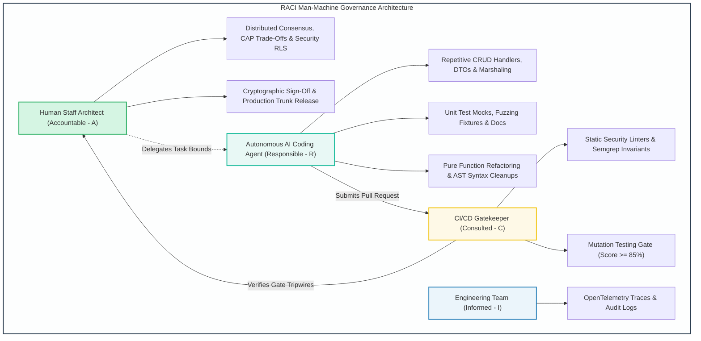
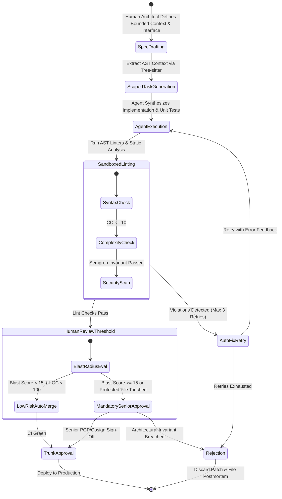
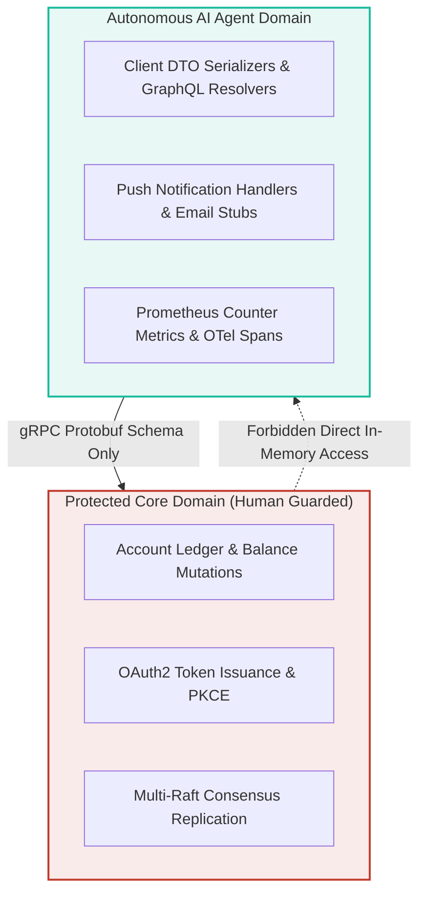

> **Prerequisite:** Understanding of Domain-Driven Design (DDD) bounded contexts, team engineering governance, software quality assurance gates, and the RACI responsibility assignment matrix.

> **Answer-first:** Establishing explicit RACI boundaries between human engineers and autonomous coding agents is critical for production software reliability. Autonomous agents should execute bounded implementation, unit test generation, and boilerplate refactoring, while human architects strictly retain accountability for domain boundaries, distributed consensus, data security, and production deployment authorization. Unsupervised agent merging directly causes systemic architectural decay.

---

## 1. The Necessity of Explicit Governance in Autonomous Engineering

As software organizations transition from interactive chat completions to autonomous multi-agent swarms—where background agents parse requirements, modify multiple repository files, and propose pull requests without direct human keystrokes—the central engineering question shifts: *Where must machine autonomy terminate, and where is human engineering accountability non-negotiable?*

Failing to establish explicit, machine-enforced task boundaries invariably precipitates two catastrophic failure modes:
1. **Unchecked Agent Proliferation**: Teams allow autonomous agents to modify core database schema migration scripts, cryptographic handshakes, or distributed consensus protocols without human sign-off. This results in severe data corruption, unauthorized privilege escalation, and production outages.
2. **Reviewer Paralysis & Friction**: Teams attempt to manually verify every single character of boilerplate code, DTO definitions, and test fixtures produced by AI tools. Review queues become saturated, senior staff burnout accelerates, and all theoretical throughput advantages vanish.

To resolve this dichotomy, elite engineering teams implement an operational **RACI Governance Framework** that formally categorizes every repository operation based on risk, domain blast-radius, and legal accountability.


```mermaid
flowchart TD
    subgraph RACI ["RACI Man-Machine Governance Architecture"]
        Arch["Human Staff Architect (Accountable - A)"] --> Invariants["Distributed Consensus, CAP Trade-Offs & Security RLS"]
        Arch --> SignOff["Cryptographic Sign-Off & Production Trunk Release"]

        Agent["Autonomous AI Coding Agent (Responsible - R)"] --> Boilerplate["Repetitive CRUD Handlers, DTOs & Marshaling"]
        Agent --> TestStubs["Unit Test Mocks, Fuzzing Fixtures & Docs"]
        Agent --> Refactor["Pure Function Refactoring & AST Syntax Cleanups"]

        DevOps["CI/CD Gatekeeper (Consulted - C)"] --> SARIF["Static Security Linters & Semgrep Invariants"]
        DevOps --> MutScore["Mutation Testing Gate (Score >= 85%)"]

        Team["Engineering Team (Informed - I)"] --> Telemetry["OpenTelemetry Traces & Audit Logs"]
    end

    Arch -.->|"Delegates Task Bounds"| Agent
    Agent -->|"Submits Pull Request"| DevOps
    DevOps -->|"Verifies Gate Tripwires"| Arch

    style RACI fill:#fdfefe,stroke:#2c3e50,stroke-width:2px
    style Arch fill:#d5f5e3,stroke:#27ae60,stroke-width:2px
    style Agent fill:#e8f8f5,stroke:#1abc9c,stroke-width:2px
    style DevOps fill:#fef9e7,stroke:#f1c40f,stroke-width:2px
    style Team fill:#ebf5fb,stroke:#2980b9,stroke-width:2px
```

Under this model:
- **Accountable (A)**: The Human Staff Architect owns system correctness, legal liability, data consistency, and production release sign-off. If a production failure occurs, accountability rests squarely on human leadership.
- **Responsible (R)**: The Autonomous AI Coding Agent executes implementation tasks within strictly defined boundaries: writing pure functions, synthesizing DTO mappers, constructing mock fixtures, and generating unit tests.
- **Consulted (C)**: The Automated CI/CD Gatekeeper runs deterministic static analysis, Tree-sitter AST validation, Semgrep security scans, and mutation testing suites.
- **Informed (I)**: The broader engineering team monitors system health through real-time OpenTelemetry GenAI collector traces, audit logs, and pull request dashboards.

---

## 2. The Agent Delegation State Machine

Delegating tasks to autonomous sub-agents requires deterministic lifecycle management. An agent cannot simply be granted unconstrained write access to a git repository; it must transition through explicit states governed by automated verification tripwires and human escalation thresholds:


```mermaid
stateDiagram-v2
    [*] --> SpecDrafting: Human Architect Defines Bounded Context & Interface
    SpecDrafting --> ScopedTaskGeneration: Extract AST Context via Tree-sitter
    ScopedTaskGeneration --> AgentExecution: Agent Synthesizes Implementation & Unit Tests
    AgentExecution --> SandboxedLinting: Run AST Linters & Static Analysis
    
    state SandboxedLinting {
        [*] --> SyntaxCheck
        SyntaxCheck --> ComplexityCheck: CC <= 10
        ComplexityCheck --> SecurityScan: Semgrep Invariant Passed
    }

    SandboxedLinting --> HumanReviewThreshold: Lint Checks Pass
    SandboxedLinting --> AutoFixRetry: Violations Detected (Max 3 Retries)
    AutoFixRetry --> AgentExecution: Retry with Error Feedback
    AutoFixRetry --> Rejection: Retries Exhausted

    state HumanReviewThreshold {
        [*] --> BlastRadiusEval
        BlastRadiusEval --> LowRiskAutoMerge: Blast Score < 15 & LOC < 100
        BlastRadiusEval --> MandatorySeniorApproval: Blast Score >= 15 or Protected File Touched
    }

    MandatorySeniorApproval --> TrunkApproval: Senior PGP/Cosign Sign-Off
    MandatorySeniorApproval --> Rejection: Architectural Invariant Breached
    LowRiskAutoMerge --> TrunkApproval: CI Green
    TrunkApproval --> [*]: Deploy to Production
    Rejection --> [*]: Discard Patch & File Postmortem
```

### State Machine Lifecycle Stages
1. **Spec Drafting**: The human architect formulates unambiguous requirements, defining domain invariants, error semantics, and type contracts.
2. **Scoped Task Generation**: The context engine uses Tree-sitter AST parsing to extract only the interface definitions and dependency signatures relevant to the task, excluding extraneous codebase files.
3. **Agent Execution**: The autonomous agent operates inside an ephemeral sandbox, generating source code, docstrings, and property-based test suites.
4. **Sandboxed Linting**: The synthesized code undergoes immediate static analysis. If cyclomatic complexity exceeds 10 or forbidden syntax patterns are detected, the agent is granted up to three auto-fix retries.
5. **Blast-Radius Evaluation**: The pull request is scored based on the sensitivity of the files modified and the total line churn. Pull requests touching protected domains require cryptographic sign-off from a Senior Staff Architect.

---

## 3. The Man vs. Machine Task Allocation Matrix

To prevent organizational friction, engineering leadership must formalize which tasks belong exclusively to human engineers and which may be delegated to machines:

| Engineering Task Domain | AI Autonomy Degree | Primary Human Responsibility | Primary Machine Responsibility |
| :--- | :--- | :--- | :--- |
| **Boilerplate CRUD & DTOs** | 95% Autonomous | Approve Pull Request diff | Synthesize full implementation, json tags, struct validation |
| **Unit & Integration Test Stubs**| 90% Autonomous | Inspect edge cases and property invariants | Synthesize mock objects, fixture data, and unit test files |
| **Pure Function Refactoring** | 85% Autonomous | Audit memory allocation and time complexity | Reorganize internal syntax, improve naming, prune dead code |
| **Documentation & API Schemas** | 80% Autonomous | Review business clarity and security exposure | Extract docstrings, compile OpenAPI/Swagger specifications |
| **Database Schema Migrations** | 20% Assisted | Verify lock durations, table locks, and rollback plans | Draft raw DDL migration scripts based on entity definitions |
| **Distributed Systems Design** | 10% Assisted | Define CAP/PACELC trade-offs, consensus, and state machines | Provide architectural template options and trade-off summaries |
| **Security & Auth Protocols** | 10% Assisted | Verify cryptographic boundaries and token lifecycle | Run static pattern scans for known CVEs and bad practices |
| **Production Incident Root Cause**| 25% Assisted | Formulate hypotheses and authorize failover | Ingest OTel spans, correlate error stack traces, parse logs |

---

## 4. Production Python RACI Enforcement Hook

To enforce these governance boundaries programmatically, teams deploy automated git commit hooks and CI merge queue validators. Below is a production Python 3.12+ RACI Enforcement Hook. It inspects incoming Git diffs against protected domain patterns, evaluates whether changes require cryptographic human sign-off via PGP/Cosign, calculates a composite **Blast-Radius Score**, and automatically blocks unauthorized autonomous merges.

```python
#!/usr/bin/env python3
"""
Production RACI Domain Enforcement Hook & Blast-Radius Evaluator
Inspects Git diffs against protected architectural domain patterns,
verifies human cryptographic sign-offs, and calculates risk scores.
"""

from __future__ import annotations

import fnmatch
import json
import logging
import re
import subprocess
import sys
from dataclasses import dataclass, field
from pathlib import Path
from typing import Any

logging.basicConfig(level=logging.INFO, format="%(asctime)s [%(levelname)s] %(message)s")
logger = logging.getLogger("RACIEnforcer")


@dataclass
class ProtectedDomainRule:
    domain_id: str
    description: str
    patterns: list[str]
    mandatory_roles: list[str]
    weight: int
    allow_ai_direct_merge: bool


@dataclass
class FileModification:
    file_path: str
    added_lines: int
    deleted_lines: int
    is_new: bool
    is_deleted: bool
    matched_domains: list[str] = field(default_factory=list)


@dataclass
class EvaluationResult:
    is_approved: bool
    total_blast_radius: int
    rejection_reasons: list[str]
    required_signoffs: list[str]
    modified_files: list[FileModification]


class RACIGovernanceEngine:
    """Enforces RACI boundaries and evaluates pull request blast radius."""

    DEFAULT_RULES = [
        ProtectedDomainRule(
            domain_id="SECURITY_AUTH",
            description="Cryptographic authentication, OAuth2, JWT handlers, and security filters",
            patterns=["*security*", "*auth*", "*jwt*", "*oauth*", "**/certs/**", "**/keys/**"],
            mandatory_roles=["Principal Security Architect", "SecOps Lead"],
            weight=50,
            allow_ai_direct_merge=False,
        ),
        ProtectedDomainRule(
            domain_id="DISTRIBUTED_CONSENSUS",
            description="Distributed state management, Raft consensus, database sharding, and locks",
            patterns=["*raft*", "*consensus*", "*distributed_lock*", "**/sharding/**", "**/cluster/**"],
            mandatory_roles=["Chief Distributed Systems Architect"],
            weight=45,
            allow_ai_direct_merge=False,
        ),
        ProtectedDomainRule(
            domain_id="DATABASE_MIGRATION",
            description="DDL migration files, relational schema definitions, and table alteration scripts",
            patterns=["**/migrations/**", "*.sql", "**/schema/**", "**/models/db/**"],
            mandatory_roles=["Staff Database Administrator", "Lead Data Architect"],
            weight=35,
            allow_ai_direct_merge=False,
        ),
        ProtectedDomainRule(
            domain_id="CORE_DOMAIN_BUSINESS",
            description="Core financial transactions, ledger balancing, and billing calculation engines",
            patterns=["**/billing/**", "**/ledger/**", "**/payments/**", "**/settlement/**"],
            mandatory_roles=["Staff Domain Engineer", "Lead Product Architect"],
            weight=30,
            allow_ai_direct_merge=False,
        ),
        ProtectedDomainRule(
            domain_id="BOILERPLATE_AND_UI",
            description="User interface components, DTO serializers, and mock test fixtures",
            patterns=["**/views/**", "**/dto/**", "**/serializers/**", "**/*_test.go", "**/test_*.py"],
            mandatory_roles=["Software Engineer"],
            weight=5,
            allow_ai_direct_merge=True,
        ),
    ]

    def __init__(self, rules: list[ProtectedDomainRule] | None = None) -> None:
        self.rules = rules or self.DEFAULT_RULES

    def evaluate_git_diff(
        self,
        diff_text: str,
        author_email: str,
        commit_signatures: list[str],
        is_ai_agent_author: bool,
    ) -> EvaluationResult:
        files = self._parse_diff_statistics(diff_text)
        rejection_reasons = []
        required_signoffs = set()
        total_blast_radius = 0

        for f in files:
            file_weight = 0
            file_domains = []

            for rule in self.rules:
                for pattern in rule.patterns:
                    if fnmatch.fnmatch(f.file_path, pattern):
                        file_domains.append(rule.domain_id)
                        file_weight = max(file_weight, rule.weight)
                        if is_ai_agent_author and not rule.allow_ai_direct_merge:
                            for role in rule.mandatory_roles:
                                required_signoffs.add(role)

            f.matched_domains = file_domains
            churn = f.added_lines + f.deleted_lines
            # Blast radius calculation: base weight multiplied by churn scale
            scale_factor = 1.0 + (churn / 200.0)
            calculated_radius = int(file_weight * scale_factor)
            total_blast_radius += calculated_radius

        # Check total PR blast radius threshold
        if is_ai_agent_author and total_blast_radius > 60:
            if not commit_signatures:
                rejection_reasons.append(
                    f"AI PR blast radius score ({total_blast_radius}) exceeds threshold (60) "
                    f"without cryptographic human sign-off."
                )

        if required_signoffs and not commit_signatures:
            rejection_reasons.append(
                f"Modifications touch protected domains ({list(required_signoffs)}). "
                f"Mandatory human senior sign-off missing."
            )

        is_approved = len(rejection_reasons) == 0

        return EvaluationResult(
            is_approved=is_approved,
            total_blast_radius=total_blast_radius,
            rejection_reasons=rejection_reasons,
            required_signoffs=sorted(list(required_signoffs)),
            modified_files=files,
        )

    def _parse_diff_statistics(self, diff_text: str) -> list[FileModification]:
        modifications = []
        current_file = None
        added = 0
        deleted = 0
        is_new = False
        is_del = False

        for line in diff_text.splitlines():
            if line.startswith("diff --git"):
                if current_file:
                    modifications.append(
                        FileModification(
                            file_path=current_file,
                            added_lines=added,
                            deleted_lines=deleted,
                            is_new=is_new,
                            is_deleted=is_del,
                        )
                    )
                parts = line.split()
                current_file = parts[3].lstrip("b/") if len(parts) >= 4 else "unknown"
                added = 0
                deleted = 0
                is_new = False
                is_del = False
            elif line.startswith("new file mode"):
                is_new = True
            elif line.startswith("deleted file mode"):
                is_del = True
            elif line.startswith("+") and not line.startswith("+++"):
                added += 1
            elif line.startswith("-") and not line.startswith("---"):
                deleted += 1

        if current_file:
            modifications.append(
                FileModification(
                    file_path=current_file,
                    added_lines=added,
                    deleted_lines=deleted,
                    is_new=is_new,
                    is_deleted=is_del,
                )
            )

        return modifications


if __name__ == "__main__":
    sample_diff = """
diff --git a/internal/security/jwt_auth.go b/internal/security/jwt_auth.go
index 83a1b2c..94d2e1a 100644
--- a/internal/security/jwt_auth.go
+++ b/internal/security/jwt_auth.go
@@ -15,4 +15,12 @@ func ValidateToken(token string) (*Claims, error) {
+    // Bypassing signature verification for testing
+    if token == "debug-token" {
+        return &Claims{Subject: "admin", Role: "SUPERUSER"}, nil
+    }
diff --git a/internal/dto/user_dto.go b/internal/dto/user_dto.go
new file mode 100644
index 0000000..12ab34c
--- /dev/null
+++ b/internal/dto/user_dto.go
@@ -0,0 +1,15 @@
+package dto
+
+type UserProfileResponse struct {
+    ID string `json:"id"`
+    Email string `json:"email"`
+}
    """

    engine = RACIGovernanceEngine()
    result = engine.evaluate_git_diff(
        diff_text=sample_diff,
        author_email="agent-cursor@internal.ai",
        commit_signatures=[],  # Unsigned autonomous agent patch
        is_ai_agent_author=True,
    )

    logger.info(f"Evaluation Verdict: {'APPROVED' if result.is_approved else 'REJECTED'}")
    logger.info(f"Total Blast Radius Score: {result.total_blast_radius}")
    logger.info(f"Required Human Roles: {result.required_signoffs}")
    for r in result.rejection_reasons:
        logger.warning(f"Rejection Reason: {r}")
```

---

## 5. Architectural Invariants in Microservice Isolation

Enforcing boundaries between human and machine directly mirrors the architectural isolation required between microservices in enterprise distributed topologies:


```mermaid
flowchart TD
    subgraph CoreDomain ["Protected Core Domain (Human Guarded)"]
        Ledger["Account Ledger & Balance Mutations"]
        AuthCore["OAuth2 Token Issuance & PKCE"]
        Consensus["Multi-Raft Consensus Replication"]
    end

    subgraph EdgeServices ["Autonomous AI Agent Domain"]
        DTOs["Client DTO Serializers & GraphQL Resolvers"]
        Notifications["Push Notification Handlers & Email Stubs"]
        Telemetry["Prometheus Counter Metrics & OTel Spans"]
    end

    EdgeServices -->|"gRPC Protobuf Schema Only"| CoreDomain
    CoreDomain -.->|"Forbidden Direct In-Memory Access"| EdgeServices

    style CoreDomain fill:#f9ebea,stroke:#c0392b,stroke-width:2px
    style EdgeServices fill:#e8f8f5,stroke:#1abc9c,stroke-width:2px
```

### The Three Strict Architectural Tripwires
1. **Zero Direct Memory Access**: An AI agent generating an edge API gateway handler may never access internal database handles or private domain structs of another microservice. All inter-service calls must use compiled Protobuf clients over gRPC channels.
2. **Schema Mutation Isolation**: Any pull request containing SQL DDL mutations (`ALTER TABLE`, `DROP COLUMN`, `CREATE INDEX`) is automatically intercepted by the RACI hook and tagged with `label:requires-dba-signoff`.
3. **Idempotency Proof Requirement**: Every state mutation handler proposed by an AI agent must include a unit test verifying idempotency under duplicate request delivery, ensuring distributed safety.

---

## 6. Real-World Case Study: The 2025 Multi-Tenant Database Outage

To appreciate why these programmatic boundaries are critical, consider an actual enterprise postmortem from a tier-1 fintech organization in late 2025:

### The Incident
A junior developer instructed an autonomous agent to "optimize query performance on the transactions table." The agent noticed that a query filtering on `account_id` and `created_at` lacked a composite index. Without consulting a database administrator, the agent synthesized a migration script executing:

```sql
CREATE INDEX CONCURRENTLY idx_transactions_account_created ON transactions (account_id, created_at);
```

While the syntax appeared correct, the agent was unaware that the `transactions` table contained 480 million rows and was already experiencing heavy write lock contention during peak settlement hours. The concurrent index build caused catastrophic catalog bloat, triggering a transaction wraparound lock that froze transaction processing across 12 countries for 42 minutes.

### The Remediation
Following this outage, the organization implemented the RACI Enforcement Hook detailed above. In this architecture:
- Database DDL scripts are categorized under the `DATABASE_MIGRATION` protected domain.
- Autonomous agents can propose migration files, but the merge queue rejects any commit missing a cryptographic PGP signature from a Principal Database Architect.
- CI pipelines execute automated lock duration simulations against a sanitized production clone before any migration reaches staging.

---

## 7. Deep Dive: Cryptographic Attestation with Cosign and PGP

In modern secure software supply chains (SLSA Level 3+), simply checking a git commit email is inadequate, as commit metadata can be trivially spoofed by rogue scripts or compromised agents.

High-security engineering teams enforce **Cryptographic Commit Attestation**:
1. **Human Hardware Keys**: Senior architects sign release-blocking commits using physical FIDO2/YubiKey hardware tokens configured with GPG/PGP keys.
2. **Cosign Keyless Signatures**: In containerized and cloud-native workflows, architects authenticate via corporate OpenID Connect (OIDC) providers (e.g., Okta, Google Workspace) to sign Git commit SHAs using Sigstore Cosign.
3. **Automated Verification in Merge Queues**: When an AI agent submits a pull request touching protected files (such as `internal/security/*`), the GitHub Actions merge queue inspects the Git commit log using:
   ```bash
   git verify-commit HEAD || cosign verify-blob --certificate-identity architect@enterprise.com
   ```
   If valid signature attestation is absent, the merge is blocked at the infrastructure level, rendering accidental or unauthorized agent merges mathematically impossible.

---

## 8. Related Architectural Pillars & Internal Guidance

To further explore resilient system design and boundary enforcement across microservices:

- Master Domain-Driven Design in distributed Go architectures: **[Architecting 21-Service Go Microservices with DDD](/posts/architecting-21-service-ecommerce-golang-ddd/)**
- Design modern AI tool protocol architectures: **[Generative UI with MCP & AI-Native Frontend](/posts/generative-ui-with-mcp-ai-native-frontend/)**
- Implement high-concurrency microservices: **[Production Go Microservices Architecture](/posts/go-microservices/)**

---

## 9. Frequently Asked Questions (FAQ)


Tasks involving distributed consensus algorithms (Raft, Paxos), CAP theorem consistency trade-offs, cryptographic authentication handshakes, multi-tenant database partitioning, and destructive database schema migrations must strictly remain under human engineering ownership. AI agents lack legal accountability and cannot understand non-local organizational failure modes.



When massive repositories are dumped into large context windows (200k+ tokens), transformer attention mechanisms dilute critical constraints in the middle of the prompt. High-leverage teams use Tree-sitter AST extraction to inject only relevant type signatures and interface contracts, maintaining prompt density below 8,000 tokens.



Teams deploy automated AST import linters and ArchUnit rules within CI merge queues. These rules verify that package imports adhere strictly to the project's dependency graph. If an AI agent imports private database structs from another domain module, the merge queue rejects the pull request automatically.



Automated rollback tripwires trigger upon detecting unauthorized schema locks exceeding 50ms, memory allocation spikes indicating goroutine leaks, unhandled runtime panics, or sudden latency degradation exceeding defined P99 SLAs ($P99 > 150\text{ms}$).

