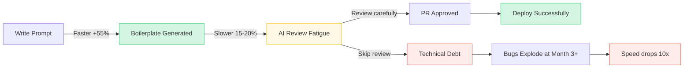

---

title: "Part 3 — The 10x Productivity Reality: Where We Speed Up, Where We Slow Down"
date: "2026-05-10T15:20:00+07:00"
lastmod: "2026-05-10T15:20:00+07:00"
draft: false
description: "Exposing the '10x Developer' illusion. Where does AI actually speed up the process, and what traps slow it down?"
ShowToc: true
TocOpen: true
weight: 4
categories: ["Series", "Software Engineering"]
tags: ["AI", "System Design", "Career"]
cover:
  image: "images/posts/ai-native-frontend-cover.png"
  alt: "AI-Driven Engineer series: evolving from code typist to AI-native software architect"
  relative: false
author: "Lê Tuấn Anh"
canonicalURL: "https://tanhdev.com/series/ai-driven-engineer/part-3-the-10x-productivity-reality/"
mermaid: true
---

Social media and tech marketing campaigns constantly inject a concept into our heads: **"10x Developer thanks to AI"**. The image of a programmer sipping coffee, typing a few prompts, and finishing a week's worth of work in one morning is incredibly appealing.

But the truth in the trenches of real-world projects is much harsher. AI provides immense power, but it follows the law of conservation of energy: The time you save when "typing code" will be partially (or entirely) reclaimed during the reading and maintenance phases if you don't know what you're doing.

## The Real-World Metrics Picture

Before diving deep, let's look at the numbers from the most reputable reports:

- **Writing Speed:** According to a 2023 GitHub Copilot study of 3,000 developers, the group using AI completed an HTTP server in JavaScript **55% faster** (1 hour 11 minutes vs. 2 hours 41 minutes for the non-AI group).
- **Acceptance Rate:** At large tech companies, the acceptance rate for AI-generated code ranges from **25% to 40%**. This means 60-75% of AI suggestions are deleted or modified.
- **Maintenance:** Conversely, the time to review and debug a Pull Request containing "AI code" often **increases by about 15-20%**, as the reviewer has to face a large volume of unfamiliar code that even the author might not fully understand.

From these numbers, it's clear: The 10x productivity boost does not come from typing 10 times faster.

### Diagram: The AI Productivity Lifecycle — Where It Speeds Up and Slows Down



## Where Does AI Actually Speed Things Up? (The Speed-Up)

It's undeniable that in certain stages, AI is truly a particle accelerator:

1. **Curing "Writer's Block":** When starting a difficult task, many programmers spend hours just staring at an empty IDE screen. With AI, you just write a comment: `// TBD: Logic to calculate progressive tax based on EU region pricing`. Instantly, you have a skeleton to start with. Editing is always easier than creating from scratch.
2. **Rapid Prototyping:** Setting up a Next.js boilerplate connected to Supabase with Tailwind CSS used to take half a day. Now, tools like v0.dev or Cursor can build a workable Proof of Concept (POC) right in the browser in less than 30 minutes.
3. **Eliminating Context Switching:** Pre-AI, the workflow was usually: Coding -> get stuck -> open browser -> Google -> dive into StackOverflow -> read docs -> return to IDE to apply. This process breaks the flow state. Now, with Copilot Chat or Cursor, the answer is right inside the code line you are writing.

## AI Review Fatigue

However, that terrifying code generation speed is spawning a new syndrome in tech companies: **AI Review Fatigue.**

There's an eternal truth in the software industry: *Reading someone else's code is always harder and more mentally exhausting than writing it yourself.* When you write code, you understand every variable and why every loop was created. But when AI "vomits" 500 lines of code in 5 seconds, the entire cognitive load is dumped onto your shoulders during the Review phase.

*   **The Illusion of Perfection:** AI-generated code often *looks very beautiful* and syntactically correct. This "good looks" deceives the brain, making programmers lazy, causing them to skim instead of reading carefully.
*   **The Exhaustion of Finding "Hidden Logic Errors":** AI might misuse a data structure or call the wrong internal API with a similar name. Straining your eyes scanning 500 lines of unfamiliar code to find one IF/ELSE with inverted logic is actually far more nerve-wracking than typing those 500 lines yourself. When code reading becomes too exhausting, Devs will blindly click `Approve`, and disaster strikes.

## The Price of Speed: The "Technical Debt" Trap

The consequence of "AI Review Fatigue" is technological garbage.

Because AI isn't limited by time or hand fatigue, it tends to generate bloated code. It's perfectly willing to call 3 massive libraries just to solve a simple string calculation. If Devs just keep blindly hitting `Tab` (Accept), the project's source code will bloat recklessly.

> **[Hard Evidence] [GitClear 2024 Report](https://www.gitclear.com/coding_on_copilot_data_shows_ais_downward_pressure_on_code_quality):** Analyzing over 153 million lines of AI-authored code (Copilot), researchers found that "Code Churn" (code that is updated, reverted, or deleted less than two weeks after being authored) **spiked by 30%**. The amount of reused code (DRY) plummeted, making way for rampant copy/pasted code. This proves AI is creating Technical Debt faster than ever.

The result: You might release features 3x faster in the first month. But by the third month, when the system is tangled in "spaghetti code" that no one understands (not even the AI), the speed of fixing bugs will be 10x slower. The Total Productivity of the project will ultimately be a negative number.

## Visual Case Study: The Refactoring Problem

| Criteria | Code Typist + AI (Speed Obsessed) | Architect + AI (Lifecycle Management) |
| :--- | :--- | :--- |
| **Action** | Selects the entire 1000-line file, commands AI: *"Optimize this file to make it clean"*. Receives 800 new lines. Clicks Accept without thinking. | Selects function by function. Provides clear context. Carefully reads each changed line. Compares Big O complexity (O(N) vs O(1)) before merging. |
| **Initial Result** | Done in 2 minutes. App still runs (or so it seems). | Done in 45 minutes. |
| **Consequences 1 week later** | An edge-case fails because AI arbitrarily deleted a flag variable. Dev **spends 3 days** tearing through 800 lines of code to find the logic bug the AI spawned. | Easily tracks and isolates bugs if they occur, because the Dev fully controls the updated logic. |

## Redefining "10x Productivity"

In the AI era, the metric for productivity is **NO LONGER** Lines of Code (LOC) generated per day.

Productivity is measured by **Time-to-Value (The time from having an idea to bringing value to the Business)** and the ability to **Reduce Complexity**. A 10x programmer is someone who knows how to use AI to solve a problem with the *fewest possible lines of code*, not someone who uses AI to trash the codebase.

So when individual productivity undergoes such a massive transformation, does the entire software production machine (SDLC) keep its old shape? What happens when a Business Analyst (BA) or Quality Assurance (QA) also starts using AI to "write some code"?

The collapse of the walls separating departments will create a shockwave analyzed in **[Part 4: Blurring SDLC Lines & The QC Revolution](/series/ai-driven-engineer/part-4-blurring-sdlc-lines-and-qc-revolution/)**.

---
### 🛠 Practical Exercise: Measure Your Own "Code Churn"
1. **Challenge:** In the coming work week, track a feature you write entirely with AI (Generate > 100 lines/time).
2. **Action:** Count how many of those lines of code need to be modified after QA reports a bug, or after your boss reviews the code.
3. **Analysis:** Calculate your own "AI Code Churn" rate. If this rate is over 30%, you are getting tangled in "AI Technical Debt".

### 📚 External Resources
- **Original Research:** [GitHub Copilot: Productivity increases 55%](https://github.blog/2022-09-07-research-quantifying-github-copilots-impact-on-developer-productivity-and-happiness/).
- **Reference Material:** Read the [AI Technical Debt Management Process](/series/ai-driven-playbook/) from the internal Playbook.

---
💬 **Discussion Corner:** Have you ever experienced "AI Review Fatigue"? When was the last time AI generated code that looked beautiful at a glance but contained a "hidden logic error" that took you all day to debug?


### Go Concurrent Worker Pool Pattern

AI productivity is amplified when systems delegate multiple code analysis checks to parallel routines. The following code executes tasks concurrently via a Worker Pool.

```go
package main

import (
	"fmt"
	"sync"
)

func Worker(id int, jobs <-chan string, results chan<- string, wg *sync.WaitGroup) {
	defer wg.Done()
	for job := range jobs {
		fmt.Printf("Worker %d processing task: %s\n", id, job)
		results <- fmt.Sprintf("Result of %s", job)
	}
}

func main() {
	jobs := make(chan string, 10)
	results := make(chan string, 10)
	var wg sync.WaitGroup

	for w := 1; w <= 3; w++ {
		wg.Add(1)
		go Worker(w, jobs, results, &wg)
	}

	for j := 1; j <= 5; j++ {
		jobs <- fmt.Sprintf("StaticAuditTask-%d", j)
	}
	close(jobs)

	wg.Wait()
	close(results)

	for res := range results {
		fmt.Println(res)
	}
}
```


## Operational Context: Part 3 The 10X Productivity Reality Appendix

### KPI Tracking and Code Quality Metrics
To evaluate the impact of AI-assisted development, track code quality indicators in the CI pipeline. Monitor the change lead time (from commit to production) alongside the code churn rate (lines deleted within 7 days). A rising churn rate indicates hallucinated patterns, requiring adjustment of the prompt templates.


<div style="display: flex; justify-content: space-between; margin-top: 2rem;">
  <div><a href="/series/ai-driven-engineer/part-2-man-vs-machine-boundaries/">← Previous: Part 2</a></div>
  <div><a href="/series/ai-driven-engineer/part-4-blurring-sdlc-lines-and-qc-revolution/">Next Article: Part 4 →</a></div>
</div>
