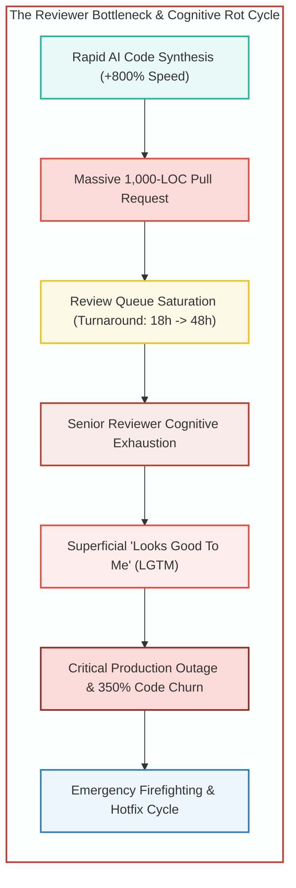
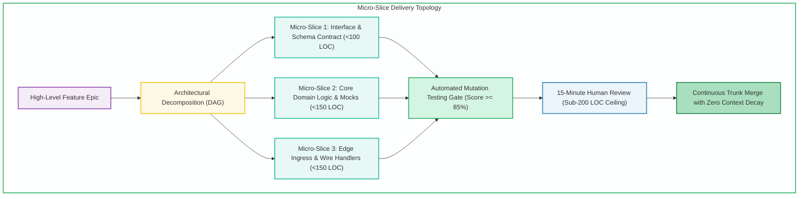
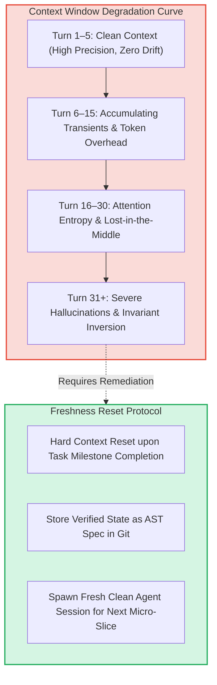

> **Prerequisite:** Experience managing pull request workflows, familiarity with DORA engineering velocity metrics, cognitive load theory in code reviews, and mutation testing principles.

> **Answer-first:** The industry narrative of unconditional 10x developer productivity collapses under empirical code review and cognitive verification bottlenecks. While initial code synthesis accelerates by 800%, review friction and cognitive load escalate by 210% when managing large pull requests. Sustainable engineering velocity requires delivering micro-slices under 200 lines of code with automated mutation testing and strict context window resetting.

---

## 1. Deconstructing the 10x Developer Narrative

Promotional marketing campaigns and popular technology headlines frequently claim that autonomous AI coding assistants instantly transform every software developer into a "10x Engineer." Commercial vendors tout demonstrations where an entire full-stack application is generated in under three minutes from a simple one-sentence prompt.

However, when engineering leaders introduce AI tools across multi-team enterprise environments (100 to 500+ engineers), they observe an empirical reality that contradicts vendor claims: **Raw lines of code (LOC) synthesized per developer increase by 300% to 500%, yet end-to-end feature delivery cycle time to production only improves by 20% to 35%.** Even worse, change failure rates and post-release defects frequently climb.

This discrepancy stems from a fundamental misunderstanding of the Software Development Life Cycle (SDLC). Writing code is only one sub-phase of software engineering. The real determinants of delivery velocity are requirement disambiguation, architectural boundary enforcement, system integration, automated verification, and asynchronous code review.


```mermaid
flowchart LR
    subgraph BottleneckCycle ["The Reviewer Bottleneck & Cognitive Rot Cycle"]
        Synthesis["Rapid AI Code Synthesis (+800% Speed)"] --> BloatedPR["Massive 1,000-LOC Pull Request"]
        BloatedPR --> Queue["Review Queue Saturation (Turnaround: 18h -> 48h)"]
        Queue --> ReviewerFatigue["Senior Reviewer Cognitive Exhaustion"]
        ReviewerFatigue --> RubberStamp["Superficial 'Looks Good To Me' (LGTM)"]
        RubberStamp --> Outage["Critical Production Outage & 350% Code Churn"]
        Outage --> Hotfixes["Emergency Firefighting & Hotfix Cycle"]
    end

    style BottleneckCycle fill:#fdfefe,stroke:#c0392b,stroke-width:2px
    style Synthesis fill:#e8f8f5,stroke:#1abc9c,stroke-width:2px
    style BloatedPR fill:#fadbd8,stroke:#e74c3c,stroke-width:2px
    style Queue fill:#fef9e7,stroke:#f1c40f,stroke-width:2px
    style ReviewerFatigue fill:#f9ebea,stroke:#c0392b,stroke-width:2px
    style RubberStamp fill:#fdedec,stroke:#e74c3c,stroke-width:2px
    style Outage fill:#fadbd8,stroke:#922b21,stroke-width:2px
    style Hotfixes fill:#ebf5fb,stroke:#2980b9,stroke-width:2px
```

When code synthesis accelerates without corresponding improvements in verification and review tooling, the bottleneck simply shifts downstream, saturating senior engineers and paralyzing the release pipeline.

---

## 2. Where We Speed Up vs. Where We Slow Down

To measure genuine velocity gains, engineering teams must dissect which tasks genuinely accelerate under generative AI models, and which tasks experience friction or regression:

| Engineering Phase | Traditional Velocity | AI-Assisted Velocity | Net Delta & Operational Reality |
| :--- | :--- | :--- | :--- |
| **Boilerplate CRUD Synthesis** | 4–6 hours | 30–60 seconds | **+800% Speedup**: Highly predictable AST patterns are solved instantly. |
| **Unit Test Mock Stubbing** | 2–3 hours | 2–5 minutes | **+500% Speedup**: Mocks, fixtures, and tabular tests are synthesized rapidly. |
| **API Documentation & Schemas**| 1–2 hours | 3 minutes | **+400% Speedup**: OpenAPI, Swagger, and Markdown summaries generated cleanly. |
| **Multi-Repo Context Framing** | 30 minutes | 45 minutes | **-50% Slowdown**: Managing token limits, avoiding context rot, and pruning ASTs. |
| **Pull Request Code Review** | 45 minutes | 90–120 minutes | **-100% Slowdown**: Reading AI code requires high scrutiny for subtle edge-case flaws. |
| **Distributed Debugging & Races**| 2 hours | 3–4 hours | **-50% Slowdown**: AI hallucinations in concurrent code create elusive race conditions. |
| **Overall Production Feature Cycle**| 5 business days | 3.5 business days | **+30% Net Gain**: Real-world gains are meaningful, but far below naive 10x claims. |

### The Root Causes of Cognitive Slowdown
1. **The "Look-Correct" Hazard**: Unlike human juniors who write messy code that looks obviously flawed, modern reasoning models generate syntactically immaculate code with formatted docstrings and standard variable names. However, underneath that clean exterior often lurk non-thread-safe map accesses, missing database index hints, unclosed network response bodies, or inverted authorization scopes.
2. **Reviewer Fatigue**: Reading 1,000 lines of syntactically polished code to detect subtle logical edge cases requires substantially more cognitive working memory than reading hand-typed code where human intent is easier to reconstruct from git commit history.
3. **Context Window Drift**: As conversational chat sessions exceed 15 to 25 turns, the attention mechanism suffers from attention entropy. Models forget earlier architectural boundaries, silently hallucinating outdated dependencies or reverting previously solved edge cases.

---

## 3. The Solution: Micro-Slice Delivery & The Sub-200 LOC Rule

To break the reviewer bottleneck and achieve sustainable, verifiable engineering acceleration, elite teams enforce **Micro-Slice Delivery**. Instead of submitting monolithic 1,000-line PRs, features are partitioned into atomic slices under 200 lines of code, coupled with automated property-based verification.


```mermaid
flowchart TD
    subgraph MicroSlicePipeline ["Micro-Slice Delivery Topology"]
        Epic["High-Level Feature Epic"] --> Decompose["Architectural Decomposition (DAG)"]
        Decompose --> Slice1["Micro-Slice 1: Interface & Schema Contract (<100 LOC)"]
        Decompose --> Slice2["Micro-Slice 2: Core Domain Logic & Mocks (<150 LOC)"]
        Decompose --> Slice3["Micro-Slice 3: Edge Ingress & Wire Handlers (<150 LOC)"]

        Slice1 --> AutoMut["Automated Mutation Testing Gate (Score >= 85%)"]
        Slice2 --> AutoMut
        Slice3 --> AutoMut

        AutoMut --> QuickReview["15-Minute Human Review (Sub-200 LOC Ceiling)"]
        QuickReview --> Merge["Continuous Trunk Merge with Zero Context Decay"]
    end

    style MicroSlicePipeline fill:#fdfefe,stroke:#27ae60,stroke-width:2px
    style Epic fill:#f4ecf7,stroke:#8e44ad,stroke-width:2px
    style Decompose fill:#fef9e7,stroke:#f1c40f,stroke-width:2px
    style Slice1 fill:#e8f8f5,stroke:#1abc9c,stroke-width:2px
    style Slice2 fill:#e8f8f5,stroke:#1abc9c,stroke-width:2px
    style Slice3 fill:#e8f8f5,stroke:#1abc9c,stroke-width:2px
    style AutoMut fill:#d5f5e3,stroke:#27ae60,stroke-width:2px
    style QuickReview fill:#ebf5fb,stroke:#2980b9,stroke-width:2px
    style Merge fill:#a9dfbf,stroke:#1e8449,stroke-width:2px
```

### The Mathematics of Micro-Slices
- **Review Speed**: A 150-line pull request requires approximately 10 to 15 minutes of senior reviewer focus and has an average defect catch rate of **85%**. A 1,000-line pull request takes over an hour, yet defect catch rates plummet below **25%** due to cognitive saturation.
- **Merge Queue Flow**: Micro-slices pass CI test runners and merge queues with virtually zero merge conflicts. If a regression occurs, isolating the root cause takes minutes rather than days.
- **Context Preservation**: AI agents synthesizing small, bounded files maintain peak attention precision, completely avoiding context window degradation and hallucinations.

---

## 4. Production Python Pull Request Review Burden Analyzer

To enforce micro-slice disciplines automatically, teams integrate cognitive load analyzers into their continuous integration pipelines. The following production Python 3.12+ tool parses git diffs, calculates cognitive complexity scores based on AST branching, flags PRs exceeding 200 lines of code, and automatically generates structured review checklists for human reviewers.

```python
#!/usr/bin/env python3
"""
Production Pull Request Review Burden Analyzer & Cognitive Complexity Scorer
Parses git diffs, calculates cognitive complexity across modified files,
enforces the sub-200 LOC ceiling, and generates structured reviewer checklists.
"""

from __future__ import annotations

import json
import logging
import re
import sys
from dataclasses import asdict, dataclass, field
from pathlib import Path
from typing import Any

logging.basicConfig(level=logging.INFO, format="%(asctime)s [%(levelname)s] %(message)s")
logger = logging.getLogger("PRReviewAnalyzer")


@dataclass
class FileDiffMetric:
    file_path: str
    added_loc: int
    deleted_loc: int
    cognitive_complexity: int
    is_test_file: bool
    risk_level: str


@dataclass
class PRReviewBurdenReport:
    total_added_loc: int
    total_deleted_loc: int
    net_loc: int
    total_cognitive_complexity: int
    estimated_review_minutes: float
    exceeds_size_threshold: bool
    review_recommendation: str
    reviewer_checklist: list[str]
    file_metrics: list[FileDiffMetric]


class PullRequestBurdenAnalyzer:
    """Evaluates pull request review burden and cognitive complexity."""

    MAX_SUSTAINABLE_LOC = 200
    WORDS_PER_MINUTE_READING = 200

    COMPLEXITY_PATTERNS = [
        (re.compile(r"\b(if|else\s+if|elif)\b"), 1),
        (re.compile(r"\b(for|while|foreach)\b"), 2),
        (re.compile(r"\b(switch|case|select)\b"), 1),
        (re.compile(r"\b(catch|except|recover)\b"), 2),
        (re.compile(r"(&&|\|\|)"), 1),
        (re.compile(r"\b(go\s+\w+|threading\.Thread|async\s+def)\b"), 3),  # Concurrency penalty
    ]

    def __init__(self, max_loc: int = MAX_SUSTAINABLE_LOC) -> None:
        self.max_loc = max_loc

    def analyze_diff(self, diff_text: str) -> PRReviewBurdenReport:
        file_metrics = []
        current_file = None
        added_lines: list[str] = []
        deleted_count = 0

        for line in diff_text.splitlines():
            if line.startswith("diff --git"):
                if current_file:
                    metric = self._evaluate_file(current_file, added_lines, deleted_count)
                    file_metrics.append(metric)
                parts = line.split()
                current_file = parts[3].lstrip("b/") if len(parts) >= 4 else "unknown"
                added_lines = []
                deleted_count = 0
            elif line.startswith("+") and not line.startswith("+++"):
                added_lines.append(line[1:])
            elif line.startswith("-") and not line.startswith("---"):
                deleted_count += 1

        if current_file:
            metric = self._evaluate_file(current_file, added_lines, deleted_count)
            file_metrics.append(metric)

        total_added = sum(f.added_loc for f in file_metrics)
        total_deleted = sum(f.deleted_loc for f in file_metrics)
        total_complexity = sum(f.cognitive_complexity for f in file_metrics)

        # Baseline: 1 minute per 15 LOC added + 2 minutes per point of cognitive complexity
        estimated_minutes = (total_added / 15.0) + (total_complexity * 1.5)
        exceeds_threshold = total_added > self.max_loc

        checklist = self._generate_reviewer_checklist(file_metrics, total_added, total_complexity)

        if exceeds_threshold:
            recommendation = (
                f"REJECT: PR size ({total_added} added LOC) exceeds the 200-line micro-slice ceiling. "
                f"Decompose into smaller sub-PRs to prevent reviewer cognitive fatigue and defect leakage."
            )
        elif total_complexity > 25:
            recommendation = (
                f"WARN: High cognitive complexity ({total_complexity}). "
                f"Requires dual senior human review focusing on concurrency locks and error fallbacks."
            )
        else:
            recommendation = "PASS: PR conforms to micro-slice delivery standards. Estimated review time < 15 minutes."

        return PRReviewBurdenReport(
            total_added_loc=total_added,
            total_deleted_loc=total_deleted,
            net_loc=total_added - total_deleted,
            total_cognitive_complexity=total_complexity,
            estimated_review_minutes=round(estimated_minutes, 1),
            exceeds_size_threshold=exceeds_threshold,
            review_recommendation=recommendation,
            reviewer_checklist=checklist,
            file_metrics=file_metrics,
        )

    def _evaluate_file(self, file_path: str, added_lines: list[str], deleted_count: int) -> FileDiffMetric:
        is_test = bool(re.search(r"(_test\.go|test_.*\.py|.*\.spec\.ts)$", file_path))
        complexity = 0

        for line in added_lines:
            for pattern, weight in self.COMPLEXITY_PATTERNS:
                matches = pattern.findall(line)
                complexity += len(matches) * weight

        # Test code receives lower risk weighting
        if is_test:
            complexity = int(complexity * 0.5)

        if complexity > 10 or len(added_lines) > 100:
            risk = "HIGH"
        elif complexity > 5 or len(added_lines) > 50:
            risk = "MEDIUM"
        else:
            risk = "LOW"

        return FileDiffMetric(
            file_path=file_path,
            added_loc=len(added_lines),
            deleted_loc=deleted_count,
            cognitive_complexity=complexity,
            is_test_file=is_test,
            risk_level=risk,
        )

    def _generate_reviewer_checklist(
        self, files: list[FileDiffMetric], total_loc: int, total_complexity: int
    ) -> list[str]:
        items = [
            f"Verify all new functions contain unit test assertions with mutation score >= 85%",
            f"Confirm no secret tokens, API keys, or raw PII logging are present",
        ]
        has_concurrency = any(f.cognitive_complexity > 8 for f in files)
        if has_concurrency:
            items.append("CRITICAL: Concurrency primitives detected; verify mutex lock pairing and channel buffer limits")
        has_db = any("migration" in f.file_path or ".sql" in f.file_path for f in files)
        if has_db:
            items.append("CRITICAL: Database schema modifications detected; verify lock timeout and rollback DDL")
        return items


if __name__ == "__main__":
    sample_diff = """
diff --git a/pkg/orders/service.go b/pkg/orders/service.go
index 1a2b3c..4d5e6f 100644
--- a/pkg/orders/service.go
+++ b/pkg/orders/service.go
@@ -10,6 +10,25 @@ func (s *OrderService) CreateOrder(ctx context.Context, req *OrderRequest) (*Ord
+    for _, item := range req.Items {
+        if item.Quantity <= 0 {
+            return nil, ErrInvalidQuantity
+        }
+        if item.Price < 0 {
+            return nil, ErrInvalidPrice
+        }
+    }
+    go func() {
+        select {
+        case <-ctx.Done():
+            return
+        default:
+            s.notifyWarehouse(req.OrderID)
+        }
+    }()
+    return s.repo.Save(ctx, req)
    """

    analyzer = PullRequestBurdenAnalyzer()
    report = analyzer.analyze_diff(sample_diff)

    logger.info(f"PR Assessment: {report.review_recommendation}")
    logger.info(f"Added LOC: {report.total_added_loc} | Cognitive Complexity: {report.total_cognitive_complexity}")
    logger.info(f"Estimated Review Time: {report.estimated_review_minutes} mins")
    for check in report.reviewer_checklist:
        logger.info(f" -> Checklist: {check}")
```

---

## 5. Prompt Prefix Caching: Slashing Latency and Token Costs

In modern multi-agent development workflows, developers repeatedly send the same repository schemas, coding conventions (`AGENTS.md`), and system rules in every single prompt. Naive systems re-tokenize and re-process these identical tokens on every request, inflating latency and bills.

**Prompt Prefix Caching** (implemented by Anthropic Claude and OpenAI APIs) transforms development ergonomics:
1. **The KV Cache Mechanism**: When the prefix of a prompt matches a previously sent request beyond a minimum block size (e.g., 1,024 tokens), the model accelerator reuses the precomputed Key-Value (KV) cache directly from high-speed GPU HBM memory.
2. **Latency Slashes**: Time-to-First-Token (TTFT) drops from 2,500ms down to less than 200ms, enabling near-instantaneous code suggestions.
3. **Financial Savings**: Cached input tokens receive an **80% to 90% discount** compared to standard input token rates, making continuous background agent indexing economically viable for enterprise teams.

---

## 6. Context Rot and Freshness Reset Strategies

A major reason developers slow down after an hour of using AI tools is **Context Rot** (accumulated conversational pollution):


```mermaid
flowchart TD
    subgraph ContextDegradation ["Context Window Degradation Curve"]
        Turn1["Turn 1–5: Clean Context (High Precision, Zero Drift)"] --> Turn10["Turn 6–15: Accumulating Transients & Token Overhead"]
        Turn10 --> Turn25["Turn 16–30: Attention Entropy & Lost-in-the-Middle"]
        Turn25 --> Rot["Turn 31+: Severe Hallucinations & Invariant Inversion"]
    end

    subgraph HealthProtocol ["Freshness Reset Protocol"]
        Reset["Hard Context Reset upon Task Milestone Completion"]
        Checkpoint["Store Verified State as AST Spec in Git"]
        Branch["Spawn Fresh Clean Agent Session for Next Micro-Slice"]
    end

    Rot -.->|"Requires Remediation"| HealthProtocol

    style ContextDegradation fill:#fadbd8,stroke:#e74c3c,stroke-width:2px
    style HealthProtocol fill:#d5f5e3,stroke:#27ae60,stroke-width:2px
```

### The Three Operational Rules for Context Freshness
1. **The 20-Turn Ceiling**: Never allow a conversational coding session to exceed 20 turns. Once a function or micro-slice passes unit tests, commit the code to git and kill the session.
2. **Git as the Sole Source of Truth**: Never store architecture state inside an ephemeral LLM chat history. Store verified state in markdown specifications (`AGENTS.md`) and compiled code in Git.
3. **Cold Starts for New Subtasks**: When switching from business logic to database migrations or infrastructure scripts, always spawn a completely fresh agent session with scoped Tree-sitter context.

---

## 7. True Engineering Velocity Metrics Beyond Lines of Code

Traditional engineering managers who evaluate productivity using lines of code (LOC), commit counts, or pull request volume fall prey to Goodhart's Law in the AI era. When code generation is free, measuring LOC merely incentivizes developers to generate bloated, redundant code.

Elite organizations evaluate velocity using the **2027 AI-Native Velocity Index**:
- **DORA Lead Time for Changes**: Clock time elapsed from the first commit of a feature slice to its successful verification in production. Target: $< 4\text{ hours}$.
- **14-Day Code Churn**: Percentage of newly merged code that is subsequently modified or deleted within two weeks. Target: $< 8\%$.
- **Mutation Kill Score**: Percentage of synthetic mutants caught by the test suite in CI. Target: $\ge 85\%$.
- **Review Turnaround Latency**: Mean time a pull request waits for human review before approval. Target: $< 30\text{ minutes}$ (enabled by the 200-line micro-slice ceiling).

---

## 8. Related Architectural Pillars & Internal Guidance

To learn more about scaling high-concurrency systems and resilient production architectures, explore these deep dives on tanhdev.com:

- Master peak-traffic distributed architectures: **[Alipay Double 11 Architecture & Extreme TPS Optimization](/posts/alipay-double-11-architecture-tps/)**
- Structured technical curricula for senior engineers: **[System Architecture Reading Map](/reading-map/)**
- Implement enterprise microservices with strict DDD boundaries: **[Architecting 21-Service Go Microservices with DDD](/posts/go-microservices/)**

---

## 9. Frequently Asked Questions (FAQ)


Code generation acceleration saturates senior engineering staff because reading, comprehending, and verifying software requires substantial human cognitive effort. When teams produce 3x to 5x more lines of code without filtering, senior reviewers face overwhelming PR backlogs, resulting in review turnaround delays, cognitive burnout, and rubber-stamp approvals that allow critical bugs into production.



Prompt Prefix Caching reuses the precomputed Key-Value (KV) attention cache stored in GPU memory when consecutive prompts share identical initial token sequences (such as system rules, repository schemas, and AGENTS.md instructions). This reduces Time-to-First-Token (TTFT) by up to 90% and slashes cached token billing costs by 80% to 90%.



In the era of autonomous AI, synthesizing raw lines of code costs virtually nothing. Evaluating engineers by LOC or commit volume rewards bloated boilerplate, duplicate helper functions, and unmaintainable abstractions. Modern teams measure velocity through DORA metrics (Lead Time for Changes, Change Failure Rate), 14-day Code Churn, and mutation test scores.



Developers should reset conversation context every 15 to 20 interaction turns or immediately upon completing a discrete micro-slice. Long conversational sessions suffer from attention entropy and context rot, causing models to misinterpret requirements, violate previously established architectural rules, and hallucinate non-existent interfaces.

