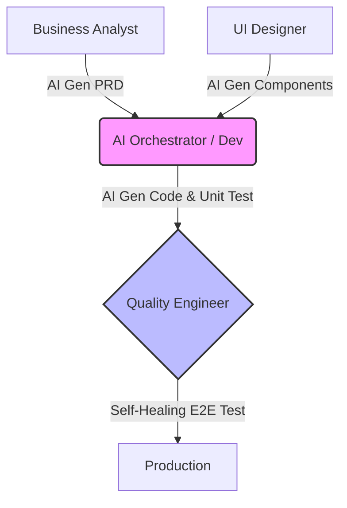

The traditional Software Development Life Cycle (SDLC) is often described as a factory assembly line. Business Analysts (BA) write requirements $\rightarrow$ Designers draw UI $\rightarrow$ Developers (Dev) write code $\rightarrow$ Quality Assurance (QA) finds bugs $\rightarrow$ DevOps pushes to the server. Everyone sits in their own "silo" and communicates via Jira tickets.

But AI has swung a sledgehammer, smashing these walls. When a BA can ask AI to generate a runnable Proof of Concept, and a Developer can ask AI to write automated test scripts, the boundaries between roles become incredibly blurred.

## Blurring Silos: Devs No Longer "Wait for Tickets"

The emergence of AI Agents has forced Developers to step out of their "just code" comfort zone and intervene deeper into the entire process:

1. **Analysis Phase (BA/PM):** PMs now use ChatGPT to auto-generate PRDs (Product Requirement Docs) and break down User Stories. The speed from "idea" to "draft" is lightning fast. **Dev's Mission:** Must participate early to assess *Technical Feasibility*. If a BA uses AI to spawn unrealistic logic, the architect (Dev) must use system thinking to stop it immediately before it turns into Technical Debt.
2. **Interface Phase (UI/UX):** With the arrival of v0.dev (by Vercel) or Figma AI, a design can be translated directly into a complete React Component with Tailwind CSS. The act of "slicing HTML/CSS" is going extinct. **Dev's Mission:** Front-end Devs no longer sit tweaking margins/padding, but focus on hooking up APIs, managing complex State, and optimizing Performance.
3. **Operations Phase (DevOps):** AI generates highly accurate Dockerfiles, Kubernetes yaml files, or Terraform scripts. Today's Devs are forced to become "Full-Cycle Developers" — self-coding, self-setting up CI/CD, and self-deploying without waiting for the DevOps team to be free.

## The QC Revolution (Quality Engineering)

If Developers are shocked a little, the Tester/QA community is shocked tenfold. The QC Revolution is happening at breakneck speed, completely redefining how we ensure software quality.

*   **The End of "Manual Testing" and the Flaky Tests Nightmare:** Previously, Automation Testing (like Selenium) was very fragile. Rename a CSS class, and the entire test script collapses. Today, **Self-Healing Automation** tools use AI to understand the DOM structure. Even if a button's ID changes, AI automatically "patches" the script and continues running.
*   **Visual Validation:** Say goodbye to eyeballing UI. Computer Vision AI (like Applitools) can compare real screenshots with Figma designs with pixel-perfect accuracy. If the font color is off or a button is shifted by 2 pixels, AI catches it.
*   **Extreme Shift-Left:** The moment a Dev `git commits`, Agents like QA Wolf or Copilot automatically generate Unit Tests and scan for vulnerabilities (SAST) right in the IDE. By the time the code reaches QA's machine, it's 95% clean.

This shift forces traditional QA to evolve into **Quality Engineers (QE)**. Instead of manually "clicking the app," QEs become managers of an "AI Tester Army," responsible for planning the Coverage Strategy and pointing out Business Edge Cases to the AI.

## Visual Case Study: The SDLC Pipeline

| Criteria | Linear SDLC (Pre-AI) | Symbiotic SDLC (AI-Augmented) |
| :--- | :--- | :--- |
| **Dev's Role** | Sits in the middle. Receives design from Designer, codes, throws to QA to test. | Becomes the central "Hub". Receives UI Components from AI, PRDs from BA, auto-gens Tests for QE to review. |
| **Testing Process** | QA writes test cases in Excel, Dev codes, QA tests manually for 2 days. | Dev uses AI to gen 80% Unit Test coverage in 2 mins. QE uses AI to run self-healing Automated E2E Tests. Test time: 1 hour. |
| **Bottleneck** | Waiting for each other (Waiting for design, DevOps environment, QA testing). | Human cross-review speed (AI Review Fatigue). |

## The New Concern of the Board (BOD)

When everything moves so fast, boundaries are broken, and productivity soars, it feels like we've found the holy grail of the tech industry. But...

Just as Programmers are intoxicatedly using AI to auto-generate Tests, write Terraform, and deploy to the Cloud, an invisible disaster lurks. What happens if the AI-generated code exactly copies open-source code with a strict license? What happens if you copy your company's entire Database structure and paste it into ChatGPT to write a query?

Those are the **Legal & Security Landmines** keeping C-Level/BOD awake at night. They view AI not just as speed, but as an existential risk. How will they manage this risk? The shocking answer regarding the trend of "Banning Public AI" will be in **[Part 5: The BOD Perspective: Expectations, Costs, Legal Risks & Internal AI](/series/ai-driven-engineer/part-5-the-bod-perspective-risk-and-privacy/)**.

---
💬 **Discussion Corner:** Have the role boundaries in your current team "blurred" yet? Has your QA team started using AI to write automated test scripts, or have Devs started taking over UI component design?
