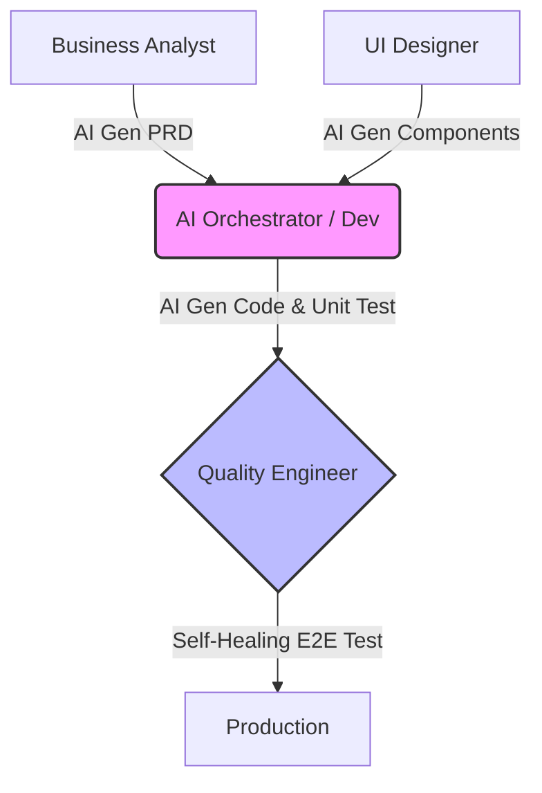

---

title: "Part 4 — Blurring SDLC Lines & The QC Revolution"
date: "2026-05-10T15:30:00+07:00"
lastmod: "2026-05-10T15:30:00+07:00"
draft: false
description: "AI is breaking down the walls between BAs, Designers, Devs, and QA."
ShowToc: true
TocOpen: true
weight: 5
categories: ["Series", "Software Engineering"]
tags: ["AI", "System Design", "Career"]
cover:
  image: "images/posts/ai-native-frontend-cover.png"
  alt: "AI-Driven Engineer series: evolving from code typist to AI-native software architect"
  relative: false
author: "Lê Tuấn Anh"
canonicalURL: "https://tanhdev.com/series/ai-driven-engineer/part-4-blurring-sdlc-lines-and-qc-revolution/"
mermaid: true
---

The traditional Software Development Life Cycle (SDLC) is often described as a factory assembly line. Business Analysts (BA) write requirements $\rightarrow$ Designers draw UI $\rightarrow$ Developers (Dev) write code $\rightarrow$ Quality Assurance (QA) finds bugs $\rightarrow$ DevOps pushes to the server. Everyone sits in their own "silo" and communicates via Jira tickets.

But AI has swung a sledgehammer, smashing these walls. When a BA can ask AI to generate a runnable Proof of Concept, and a Developer can ask AI to write automated test scripts, the boundaries between roles become incredibly blurred.

## Blurring Silos: Devs No Longer "Wait for Tickets"

The emergence of AI Agents has forced Developers to step out of their "just code" comfort zone and intervene deeper into the entire process:

1. **Analysis Phase (BA/PM):** PMs now use ChatGPT to auto-generate PRDs (Product Requirement Docs) and break down User Stories. The speed from "idea" to "draft" is lightning fast. **Dev's Mission:** Must participate early to assess *Technical Feasibility*. If a BA uses AI to spawn unrealistic logic, the architect (Dev) must use system thinking to stop it immediately before it turns into Technical Debt.
2. **Interface Phase (UI/UX):** With the arrival of v0.dev (by Vercel) or Figma AI, a design can be translated directly into a complete React Component with Tailwind CSS. The act of "slicing HTML/CSS" is going extinct. **Dev's Mission:** Front-end Devs no longer sit tweaking margins/padding, but focus on hooking up APIs, managing complex State, and optimizing Performance.
3. **Operations Phase (DevOps):** AI generates highly accurate Dockerfiles, Kubernetes yaml files, or Terraform scripts. Today's Devs are forced to become "Full-Cycle Developers" — self-coding, self-setting up CI/CD, and self-deploying without waiting for the DevOps team to be free.

### Technical Example: Full-Cycle Automation (CI/CD)

This is a typical example when a Developer asks AI to set up a CI/CD Pipeline (Github Actions) with just one prompt: *"Create a yaml file to deploy Next.js to Vercel, mandatory to run tests first."*

```yaml
# AI-Generated CI/CD Pipeline (.github/workflows/deploy.yml)
name: Deploy Next.js to Vercel
on:
  push:
    branches: [ "main" ]
jobs:
  test-and-deploy:
    runs-on: ubuntu-latest
    steps:
      - uses: actions/checkout@v3
      - name: Setup Node.js
        uses: actions/setup-node@v3
        with:
          node-version: '18'
      
      # 1. Automated Testing (Shift-Left)
      - run: npm ci
      - run: npm run test:unit
      
      # 2. Automated Deployment (No DevOps needed)
      - name: Deploy to Vercel
        if: success() # Only deploy when QA (tests) are green
        uses: amondnet/vercel-action@v20
        with:
          vercel-token: ${{ secrets.VERCEL_TOKEN }}
          vercel-org-id: ${{ secrets.ORG_ID }}
          vercel-project-id: ${{ secrets.PROJECT_ID }}
          vercel-args: '--prod'
```
*Devs don't need to rely on a DevOps engineer. The entire testing and deployment phase is neatly automated.*

## The QC Revolution (Quality Engineering)

If Developers are shocked a little, the Tester/QA community is shocked tenfold. The QC Revolution is happening at breakneck speed, completely redefining how we ensure software quality.

*   **The End of "Manual Testing" and the Flaky Tests Nightmare:** Previously, Automation Testing (like Selenium) was very fragile. Rename a CSS class, and the entire test script collapses. Today, **Self-Healing Automation** tools use AI to understand the DOM structure. Even if a button's ID changes, AI automatically "patches" the script and continues running.
*   **Visual Validation:** Say goodbye to eyeballing UI. Computer Vision AI (like Applitools) can compare real screenshots with Figma designs with pixel-perfect accuracy. If the font color is off or a button is shifted by 2 pixels, AI catches it.
*   **Extreme Shift-Left:** The moment a Dev `git commits`, Agents like QA Wolf or Copilot automatically generate Unit Tests and scan for vulnerabilities (SAST) right in the IDE. By the time the code reaches QA's machine, it's 95% clean.

This shift forces traditional QA to evolve into **Quality Engineers (QE)**. Instead of manually "clicking the app," QEs become managers of an "AI Tester Army," responsible for planning the Coverage Strategy and pointing out Business Edge Cases to the AI.

## Visual Case Study: The SDLC Pipeline



| Criteria | Linear SDLC (Pre-AI) | Symbiotic SDLC (AI-Augmented) |
| :--- | :--- | :--- |
| **Dev's Role** | Sits in the middle. Receives design from Designer, codes, throws to QA to test. | Becomes the central "Hub". Receives UI Components from AI, PRDs from BA, auto-gens Tests for QE to review. |
| **Testing Process** | QA writes test cases in Excel, Dev codes, QA tests manually for 2 days. | Dev uses AI to gen 80% Unit Test coverage in 2 mins. QE uses AI to run self-healing Automated E2E Tests. Test time: 1 hour. |
| **Bottleneck** | Waiting for each other (Waiting for design, DevOps environment, QA testing). | Human cross-review speed (AI Review Fatigue). |

## The New Concern of the Board (BOD)

When everything moves so fast, boundaries are broken, and productivity soars, it feels like we've found the holy grail of the tech industry. But...

Just as Programmers are intoxicatedly using AI to auto-generate Tests, write Terraform, and deploy to the Cloud, an invisible disaster lurks. What happens if the AI-generated code exactly copies open-source code with a strict license? What happens if you copy your company's entire Database structure and paste it into ChatGPT to write a query?

Those are the **Legal & Security Landmines** keeping C-Level/BOD awake at night. They view AI not just as speed, but as an existential risk. How will they manage this risk? The shocking answer regarding the trend of "Banning Public AI" will be in **[Part 5: The BOD Perspective: Expectations, Costs, Legal Risks & Internal AI](/series/ai-driven-engineer/part-5-the-bod-perspective-risk-and-privacy/)**.

---
### 🛠 Practical Exercise: Build an AI Test Bot
1. **Challenge:** You are a QE. Try applying the "Extreme Shift-Left" strategy.
2. **Action:** Use Cursor or Github Copilot Chat, open a Javascript function in your project, and request: *"Generate 5 edge-case Unit Tests (Jest) for this function, including security risks (like SQL Injection payloads)".*
3. **Analysis:** Run it and see if AI covers cases that a Manual QA tester might miss.

### 📚 External Resources & Related Links
- **Self-Healing Tools:** Explore [QA Wolf](https://www.qawolf.com/) or [Playwright](https://playwright.dev/) combined with AI.
- **Related in series:** Rapid automated test writing skills are detailed in the *Prompt Library* of [Part 6: From Coder to Orchestrator](/series/ai-driven-engineer/part-6-from-coder-to-orchestrator/).

---
💬 **Discussion Corner:** Have the role boundaries in your current team "blurred" yet? Has your QA team started using AI to write automated test scripts, or have Devs started taking over UI component design?


### Go Table-Driven Unit Testing

Quality Control shifts from manual QA to table-driven automated test suites generated and validated through code check loops.

```go
package main

import "testing"

func CalculateCoverageRatio(statements, executed int) float64 {
	if statements == 0 {
		return 0.0
	}
	return (float64(executed) / float64(statements)) * 100.0
}

func TestCalculateCoverageRatio(t *testing.T) {
	tests := []struct {
		stmt, exec int
		want       float64
	}{
		{100, 75, 75.0},
		{0, 0, 0.0},
		{50, 50, 100.0},
	}

	for _, tc := range tests {
		got := CalculateCoverageRatio(tc.stmt, tc.exec)
		if got != tc.want {
			t.Errorf("CalculateCoverageRatio(%d, %d) = %f; want %f", tc.stmt, tc.exec, got, tc.want)
		}
	}
}
```

### The QA Revolution and Shifting Testing Left
In the AI-driven software development lifecycle, testing is integrated directly into the coding loop:
- **Auto-generated Tests:** AI agents generate comprehensive table-driven tests covering edge cases.
- **Mutational Testing:** Automated systems inject synthetic bugs to verify the test suite detects them.
- **Dynamic Assertions:** Gateways check outputs against schema specifications in real time.
- **Zero-touch Deployments:** Code is automatically pushed to production if it passes the validation suite.

### Technical Appendix: Mocking Interfaces & Testing Strategies in Go
To construct highly isolated unit test suites:
- **Interface Segregation:** Define interfaces at the consumer level. This allows easy mocking without writing boilerplate mock objects.
- **Use gomock Generator:** Run the `mockgen` utility to generate mock definitions for external network services (databases, payment APIs) automatically.
- **Parallel Testing Execution:** Use the `t.Parallel()` instruction in Go test definitions. This triggers concurrent execution across multiple CPU cores, accelerating CI suite runtime.


## Operational Context: Part 4 Blurring Sdlc Lines And Qc Revolution Appendix

### KPI Tracking and Code Quality Metrics
To evaluate the impact of AI-assisted development, track code quality indicators in the CI pipeline. Monitor the change lead time (from commit to production) alongside the code churn rate (lines deleted within 7 days). A rising churn rate indicates hallucinated patterns, requiring adjustment of the prompt templates.


## Operational Context: Part 4 Blurring Sdlc Lines And Qc Revolution Appendix

### Sandbox Container Isolation and Security Profiles
Running code generated by AI models requires isolated runtimes. Deploy sandboxed containers utilizing kernel virtualization (like gVisor). Restrict container CPU shares and block internet access to prevent execution of unauthorized commands or network requests.


<div style="display: flex; justify-content: space-between; margin-top: 2rem;">
  <div><a href="/series/ai-driven-engineer/part-3-the-10x-productivity-reality/">← Previous: Part 3</a></div>
  <div><a href="/series/ai-driven-engineer/part-5-the-bod-perspective-risk-and-privacy/">Next Article: Part 5 →</a></div>
</div>
