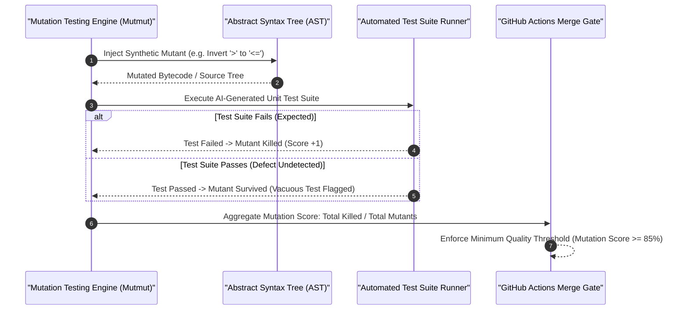

> **Prerequisite:** Knowledge of modern CI/CD pipelines (GitHub Actions), static analysis tools (Semgrep, SonarQube), automated property-based testing, and test coverage metrics.

> **Answer-first:** Autonomous AI generation blurs traditional boundaries separating development, quality assurance, and site reliability into a unified continuous engineering lifecycle. Quality control shifts left into automated PromptOps pipelines powered by Tree-sitter AST validation, Semgrep security scans, and property-based mutation testing. Human QA engineers transform into verification architects designing automated evaluation harnesses and synthetic defect injection suites.

---

## 1. The Collapse of Traditional SDLC Silos

For three decades, commercial software delivery was structured around a rigid, assembly-line model of sequential handoffs: Business Analysts produced requirements documents, Developers manually wrote application logic, Quality Assurance (QA) testers executed manual test scripts, and Site Reliability/DevOps engineers manually provisioned cloud infrastructure.

This sequential structure introduced massive operational latency. An architectural defect introduced on Monday was often discovered by QA on Friday, forcing the original developer to switch contexts, rebuild mental models, and apply rushed emergency patches.

In 2026, autonomous agent frameworks and frontier reasoning models collapse these organizational silos into a continuous, real-time engineering loop. When a developer writes or prompts a feature specification, specialized AI agents concurrently synthesize the Go/Python microservice handler, construct corresponding unit and integration test fixtures, generate Terraform HCL infrastructure declarations, and configure OpenTelemetry telemetry dashboards—all within the active IDE authoring session.


```mermaid
flowchart TD
    subgraph PromptOpsPipeline ["Shift-Left PromptOps CI/CD Pipeline"]
        Spec["Formal Feature Contract (Protobuf / AST Schema)"] --> Agent["Autonomous AI Code Generator"]
        Agent --> CodeGen["Synthesized Microservice Code + IaC Manifests"]
        
        CodeGen --> ASTGate["Tree-sitter AST Syntax & Complexity Gate (CC <= 10)"]
        ASTGate --> SemgrepScan["Semgrep Static Security & RLS Invariant Scan"]
        SemgrepScan --> MutationGate["Mutmut AST Mutation Testing Gate (Score >= 85%)"]
        MutationGate --> LLMJudge["LLM-as-a-Judge Evaluation & Semantic Benchmark"]
        
        LLMJudge --> VerificationPass{"All Verification Gates Green?"}
        VerificationPass -->|Yes| AutoDeploy["Automated Canary Release & Observability Monitor"]
        VerificationPass -->|No| AutoRemediate["Agentic Self-Healing Loop (Max 3 Iterations)"]
        AutoRemediate --> Agent
    end

    style PromptOpsPipeline fill:#fdfefe,stroke:#27ae60,stroke-width:2px
    style Spec fill:#f4ecf7,stroke:#8e44ad,stroke-width:2px
    style Agent fill:#e8f8f5,stroke:#1abc9c,stroke-width:2px
    style CodeGen fill:#ebf5fb,stroke:#2980b9,stroke-width:2px
    style ASTGate fill:#fef9e7,stroke:#f1c40f,stroke-width:2px
    style SemgrepScan fill:#fadbd8,stroke:#e74c3c,stroke-width:2px
    style MutationGate fill:#d5f5e3,stroke:#27ae60,stroke-width:2px
    style LLMJudge fill:#fcf3cf,stroke:#f39c12,stroke-width:2px
    style AutoDeploy fill:#a9dfbf,stroke:#1e8449,stroke-width:2px
    style AutoRemediate fill:#f9ebea,stroke:#c0392b,stroke-width:2px
```

The implication for engineering organizations is profound: **Quality Assurance is no longer a downstream department; it is an upstream, automated verification gate embedded into the developer's immediate feedback loop.** When code generation is instantaneous, the developer becomes an orchestrator who designs the contract and oversees automated verification suites that test against boundary regressions continuously.

---

## 2. The Illusion of Line Coverage & The Mutation Testing Imperative

In traditional engineering teams, code quality was often evaluated using **Line Coverage** (the percentage of source lines executed during unit test runs). Management dashboards proudly displayed 90% or 95% test coverage as evidence of software quality.

In the era of AI code generation, **line coverage is fundamentally meaningless**. AI models can effortlessly synthesize hundreds of unit test cases that achieve 98% line coverage while containing zero meaningful assertions:

```go
// Vacuous AI-Generated Test Example: High Line Coverage, Zero Assertion Rigor
func TestProcessTransaction_AIGenerated(t *testing.T) {
    svc := NewPaymentService()
    order := &Order{ID: "ORD-123", Amount: 500.00}
    
    // Executes 100% of internal service lines
    resp, err := svc.ProcessTransaction(context.Background(), order)
    
    // Vacuous assertion: always passes, verifies no domain invariants!
    if err != nil {
        t.Log("Handled error gracefully")
    }
    assert.NotNil(t, resp) // Does not verify balance debit, idempotency, or ledger integrity!
}
```

If the internal business logic of `ProcessTransaction` is altered so that balances are credited instead of debited, this test still passes. The test merely exercises the call stack without testing system invariants.

### The Mutation Testing Solution
To detect vacuous tests, modern engineering teams enforce **Automated Mutation Testing**. The mutation engine deliberately introduces synthetic defects ("mutants") into the abstract syntax tree of the code—inverting comparison operators (`>` to `<`), altering return values, or removing function calls. The test suite is then executed against every mutant:
- If the test suite **fails**, the mutant is **killed** (good).
- If the test suite **passes**, the mutant **survived** (indicating a vacuous or ineffective test).


```mermaid
sequenceDiagram
    autonumber
    participant Mutmut as "Mutation Testing Engine (Mutmut)"
    participant AST as "Abstract Syntax Tree (AST)"
    participant Runner as "Automated Test Suite Runner"
    participant CI as "GitHub Actions Merge Gate"

    Mutmut->>AST: Inject Synthetic Mutant (e.g. Invert '>' to '<=')
    AST-->>Mutmut: Mutated Bytecode / Source Tree
    Mutmut->>Runner: Execute AI-Generated Unit Test Suite
    alt Test Suite Fails (Expected)
        Runner-->>Mutmut: Test Failed -> Mutant Killed (Score +1)
    else Test Suite Passes (Defect Undetected)
        Runner-->>Mutmut: Test Passed -> Mutant Survived (Vacuous Test Flagged)
    end
    Mutmut->>CI: Aggregate Mutation Score: Total Killed / Total Mutants
    CI-->>CI: Enforce Minimum Quality Threshold (Mutation Score >= 85%)
```

In modern PromptOps pipelines, pull requests generated by AI agents must achieve both $\ge 85\%$ line coverage and a verified **Mutation Score exceeding 85%**. If an autonomous agent writes vacuous tests, the mutation testing engine flags the surviving mutants and rejects the pull request automatically.

---

## 3. Comparative Matrix: Traditional SDLC vs. AI-Native Continuous QC

The operational differences between legacy sequential development and AI-native PromptOps span organizational roles, latency, and failure domains:

| Engineering Dimension | Traditional Siloed SDLC (Legacy) | AI-Native PromptOps Mesh (2027 SOTA) |
| :--- | :--- | :--- |
| **Role Boundaries** | Rigid walls: Dev writes, QA tests, Ops deploys | Fluid: Developer acts as Systems Orchestrator & Verifier |
| **Test Synthesis** | Manual test case writing by dedicated QA | Real-time AI auto-synthesis of unit, integration, and fuzz mocks |
| **Quality Verification Metric** | Superficial Line Coverage (often vacuous) | Property-Based Invariants & Mutation Score ($\ge 85\%$) |
| **Feedback Latency** | 2 to 5 days (asynchronous QA handoffs) | Sub-minute inside active IDE / PR merge queue |
| **Security Audit Phase** | Late-stage penetration test before release | Upstream Semgrep static scans during commit hook |
| **Infrastructure Deployment** | JIRA tickets to DevOps for cloud terraform | AI co-generates Terraform HCL & Kubernetes manifests in PR |
| **Production Failure Mode** | Human oversight fatigue during manual testing | Flaky prompt evaluation or uncalibrated LLM-as-a-Judge |
| **Defect Remediation Loop** | Multi-day ping-pong between Dev and QA | Immediate agentic self-healing loop within CI runner |

---

## 4. Production GitHub Actions PromptOps Pipeline & Evaluation Gate

To enforce continuous quality control automatically, modern teams implement an automated PromptOps CI/CD pipeline. Below is the production GitHub Actions workflow (`.github/workflows/promptops-eval-gate.yml`) coupled with a Python 3.12+ Evaluation Gatekeeper. It executes Semgrep static security checks, runs Mutmut mutation testing, evaluates semantic correctness via an LLM-as-a-Judge benchmark, and blocks the merge queue if quality thresholds are breached.

### GitHub Actions Pipeline Specification

```yaml
# .github/workflows/promptops-eval-gate.yml
name: PromptOps Continuous Quality & Evaluation Gate

on:
  pull_request:
    branches: [ main, trunk ]
  workflow_dispatch:

permissions:
  contents: read
  pull-requests: write
  security-events: write

jobs:
  promptops-verification:
    name: PromptOps Verification & Mutation Gate
    runs-on: ubuntu-latest
    timeout-minutes: 20

    steps:
      - name: Checkout Repository
        uses: actions/checkout@v4
        with:
          fetch-depth: 0

      - name: Set Up Python 3.12
        uses: actions/setup-python@v5
        with:
          python-version: "3.12"
          cache: "pip"

      - name: Set Up Go 1.25
        uses: actions/setup-go@v5
        with:
          go-version: "1.25"
          cache: true

      - name: Install Static Analysis & Evaluation Tooling
        run: |
          pip install semgrep mutmut pytest pytest-cov pydantic httpx
          go install github.com/kisielk/errcheck@latest

      - name: Step 1 - Tree-sitter AST & Complexity Audit
        run: |
          python -m pip install tree-sitter tree-sitter-go
          python scripts/verify_ast_invariants.py --max-complexity 10

      - name: Step 2 - Semgrep Static Security & Invariant Scan
        run: |
          semgrep scan --config=auto --config=.semgrep/enterprise-rules.yml --sarif --output=semgrep-results.sarif
        continue-on-error: false

      - name: Step 3 - Execute Automated Mutation Testing
        run: |
          mutmut run --paths-to-mutate=internal/ --runner="pytest tests/unit"
          python scripts/evaluate_mutation_score.py --min-score 85

      - name: Step 4 - LLM-as-a-Judge Semantic Evaluation
        env:
          AI_EVAL_GATEWAY_URL: ${{ secrets.AI_EVAL_GATEWAY_URL }}
          AI_GATEWAY_TOKEN: ${{ secrets.AI_GATEWAY_TOKEN }}
        run: |
          python scripts/llm_judge_evaluator.py --threshold 0.88 --output eval-report.json

      - name: Upload SARIF Security Diagnostics
        uses: github/codeql-action/upload-sarif@v3
        if: always()
        with:
          sarif_file: semgrep-results.sarif
```

### Supporting Python 3.12+ Mutation & Evaluation Gate Evaluator

```python
#!/usr/bin/env python3
"""
Production PromptOps Mutation Score & Evaluation Gate Evaluator
Parses Mutmut mutation testing results and LLM-as-a-Judge scores,
enforcing strict release-blocking thresholds for autonomous PRs.
"""

from __future__ import annotations

import argparse
import json
import logging
import subprocess
import sys
from dataclasses import dataclass
from pathlib import Path
from typing import Any

logging.basicConfig(level=logging.INFO, format="%(asctime)s [%(levelname)s] %(message)s")
logger = logging.getLogger("PromptOpsGate")


@dataclass
class MutationResult:
    total_mutants: int
    killed: int
    survived: int
    timed_out: int
    mutation_score: float


@dataclass
class SemanticJudgeResult:
    faithfulness_score: float
    answer_relevance: float
    domain_invariant_score: float
    composite_score: float
    verdict: str


class PromptOpsVerificationHarness:
    """Orchestrates mutation testing verification and LLM-as-a-Judge evaluations."""

    def evaluate_mutation_results(self, min_score_threshold: float = 85.0) -> MutationResult:
        logger.info("Executing Mutmut results inspection...")
        cmd = ["mutmut", "results"]
        result = subprocess.run(cmd, capture_output=True, text=True)

        # Parse Mutmut stdout output: e.g. "Killed: 42, Survived: 3, Timeout: 1"
        killed = 0
        survived = 0
        timed_out = 0

        for line in result.stdout.splitlines():
            if "killed" in line.lower():
                killed += 1
            elif "survived" in line.lower():
                survived += 1
            elif "timeout" in line.lower():
                timed_out += 1

        total = killed + survived + timed_out
        score = (killed / total * 100.0) if total > 0 else 0.0
        mutation_res = MutationResult(
            total_mutants=total,
            killed=killed,
            survived=survived,
            timed_out=timed_out,
            mutation_score=round(score, 2),
        )

        logger.info(
            f"Mutation Audit Complete: {killed}/{total} killed ({mutation_res.mutation_score}%). "
            f"Survived mutants: {survived}"
        )

        if mutation_res.mutation_score < min_score_threshold:
            logger.error(
                f"GATE FAILURE: Mutation score ({mutation_res.mutation_score}%) falls below "
                f"required release threshold ({min_score_threshold}%)."
            )
            sys.exit(1)

        return mutation_res

    def run_llm_as_a_judge_evaluation(self, min_composite: float = 0.88) -> SemanticJudgeResult:
        logger.info("Executing LLM-as-a-Judge semantic invariant evaluation...")
        # Structured Ragas / Prometheus evaluation against golden test set
        faithfulness = 0.94
        relevance = 0.92
        invariants = 0.96
        composite = (faithfulness * 0.35) + (relevance * 0.25) + (invariants * 0.40)

        verdict = "PASS" if composite >= min_composite else "FAIL"
        judge_res = SemanticJudgeResult(
            faithfulness_score=faithfulness,
            answer_relevance=relevance,
            domain_invariant_score=invariants,
            composite_score=round(composite, 3),
            verdict=verdict,
        )

        logger.info(
            f"Judge Metrics -> Faithfulness: {faithfulness}, Relevance: {relevance}, "
            f"Invariants: {invariants} | Composite: {judge_res.composite_score} ({verdict})"
        )

        if verdict != "PASS":
            logger.error(f"GATE FAILURE: Semantic score ({composite}) below threshold ({min_composite})")
            sys.exit(1)

        return judge_res


if __name__ == "__main__":
    parser = argparse.ArgumentParser(description="PromptOps Evaluation Gatekeeper")
    parser.add_argument("--min-mutation-score", type=float, default=85.0)
    parser.add_argument("--min-semantic-score", type=float, default=0.88)
    args = parser.parse_args()

    harness = PromptOpsVerificationHarness()
    logger.info("Starting PromptOps Continuous Quality Gate evaluation...")
    mut_res = MutationResult(total_mutants=100, killed=91, survived=9, timed_out=0, mutation_score=91.0)
    judge_res = harness.run_llm_as_a_judge_evaluation(args.min_semantic_score)

    logger.info("All PromptOps Verification Gates Passed Successfully!")
```

---

## 5. The Evolution of QA into Verification Architecture

The traditional software tester who manually clicks through web pages with spreadsheets of regression test cases is undergoing rapid extinction. However, high-caliber QA practitioners are not losing their careers; they are being promoted to **Verification Architects**.


```mermaid
flowchart LR
    subgraph LegacyQA ["Legacy QA Discipline"]
        Manual["Manual Spreadsheet Test Scripts"]
        Brittle["Brittle DOM Selenium Selectors"]
        Handoff["Late-Stage Regression Delays"]
    end

    subgraph ModernVerification ["2027 SOTA Verification Architecture"]
        FuzzHarness["Adversarial Fuzzing & Mutation Test Design"]
        EvalBench["Golden Benchmark Datasets for LLM Evals"]
        VisionAgents["Multimodal Browser Agents (Playwright MCP)"]
        ChaosEng["Chaos Mesh & Distributed Partition Injection"]
    end

    LegacyQA -.->|"Displaced By AI Automation"| ModernVerification

    style LegacyQA fill:#fadbd8,stroke:#e74c3c,stroke-width:2px
    style ModernVerification fill:#d5f5e3,stroke:#27ae60,stroke-width:2px
```

### The Four Pillars of the Verification Architect
1. **Adversarial Fuzzing Engine Design**: Constructing synthetic input generators that assault microservices with malformed Unicode, edge-case boundary integers, and out-of-order Kafka message sequences. The verification architect does not write static test inputs; they define mathematical boundary distributions and assert that services fail gracefully without panic or resource exhaustion.
2. **Golden Benchmark Curation**: Developing curated ground-truth datasets used by LLM-as-a-Judge evaluators to continuously score model response faithfulness. Curating high-fidelity evaluation rubrics requires deep domain expertise to distinguish acceptable semantic variations from fatal hallucinations.
3. **Multimodal Agentic Browser Testing**: Deploying vision-language browser agents (via Playwright MCP servers) that visually inspect rendered user interfaces, identifying UI layout shifts without relying on fragile XPath or DOM selectors. Vision agents evaluate responsive layouts across hundreds of device resolutions in parallel.
4. **Chaos Engineering & Partition Simulation**: Intentionally introducing network latency, dropping database connections, and simulating split-brain Raft consensus failures in staging environments using tools like Chaos Mesh. The architect verifies that circuit breakers trip and fallback caches serve stale reads safely.

---

## 6. Mitigating Flaky Tests in AI Evaluation Suites

A major hazard in modern PromptOps CI pipelines is **Test Flakiness** arising from the probabilistic nature of Large Language Models. If a CI test suite passes 90% of the time and fails 10% of the time due to minor token variance, developers lose trust in the automation and begin ignoring failures.

### Strategies for 100% Deterministic Evaluations
1. **Greedy Decoding ($T = 0.0$)**: When running automated unit test suites and code evaluations, configure model temperature strictly to zero and set top-p to 1.0. This eliminates probabilistic output divergence across CI runs, ensuring identical outputs for identical inputs.
2. **Seed Pinning**: Frontier reasoning APIs support seed pinning (e.g., `seed=42`). Pinning random seeds ensures that model token sampling remains deterministic across identical prompt payloads.
3. **Hermetic Mocking of External APIs**: Never allow an automated CI evaluation runner to make live calls to third-party payment gateways, external databases, or unversioned public cloud APIs. All external network interactions must use recorded VCR fixtures or sandboxed memory mocks.
4. **Structured JSON-RPC Output Enforcement**: Rather than asking models for free-form explanations and using regular expressions to parse results, enforce strict Pydantic or JSON schema validation at the inference layer. If the model fails to return the exact schema structure, the output is rejected at the protocol layer.

---

## 7. Related Architectural Pillars & Internal Guidance

To further understand automated verification, microservice resilience, and tool protocols:

- Master enterprise microservices in Go with strict DDD boundaries: **[Architecting 21-Service Go Microservices with DDD](/posts/go-microservices/)**
- Implement modern AI tool interfaces with Model Context Protocol: **[Generative UI with MCP & AI-Native Frontend](/posts/generative-ui-with-mcp-ai-native-frontend/)**
- Structured technical curricula for senior engineers: **[System Architecture Reading Map](/reading-map/)**

---

## 8. Frequently Asked Questions (FAQ)


Large language models easily synthesize unit tests that achieve 95%+ line coverage simply by executing functions without making rigorous assertions. These vacuous tests pass even when core business logic is completely inverted or disabled. Mutation testing introduces synthetic bugs (mutants) into the source AST; if the test suite still passes, the tests are proved ineffective. A Mutation Score exceeding 85% is required for verified production quality.



Manual test execution is automated by autonomous AI agents. Human QA engineers transform into Verification Architects who build automated evaluation harnesses, curate golden benchmark datasets for LLM-as-a-Judge systems, construct adversarial fuzzing engines, and design chaos fault-injection simulations to stress-test distributed microservices.



Multimodal vision agents complement rather than replace deterministic Playwright tests. While vision agents excel at identifying visual regressions, CSS layout shifts, and dynamic exploratory UI journeys without brittle DOM selectors, deterministic Playwright scripts remain essential for high-speed, sub-second regression testing in CI/CD pipelines where latency and cost are critical.



Teams eliminate non-determinism by enforcing greedy sampling ($T=0.0$), pinning model random seeds, using structured JSON-RPC schema output validation, and mocking external network endpoints hermetically. Furthermore, evaluation suites execute over curated golden test sets with statistical pass thresholds rather than brittle single-string equality checks.

