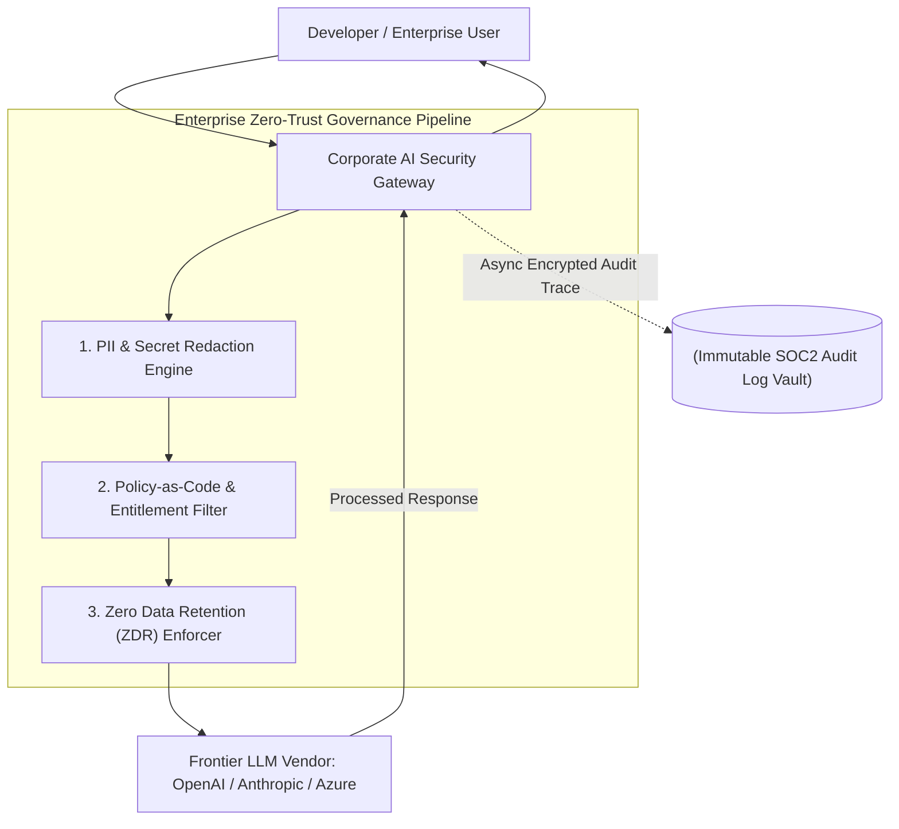

> **Key Takeaway**: Enterprise Boards of Directors (BoD) prioritize three critical AI risk categories: proprietary IP leakage, regulatory non-compliance (EU AI Act / SOC2 / HIPAA), and copyright liability. Establishing a Zero Data Retention (ZDR) gateway paired with automated PII masking ensures AI adoption proceeds safely without exposing corporate IP or customer data.

While engineering teams focus on model benchmarks and developer velocity, the Board of Directors (BoD) and C-suite executives view AI adoption through the lens of **Enterprise Risk Management (ERM)**.

A single security failure—such as an engineer pasting unreleased source code or confidential financial metrics into a public LLM web interface—can cause catastrophic brand damage, legal liability, and regulatory penalties.

---

## Enterprise AI Governance & Security Topology

Boardroom AI governance establishes policy-as-code guardrails, data privacy filters, and IP protection scanners to mitigate corporate AI risks. In 2026, enterprise gateways wrap Model Context Protocol (MCP) servers with mTLS proxy layers, logging OpenTelemetry audit spans to satisfy EU AI Act compliance mandates.

**Enterprise AI Security Gateway Architecture:** This topology diagram illustrates the zero-trust governance pipeline, demonstrating how incoming user prompts pass through PII redaction engines, policy filters, and ZDR headers before reaching vendor LLM APIs.



### Core Boardroom Concerns & Countermeasures
1. **Intellectual Property (IP) & Code Leakage**: Employees uploading trade secrets to public model endpoints. *Countermeasure*: Deploy enterprise AI gateways enforcing Zero Data Retention (ZDR) and blocking non-sanctioned SaaS endpoints.
2. **Regulatory Non-Compliance**: Violation of GDPR, HIPAA, or the EU AI Act due to unmonitored PII processing. *Countermeasure*: Automated regex and NER (Named Entity Recognition) presidio filters redacting sensitive fields prior to egress.
3. **Model Copyright & License Poisoning**: AI assistants generating code copied from GPL-licensed repositories without attribution. *Countermeasure*: IDE-level AST license scanners blocking permissive/copyleft code duplication.

---

## Production Python Compliance & Privacy Audit Scanner

Production audit scanners parse code repos for PII leakage, proprietary data ingestion, and non-compliant third-party AI library licenses.

**Python PII Redaction & ZDR Enforcement Middleware:** The `EnterprisePrivacyScanner` class intercepts prompt payloads using regex patterns and SHA-256 hashing, sanitizing sensitive PII fields and injecting mandatory ZDR compliance headers.

```python
import re
import hashlib
import time
from typing import Dict, Any, List, Tuple
from pydantic import BaseModel, Field

class RedactionResult(BaseModel):
    is_safe: bool
    sanitized_prompt: str
    redacted_entities_count: int
    data_hash: str
    timestamp: float = Field(default_factory=time.time)

class EnterprisePrivacyScanner:
    def __init__(self):
        # High-risk sensitive entity patterns
        self.patterns: List[Tuple[str, re.Pattern]] = [
            ("EMAIL", re.compile(r"[a-zA-Z0-9_.+-]+@[a-zA-Z0-9-]+\.[a-zA-Z0-9-.]+", re.IGNORECASE)),
            ("CREDIT_CARD", re.compile(r"\b(?:\d[ -]*?){13,16}\b")),
            ("API_KEY", re.compile(r"(?:api[_-]?key|secret|token)\s*[:=]\s*['\"]?([a-zA-Z0-9_\-]{20,})['\"]?", re.IGNORECASE)),
            ("SSN", re.compile(r"\b\d{3}-\d{2}-\d{4}\b")),
            ("IP_ADDRESS", re.compile(r"\b(?:[0-9]{1,3}\.){3}[0-9]{1,3}\b"))
        ]

    def redact_sensitive_data(self, raw_prompt: str) -> RedactionResult:
        sanitized = raw_prompt
        redaction_count = 0

        for label, pattern in self.patterns:
            matches = pattern.findall(sanitized)
            if matches:
                redaction_count += len(matches)
                sanitized = pattern.sub(f"[REDACTED_{label}]", sanitized)

        # Compute SHA-256 cryptographic hash of original prompt for audit lineage
        prompt_hash = hashlib.sha256(raw_prompt.encode("utf-8")).hexdigest()

        return RedactionResult(
            is_safe=True,
            sanitized_prompt=sanitized,
            redacted_entities_count=redaction_count,
            data_hash=prompt_hash
        )

    def enforce_zdr_headers(self, headers: Dict[str, str]) -> Dict[str, str]:
        """Enforces mandatory Zero Data Retention headers for vendor APIs."""
        enforced_headers = headers.copy()
        enforced_headers["X-Enterprise-Zero-Data-Retention"] = "true"
        enforced_headers["X-Audit-Compliance-Tier"] = "SOC2-Type-II"
        return enforced_headers

if __name__ == "__main__":
    scanner = EnterprisePrivacyScanner()

    untrusted_prompt = (
        "Please analyze our Q3 performance for client john.doe@acme.corp. "
        "Use secret api_key = 'sk_live_9988221100abcdeff1122' to fetch data from 192.168.1.50."
    )

    result = scanner.redact_sensitive_data(untrusted_prompt)
    headers = scanner.enforce_zdr_headers({"Authorization": "Bearer sk-ent-12345"})

    print("=== Enterprise Privacy & Compliance Audit Result ===")
    print(f"Original Prompt Hash: {result.data_hash}")
    print(f"Redacted Entities: {result.redacted_entities_count}")
    print(f"Sanitized Prompt:\n{result.sanitized_prompt}")
    print(f"Enforced ZDR Headers: {headers['X-Enterprise-Zero-Data-Retention']}")
```

---

## Comparative Matrix: Unregulated vs. Enterprise AI Governance

Unregulated corporate AI usage risks IP contamination and regulatory fines, while enterprise governance ensures SOC2 and GDPR compliance.

**Unregulated vs. Governed AI Matrix:** This comparative table contrasts unregulated corporate AI risks against the enterprise governance framework across privacy policies, PII handling, audit logging, and regulatory compliance.

| Governance Aspect | Unregulated AI Usage | Enterprise AI Governance Framework |
| :--- | :--- | :--- |
| **Data Privacy Policy** | Public web endpoints (Data retained) | Enterprise ZDR Gateway (Zero Retention) |
| **PII Handling** | Raw PII sent in plain text | Pre-flight regex & presidio redaction |
| **Audit Logging** | None | Cryptographic SHA-256 SOC2 trace vault |
| **IP Protection** | Unprotected prompt payloads | Strict DLP (Data Loss Prevention) rules |
| **Regulatory Compliance** | Non-compliant (GDPR/HIPAA Risk) | Fully compliant with EU AI Act & SOC2 |

---

## Frequently Asked Questions

### What Zero Data Retention (ZDR) SLA requirements must enterprise teams enforce with frontier LLM API providers?
Enterprise ZDR contracts strictly prohibit API vendors from persisting prompt or response payloads to disk or utilizing customer data for model retraining. Gateways enforce this policy by injecting mandatory HTTP headers (`X-Enterprise-Zero-Data-Retention: true`) and auditing vendor SOC2 Type II compliance attestations annually.

### How do automated PII masking engines redact sensitive customer data before prompt transmittal?
Automated PII engines combine regex pattern matching with Named Entity Recognition (NER) models to intercept raw prompt streams pre-flight. The engine replaces sensitive entities (such as SSNs, credit card numbers, secret API keys, and email addresses) with safe synthetic tokens like `[REDACTED_EMAIL]`, ensuring zero plain-text customer data leaves the corporate perimeter.

### How do cryptographic SHA-256 audit trails satisfy SOC2 Type II compliance standards for AI interactions?
Cryptographic audit trails compute immutable SHA-256 hashes of all input prompts, sanitized payloads, and AI model outputs, storing the metadata in append-only audit vaults. This cryptographic lineage proves to external SOC2 auditors that every model interaction was properly sanitized, policy-checked, and executed under zero-retention rules without exposing sensitive payload content.

---

## Internal Series Navigation

Advance to Part 6 to learn how to transition from individual coding to multi-agent swarm orchestration.

- [Part 2 — Man vs. Machine Boundaries in Engineering](/series/ai-driven-engineer/part-2-man-vs-machine-boundaries/)
- [Part 4 — Blurring SDLC Lines & QC Revolution](/series/ai-driven-engineer/part-4-blurring-sdlc-lines-and-qc-revolution/)
- [Part 7 — System Design Survival: Architectural Shield](/series/ai-driven-engineer/part-7-system-design-survival/)
- [Part 5 — Enterprise Security, RBAC & Data Poisoning Defense](/series/ai-data-engineering-pipeline/part-5-enterprise-security-data-poisoning/)
- [Part 7 — AI Security Engineering](/series/ai-driven-playbook/part-7-ai-security-engineering/)
