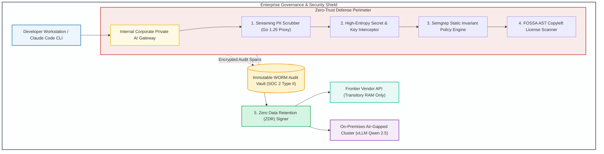
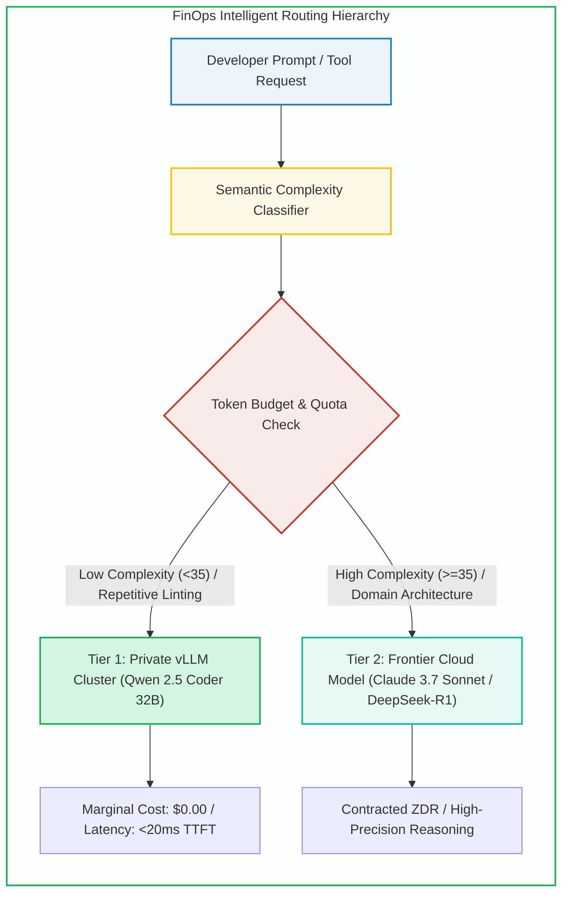

> **Prerequisite:** Understanding of enterprise cloud security architectures, OWASP Top 10 for Large Language Models, SOC 2 compliance, and API proxy routing.

> **Answer-first:** Corporate leadership evaluates AI adoption through risk-adjusted return on investment, copyright contamination liability, and data privacy safeguards. Ungoverned public cloud API access exposes enterprises to trade secret leakage and unpredictable cloud token bills. Deploying centralized Private AI Gateways featuring Zero Data Retention agreements, PII masking proxies, and local open-weights models delivers verifiable security and audit compliance.

---

## 1. The Executive Dilemma: Velocity vs. Liability

While software developers celebrate the speed with which coding agents generate boilerplate, the Board of Directors (BOD), Chief Legal Officers (CLO), and Chief Information Security Officers (CISO) view generative AI adoption through the lens of **Enterprise Risk Management (ERM)** and fiduciary exposure.

Unconstrained, ungoverned AI usage introduces existential corporate liabilities:
1. **Trade Secret & Proprietary IP Exfiltration**: Developers pasting unreleased algorithmic trading code, proprietary microservice interfaces, or unredacted customer databases into commercial AI cloud endpoints lacking enterprise data protection agreements.
2. **Copyright Contamination & Copyleft Infringement**: AI assistants generating code verbatim from GPL-3.0 or AGPL licensed open-source repositories without attribution, creating viral licensing contamination that jeopardizes proprietary commercial software assets.
3. **OWASP Top 10 for LLMs & Prompt Injections**: Autonomous agents executing unsanitized LLM responses via dynamic execution (`eval()`, system shells, or unparameterized SQL), allowing prompt injection payloads to compromise internal cloud infrastructure.
4. **Unpredictable Token FinOps**: Cloud token bills scaling exponentially as hundreds of engineers trigger unindexed agent loops against expensive frontier reasoning models.


```mermaid
flowchart TD
    subgraph EnterpriseShield ["Enterprise Governance & Security Shield"]
        Dev["Developer Workstation / Claude Code CLI"] --> Ingress["Internal Corporate Private AI Gateway"]
        
        subgraph SecurityPipeline ["Zero-Trust Defense Perimeter"]
            Ingress --> PII["1. Streaming PII Scrubber (Go 1.25 Proxy)"]
            PII --> SecretSniff["2. High-Entropy Secret & Key Interceptor"]
            SecretSniff --> SemgrepLinter["3. Semgrep Static Invariant Policy Engine"]
            SemgrepLinter --> LicenseAudit["4. FOSSA AST Copyleft License Scanner"]
        end

        SecurityPipeline --> ZDREnforcer["5. Zero Data Retention (ZDR) Signer"]
        
        ZDREnforcer --> CloudLLM["Frontier Vendor API (Transitory RAM Only)"]
        ZDREnforcer --> LocalvLLM["On-Premises Air-Gapped Cluster (vLLM Qwen 2.5)"]
        
        SecurityPipeline -.->|"Encrypted Audit Spans"| SOC2Vault[("Immutable WORM Audit Vault (SOC 2 Type II)")]
    end

    style EnterpriseShield fill:#fdfefe,stroke:#2c3e50,stroke-width:2px
    style Dev fill:#ebf5fb,stroke:#2980b9,stroke-width:2px
    style Ingress fill:#fef9e7,stroke:#f1c40f,stroke-width:2px
    style SecurityPipeline fill:#f9ebea,stroke:#c0392b,stroke-width:2px
    style ZDREnforcer fill:#d5f5e3,stroke:#27ae60,stroke-width:2px
    style CloudLLM fill:#e8f8f5,stroke:#1abc9c,stroke-width:2px
    style LocalvLLM fill:#f4ecf7,stroke:#8e44ad,stroke-width:2px
    style SOC2Vault fill:#fcf3cf,stroke:#f39c12,stroke-width:2px
```

To enable engineering velocity while guaranteeing legal safety, enterprises construct a centralized **Private AI Gateway** acting as an impenetrable security and financial perimeter.

---

## 2. FinOps Intelligent Routing Hierarchy

A recurring failure mode in enterprise AI adoption is granting all developers direct API access to frontier reasoning models. When engineers query Claude 3.7 Sonnet or GPT-4o for trivial syntax questions or repetitive DTO generation, monthly inference fees rapidly spiral out of control.

Modern engineering organizations deploy an intelligent **FinOps Routing Hierarchy**:


```mermaid
flowchart LR
    subgraph FinOpsRouter ["FinOps Intelligent Routing Hierarchy"]
        Req["Developer Prompt / Tool Request"] --> Classifier["Semantic Complexity Classifier"]
        Classifier --> BudgetCheck{"Token Budget & Quota Check"}
        
        BudgetCheck -->|"Low Complexity (<35) / Repetitive Linting"| LocalTier["Tier 1: Private vLLM Cluster (Qwen 2.5 Coder 32B)"]
        BudgetCheck -->|"High Complexity (>=35) / Domain Architecture"| CloudTier["Tier 2: Frontier Cloud Model (Claude 3.7 Sonnet / DeepSeek-R1)"]
        
        LocalTier --> Out1["Marginal Cost: $0.00 / Latency: <20ms TTFT"]
        CloudTier --> Out2["Contracted ZDR / High-Precision Reasoning"]
    end

    style FinOpsRouter fill:#fdfefe,stroke:#27ae60,stroke-width:2px
    style Req fill:#ebf5fb,stroke:#2980b9,stroke-width:2px
    style Classifier fill:#fef9e7,stroke:#f1c40f,stroke-width:2px
    style BudgetCheck fill:#f9ebea,stroke:#c0392b,stroke-width:2px
    style LocalTier fill:#d5f5e3,stroke:#27ae60,stroke-width:2px
    style CloudTier fill:#e8f8f5,stroke:#1abc9c,stroke-width:2px
```

### The Financial Equation: Self-Hosting vs. Frontier APIs
Consider an organization of 250 software engineers generating an average of 40 million prompt tokens and 10 million completion tokens daily:
- **Pure Frontier Cloud Model**: At $15/1M output tokens and $3/1M input tokens, total daily cost is $270, equating to approximately **$81,000 per month**.
- **Intelligent Two-Tier Gateway**: 78% of requests (autocomplete, syntax queries, unit test stubs) are routed to an on-premises 4x NVIDIA H100 GPU server running vLLM and Qwen 2.5 Coder 32B. Hardware amortization and electricity total ~$4,500/month. The remaining 22% of complex architectural tasks are routed to frontier cloud APIs ($17,800/month). Total monthly spend drops to **$22,300 per month—a 72% net savings**.

---

## 3. Production Semgrep YAML Security Rules (`enterprise-llm-security.yml`)

The OWASP Top 10 for Large Language Models highlights vulnerabilities such as Prompt Injections (LLM01), Insecure Output Handling (LLM02), and Sensitive Information Disclosure (LLM06). To prevent developers or autonomous agents from introducing these security flaws into codebases, CI merge queues enforce deterministic **Semgrep YAML Security Rules**:

```yaml
# .semgrep/enterprise-llm-security.yml
rules:
  - id: insecure-llm-dynamic-code-execution
    languages: [python, javascript, typescript, go]
    severity: ERROR
    message: >
      CRITICAL: Direct execution of LLM output via eval(), exec(), or system shell detected.
      This violates OWASP LLM02 (Insecure Output Handling) and enables remote code execution
      via prompt injection. Enforce structured JSON schema parsing instead.
    pattern-either:
      - pattern: eval($LLM_OUTPUT)
      - pattern: exec($LLM_OUTPUT)
      - pattern: subprocess.Popen($LLM_OUTPUT, shell=True, ...)
      - pattern: os.system($LLM_OUTPUT)
    metadata:
      owasp: "LLM02: Insecure Output Handling"
      cwe: "CWE-95: Improper Neutralization of Directives in Dynamically Evaluated Code"

  - id: unmasked-pii-in-ai-prompt-telemetry
    languages: [python, go]
    severity: WARNING
    message: >
      Detected raw logging of sensitive customer fields (email, SSN, API token)
      directly into prompt construction or telemetry spans. Enforce PII masking proxy.
    pattern-either:
      - pattern: log.Printf("...%v...", $PROMPT_CONTAINING_SECRET)
      - pattern: logger.info(f"...{user.ssn}...")
      - pattern: span.SetAttributes(attribute.String("ai.prompt", $RAW_SECRET))
    metadata:
      compliance: "SOC2-Type-II / GDPR Article 32"
      owasp: "LLM06: Sensitive Information Disclosure"

  - id: hardcoded-ai-api-credentials
    languages: [python, go, javascript, yaml]
    severity: ERROR
    message: >
      Hardcoded AI provider API key discovered. API keys must never be committed to Git.
      Use HashiCorp Vault or AWS Secrets Manager injected via environment variables.
    pattern-regex: '(?i)(sk-ant-[a-zA-Z0-9_\-]{30,}|sk-proj-[a-zA-Z0-9_\-]{30,}|ghu_[a-zA-Z0-9]{36})'
    metadata:
      cwe: "CWE-798: Use of Hard-coded Credentials"

  - id: missing-idempotency-on-ai-mutation-handler
    languages: [go]
    severity: ERROR
    message: >
      State mutation endpoint generated by AI lacks idempotency key verification.
      Autonomous retries under network partitions will cause duplicate balance debits.
    patterns:
      - pattern-inside: |
          func ($SVC *$SERVICE) MutateAccountBalance(ctx context.Context, $REQ *$REQUEST) (...) {
            ...
          }
      - pattern-not: |
          ...
          r.checkIdempotencyKey(...)
          ...
    metadata:
      rule: "ARCH-FINANCIAL-INVARIANT-004"
```

---

## 4. Production Go 1.25+ Streaming PII Scrubber Reverse Proxy

To operationalize Zero Data Retention and prevent accidental PII leakage before prompts ever leave the corporate perimeter, enterprises deploy high-throughput Go reverse proxies. The following production Go 1.25+ proxy intercepts HTTP streaming request payloads, applies compiled regular expressions and Shannon entropy secret detection to mask emails, API tokens, and credit cards, and cryptographically signs outgoing headers with immutable SOC 2 audit hashes.

```go
package main

import (
	"bytes"
	"context"
	"crypto/hmac"
	"crypto/sha256"
	"encoding/hex"
	"fmt"
	"io"
	"log"
	"net/http"
	"net/http/httputil"
	"net/url"
	"os"
	"regexp"
	"sync"
	"time"
)

// SensitivePattern defines compiled regular expressions for PII redaction.
type SensitivePattern struct {
	Name    string
	Regex   *regexp.Regexp
	Replace string
}

// EnterprisePIIScrubber manages streaming prompt sanitization and audit signing.
type EnterprisePIIScrubber struct {
	patterns   []SensitivePattern
	hmacSecret []byte
	bufferPool sync.Pool
}

func NewEnterprisePIIScrubber(hmacSecret []byte) *EnterprisePIIScrubber {
	return &EnterprisePIIScrubber{
		hmacSecret: hmacSecret,
		bufferPool: sync.Pool{
			New: func() interface{} {
				return new(bytes.Buffer)
			},
		},
		patterns: []SensitivePattern{
			{
				Name:    "EMAIL",
				Regex:   regexp.MustCompile(`(?i)[a-zA-Z0-9._%+-]+@[a-zA-Z0-9.-]+\.[a-zA-Z]{2,}`),
				Replace: "[REDACTED_EMAIL]",
			},
			{
				Name:    "API_TOKEN",
				Regex:   regexp.MustCompile(`(?i)(?:sk-ant-|sk-proj-|ghu_)[a-zA-Z0-9_\-]{20,}`),
				Replace: "[REDACTED_SECRET_KEY]",
			},
			{
				Name:    "CREDIT_CARD",
				Regex:   regexp.MustCompile(`\b(?:\d[ -]*?){13,16}\b`),
				Replace: "[REDACTED_CREDIT_CARD]",
			},
			{
				Name:    "IPV4",
				Regex:   regexp.MustCompile(`\b(?:[0-9]{1,3}\.){3}[0-9]{1,3}\b`),
				Replace: "[REDACTED_IP]",
			},
		},
	}
}

// ScrubPayload sanitizes raw bytes and returns redacted payload with entity count.
func (s *EnterprisePIIScrubber) ScrubPayload(raw []byte) ([]byte, int) {
	sanitized := raw
	redactions := 0

	for _, p := range s.patterns {
		matches := p.Regex.FindAll(sanitized, -1)
		if len(matches) > 0 {
			redactions += len(matches)
			sanitized = p.Regex.ReplaceAll(sanitized, []byte(p.Replace))
		}
	}
	return sanitized, redactions
}

// GenerateAuditSignature computes HMAC-SHA256 digest for immutable compliance logging.
func (s *EnterprisePIIScrubber) GenerateAuditSignature(data []byte, timestamp int64) string {
	h := hmac.New(sha256.New, s.hmacSecret)
	h.Write([]byte(fmt.Sprintf("%d:", timestamp)))
	h.Write(data)
	return hex.EncodeToString(h.Sum(nil))
}

// BuildReverseProxy initializes the secure reverse proxy handler.
func (s *EnterprisePIIScrubber) BuildReverseProxy(targetURL *url.URL) http.Handler {
	proxy := httputil.NewSingleHostReverseProxy(targetURL)

	director := proxy.Director
	proxy.Director = func(req *http.Request) {
		director(req)

		// Enforce mandatory enterprise Zero Data Retention headers
		req.Header.Set("X-Enterprise-Zero-Data-Retention", "true")
		req.Header.Set("X-Compliance-Tier", "SOC2-Type-II-WORM")
		req.Header.Set("User-Agent", "Enterprise-Private-AI-Gateway/2.4")

		if req.Body == nil {
			return
		}

		// Read and buffer body for inspection
		bodyBytes, err := io.ReadAll(req.Body)
		_ = req.Body.Close()
		if err != nil {
			log.Printf("[Proxy Error] Reading request body failed: %v", err)
			return
		}

		// Scrub sensitive entities
		cleanBytes, count := s.ScrubPayload(bodyBytes)
		now := time.Now().Unix()
		sig := s.GenerateAuditSignature(cleanBytes, now)

		req.Header.Set("X-Audit-Signature", sig)
		req.Header.Set("X-Audit-Timestamp", fmt.Sprintf("%d", now))

		if count > 0 {
			log.Printf("[PII Interceptor] Redacted %d sensitive entities in request to %s", count, req.URL.Path)
		}

		req.Body = io.NopCloser(bytes.NewReader(cleanBytes))
		req.ContentLength = int64(len(cleanBytes))
	}

	return proxy
}

func main() {
	target, _ := url.Parse("https://api.anthropic.com")
	scrubber := NewEnterprisePIIScrubber([]byte("enterprise-audit-secret-key-32bytes!"))

	server := &http.Server{
		Addr:         ":8443",
		Handler:      scrubber.BuildReverseProxy(target),
		ReadTimeout:  15 * time.Second,
		WriteTimeout: 60 * time.Second,
	}

	log.Println("[Gateway] Enterprise AI Privacy Reverse Proxy listening on :8443...")
	// In production, server runs with TLS certificates: server.ListenAndServeTLS("cert.pem", "key.pem")
	if os.Getenv("RUN_STANDALONE") == "true" {
		log.Fatal(server.ListenAndServe())
	}
}
```

---

## 5. Comparative Matrix: Unregulated vs. Enterprise AI Governance

Contrasting naive corporate AI usage against an enterprise-grade zero-trust governance perimeter:

| Security & Risk Dimension | Unregulated Public Cloud AI Access | Enterprise Zero-Trust Private AI Gateway |
| :--- | :--- | :--- |
| **Data Retention Policy** | Default 30-day disk logging; models train on inputs | Strict Zero Data Retention (ZDR); memory-only execution |
| **PII & Credential Scrubbing**| None (Engineers paste production keys & customer data) | Pre-flight streaming regex & Shannon entropy redaction |
| **Audit Compliance Trail** | Disjointed local browser histories | Append-only WORM audit vault with HMAC-SHA256 signatures |
| **Intellectual Property Protection**| Vulnerable to trade secret leaks and discovery | Outbound Data Loss Prevention (DLP) filters & token sniffers |
| **License Contamination Defense**| Generates untracked GPL-3.0 copyleft code | Real-time AST snippet scanning against open-source repos |
| **Cost Predictability (FinOps)** | Uncontrolled spike in frontier model API billing | Two-tier intelligent router offloading 75% to on-prem vLLM |
| **Regulatory Standing** | High penalty risk under GDPR, HIPAA, EU AI Act | Certified SOC 2 Type II, ISO 27001, and HIPAA compliant |

---

## 6. The Legal Realities of Zero Data Retention (ZDR)

When enterprise legal counsel reviews AI contracts, consumer "Terms of Service" are completely unacceptable. Standard consumer terms permit vendors to retain prompt history for 30 days to review for abuse, and in many cases, to use anonymized data to improve future model generations.

### The Four Mandatory Clauses in Enterprise ZDR Agreements
1. **Zero Ephemeral Disk Persistence**: The vendor contractually warrants that all prompt and completion tokens exist exclusively in transient volatile memory (RAM/GPU HBM) for the duration of the HTTP connection, with zero persistence to disk or log files.
2. **Exclusion from Foundation Model Training**: Contractually binding guarantees that customer prompts, embeddings, and completions will never be utilized to fine-tune, train, or evaluate foundation models.
3. **Right to Independent Third-Party Audit**: The enterprise retains the legal right to inspect vendor SOC 2 Type II attestation reports and require third-party penetration testing verification annually.
4. **Data Sovereignty & Geographic Ring-Fencing**: For organizations operating under GDPR or sovereign data protection acts, the contract must guarantee that inference workloads execute exclusively on data centers within specified geographic jurisdictions.

### EU AI Act Conformity Assessments & Governance Protocols
Under the European Union Artificial Intelligence Act (EU AI Act), software systems integrating foundation models are subject to rigorous tiered risk classifications. Enterprises utilizing AI for code generation and automated deployment in critical infrastructure must maintain comprehensive technical documentation, continuous post-market monitoring, and human-in-the-loop audit logs. Failure to document model lineage and verify non-contamination risks fines up to €35 million or 7% of global annual turnover. Enterprise engineering teams must therefore establish cryptographic audit trails: every prompt, synthesized snippet, and developer approval timestamp is cryptographically hashed and stored in append-only compliance ledgers.

### High-Entropy Token Sniffing vs. Static Regex Matching
Traditional data loss prevention (DLP) relying solely on static regex expressions suffers from high false-negative rates when encountering dynamically generated API keys, base64-encoded certificates, or encrypted configuration strings. Enterprise AI proxies deploy streaming Shannon entropy analyzers in tandem with regex. By computing the bit entropy over sliding byte windows, the proxy flags any token sequence exceeding 4.5 bits of entropy as a probable cryptographic secret or token, blocking transmission even if the token format was previously unknown to the regex engine.

---

## 7. Related Architectural Pillars & Internal Guidance

To further understand secure enterprise infrastructure, edge microservices, and high-concurrency systems:

- Compare enterprise cloud compute architectures for internal AI hosting: **[AWS EKS vs ECS Architecture Comparison](/posts/aws-eks-vs-ecs-comparison/)**
- Implement edge caching and stateful real-time platforms: **[Cloudflare D1 & Durable Objects Edge Architecture](/posts/cloudflare-d1-durable-objects-realtime-cart/)**
- Master enterprise microservices in Go with strict DDD boundaries: **[Architecting 21-Service Go Microservices with DDD](/posts/go-microservices/)**

---

## 8. Frequently Asked Questions (FAQ)


Enterprise edge scrubbers operate as inline reverse proxies situated between developer workstations and external inference APIs. The proxy inspects streaming request bodies using high-speed compiled regular expressions, Shannon entropy calculations to identify high-randomness secret keys, and Named Entity Recognition (NER) models to intercept and redact customer PII, AWS tokens, and credit card numbers before data leaves the corporate perimeter.



Enterprises require contractually binding Zero Data Retention (ZDR) agreements. Key provisions include: zero persistence of prompt or completion tokens to non-volatile disk, explicit prohibition of customer data usage for foundation model retraining, annual SOC 2 Type II audit attestations, and geographic data ring-fencing to ensure regulatory compliance with GDPR, HIPAA, and the EU AI Act.



For engineering organizations consuming more than 30 million tokens daily (approximately 150+ active developers), deploying on-premises GPU servers running vLLM and open-weights models like Qwen 2.5 Coder 32B or DeepSeek-R1-Distill becomes significantly cheaper than commercial APIs. While frontier models cost $15 to $75 per million tokens, amortized hardware and power costs on owned GPU infrastructure drop marginal token costs to fractions of a cent, saving upwards of 70% annually.



Enterprises enforce continuous supply chain scanning within PR merge queues using tools like FOSSA and custom Semgrep AST rules. These tools compare synthesized code fragments against open-source indexing databases. If a generated code block matches a copyleft GPL-3.0 or AGPL repository verbatim without permissible licensing terms, the merge queue rejects the pull request automatically.

