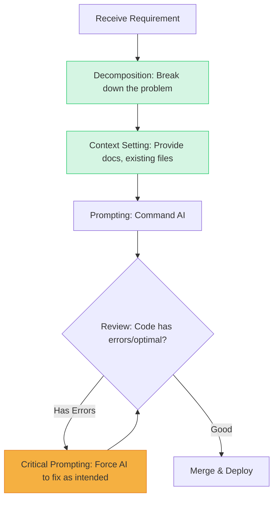

In Part 5, we saw the Board of Directors (BOD) frantically equipping internal AI systems to push productivity KPIs. At this point, if you stubbornly sit and type every line of code from start to finish, you will be left behind. To survive, programmers must shed the "Coder" jacket and put on the **"AI Orchestrator"** mantle.

## What is an AI Orchestrator?

Imagine you've just been promoted to Tech Lead, and under your command is a swarm of extremely agile but... brainless (lacking contextual thinking) AI "interns".

Your job is no longer grabbing the keyboard to code yourself. Your job is: **Decomposition, Context Setting, Prompting, and Reviewing.**

An excellent Orchestrator is someone who knows how to make machines work at full capacity to serve their architectural intent.

### Diagram: Orchestration Loop (OODA Loop for Developers)

## The Art of Context Engineering

The biggest mistake new AI users (like ChatGPT or Cursor) make is issuing "generic" commands.
For example: *"Write a Login page using React for me"*.
Result: AI generates a beautiful login page, but uses a Form library your company doesn't use, invents a weird CSS class, and calls APIs using REST when your company uses GraphQL.

**"Context is King".** An Orchestrator knows how to inject context so AI generates code that fits 100% into the current system.

In modern IDEs (like Cursor, Windsurf), an Orchestrator will operate as follows:
1. **@Files / @Folders:** Explicitly point the AI to related files. *"Read `UserSchema.prisma` and `AuthContext.tsx` to get context."*
2. **@Docs:** Force AI to read the latest library documentation so it avoids old syntax.
3. **Provide Constraints:** *"Write the login function. REQUIREMENT: Use Zustand for state instead of Redux. Only use Tailwind classes defined in `tailwind.config.js`. You must catch HTTP 401 errors and call `showToastError`."*

With a prompt like the one above, the generated code can be merged straight into production without changing a single word.

### [Bonus] Prompt Library: Real-World Context Templates

To save time, here are 3 standard Context Templates you can copy and use immediately in Cursor/Windsurf:

**1. Bulletproof Code Refactoring Prompt:**
> "Your role is a Senior [Language] Developer. Carefully read the file `@legacy_file.js`. Refactor the `[Function_Name]` function according to Clean Code and SOLID principles. 
> REQUIREMENTS:
> 1. Do not change the original Input and Output of the function (Backward compatibility).
> 2. Convert nested loops to O(N) if possible.
> 3. Add try/catch and log errors to a file following the company's `@logger.js` standard.
> 4. Only return the changed code, no lengthy explanations."

**2. Rapid TDD (Test-Driven Development) Prompt:**
> "Read the file containing calculation logic `@calculator.ts`. Generate a full suite of Unit Tests using the `[Jest/Vitest]` library. 
> REQUIREMENTS:
> 1. 100% coverage for all if/else branches.
> 2. Must include at least 3 Edge Cases (Empty data, null data, negative numbers).
> 3. Automatically mock external API calls."

**3. Secure CI/CD Script Prompt:**
> "Write a Github Actions workflow file to deploy this React app to AWS S3. 
> REQUIREMENTS: 
> 1. Must include steps to run `npm run lint` and `npm run test` before building.
> 2. DO NOT hardcode AWS Credentials. Retrieve them from `secrets.AWS_ACCESS_KEY_ID`.
> 3. Configure automatic CloudFront invalidation after upload is complete."

## Critical Prompting Skills

Never treat AI as a "Master". Treat it as a "Subordinate". An Orchestrator doesn't blindly click `Accept`. They continuously interrogate the AI to reach the optimal solution.

*   *AI proposes a Nested Loop.*
*   **Orchestrator:** *"This algorithm has O(N^2) complexity. If this array has 100,000 users, the server will bottleneck. Rewrite it using a Hash Map (O(1))."*
*   *AI corrects it using a Hash Map.*
*   **Orchestrator:** *"Good. Now generate 5 unit tests for these cases: Empty array, array with duplicate user IDs, and array full of nulls."*

This is the Test-Driven Development (TDD) process fast-forwarded. You use your brain to design test cases, AI uses its "muscle" to type the test code.

## Case Study: Decomposition Mindset

Suppose you need to build a feature: **"Export periodic Revenue Reports via Email"**.

| The Coder | The Orchestrator |
| :--- | :--- |
| Finds an email library. Writes logic to sum revenue. Builds HTML UI for email. Sets up Cronjob. Crams everything into one `report.js` file. Overloaded and tightly coupled code. | **Step 1:** Tells AI: *"Design the DB schema for the Reports table"*. Reviews & Approves. **Step 2:** Tells AI: *"Based on the approved schema, write the total revenue query function"*. Reviews. **Step 3:** Tells AI: *"Read the company's sample HTML template file, inject the revenue variables"*. Reviews. **Step 4:** Tells AI: *"Write a Cronjob script to run the above function at 8 AM every Monday"*. |

The Orchestrator doesn't juggle everything. They break a massive problem into 4 small steps (Decomposition), and use AI to "knock down" each step one by one.

## The Orchestrator's Ultimate Weapon

No matter how well you inject context, or how well you decompose the problem, there will be a time when AI presents 2 different architectural options and asks you: *"Boss, which way do you want to choose?"*.

At this point, prompt engineering becomes useless. The only thing that helps you make the right decision so the system doesn't crash is your foundation in **System Design**.

Is System Design truly the only "life preserver" keeping Programmers from being eliminated in the next 10 years? We will find the answer in **[Part 7: System Design: The Priceless Survival Territory for Developers](/series/ai-driven-engineer/part-7-system-design-survival/)**.

---
### 🛠 Practical Exercise: Practice being an Orchestrator
1. **Challenge:** Apply the Decomposition mindset to a task you are working on.
2. **Action:** Instead of writing one massive 50-line prompt cramming all requirements, write 4 concise prompts, each solving exactly 1 step (Schema -> Query -> Logic -> UI).
3. **Analysis:** You will notice the generated code has far fewer errors and you can control every step the AI takes.

### 📚 External Resources & Related Links
- **Thinking Framework:** Read more about the concept of [Chain-of-Thought Prompting](https://www.promptingguide.ai/techniques/cot).
- **Related in series:** The danger of not carefully reading AI-generated code (skipping the Review phase in Orchestration) is analyzed in [Part 3: AI Review Fatigue](/series/ai-driven-engineer/part-3-the-10x-productivity-reality/).

---
💬 **Discussion Corner:** Confess, have you ever written a generic prompt (like "fix this bug for me") and received a pile of garbage code? What was your most expensive lesson when setting "constraints" for AI?

  
<a href="/series/ai-driven-engineer/part-5-the-bod-perspective-risk-and-privacy/">← Previous: Part 5</a>

  
<a href="/series/ai-driven-engineer/part-7-system-design-survival/">Next Article: Part 7 →</a>

