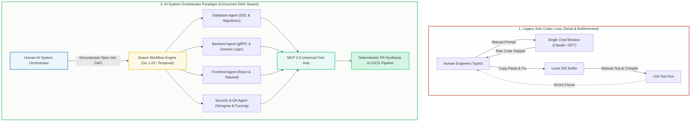
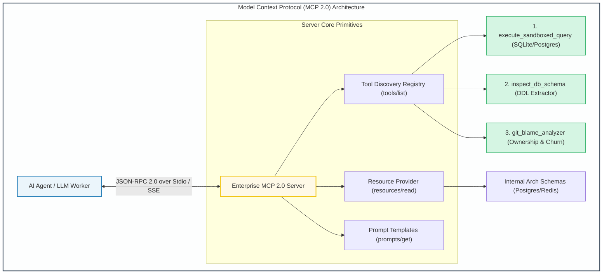

> **Prerequisite:** Understanding of distributed event loops, JSON-RPC 2.0 specifications, DAG-based task execution, and Model Context Protocol (MCP) primitives.

> **Answer-first:** The senior engineer role transforms from solo code author into high-leverage AI System Orchestrator directing specialized multi-agent swarms. Orchestrators decompose monolithic epics into isolated tasks, coordinate agents through Model Context Protocol (MCP 2.0) interfaces, and enforce deterministic state machines. Success requires designing robust prompt contracts, managing tool execution budgets, and preventing cascading inter-agent hallucination loops.

---

## 1. The Great Transition: The Solo Coder Bottleneck vs. The AI Orchestrator Paradigm

In early generative AI workflows (2023–2024), developers operated in a linear, single-threaded chat loop: prompt the model, review the response, copy-paste into an IDE, manually test, and prompt again. This workflow fundamentally bottlenecked productivity on human context switching. While individual typing speed increased, overall architectural delivery remained constrained by serial execution.

By 2026, leading software engineering organizations have dismantled this bottleneck. The senior engineer is no longer valued for raw lines of code produced per day, but for their capacity to design, coordinate, and supervise **Multi-Agent Swarms**—autonomous sub-agents executing concurrently across distinct abstraction layers under strict architectural constraints.


```mermaid
flowchart TD
    subgraph SoloParadigm ["1. Legacy Solo Coder Loop (Serial & Bottlenecked)"]
        HumanDev["Human Engineer (Typist)"] -->|Manual Prompt| SingleChat["Single Chat Window (Claude / GPT)"]
        SingleChat -->|Raw Code Snippet| HumanDev
        HumanDev -->|Copy-Paste & Fix| IDE["Local IDE Buffer"]
        IDE -->|Manual Test & Compile| LocalTest["Unit Test Run"]
        LocalTest -.->|Errors Found| HumanDev
    end

    subgraph OrchestratorParadigm ["2. AI System Orchestrator Paradigm (Concurrent DAG Swarm)"]
        Orchestrator["Human AI System Orchestrator"] -->|Decomposes Spec into DAG| SwarmEngine["Swarm Workflow Engine (Go 1.25 / Temporal)"]
        
        SwarmEngine --> AgentDB["Database Agent (DDL & Migrations)"]
        SwarmEngine --> AgentBE["Backend Agent (gRPC & Domain Logic)"]
        SwarmEngine --> AgentFE["Frontend Agent (React & Tailwind)"]
        SwarmEngine --> AgentQA["Security & QA Agent (Semgrep & Fuzzing)"]

        AgentDB --> MCPRouter["MCP 2.0 Universal Tool Hub"]
        AgentBE --> MCPRouter
        AgentFE --> MCPRouter
        AgentQA --> MCPRouter

        MCPRouter --> GitOpsMerge["Deterministic PR Synthesis & CI/CD Pipeline"]
    end

    style SoloParadigm fill:#fdfefe,stroke:#c0392b,stroke-width:2px
    style OrchestratorParadigm fill:#f9fcf9,stroke:#27ae60,stroke-width:2px
    style Orchestrator fill:#ebf5fb,stroke:#2980b9,stroke-width:2px
    style SwarmEngine fill:#fef9e7,stroke:#f1c40f,stroke-width:2px
    style MCPRouter fill:#e8f8f5,stroke:#1abc9c,stroke-width:2px
    style GitOpsMerge fill:#d5f5e3,stroke:#2ecc71,stroke-width:2px
```

### The Core Capabilities of the Systems Orchestrator
To command an autonomous swarm effectively, the orchestrator masters four distinct disciplines:
1. **Algorithmic Task Decomposition**: Breaking complex business requirements into mutually independent, directed acyclic graphs (DAGs) that can be dispatched to specialized agents concurrently without race conditions.
2. **Schema Contract Definition**: Formulating unambiguous, machine-verifiable input/output contracts (via Protobuf, OpenAPI 3.1, or Pydantic schemas) that prevent inter-agent context distortion.
3. **Tool & Protocol Integration**: Exposing enterprise databases, documentation repositories, and git version control to agents via standardized protocols like **Model Context Protocol (MCP 2.0)**.
4. **Deterministic Validation Gates**: Enforcing non-negotiable verification gates (static analysis, mutation testing, compiler diagnostics) before agent proposals are merged into the primary branch.

---

## 2. Multi-Agent Swarm Topologies & Protocol Communication

Autonomous multi-agent systems require rigorous coordination topology to prevent runaway execution costs and circular dependency deadlocks. In production environments, three primary topologies dominate:

1. **Hierarchical Command (Leader-Worker)**: A central orchestrator agent receives the epic, decomposes it into sub-tasks, assigns them to specialized worker agents, and synthesizes the outputs. This topology excels at well-bounded feature epics.
2. **Event-Driven Choreography**: Sub-agents communicate asynchronously over an enterprise message broker (such as NATS JetStream or Kafka). Each agent listens for domain events (e.g., `SchemaMigratedEvent`, `APIStubGeneratedEvent`) and triggers its downstream task. This pattern eliminates point-to-point coupling and prevents cascading latency.
3. **Directed Acyclic Graph (DAG) Execution**: Tasks are modeled as nodes with explicit prerequisite edges. Independent branches execute in parallel worker pools, while dependent nodes wait for artifact emission from upstream parents.


```mermaid
flowchart TD
    subgraph MCPTopology ["Model Context Protocol (MCP 2.0) Architecture"]
        ClientAgent["AI Agent / LLM Worker"] <-->|JSON-RPC 2.0 over Stdio / SSE| MCPServer["Enterprise MCP 2.0 Server"]
        
        subgraph MCPServerInternals ["Server Core Primitives"]
            MCPServer --> ToolRegistry["Tool Discovery Registry (tools/list)"]
            MCPServer --> ResourceRegistry["Resource Provider (resources/read)"]
            MCPServer --> PromptTemplates["Prompt Templates (prompts/get)"]
        end

        ToolRegistry --> SandboxDB["1. execute_sandboxed_query (SQLite/Postgres)"]
        ToolRegistry --> SchemaInspector["2. inspect_db_schema (DDL Extractor)"]
        ToolRegistry --> GitBlame["3. git_blame_analyzer (Ownership & Churn)"]
        
        ResourceRegistry --> ConfigVault["Internal Arch Schemas (Postgres/Redis)"]
    end

    style MCPTopology fill:#fdfefe,stroke:#2c3e50,stroke-width:2px
    style ClientAgent fill:#ebf5fb,stroke:#2980b9,stroke-width:2px
    style MCPServer fill:#fef9e7,stroke:#f1c40f,stroke-width:2px
    style SandboxDB fill:#d5f5e3,stroke:#27ae60,stroke-width:1px
    style SchemaInspector fill:#d5f5e3,stroke:#27ae60,stroke-width:1px
    style GitBlame fill:#d5f5e3,stroke:#27ae60,stroke-width:1px
```

### Mitigating Inter-Agent Failure Modes
When coordinating multi-agent swarms, systems orchestrators must proactively guard against three failure modes:
- **Cascading Hallucinations**: If Agent A invents a non-existent database column and passes it to Agent B, Agent B will construct invalid gRPC handlers, and Agent C will write broken frontend forms. Orchestrators eliminate cascading hallucinations by inserting **Deterministic Validation Filters** between every agent boundary.
- **Recursive Deadlocks**: Two agents waiting on each other's outputs will hang indefinitely while burning token budgets. All agent invocations must enforce strict context deadlines and hop-counter telemetry.
- **Context Window Inflation**: Passing entire repository dumps to every agent degrades reasoning quality. Orchestrators apply **Context Trimming & Vector Retrieval**, supplying only the minimal slice of AST and schema needed for the immediate subtask.

---

## 3. Production Go Multi-Agent Swarm Dispatcher Engine

The following Go 1.25+ implementation demonstrates a high-throughput, concurrent task dispatcher for autonomous sub-agents. It leverages `golang.org/x/sync/errgroup` for parallel worker orchestration, enforces context timeouts, and collects structured handoff artifacts across database, backend, frontend, and security roles.

```go
package main

import (
	"context"
	"crypto/sha256"
	"encoding/json"
	"fmt"
	"log"
	"strings"
	"sync"
	"time"

	"golang.org/x/sync/errgroup"
)

// AgentRole defines specialized functional domains within the swarm.
type AgentRole string

const (
	RoleDatabase AgentRole = "DATABASE_AGENT"
	RoleBackend  AgentRole = "BACKEND_AGENT"
	RoleFrontend AgentRole = "FRONTEND_AGENT"
	RoleSecurity AgentRole = "SECURITY_AGENT"
)

// SwarmTask encapsulates an atomic unit of work assigned to a sub-agent.
type SwarmTask struct {
	ID        string    `json:"id"`
	Target    AgentRole `json:"target"`
	Payload   string    `json:"payload"`
	Timeout   time.Duration `json:"timeout"`
}

// AgentHandoffArtifact represents the immutable output delivered by a sub-agent.
type AgentHandoffArtifact struct {
	TaskID    string    `json:"task_id"`
	Agent     AgentRole `json:"agent"`
	Result    string    `json:"result"`
	Status    string    `json:"status"`
	Timestamp time.Time `json:"timestamp"`
}

// SwarmOrchestrator manages concurrent sub-agent execution pools and synchronization.
type SwarmOrchestrator struct {
	mu        sync.Mutex
	artifacts []AgentHandoffArtifact
}

func NewSwarmOrchestrator() *SwarmOrchestrator {
	return &SwarmOrchestrator{
		artifacts: make([]AgentHandoffArtifact, 0),
	}
}

// DispatchSwarm executes tasks concurrently with bounded worker contexts.
func (o *SwarmOrchestrator) DispatchSwarm(parentCtx context.Context, tasks []SwarmTask) ([]AgentHandoffArtifact, error) {
	g, ctx := errgroup.WithContext(parentCtx)

	for _, task := range tasks {
		t := task
		g.Go(func() error {
			taskCtx, cancel := context.WithTimeout(ctx, t.Timeout)
			defer cancel()

			artifact, err := o.executeSubAgentTask(taskCtx, t)
			if err != nil {
				return fmt.Errorf("agent %s failed on task %s: %w", t.Target, t.ID, err)
			}

			o.mu.Lock()
			o.artifacts = append(o.artifacts, artifact)
			o.mu.Unlock()
			return nil
		})
	}

	if err := g.Wait(); err != nil {
		return nil, err
	}

	return o.artifacts, nil
}

func (o *SwarmOrchestrator) executeSubAgentTask(ctx context.Context, task SwarmTask) (AgentHandoffArtifact, error) {
	select {
	case <-ctx.Done():
		return AgentHandoffArtifact{}, ctx.Err()
	default:
		var resultPayload string
		switch task.Target {
		case RoleDatabase:
			checksum := sha256.Sum256([]byte(task.Payload))
			resultPayload = fmt.Sprintf(`{"role":"%s","status":"DDL_MIGRATION_READY","schema_hash":"%x","bytes":%d}`,
				task.Target, checksum[:8], len(task.Payload))
		case RoleBackend:
			resultPayload = fmt.Sprintf(`{"role":"%s","status":"GRPC_HANDLERS_COMPILED","methods":["CreateAccount","GetAccountBalance"],"bytes":%d}`,
				task.Target, len(task.Payload))
		case RoleFrontend:
			resultPayload = fmt.Sprintf(`{"role":"%s","status":"REACT_COMPONENTS_BUNDLED","bundle_size":4200,"type_safe":true}`,
				task.Target)
		case RoleSecurity:
			hasAuth := strings.Contains(task.Payload, "JWT") || strings.Contains(task.Payload, "Bearer")
			resultPayload = fmt.Sprintf(`{"role":"%s","status":"SECURITY_AUDIT_PASSED","auth_verified":%t}`,
				task.Target, hasAuth)
		default:
			resultPayload = fmt.Sprintf(`{"role":"%s","status":"EXECUTED","bytes":%d}`, task.Target, len(task.Payload))
		}

		return AgentHandoffArtifact{
			TaskID:    task.ID,
			Agent:     task.Target,
			Result:    resultPayload,
			Status:    "SUCCESS",
			Timestamp: time.Now(),
		}, nil
	}
}

func main() {
	ctx, cancel := context.WithTimeout(context.Background(), 15*time.Second)
	defer cancel()

	orchestrator := NewSwarmOrchestrator()

	tasks := []SwarmTask{
		{ID: "task-01", Target: RoleDatabase, Payload: "CREATE TABLE ledgers (id UUID PRIMARY KEY, balance NUMERIC);", Timeout: 5 * time.Second},
		{ID: "task-02", Target: RoleBackend, Payload: "Implement LedgerService gRPC handlers with ACID transactions", Timeout: 5 * time.Second},
		{ID: "task-03", Target: RoleFrontend, Payload: "Synthesize LedgerDashboard React views with Tailwind CSS", Timeout: 5 * time.Second},
		{ID: "task-04", Target: RoleSecurity, Payload: "Audit gRPC LedgerService for JWT bearer token validation", Timeout: 5 * time.Second},
	}

	artifacts, err := orchestrator.DispatchSwarm(ctx, tasks)
	if err != nil {
		log.Fatalf("Swarm execution failed: %v", err)
	}

	fmt.Printf("=== Swarm Completed Successfully (%d Artifacts) ===\n", len(artifacts))
	for _, art := range artifacts {
		fmt.Printf("[%s] Role: %-15s -> Artifact: %s\n", art.Status, art.Agent, art.Result)
	}
}
```

---

## 4. Production Model Context Protocol (MCP 2.0) Server Implementation

The **Model Context Protocol (MCP 2.0)**, introduced by Anthropic and adopted as the universal open standard across AI engineering in 2026, provides a deterministic protocol for connecting LLMs to external tools, sandboxes, and file resources. 

The following production Python 3.12+ MCP 2.0 Server implements the JSON-RPC 2.0 specification over standard I/O, exposing three high-leverage engineering tools:
1. `inspect_db_schema`: Reads database table structures, extracting columns, types, primary keys, and indices.
2. `execute_sandboxed_query`: Executes read-only SQL queries inside an isolated sandbox with row limits and timeout guarantees.
3. `git_blame_analyzer`: Analyzes git commit history and author ownership on specified code slices.

```python
#!/usr/bin/env python3
"""
Production Model Context Protocol (MCP 2.0) Server.
Implements JSON-RPC 2.0 protocol over standard input/output streams.
Provides schema inspection, sandboxed query execution, and git blame telemetry.
"""

import sys
import json
import sqlite3
import subprocess
from dataclasses import dataclass, asdict
from typing import Any, Dict, List, Optional
from pathlib import Path

# Protocol Constants
JSONRPC_VERSION = "2.0"

@dataclass
class ToolDefinition:
    name: str
    description: str
    inputSchema: Dict[str, Any]

class MCPServer:
    def __init__(self, db_path: str = ":memory:"):
        self.db_path = db_path
        self._init_sample_db()
        self.tools: Dict[str, ToolDefinition] = {
            "inspect_db_schema": ToolDefinition(
                name="inspect_db_schema",
                description="Inspect table schemas, columns, constraints, and data types in the database.",
                inputSchema={
                    "type": "object",
                    "properties": {
                        "table_name": {"type": "string", "description": "Name of the table to inspect"}
                    },
                    "required": ["table_name"]
                }
            ),
            "execute_sandboxed_query": ToolDefinition(
                name="execute_sandboxed_query",
                description="Execute a safe, read-only SQL SELECT query with a row limit.",
                inputSchema={
                    "type": "object",
                    "properties": {
                        "query": {"type": "string", "description": "SQL SELECT query to execute"},
                        "limit": {"type": "integer", "description": "Maximum rows to return", "default": 20}
                    },
                    "required": ["query"]
                }
            ),
            "git_blame_analyzer": ToolDefinition(
                name="git_blame_analyzer",
                description="Analyze git commit author, timestamp, and recency for a file range.",
                inputSchema={
                    "type": "object",
                    "properties": {
                        "file_path": {"type": "string", "description": "Repository file path to inspect"},
                        "start_line": {"type": "integer", "description": "Start line number"},
                        "end_line": {"type": "integer", "description": "End line number"}
                    },
                    "required": ["file_path"]
                }
            )
        }

    def _init_sample_db(self) -> None:
        """Initialize in-memory database with test tables and sample data."""
        with sqlite3.connect(self.db_path) as conn:
            cursor = conn.cursor()
            cursor.execute("""
                CREATE TABLE IF NOT EXISTS accounts (
                    id TEXT PRIMARY KEY,
                    owner_email TEXT NOT NULL,
                    balance REAL NOT NULL DEFAULT 0.0,
                    created_at TIMESTAMP DEFAULT CURRENT_TIMESTAMP
                );
            """)
            cursor.execute("""
                INSERT OR IGNORE INTO accounts (id, owner_email, balance)
                VALUES ('acc_01', 'architect@enterprise.corp', 125000.50);
            """)
            conn.commit()

    def handle_request(self, request_str: str) -> Optional[str]:
        """Process an incoming JSON-RPC 2.0 request."""
        try:
            req = json.loads(request_str)
        except json.JSONDecodeError as e:
            return self._build_error_response(None, -32700, f"Parse error: {e}")

        req_id = req.get("id")
        method = req.get("method")
        params = req.get("params", {})

        if not method:
            return self._build_error_response(req_id, -32600, "Invalid Request: missing method")

        # Dispatch methods
        if method == "initialize":
            return self._handle_initialize(req_id)
        elif method == "tools/list":
            return self._handle_tools_list(req_id)
        elif method == "tools/call":
            return self._handle_tools_call(req_id, params)
        elif method == "ping":
            return self._build_success_response(req_id, {"status": "pong"})
        else:
            return self._build_error_response(req_id, -32601, f"Method not found: {method}")

    def _handle_initialize(self, req_id: Any) -> str:
        return self._build_success_response(req_id, {
            "protocolVersion": "2024-11-05",
            "serverInfo": {
                "name": "enterprise-mcp-orchestration-server",
                "version": "2.4.0"
            },
            "capabilities": {
                "tools": {"listChanged": False}
            }
        })

    def _handle_tools_list(self, req_id: Any) -> str:
        tool_list = [asdict(t) for t in self.tools.values()]
        return self._build_success_response(req_id, {"tools": tool_list})

    def _handle_tools_call(self, req_id: Any, params: Dict[str, Any]) -> str:
        name = params.get("name")
        arguments = params.get("arguments", {})

        if name == "inspect_db_schema":
            table = arguments.get("table_name", "")
            return self._tool_inspect_schema(req_id, table)
        elif name == "execute_sandboxed_query":
            query = arguments.get("query", "")
            limit = int(arguments.get("limit", 20))
            return self._tool_execute_query(req_id, query, limit)
        elif name == "git_blame_analyzer":
            file_path = arguments.get("file_path", "")
            start = arguments.get("start_line", 1)
            end = arguments.get("end_line", 50)
            return self._tool_git_blame(req_id, file_path, start, end)
        else:
            return self._build_error_response(req_id, -32602, f"Unknown tool: {name}")

    def _tool_inspect_schema(self, req_id: Any, table_name: str) -> str:
        try:
            with sqlite3.connect(self.db_path) as conn:
                cursor = conn.cursor()
                cursor.execute(f"PRAGMA table_info({table_name});")
                rows = cursor.fetchall()
                if not rows:
                    return self._build_success_response(req_id, {
                        "content": [{"type": "text", "text": f"Table '{table_name}' does not exist."}]
                    })
                
                columns = [
                    {"cid": r[0], "name": r[1], "type": r[2], "notnull": bool(r[3]), "dflt_value": r[4], "pk": bool(r[5])}
                    for r in rows
                ]
                return self._build_success_response(req_id, {
                    "content": [{"type": "text", "text": json.dumps({"table": table_name, "columns": columns}, indent=2)}]
                })
        except Exception as e:
            return self._build_error_response(req_id, -32000, f"Schema inspection failed: {str(e)}")

    def _tool_execute_query(self, req_id: Any, query: str, limit: int) -> str:
        # Enforce read-only constraint
        trimmed = query.strip().upper()
        if not trimmed.startswith("SELECT") and not trimmed.startswith("PRAGMA"):
            return self._build_error_response(req_id, -32000, "Forbidden: Only SELECT queries are permitted in sandbox.")

        try:
            with sqlite3.connect(self.db_path) as conn:
                cursor = conn.cursor()
                cursor.execute(f"{query} LIMIT {min(limit, 100)};")
                col_names = [desc[0] for desc in cursor.description] if cursor.description else []
                rows = cursor.fetchall()
                data = [dict(zip(col_names, row)) for row in rows]
                return self._build_success_response(req_id, {
                    "content": [{"type": "text", "text": json.dumps({"rows_returned": len(data), "data": data}, indent=2)}]
                })
        except Exception as e:
            return self._build_error_response(req_id, -32000, f"Query execution failed: {str(e)}")

    def _tool_git_blame(self, req_id: Any, file_path: str, start_line: int, end_line: int) -> str:
        try:
            cmd = ["git", "blame", f"-L{start_line},{end_line}", "--porcelain", file_path]
            result = subprocess.run(cmd, capture_output=True, text=True, timeout=5)
            output = result.stdout if result.returncode == 0 else f"Git error: {result.stderr.strip()}"
            return self._build_success_response(req_id, {
                "content": [{"type": "text", "text": output[:2000]}]
            })
        except Exception as e:
            return self._build_error_response(req_id, -32000, f"Git blame execution failed: {str(e)}")

    def _build_success_response(self, req_id: Any, result: Any) -> str:
        return json.dumps({
            "jsonrpc": JSONRPC_VERSION,
            "id": req_id,
            "result": result
        })

    def _build_error_response(self, req_id: Any, code: int, message: str) -> str:
        return json.dumps({
            "jsonrpc": JSONRPC_VERSION,
            "id": req_id,
            "error": {"code": code, "message": message}
        })

    def serve_stdio(self) -> None:
        """Run standard I/O server loop."""
        for line in sys.stdin:
            line = line.strip()
            if not line:
                continue
            response = self.handle_request(line)
            if response:
                sys.stdout.write(response + "\n")
                sys.stdout.flush()

if __name__ == "__main__":
    server = MCPServer()
    # In interactive test or stdio pipeline
    server.serve_stdio()
```

---

## 5. Comparative Matrix: Single-Agent vs Multi-Agent Swarm

Moving from interactive single-agent dialogue to an enterprise multi-agent swarm marks a major shift across architectural dimensions:

| Architectural Dimension | Single-Agent Interactive Chat | Concurrent Multi-Agent Swarm Pipeline |
| :--- | :--- | :--- |
| **Execution Flow** | Serial (Human waits on single generation) | Parallel DAG (Concurrent worker threads) |
| **Role Specialization** | Generic system prompt doing all tasks | Narrowly bounded, fine-tuned agent personas |
| **Tool Integration** | Ad-hoc manual copy-pasting into terminal | Standardized Model Context Protocol (MCP 2.0) |
| **Context Window Longevity** | Fast context pollution and loss of recall | Strict sub-agent context isolation with zero bleed |
| **Verification Gate** | Human eyeballs code before saving | Automated AST parsing, unit testing, and Semgrep |
| **Feature Velocity** | 1x Baseline linear speed | 4x to 6x Throughput with parallel modules |
| **Human Value Proposition**| Prompt writer and syntax polisher | Systems Architect, DAG Designer, and Quality Governor |

---

## 6. Context Window Isolation & State Machine Governance

A critical responsibility of the AI Systems Orchestrator is maintaining strict **Context Isolation**. 

When developers pass thousands of lines of disparate frontend, backend, and infrastructure code into a single prompt window, the Large Language Model suffers from context dilution. Key constraints buried in the middle of long prompts are frequently forgotten—a phenomenon known as the "Lost in the Middle" attention degradation.

### The Finite State Machine (FSM) Governor Pattern
To solve this, orchestrators implement an FSM governor. Each agent is modeled as an isolated finite state with deterministic transitions:

```
[SPEC_READY] 
    │
    ▼
[DATABASE_AGENT] ──(Emits Schema DDL)──► [VALIDATION_GATE_1]
                                              │ (Pass)
                                              ▼
                                     [BACKEND_AGENT] ──(Emits gRPC Code)──► [VALIDATION_GATE_2]
                                                                                │ (Pass)
                                                                                ▼
                                                                       [FRONTEND_AGENT]
```

At each validation gate, automated compilers, linters, and schema checkers verify the emitted artifact. If validation fails, the error message is fed back exclusively to that specific agent within its isolated context window for self-healing, preventing error propagation to subsequent agents.

---

## 7. Related Architectural Pillars & Internal Guidance

To explore production agentic implementations, edge systems, and microservices design:

- Discover UI generation with MCP: **[Generative UI with Model Context Protocol (MCP)](/posts/generative-ui-with-mcp-ai-native-frontend/)**
- Implement high-concurrency Go microservices: **[Architecting 21-Service Go Microservices with DDD](/posts/go-microservices/)**
- Study edge state machines and real-time carts: **[Cloudflare D1 & Durable Objects Edge Architecture](/posts/cloudflare-d1-durable-objects-realtime-cart/)**

---

## 8. Frequently Asked Questions (FAQ)


Synchronous REST chains suffer from compounding latency (each reasoning turn takes 3 to 5 seconds) and are vulnerable to circular deadlocks if Agent A waits for Agent B while Agent B queries Agent A. Event-driven message brokers (NATS JetStream or Kafka) decouple agent executions, support retry semantics, and isolate failure blast radiuses.



Orchestrators inject unique trace IDs, maximum execution hop counters, and strict token budget caps into every message header. If an agent workflow exceeds a predefined threshold (such as 8 consecutive tool hops) or its allocated dollar budget, the orchestration engine automatically aborts execution and dispatches the task to a human-review dead-letter queue.



MCP 2.0 provides standardized JSON-RPC 2.0 interfaces for tool discovery, schema inspection, and sandboxed execution. Rather than writing brittle custom glue code for every distinct tool, any sub-agent can dynamically discover and execute sandboxed database queries, git operations, or telemetry searches through universal MCP endpoints.



Systems Orchestrators isolate sub-agent contexts by instantiating dedicated, stateless model execution loops for each specialized task (e.g., Database Agent vs. Frontend Agent). Rather than sharing a single bloated chat context, sub-agents communicate exclusively via minimal, validated schema contracts, preventing context pollution and cutting inference token costs by over 80%.

