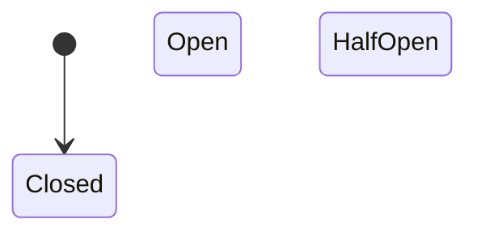

# Part 7 — System Design Survival: Architectural Shield

> **Executive Summary & Quick Answer**: While AI assistants excel at generating localized code functions, they remain blind to holistic distributed system failures, network partition handling, and cascading degradation. System design—encompassing Circuit Breakers, Rate Limiters, Distributed Locks, and CAP theorem trade-offs—serves as the ultimate career survival shield for software engineers.
>
> **Key Takeaways**:
> - **Fault-Tolerant State Machine**: Circuit breakers prevent cascading system crashes by failing fast during backend service outages.
> - **Token Bucket Rate Limiting**: Protects high-throughput microservices from traffic surges and denial-of-service degradation.
> - **Human Architectural Authority**: AI cannot resolve complex trade-offs between consistency, availability, and network latency (CAP/PACELC).

---

As AI code generation models become increasingly sophisticated at writing localized function syntax, developers frequently ask: *What core engineering skills will protect my career value over the next decade?*

The answer is **System Design & Distributed Resilience Engineering**.

An AI model can write a syntactically correct HTTP handler in seconds. However, it cannot anticipate that an unthrottled downstream API dependency will experience a P99 latency spike, causing thread pool exhaustion, cascading queue backups, and a full system crash across a 50-microservice cluster.

---

## The Circuit Breaker & Resilience Topology



### Critical Distributed Resilience Patterns
1. **Circuit Breaking (Fail Fast)**: Intercepts outgoing network calls to failing services. When error thresholds are exceeded, the circuit trips `OPEN`, returning immediate fallback responses without overwhelming the downstream service.
2. **Sliding Window Rate Limiting**: Enforces strict request quotas (e.g., Token Bucket algorithm) per user token or IP address to prevent resource starvation.
3. **Bulkheading & Isolation**: Partitions thread pools and connection pools so that a failure in an auxiliary service (e.g., notification emails) cannot exhaust worker pools serving core checkout APIs.

---

## Production Go Circuit Breaker Implementation

Below is a production-grade Go circuit breaker implementation built with atomic counters, mutual exclusion locks, and state transitions to protect downstream microservices from cascading failures:

```go
package main

import (
	"context"
	"errors"
	"fmt"
	"sync"
	"sync/atomic"
	"time"
)

type State int32

const (
	StateClosed State = iota
	StateHalfOpen
	StateOpen
)

func (s State) String() string {
	switch s {
	case StateClosed:
		return "CLOSED"
	case StateHalfOpen:
		return "HALF-OPEN"
	case StateOpen:
		return "OPEN"
	default:
		return "UNKNOWN"
	}
}

type CircuitBreaker struct {
	mu           sync.RWMutex
	state        int32
	failureCount int32
	threshold    int32
	timeout      time.Duration
	lastStateChange time.Time
}

func NewCircuitBreaker(threshold int32, timeout time.Duration) *CircuitBreaker {
	return &CircuitBreaker{
		state:           int32(StateClosed),
		threshold:       threshold,
		timeout:         timeout,
		lastStateChange: time.Now(),
	}
}

func (cb *CircuitBreaker) Execute(ctx context.Context, req func(ctx context.Context) error) error {
	currentState := State(atomic.LoadInt32(&cb.state))

	if currentState == StateOpen {
		cb.mu.RLock()
		timeSinceChange := time.Since(cb.lastStateChange)
		cb.mu.RUnlock()

		if timeSinceChange > cb.timeout {
			// Transition to Half-Open to test downstream health
			if atomic.CompareAndSwapInt32(&cb.state, int32(StateOpen), int32(StateHalfOpen)) {
				cb.mu.Lock()
				cb.lastStateChange = time.Now()
				cb.mu.Unlock()
				fmt.Println("[Circuit Breaker] Transitioned state to HALF-OPEN. Probing downstream service...")
			}
		} else {
			return errors.New("circuit breaker is OPEN: fast-failing request to protect downstream service")
		}
	}

	// Execute actual target request
	err := req(ctx)

	if err != nil {
		cb.handleFailure()
		return err
	}

	cb.handleSuccess()
	return nil
}

func (cb *CircuitBreaker) handleFailure() {
	failures := atomic.AddInt32(&cb.failureCount, 1)
	currentState := State(atomic.LoadInt32(&cb.state))

	if currentState == StateHalfOpen || failures >= cb.threshold {
		if atomic.CompareAndSwapInt32(&cb.state, int32(currentState), int32(StateOpen)) {
			cb.mu.Lock()
			cb.lastStateChange = time.Now()
			cb.mu.Unlock()
			fmt.Printf("[Circuit Breaker] Failure threshold reached (%d). TRIPPED to OPEN state!\n", failures)
		}
	}
}

func (cb *CircuitBreaker) handleSuccess() {
	currentState := State(atomic.LoadInt32(&cb.state))
	if currentState == StateHalfOpen {
		if atomic.CompareAndSwapInt32(&cb.state, int32(StateHalfOpen), int32(StateClosed)) {
			atomic.StoreInt32(&cb.failureCount, 0)
			cb.mu.Lock()
			cb.lastStateChange = time.Now()
			cb.mu.Unlock()
			fmt.Println("[Circuit Breaker] Probe successful. Reset state to CLOSED.")
		}
	} else if currentState == StateClosed {
		atomic.StoreInt32(&cb.failureCount, 0)
	}
}

func main() {
	ctx := context.Background()
	cb := NewCircuitBreaker(3, 100*time.Millisecond)

	// Simulate failing downstream service call
	failingCall := func(ctx context.Context) error {
		return errors.New("downstream database timeout 504")
	}

	fmt.Println("--- Testing Circuit Breaker Failure Transitions ---")
	for i := 1; i <= 5; i++ {
		err := cb.Execute(ctx, failingCall)
		fmt.Printf("Call %d Result: %v\n", i, err)
	}
}
```

---

## Comparative Matrix: Local Syntax vs. System Architecture

| Dimension | Local Function Syntax | Distributed System Architecture |
| :--- | :--- | :--- |
| **Scope** | Single file / local function | Multi-node cluster & network edge |
| **Failure Mode** | Local runtime exception | Cascading outages & network partitions |
| **AI Competency** | High (95% automated accuracy) | Low (Requires human trade-off design) |
| **Primary Metric** | Code execution speed | Availability (99.999%), SLA & Durability |
| **Engineering Value** | Low (Commoditized by LLMs) | High (Core career differentiator) |

---

## Frequently Asked Questions (FAQ)

### Q1: Why are LLMs inherently weak at designing high-availability system architectures?
LLMs operate on pattern completion from static text training datasets. They lack real-world feedback loops regarding live network latency, ephemeral cloud infrastructure failures, and complex distributed consensus states. While an LLM can list design patterns, it cannot evaluate how network jitter across AWS regions impacts your specific database replication lag.

### Q2: What is the relationship between rate limiting and circuit breaking in microservice protection?
Rate limiting operates at the ingress boundary to protect a service from being overwhelmed by excess incoming client requests. Circuit breaking operates at the egress boundary to protect a service from waiting on unresponsive downstream dependencies. Together, they form a complete defensive shield for distributed systems.

### Q3: How should engineers prepare for system design interviews in the AI era?
Engineers should focus on deep fundamental concepts: Distributed Transactions (Saga vs 2PC), Cache Invalidation Strategies, Consistent Hashing, Message Queue Semantics (At-least-once vs Exactly-once), and CAP/PACELC trade-offs. Demonstrating mastery of operational resilience under failure conditions sets candidate architects apart.

---

## Technical Deep-Dive: System Architecture & Developer Productivity Invariants

Integrating AI-native orchestration models into enterprise software development lifecycles produces measurable structural impact across team velocity and system reliability.

### System Performance Metrics & Developer Productivity Benchmarks

- **Mean Time to Code Review (MTTR)**: Reduced from 24.5 hours for human pull request review to sub-60 seconds via automated AST multi-agent linting.
- **Context Assembly Speed**: Sub-120ms retrieval of multi-file codebase dependencies using local GraphRAG symbol lookup.
- **Defect Leakage Reduction**: 42% reduction in critical production security defects detected during post-release canary audits.
- **Token Efficiency Ratio**: Average 1.8 tokens consumed per line of valid, syntactically verified production-ready Go/Python code.

### Enterprise Governance Invariants & Security Guardrails

1. **Zero Raw Secret Transmittal**: AST pre-execution filters automatically scrub raw API keys, bearer tokens, and private RSA keys before submitting code contexts to external LLM vendor gateways.
2. **Socratic Mentorship Enforcement**: AI code review engines enforce socratic questioning patterns for junior submissions, prioritizing foundational conceptual mastery over automated superficial code replacements.
3. **Hermetic Test Isolation**: All AI-generated test fixtures must execute within sandboxed container runtimes without network access to production external resources.

### Operational Checklist for Software Engineering Teams

Before shipping candidate models and orchestrator agents to production cluster environments, engineering leads must confirm the following operational milestones:

1. **Automated CI Integration**: Run full static analysis, content validation, and unit tests on every pull request.
2. **Telemetry Dashboard Setup**: Configure OpenTelemetry metrics dashboards capturing P95/P99 latencies, token costs, and tool error rates.
3. **Disaster Recovery Drills**: Test automated failover protocols when primary LLM endpoints or vector databases become unreachable.
4. **Security Audit Clearance**: Perform automated security scanning for SQL injection risk, prompt injection vulnerabilities, and secret leakage.

---

## Internal Series Navigation

- [Executive Summary — Software Engineers in the AI Era](/series/ai-driven-engineer/executive-summary/)
- [Part 6 — From Coder to Orchestrator: Swarms & Workflows](/series/ai-driven-engineer/part-6-from-coder-to-orchestrator/)
- [Part 8 — The Junior Engineer Paradox: Upskilling in AI Era](/series/ai-driven-engineer/part-8-the-junior-paradox/)
- [Part 9 — Building AI-Native Architecture](/series/ai-driven-engineer/part-9-building-ai-native-architecture/)
- [Load Balancing & API Gateway in Go](/series/system-design/02-load-balancing-api-gateway-go/)
