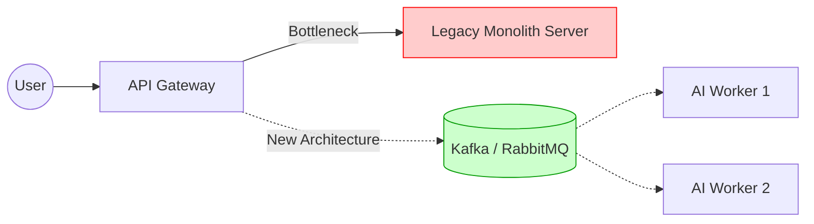

---

title: "Part 7 — System Design: The Priceless Survival Territory for Developers"
date: "2026-05-10T16:00:00+07:00"
lastmod: "2026-05-10T16:00:00+07:00"
draft: false
description: "AI can write excellent code, but it cannot design macro-systems."
ShowToc: true
TocOpen: true
weight: 8
categories: ["Series", "Software Engineering"]
tags: ["AI", "System Design", "Career"]
cover:
  image: "images/posts/ai-native-frontend-cover.png"
  alt: "AI-Driven Engineer series: evolving from code typist to AI-native software architect"
  relative: false
author: "Lê Tuấn Anh"
canonicalURL: "https://tanhdev.com/series/ai-driven-engineer/part-7-system-design-survival/"
mermaid: true
---

No matter how top-tier your Prompt Engineering skills are, sooner or later you will hit a reality wall: **Writing code to create a feature is easy, but designing a system that can handle millions of users is incredibly difficult.**

In an era where AI is taking over "typing" tasks, System Design is the life preserver, the "inviolable territory" that keeps you from being phased out.

## AI is Good at "Building Rooms", Not "Building Houses"

Imagine software development as building an apartment complex.
- AI is a brilliant builder. If you say: *"Build me a Nordic-style kitchen"*, AI will make a perfect kitchen (write a standard RESTful Microservice, clean code, full Unit Tests).
- But AI **cannot** independently decide how this building should share a drainage system, where to place elevators to handle 1000 people simultaneously, or how deep the foundation must be to withstand earthquakes.

In software, AI can write a highly optimized algorithmic function. But when you have 50 Microservices that need to communicate with each other, should you use Event-Driven (like Kafka) or an API Gateway? How do you handle Asynchronous data so it isn't lost when a service crashes? Those are Architectural problems that only the human brain can solve.

## Maintaining & Renovating "Occupied Houses": Why AI Agents Fail at Massive Legacy Code

Most promotional demos for AI Agents (like Devin, Cursor) showcase creating an entirely new application from scratch (Greenfield projects). It looks like magic.

But in enterprise reality, 80% of a programmer's work is maintaining and upgrading systems that have existed for 5 to 10 years (Brownfield/Legacy Code). **And this is exactly where AI Agents "cry out in despair".**

1. **Context Window Limits:** A Legacy project often has millions of lines of code, tangled with circular dependencies. You cannot "cram" all those millions of lines into the AI's brain at once. It will overload, suffer from forgetting, and generate logic that breaks the old system.
2. **Undocumented Business Rules:** Old code often contains lines that look "stupid" (e.g., `if (user_id == 999) return false;`). AI will look at that and suggest deleting it for "optimization". But only veteran programmers know that `999` is a former partner's ID, and if that line is deleted, the partner will sue the company. AI lacks the ability to read the "political and business intent" behind garbage code.
3. **Renovating an Occupied House:** Refactoring a Legacy system is like changing tires while the car is speeding on a highway. Programmers must design patterns (like the Strangler Fig) to gradually drain old code into new code without disrupting users. AI does not have this long-term strategic thinking.

## The Core of System Design: The Art of Trade-offs

System design isn't about choosing the "best" solution, because in engineering there is never perfection. System design is the **Art of Trade-offs.**

According to the CAP Theorem, you cannot have all 3: Consistency, Availability, and Partition Tolerance. You must sacrifice one.
- AI can fluently recite the CAP theorem to you.
- But **The Engineer** is the one who decides: *"Our banking system would rather throw an error (lose Availability) than transfer the wrong amount of money (maintain Consistency)."*

AI has no context regarding the company's finances (do we have money to rent a bigger server?), doesn't know what language the current Dev team is strong in, and doesn't know if the Deadline is tomorrow or next month. All these "real-life variables" force the Engineer to make the final architectural decision.

## [Bonus] System Design Rubric for the AI Era

How do you know if a system architecture design meets the STANDARD in this era? Below is a Rubric for Tech Leads/Architects when reviewing solutions:

| Criteria | Low Level (Fully AI Dependent) | High Level (True Architect) |
| :--- | :--- | :--- |
| **AI Security** | Allows AI to directly query the Production DB to read data. | Sets up RAG architecture, only letting AI read Sanitized Data on a separate Vector DB. |
| **Vendor Lock-in Risk Management** | Hard-codes all API calls directly to OpenAI. If OpenAI goes down, the App goes down. | Designs through an **AI Gateway (Abstraction Layer)**. Switches back and forth between GPT-4, Claude, and Local LLMs using just 1 environment variable. |
| **Load Handling (Scalability)** | Scales by "throwing money" to upgrade CPU/RAM (Scale Up) when AI processes slowly. | Applies a Queue (Kafka/RabbitMQ) to catch requests. Handles AI asynchronously and returns results via Webhooks/WebSockets. |
| **Fallback Plan** | None. If AI returns an HTTP 500 error, it throws the 500 error right in the User's face. | Has a clear Fallback. If AI Times out or gets rate-limited, the system automatically returns default Rule-based logic to the User. |

## Visual Case Study: Handling Bottlenecks

Suppose your e-commerce app crashes on Flash Sale day because of too much traffic.

| AI-Dependent Engineer (Treating Symptoms) | System Design Engineer (Treating the Root Cause) |
| :--- | :--- |
| Pastes the error log into ChatGPT. AI advises upgrading RAM/CPU (Scale Up) and optimizing minor SQL queries. The server still crashes due to Connection overload. | Sees the Architectural problem. Doesn't ask AI to fix code, but personally designs an intermediate Redis Cache layer, or moves the Order system to a Message Queue (RabbitMQ). Only then do they ask AI to write the RabbitMQ connection code. |

## The Leading Hook

If System Design is the only survival skill, and reading Legacy Code is a programmer's strongest defensive wall, then a very pressing question arises:

How will young Freshers/Juniors entering the profession learn these macro skills? Previously, Juniors learned by coding small features (building muscle). Now AI has taken over that work. If they don't train their "muscles," how will they evolve into the "brains" (Seniors/Architects)?

This is a new generational talent crisis named: **[Part 8: The Junior Paradox - Building Foundations When AI Does the Basics](/series/ai-driven-engineer/part-8-the-junior-paradox/)**.

---
### 🛠 Practical Exercise: Practice Architectural Design
1. **Challenge:** Choose an application you use daily (like a Food Delivery app).
2. **Action:** Without using AI or Google, try to sketch out 3 core microservices needed to make that app work (e.g., Order Service, Payment Service, Driver Tracking Service). Then write down what happens if the Payment Service crashes while an order is placed.
3. **Analysis:** Now ask ChatGPT/Claude to evaluate your design and suggest how a Message Queue could save that crash scenario.

### 📚 External Resources & Related Links
- **Architecture Knowledge:** Check out the [ByteByteGo](https://bytebytego.com/) newsletter by Alex Xu for excellent system design breakdowns.
- **Related in series:** To understand how AI impacts the people building these architectures, read [Part 1: The Death of 'Code Typists'](/series/ai-driven-engineer/part-1-the-death-of-code-typists/).

---
💬 **Discussion Corner:** Facing Legacy Code (5-10 year old projects tangled in technical debt), does the AI Agent you use (Cursor/Copilot) get "shut down"? How do you handle it to avoid crashing the old system?

  
<a href="/series/ai-driven-engineer/part-6-from-coder-to-orchestrator/">← Previous: Part 6</a>

  
<a href="/series/ai-driven-engineer/part-8-the-junior-paradox/">Next Article: Part 8 →</a>

