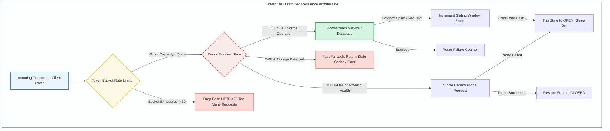

> **Prerequisite:** Strong understanding of distributed systems fundamentals, CAP and PACELC theorems, concurrency race conditions, and atomic state synchronization.

> **Answer-first:** High-level distributed systems design, data consistency modeling, and network partition resilience remain the irreplaceable domain of human software engineers. Large language models fundamentally fail at non-local reasoning, subtle concurrency race conditions, and CAP theorem trade-offs. Mastering storage engine internals, distributed transactions, and failure domain isolation guarantees technical leadership and long-term career durability.

---

## 1. The Reasoning Horizon: Why LLMs Collapse at Distributed Scale

As frontier generative AI models become proficient at generating localized function syntax, junior and senior engineers alike ask: *Which engineering skills will remain durable over the next decade?*

The definitive answer is **System Design, Distributed Resilience, and Concurrency Modeling**.

Large Language Models (LLMs) operate fundamentally through localized autoregressive token prediction over finite attention spans. While an LLM can generate a syntactically pristine HTTP controller or DTO mapper in milliseconds, it remains completely blind to non-local emergent properties in distributed systems:
1. **Network Partition Asynchrony**: An LLM cannot predict how a sudden 200ms latency spike on an unindexed downstream microservice will exhaust thread pools, trigger uncoordinated retries, and cascade into a multi-region outage.
2. **Hidden Concurrency Race Conditions**: Under high contention, subtle time-of-check to time-of-use (TOCTOU) bugs, distributed deadlocks, and stale read phenomena evade static AST checks.
3. **CAP & PACELC Theorem Trade-offs**: Choosing between linearizable consistency (CP) and high availability (AP) requires evaluating business risk tolerance, financial liabilities, and regulatory constraints—decisions that cannot be delegated to probabilistic models.


```mermaid
flowchart TD
    subgraph HumanVsAIHorizon ["The Engineering Competency Horizon"]
        subgraph AICommodity ["1. AI-Automated Commodity Layer (Local Scope)"]
            A1["Function Syntax Generation (Python/Go/Rust)"]
            A2["Unit Test Boilerplate & Mock Synthesis"]
            A3["CRUD API Endpoint Scaffolding"]
            A4["Regex & SQL Query Formatting"]
        end

        subgraph HumanDomain ["2. Irreplaceable Human Architectural Citadel (Distributed Scope)"]
            H1["Distributed Consensus & Quorum (Raft / Paxos)"]
            H2["CAP / PACELC Trade-Off Balancing"]
            H3["Cascading Failure Isolation & Circuit Breaking"]
            H4["Stateful Storage Engine Internals (LSM vs B+Tree)"]
            H5["Idempotency & Exactly-Once Semantics"]
        end
    end

    AICommodity -.->|"Supervised by"| HumanDomain

    style HumanVsAIHorizon fill:#fdfefe,stroke:#2c3e50,stroke-width:2px
    style AICommodity fill:#f9ebea,stroke:#c0392b,stroke-width:2px
    style HumanDomain fill:#e8f8f5,stroke:#16a085,stroke-width:2px
```

When systems fail in production, they almost never fail because an engineer forgot the syntax of a `for` loop. They fail because an architect designed a system with unbounded buffers, unpartitioned failure domains, or missing circuit breakers.

---

## 2. Distributed Resilience Patterns: Circuit Breakers & Token Buckets

Architectural resilience provides the fault-tolerant shield that protects modern enterprise platforms against imperfect code, network partitions, and third-party API degradations.

In high-concurrency distributed systems, two foundational mechanisms operate as the primary defense line:
- **Distributed Circuit Breaker**: Intercepts downstream network dependencies. When the failure rate exceeds a critical threshold, the circuit trips from `CLOSED` to `OPEN`, failing fast immediately without exhausting local threads or overloading the struggling dependency. After a sleep window, it enters `HALF-OPEN` to safely test downstream recovery with probe traffic.
- **Token Bucket Rate Limiter**: Enforces strict throughput quotas on incoming requests while accommodating legitimate traffic bursts up to bucket capacity.


```mermaid
flowchart TD
    subgraph ResilienceTopology ["Enterprise Distributed Resilience Architecture"]
        ClientReq["Incoming Concurrent Client Traffic"] --> RateLimiter{"Token Bucket Rate Limiter"}
        
        RateLimiter -->|"Within Capacity / Quota"| CBGate{"Circuit Breaker State"}
        RateLimiter -->|"Bucket Exhausted (429)"| DropFast["Drop Fast: HTTP 429 Too Many Requests"]
        
        CBGate -->|"CLOSED: Normal Operation"| DownstreamRPC["Downstream Service / Database"]
        CBGate -->|"OPEN: Outage Detected"| Fallback["Fast Fallback: Return Stale Cache / Error"]
        CBGate -->|"HALF-OPEN: Probing Health"| ProbeCall["Single Canary Probe Request"]

        DownstreamRPC -->|"Success"| SuccessTracker["Reset Failure Counter"]
        DownstreamRPC -->|"Latency Spike / 5xx Error"| FailureTracker["Increment Sliding Window Errors"]

        FailureTracker -->|Error Rate > 50%| TripOpen["Trip State to OPEN (Sleep 5s)"]
        ProbeCall -->|"Probe Succeeded"| ResetClosed["Restore State to CLOSED"]
        ProbeCall -->|"Probe Failed"| TripOpen
    end

    style ResilienceTopology fill:#fdfefe,stroke:#2c3e50,stroke-width:2px
    style ClientReq fill:#ebf5fb,stroke:#2980b9,stroke-width:2px
    style RateLimiter fill:#fef9e7,stroke:#f1c40f,stroke-width:2px
    style CBGate fill:#f9ebea,stroke:#c0392b,stroke-width:2px
    style DownstreamRPC fill:#d5f5e3,stroke:#27ae60,stroke-width:2px
    style DropFast fill:#fadbd8,stroke:#e74c3c,stroke-width:1px
    style Fallback fill:#fadbd8,stroke:#e74c3c,stroke-width:1px
```

---

## 3. Production Go 1.25+ Distributed Circuit Breaker & Token Bucket Rate Limiter

The following Go 1.25+ implementation combines an atomic **Circuit Breaker** with a high-throughput **Token Bucket Rate Limiter**. It uses `sync/atomic` for lockless fast-path state checks, mutex-protected sliding-window health evaluation, and atomic token replenishments.

```go
package main

import (
	"context"
	"errors"
	"fmt"
	"math"
	"math/rand/v2"
	"sync"
	"sync/atomic"
	"time"
)

// ==========================================
// 1. TOKEN BUCKET RATE LIMITER
// ==========================================

// TokenBucket limits burst traffic while maintaining a steady refill rate.
type TokenBucket struct {
	capacity   float64
	tokens     float64
	refillRate float64 // Tokens per second
	lastRefill time.Time
	mu         sync.Mutex
}

func NewTokenBucket(capacity float64, refillRate float64) *TokenBucket {
	return &TokenBucket{
		capacity:   capacity,
		tokens:     capacity,
		refillRate: refillRate,
		lastRefill: time.Now(),
	}
}

// Allow attempts to consume 1 token. Returns true if allowed, false if rate limited.
func (tb *TokenBucket) Allow() bool {
	tb.mu.Lock()
	defer tb.mu.Unlock()

	now := time.Now()
	elapsed := now.Sub(tb.lastRefill).Seconds()
	tb.lastRefill = now

	// Refill tokens based on elapsed duration
	tb.tokens = math.Min(tb.capacity, tb.tokens+(elapsed*tb.refillRate))

	if tb.tokens >= 1.0 {
		tb.tokens -= 1.0
		return true
	}
	return false
}

// ==========================================
// 2. DISTRIBUTED CIRCUIT BREAKER
// ==========================================

type CircuitState int32

const (
	StateClosed CircuitState = iota
	StateHalfOpen
	StateOpen
)

func (s CircuitState) String() string {
	switch s {
	case StateClosed:
		return "CLOSED"
	case StateHalfOpen:
		return "HALF-OPEN"
	case StateOpen:
		return "OPEN"
	default:
		return "UNKNOWN"
	}
}

var (
	ErrCircuitOpen = errors.New("circuit breaker is OPEN: fast-failing request")
	ErrRateLimited = errors.New("rate limit exceeded: token bucket exhausted")
)

type CircuitBreaker struct {
	mu              sync.RWMutex
	state           int32 // Atomic CircuitState
	failureCount    int32
	failureThreshold int32
	baseTimeout     time.Duration
	lastStateChange time.Time
	halfOpenSuccess int32
	probeSuccessReq int32
}

func NewCircuitBreaker(threshold int32, timeout time.Duration) *CircuitBreaker {
	return &CircuitBreaker{
		state:            int32(StateClosed),
		failureThreshold: threshold,
		baseTimeout:      timeout,
		lastStateChange:  time.Now(),
		probeSuccessReq:  2, // Require 2 consecutive probe successes to close
	}
}

func (cb *CircuitBreaker) Execute(ctx context.Context, req func(ctx context.Context) error) error {
	currentState := CircuitState(atomic.LoadInt32(&cb.state))

	if currentState == StateOpen {
		cb.mu.RLock()
		elapsed := time.Since(cb.lastStateChange)
		cb.mu.RUnlock()

		if elapsed > cb.baseTimeout {
			// Attempt CAS transition from OPEN to HALF-OPEN
			if atomic.CompareAndSwapInt32(&cb.state, int32(StateOpen), int32(StateHalfOpen)) {
				cb.mu.Lock()
				cb.lastStateChange = time.Now()
				atomic.StoreInt32(&cb.halfOpenSuccess, 0)
				cb.mu.Unlock()
				fmt.Printf("[CircuitBreaker] Timeout expired (%v). Transitioned to HALF-OPEN.\n", elapsed)
			}
		} else {
			return ErrCircuitOpen
		}
	}

	// Execute operation under context
	err := req(ctx)

	if err != nil {
		cb.onFailure()
		return err
	}

	cb.onSuccess()
	return nil
}

func (cb *CircuitBreaker) onFailure() {
	currentState := CircuitState(atomic.LoadInt32(&cb.state))

	if currentState == StateHalfOpen {
		// Probe failed: trip back to OPEN immediately with exponential jitter
		atomic.StoreInt32(&cb.state, int32(StateOpen))
		cb.mu.Lock()
		cb.lastStateChange = time.Now()
		cb.mu.Unlock()
		fmt.Println("[CircuitBreaker] Probe call FAILED in HALF-OPEN. Tripped back to OPEN.")
		return
	}

	failures := atomic.AddInt32(&cb.failureCount, 1)
	if failures >= cb.failureThreshold {
		if atomic.CompareAndSwapInt32(&cb.state, int32(StateClosed), int32(StateOpen)) {
			cb.mu.Lock()
			cb.lastStateChange = time.Now()
			cb.mu.Unlock()
			fmt.Printf("[CircuitBreaker] Failure threshold reached (%d). Tripped to OPEN state.\n", failures)
		}
	}
}

func (cb *CircuitBreaker) onSuccess() {
	currentState := CircuitState(atomic.LoadInt32(&cb.state))

	if currentState == StateHalfOpen {
		successes := atomic.AddInt32(&cb.halfOpenSuccess, 1)
		if successes >= cb.probeSuccessReq {
			if atomic.CompareAndSwapInt32(&cb.state, int32(StateHalfOpen), int32(StateClosed)) {
				atomic.StoreInt32(&cb.failureCount, 0)
				cb.mu.Lock()
				cb.lastStateChange = time.Now()
				cb.mu.Unlock()
				fmt.Println("[CircuitBreaker] Consecutive probes SUCCEEDED. Reset circuit to CLOSED.")
			}
		}
	} else if currentState == StateClosed {
		atomic.StoreInt32(&cb.failureCount, 0)
	}
}

// ==========================================
// 3. INTEGRATED RESILIENT CLIENT HARNESS
// ==========================================

type ResilientService struct {
	limiter *TokenBucket
	breaker *CircuitBreaker
}

func NewResilientService() *ResilientService {
	return &ResilientService{
		limiter: NewTokenBucket(10, 5), // Burst: 10, Refill: 5 req/sec
		breaker: NewCircuitBreaker(3, 200*time.Millisecond),
	}
}

func (s *ResilientService) Call(ctx context.Context, id int, simulateError bool) error {
	if !s.limiter.Allow() {
		return ErrRateLimited
	}

	return s.breaker.Execute(ctx, func(ctx context.Context) error {
		if simulateError {
			return errors.New("downstream RPC 503 Service Unavailable")
		}
		return nil
	})
}

func main() {
	service := NewResilientService()
	ctx := context.Background()

	fmt.Println("=== 1. Testing Failure Trip to OPEN ===")
	for i := 1; i <= 5; i++ {
		err := service.Call(ctx, i, true)
		fmt.Printf("Req %d: error = %v\n", i, err)
		time.Sleep(10 * time.Millisecond)
	}

	fmt.Println("\n=== 2. Waiting for Timeout Window to enter HALF-OPEN ===")
	time.Sleep(250 * time.Millisecond)

	fmt.Println("\n=== 3. Testing Probe Recovery in HALF-OPEN ===")
	for i := 6; i <= 9; i++ {
		err := service.Call(ctx, i, false) // Recovering: no errors
		fmt.Printf("Req %d: error = %v\n", i, err)
		time.Sleep(50 * time.Millisecond)
	}
}
```

---

## 4. CAP Theorem & PACELC Trade-Off Analysis in Practice

When designing large-scale distributed architectures, engineers must make explicit, mathematically grounded trade-offs dictated by the CAP and PACELC theorems:

- **CAP Theorem**: In any asynchronous network subject to partitions ($P$), a distributed data store can guarantee either **Consistency** ($C$) or **Availability** ($A$), but never both.
- **PACELC Extension**: If there is a Partition ($P$), how do you trade off Availability ($A$) and Consistency ($C$)? **Else** ($E$), when the system is running normally, how do you trade off Latency ($L$) and Consistency ($C$)?

### Mapping Architectural Bounded Contexts
A common mistake made by naive AI code generators is applying a single storage pattern across all domain boundaries. Senior system architects divide applications into strict bounded contexts:

| Bounded Context | CAP Classification | PACELC Profile | Storage Engine Choice | Rationale |
| :--- | :--- | :--- | :--- | :--- |
| **Financial Ledger / Payments** | **CP** (Consistency / Partition) | **PC/EC** | CockroachDB / PostgreSQL | Invariant balance integrity; zero double-spend tolerance. |
| **Inventory Allocation** | **CP** (Strict Serializability) | **PC/EC** | Redis Raft / Spanner | Prevents overselling flash-sale stock under concurrent traffic. |
| **User Shopping Cart** | **AP** (Availability / Partition) | **PA/EL** | DynamoDB / Cloudflare KV | High availability; cart merges via CRDTs if partition occurs. |
| **Semantic Vector Cache** | **AP** (Eventual Consistency) | **PA/EL** | Redis Cluster / Milvus | Low latency is paramount; stale cache miss triggers fresh fetch. |
| **Audit & Telemetry Logs** | **AP** (High Throughput Write) | **PA/EL** | ClickHouse / Kafka | Append-only streams prioritize ingestion rate over immediate read sync. |

---

## 5. Comparative Matrix: Local Syntax vs. Distributed Architecture

| Dimension | Local Function Syntax | Distributed System Architecture |
| :--- | :--- | :--- |
| **Scope & Topology** | Single file / local function scope | Multi-region cluster, RPC mesh & edge nodes |
| **Primary Failure Mode** | Local runtime null pointer or type exception | Cascading network partitions & thread starvation |
| **AI Automation Level** | 95%+ Automated (LLMs generate syntax flawlessly) | Low (<15% automated; requires human trade-off judgment) |
| **Core Success Metric** | Code execution speed & cyclomatic complexity | Availability (99.999%), SLA durability & P99 latency |
| **Career Durability** | Rapidly commoditizing | High-leverage, irreplaceable architectural leadership |
| **Testing Methodology** | Unit tests & static mocks | Jepsen partition chaos testing & load fuzzing |

---

## 6. The Irreplaceable Human Architectural Citadel

Why does deep distributed systems design protect engineers from AI-driven obsolescence?

1. **Stateful Invariants Cannot Be Guessed**: Large language models do not carry real-time operational telemetry. They do not know that your database disk I/O is saturated at 92%, or that cross-region VPC peering introduces 85ms round-trip latency. Human architects design around real physical hardware and network constraints.
2. **Failure Domain Isolation**: Designing fault domains (Availability Zones, cell-based architectures, bulkheaded pools) requires understanding organizational topology and blast radius mitigation—domains where LLM hallucinations can cause catastrophic multi-million-dollar outages.
3. **Storage Engine Internals**: Selecting between an LSM-Tree (Log-Structured Merge-tree like RocksDB/Cassandra, optimized for write throughput) and a $B^+$-Tree (like InnoDB/PostgreSQL, optimized for read predictability) requires deep first-principles intuition regarding mechanical disk seek times, write amplification, and compaction debt.

### Distributed Consensus & Coordination: Raft vs. Gossip Protocols
While an AI agent can instantiate an etcd client or Redis connection, choosing the appropriate consensus topology requires understanding latency trade-offs under partial network partitions. Strict consensus protocols like Raft or Multi-Paxos demand a quorum of $(N/2) + 1$ nodes to commit state transitions. In a multi-region deployment across three continents, achieving Raft leader election and log replication incurs severe speed-of-light round-trip latency penalties (120ms to 250ms). Conversely, weakly consistent Gossip protocols (such as SWIM or Cassandra Dynamo-clustering) provide sub-millisecond local writes and eventual convergence, but admit transient split-brain states. Human architects map business requirements directly to these mechanical realities, choosing Raft for cluster leader coordination and Gossip for node health heartbeats.

### The Dual-Write Dilemma & The Transactional Outbox Pattern
A classic pitfall in AI-synthesized microservice handlers is the "Dual-Write Bug": the model generates code that updates a relational database table and immediately publishes an event to an Apache Kafka message broker within the same function block. When the database write succeeds but the network connection to Kafka drops, the system enters an inconsistent, corrupted state. LLMs consistently fail to foresee this failure mode. Senior engineers resolve the dual-write dilemma by architecting the **Transactional Outbox Pattern**: both the business entity mutation and the outbox event record are committed atomically within the same local ACID database transaction. A decoupled Change Data Capture (CDC) process using Debezium tails the database write-ahead log (WAL) and publishes events to Kafka with at-least-once delivery guarantees.

---

## 7. Related Architectural Pillars & Internal Guidance

To deepen your mastery of distributed resilience, edge computing, and high-concurrency Golang systems:

- Architect 21 production microservices in Go with DDD: **[Architecting 21-Service Go Microservices with DDD](/posts/go-microservices/)**
- Implement edge state machines and resilient carts: **[Cloudflare D1 & Durable Objects Edge Architecture](/posts/cloudflare-d1-durable-objects-realtime-cart/)**
- Evaluate cloud container architectures for resilience: **[AWS EKS vs ECS Architecture Comparison](/posts/aws-eks-vs-ecs-comparison/)**

---

## 8. Frequently Asked Questions (FAQ)


AI models operate on local prompt text and static training patterns, lacking real-time visibility into physical network topologies, latency variance, and financial risk tolerance. Resolving CAP/PACELC trade-offs requires human architects to evaluate business priorities: deciding whether a momentary outage (sacrificing Availability) or a temporary inconsistent read (sacrificing Consistency) is more acceptable under network partitions.



When a downstream microservice degrades, atomic circuit breakers trip to OPEN immediately upon crossing failure thresholds. This causes all subsequent calls to fail fast locally without consuming TCP sockets, thread pools, or memory buffers. By short-circuiting doomed calls, the breaker gives the downstream system breathing room to recover and prevents the calling service from suffering thread starvation.



The Token Bucket algorithm accumulates tokens at a constant refill rate up to a burst capacity limit, allowing sudden bursts of traffic to proceed immediately as long as tokens are available. The Leaky Bucket algorithm processes incoming requests at a strictly fixed output rate regardless of burst intensity, smoothing traffic spikes into a constant stream at the cost of queuing latency.



Different business domains carry vastly different risk profiles. Financial transaction aggregates and inventory reserves demand strict linearizable consistency (CP) to prevent duplicate spend and overselling. In contrast, product review ratings, social feeds, and recommendation caches safely operate under eventual consistency (AP), enabling sub-10ms response latencies and high availability.

