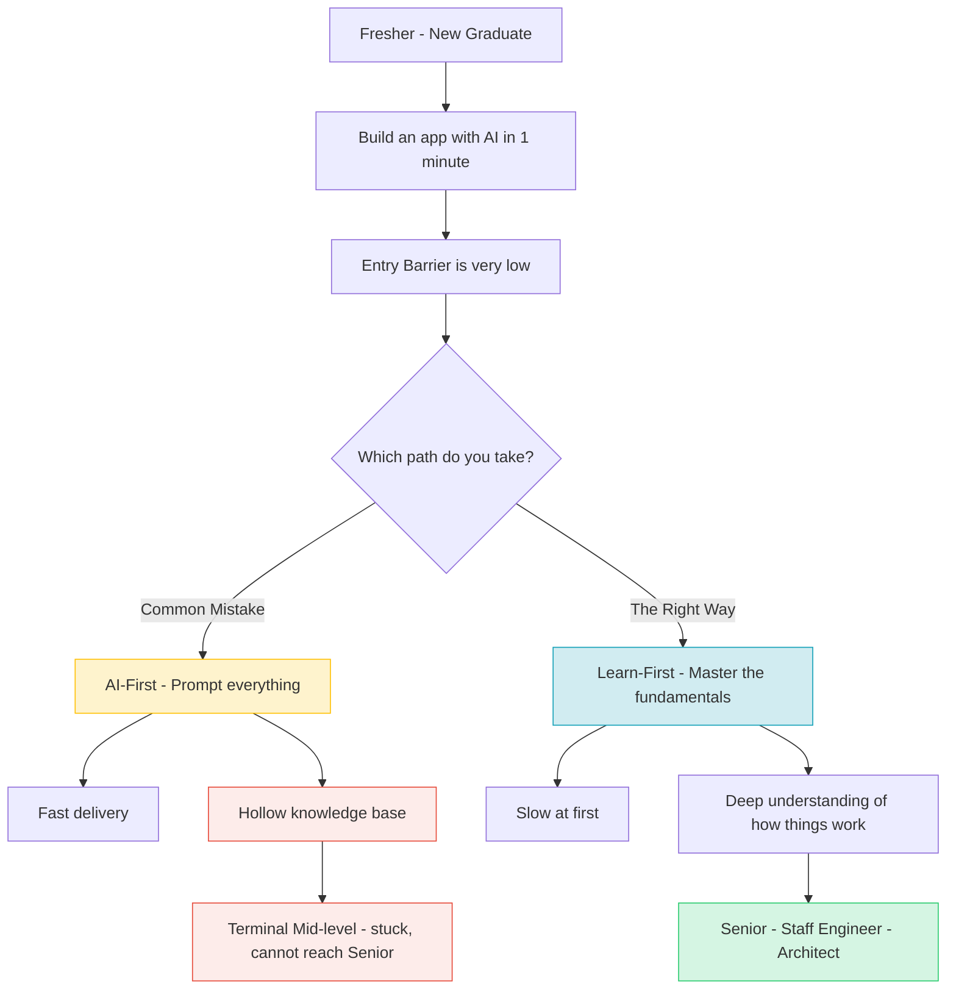

---

title: "Part 8 — The Junior Paradox: Building Foundations When AI Does the Basics"
date: "2026-05-10T16:10:00+07:00"
lastmod: "2026-05-10T16:10:00+07:00"
draft: false
description: "Dissecting the crisis in training young programmers. When machines solve the surface-level problems, how must newcomers train to avoid having 'hollow"
ShowToc: true
TocOpen: true
weight: 9
categories: ["Series", "Software Engineering"]
tags: ["AI", "System Design", "Career"]
cover:
  image: "images/posts/ai-native-frontend-cover.png"
  alt: "AI-Driven Engineer series: evolving from code typist to AI-native software architect"
  relative: false
author: "Lê Tuấn Anh"
canonicalURL: "https://tanhdev.com/series/ai-driven-engineer/part-8-the-junior-paradox/"
mermaid: true
---

At this point, we have painted a relatively bright prospect: Programmers escaping the drudgery of boring typing, becoming System Architects, and orchestrating AI.

But this prospect is only true for **Senior Developers** — those who already have a solid professional foundation to assess the right/wrong of source code. For newcomers (Freshers/Juniors), the advent of AI has inadvertently created the worst training crisis in history: **The Junior Paradox.**

## How Does This Paradox Work?

For the last 20 years, the evolutionary path from Junior to Senior was a path full of "suffering" but necessary.
You learned CSS hacks, you cried over a missing semicolon (;), you struggled to config Webpack, and you repeatedly wrote hundreds of CRUD functions from project to project. It was those hours of "struggling" with basic problems that formed what is called **Technical Intuition** or "Programming Muscle".

Today, a student can just open Cursor, type *"Create a To-Do list app with React"* and have a smoothly running product in 1 minute.
- The problem is: When you use AI to bypass foundational problems (muscle-building exercises), you lose the opportunity to understand how things work "under the hood".
- The consequence: You might have the "illusion" that you are coding very fast, but in reality, you are just an **"AI Operator"**, not a Software Engineer.

## The Broken Learning Curve

In the old model, Junior developers were paid to "slow down" the project at an acceptable rate, in exchange for learning through small bugs. Now, startup companies no longer want to pay someone to spend 3 days fixing a CSS issue when the CEO can use AI to build that page in 10 minutes.

This creates a **"Valley of Death"** in the career path:
1. **Entry Barrier is extremely low:** Anyone can build a basic application. The value of "knowing a bit of code" drops to zero.
2. **Seniority Barrier is extremely high:** To run a system stably for millions of users, you need deep knowledge of distributed systems, memory management, and security. But the gap between "an app that runs" and "an enterprise system" is something AI currently cannot fill for you.

### Diagram: The Junior Career Path in the AI Era



## Visual Case Study: The Debugging Problem

| Criteria | Hollow Junior (Spoiled by AI) | Proactive Junior (Uses AI to learn) |
| :--- | :--- | :--- |
| **How to handle a Bug** | Copies the exact red error log (stack trace) and pastes it into ChatGPT: *"Fix this for me"*. Overwrites the file with new code. Doesn't understand why it runs. | Reads the error message. Thinks independently first. Only then uses AI: *"NullPointerException at line 45, is it because the `user` variable hasn't resolved from the Promise? Explain the principle to me"*. |
| **Long-term Results** | Resolves task in 5 mins. When the same error repeats in another module, continues the endless copy/paste loop. | Spends 20 mins discussing with AI as a "Private Tutor". Deeply understands Asynchronous JS. Next time, fixes it immediately. |

## Next-Generation Training Solutions

So if we cannot (and should not) ban Juniors from using AI, how do they build a solid professional foundation? Here are 3 vital directions:

1. **Focus on the "Why", let AI handle the "How":** AI will show you *HOW* to do a feature. Your job is to constantly ask *WHY* it was written that way. *"Why did you use a HashSet here instead of an Array?"*. Turn AI from a "hired coding worker" into a "1-on-1 tutor".
2. **Deconstruct AI's Code:** Absolutely forbid unconscious `Tab` pressing. Read every line of code the AI generates, practice looking for security holes (SQL Injection, XSS) that AI accidentally leaves behind. The act of "Reviewing AI Code" is the best muscle-training exercise.
3. **Occasionally, build things the hard way:** When doing real projects for the company, use AI to optimize speed. But when self-studying at home (Side Projects), turn Copilot completely off. Write a web server in C++ from scratch, struggle with pointers yourself. Allow yourself to experience the pain, because only that pain can mold a solid Senior.

## Conclusion to the Personal Roadmap

We have traveled a long way to reshape the personal role of the Software Engineer: The future belongs to Architects who understand the business, know how to orchestrate AI, have solid foundations, and are not afraid of responsibility.

But that's just the "Skills". What about the "Product"?

In the future, we will not just use AI as a tool to type code. We will embed artificial intelligence deep into the core features of the products we are building. Welcome to the architectural model of the future in our final article: **[Part 9: LLM Integration - The Mindset of Building AI-Native Applications](/series/ai-driven-engineer/part-9-building-ai-native-architecture/)**.

---
### 🛠 Practical Exercise: Build a "Socratic Mentor" Prompt
1. **Challenge:** Don't let AI give you the answer directly.
2. **Action:** Save this prompt to your IDE settings: *"You are a strict Senior Developer. When I ask a coding question, DO NOT give me the code. Instead, ask me 3 guiding questions so I can find the answer myself."*
3. **Analysis:** Apply this prompt the next time you get stuck. You will realize you learn 10x more than just copying the final code.

### 📚 External Resources & Related Links
- **Foundational Learning:** [Teach Yourself Computer Science](https://teachyourselfcs.com/) - A definitive guide for self-taught software engineers.
- **Related in series:** To see the expectations placed upon Senior Developers who successfully transition, read [Part 6: From Coder to Orchestrator](/series/ai-driven-engineer/part-6-from-coder-to-orchestrator/).

---
💬 **Discussion Corner:** In your opinion, what core skill (Data Structures, Computer Networks, or SQL) is the most important one that Juniors MUST self-study (the hard way) instead of having AI generate it?


### Go Static Code Smell Detector

Seniors must build tools that inspect AI generated artifacts. The following program detects simple code anti-patterns like using bad imports or global variables.

```go
package main

import (
	"fmt"
	"strings"
)

func CheckCodeSmells(code string) []string {
	var warnings []string
	if strings.Contains(code, "import .") {
		warnings = append(warnings, "Anti-pattern: dot import used")
	}
	if strings.Contains(code, "goto ") {
		warnings = append(warnings, "Anti-pattern: goto statement used")
	}
	return warnings
}

func main() {
	sample := "package main\nimport . \"fmt\"\nfunc main() { goto End; End: }"
	smells := CheckCodeSmells(sample)
	for _, smell := range smells {
		fmt.Println("WARNING:", smell)
	}
}
```

### Mentoring Juniors in the AI Era
To prevent juniors from becoming dependent on LLMs:
- **First-principles Mentorship:** Force juniors to write basic algorithms before using LLM utilities.
- **Deep Code Reviews:** Require juniors to explain the generated code they submit.
- **AST Enforcement:** Put static lint checkers in place to catch anti-patterns.
- **Architectural Tasks:** Involve junior developers in design sessions to develop systemic thinking.

### Technical Appendix: Controlling Technical Debt & Refactoring Legacy Codebases
AI assistance can generate code at speed, but unchecked generation leads to code bloat:
- **Set Code Deletion Metrics:** Encourage developers to delete unused boilerplate files.
- **Refactor Small Slices:** Focus refactoring changes on single functions rather than editing entire files at once.
- **Verify with Test Suites:** Run regression tests continuously during refactoring sessions.
- **Build Technical Debt Ledgers:** Track code smells inside a Markdown file, updating progress logs as issues are resolved.


## Operational Context: Part 8 The Junior Paradox Appendix

### KPI Tracking and Code Quality Metrics
To evaluate the impact of AI-assisted development, track code quality indicators in the CI pipeline. Monitor the change lead time (from commit to production) alongside the code churn rate (lines deleted within 7 days). A rising churn rate indicates hallucinated patterns, requiring adjustment of the prompt templates.


## Operational Context: Part 8 The Junior Paradox Appendix

### Sandbox Container Isolation and Security Profiles
Running code generated by AI models requires isolated runtimes. Deploy sandboxed containers utilizing kernel virtualization (like gVisor). Restrict container CPU shares and block internet access to prevent execution of unauthorized commands or network requests.


## Operational Context: Part 8 The Junior Paradox Appendix

### Context Window Optimization and Cost Allocation
To optimize costs when calling LLM APIs, implement dynamic prompt compression. Analyze the history stream and remove redundant lines of code, passing only critical context. Track token usage per execution loop, alerting the team if costs exceed set budgets.


<div style="display: flex; justify-content: space-between; margin-top: 2rem;">
  <div><a href="/series/ai-driven-engineer/part-7-system-design-survival/">← Previous: Part 7</a></div>
  <div><a href="/series/ai-driven-engineer/part-9-building-ai-native-architecture/">Next Article: Part 9 →</a></div>
</div>
