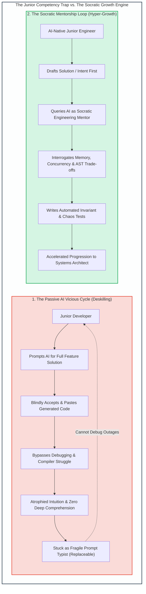
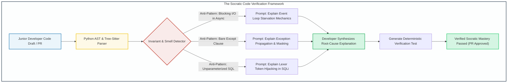

> **Prerequisite:** Familiarity with software engineering career progression, deliberate practice methodology, abstract syntax tree (AST) inspection, and code review principles.

> **Answer-first:** The Junior Engineer Paradox arises because AI coding assistants automate entry-level boilerplate tasks that traditionally built foundational engineering intuition. Junior developers must escape this trap by practicing active critical code review, studying compiler internals, and leveraging Socratic AI prompting rather than passive auto-completion. True mastery stems from deep first-principles comprehension rather than superficial syntax generation.

---

## 1. The Anatomy of the Junior Engineer Paradox

For four decades, the global software engineering industry relied on an implicit apprenticeship pipeline:
1. **Entry-Level / Junior (Years 1–3)**: Assigned to write repetitive CRUD endpoints, format database migrations, fix trivial frontend styling bugs, and write unit test stubs. Through thousands of hours of manual compilation errors, stack trace debugging, and senior engineer code review critiques, juniors developed visceral intuition for how computers execute instructions in memory.
2. **Mid-Level (Years 3–6)**: Designed sub-system modules, refactored domain boundaries, and handled concurrency.
3. **Senior / Principal Architect (Years 6+)**: Governed distributed systems design, data storage invariants, fault tolerance, and security boundaries.

Today, AI coding assistants (Claude Code, GitHub Copilot, Cursor) synthesize boilerplate CRUD endpoints, CSS flexbox rules, and mock stubs in fractions of a second. 

This technological leap creates **The Junior Engineer Paradox**:
*If generative AI completely automates the entry-level tasks that traditionally served as the training ground for junior developers, how will the software industry cultivate the next generation of senior system architects?*


```mermaid
flowchart TD
    subgraph JuniorParadoxLoop ["The Junior Competency Trap vs. The Socratic Growth Engine"]
        subgraph ViciousTrap ["1. The Passive AI Vicious Cycle (Deskilling)"]
            J1["Junior Developer"] --> PromptPaste["Prompts AI for Full Feature Solution"]
            PromptPaste --> BlindAccept["Blindly Accepts & Pastes Generated Code"]
            BlindAccept --> BypassedStruggle["Bypasses Debugging & Compiler Struggle"]
            BypassedStruggle --> AtrophiedIntuition["Atrophied Intuition & Zero Deep Comprehension"]
            AtrophiedIntuition --> ImposterStagnation["Stuck as Fragile Prompt Typist (Replaceable)"]
            ImposterStagnation -.->|Cannot Debug Outages| J1
        end

        subgraph VirtuousSocratic ["2. The Socratic Mentorship Loop (Hyper-Growth)"]
            J2["AI-Native Junior Engineer"] --> DraftCode["Drafts Solution / Intent First"]
            DraftCode --> SocraticQuery["Queries AI as Socratic Engineering Mentor"]
            SocraticQuery --> InterrogateAST["Interrogates Memory, Concurrency & AST Trade-offs"]
            InterrogateAST --> InvariantTesting["Writes Automated Invariant & Chaos Tests"]
            InvariantTesting --> AcceleratedArchitect["Accelerated Progression to Systems Architect"]
        end
    end

    style JuniorParadoxLoop fill:#fdfefe,stroke:#2c3e50,stroke-width:2px
    style ViciousTrap fill:#fadbd8,stroke:#e74c3c,stroke-width:2px
    style VirtuousSocratic fill:#d5f5e3,stroke:#27ae60,stroke-width:2px
```

If junior engineers merely become passive copy-paste conduits for LLM completions, their cognitive problem-solving muscles atrophy. When an inevitable production outage strikes that falls outside the training distribution of the model, they will be utterly incapable of diagnosing memory leaks, lock contentions, or corrupt network packets.

---

## 2. Breaking the Trap: The Socratic AI Mentorship Framework

The solution to the Junior Engineer Paradox is not to ban AI assistants, but to radically transform the developer's psychological posture: **Shift from passive code consumption to active Socratic interrogation**.

Instead of treating the AI as an outsourced code monkey, junior developers must treat the model as a tireless, 24/7 personal computer science tutor.


```mermaid
flowchart TD
    subgraph SocraticPipeline ["The Socratic Code Verification Framework"]
        DevCode["Junior Developer Code Draft / PR"] --> ASTParser["Python AST & Tree-Sitter Parser"]
        
        ASTParser --> InvariantEngine{"Invariant & Smell Detector"}
        
        InvariantEngine -->|"Anti-Pattern: Blocking I/O in Async"| SocraticPrompt1["Prompt: Explain Event Loop Starvation Mechanics"]
        InvariantEngine -->|"Anti-Pattern: Bare Except Clause"| SocraticPrompt2["Prompt: Explain Exception Propagation & Masking"]
        InvariantEngine -->|"Anti-Pattern: Unparameterized SQL"| SocraticPrompt3["Prompt: Explain Lexer Token Hijacking in SQLi"]

        SocraticPrompt1 --> InteractiveReflect["Developer Synthesizes Root-Cause Explanation"]
        SocraticPrompt2 --> InteractiveReflect
        SocraticPrompt3 --> InteractiveReflect

        InteractiveReflect --> StressTestGen["Generate Deterministic Verification Test"]
        StressTestGen --> PassGate["Verified Socratic Mastery Passed (PR Approved)"]
    end

    style SocraticPipeline fill:#fdfefe,stroke:#2c3e50,stroke-width:2px
    style DevCode fill:#ebf5fb,stroke:#2980b9,stroke-width:2px
    style ASTParser fill:#fef9e7,stroke:#f1c40f,stroke-width:2px
    style InvariantEngine fill:#f9ebea,stroke:#c0392b,stroke-width:2px
    style InteractiveReflect fill:#d5f5e3,stroke:#27ae60,stroke-width:2px
    style PassGate fill:#d5f5e3,stroke:#2ecc71,stroke-width:2px
```

### The Socratic Prompting Protocol
When reviewing code proposed by an AI assistant, junior engineers must execute the **Five Socratic Probes**:
1. **The Memory Allocation Probe**: *"Why did you use a heap-allocated slice instead of a fixed-size stack array here? What is the impact on garbage collector pause times under 10,000 requests per second?"*
2. **The Asynchronous Event Loop Probe**: *"If this third-party HTTP call takes 4 seconds to return, does it block the entire single-threaded event loop or delegate to a thread pool worker?"*
3. **The Concurrency & Invariant Probe**: *"What happens if two concurrent goroutines execute this check-then-act block at the exact same microsecond? Where is the mutual exclusion lock?"*
4. **The Database Query Plan Probe**: *"What is the explain-analyze execution plan for this query? Will PostgreSQL execute an Index Scan or fall back to an expensive Sequential Scan on 5 million rows?"*
5. **The Failure Mode Probe**: *"If the Redis cache cluster suddenly becomes unreachable, does this function fail gracefully with stale data or crash the HTTP process?"*

---

## 3. Production Python 3.12+ Socratic AST Verification Engine

The following Python 3.12+ engine directly inspects code submissions using Python's standard `ast` module. It identifies critical architectural anti-patterns (such as blocking I/O calls inside asynchronous coroutines, bare exception handling, and mutable default arguments), automatically generates Socratic interrogation challenges, and constructs executable verification unit tests.

```python
#!/usr/bin/env python3
"""
Production Socratic Code Review & Invariant Verification Engine.
Analyzes Python code submissions using standard Abstract Syntax Tree (AST) parsing.
Identifies subtle architectural anti-patterns, generates Socratic reflection prompts,
and creates executable pytest assertion harnesses.
"""

import ast
import inspect
from dataclasses import dataclass, field
from typing import List, Dict, Any, Optional

@dataclass
class CodeSmell:
    rule_id: str
    line: int
    col: int
    message: str
    socratic_question: str
    remediation_hint: str

class SocraticASTVisitor(ast.NodeVisitor):
    def __init__(self):
        self.smells: List[CodeSmell] = []
        self.in_async_func: bool = False
        self.current_func_name: Optional[str] = None

    def visit_AsyncFunctionDef(self, node: ast.AsyncFunctionDef):
        prev_async = self.in_async_func
        prev_func = self.current_func_name
        self.in_async_func = True
        self.current_func_name = node.name

        # Check for missing return type annotation
        if node.returns is None:
            self.smells.append(CodeSmell(
                rule_id="ARCH-TYPE-001",
                line=node.lineno,
                col=node.col_offset,
                message=f"Async function '{node.name}' is missing return type annotation.",
                socratic_question="Why do static type checkers require explicit return types on async coroutines?",
                remediation_hint="Add explicit return type: async def foo(...) -> ReturnType:"
            ))

        self.generic_visit(node)
        self.in_async_func = prev_async
        self.current_func_name = prev_func

    def visit_Call(self, node: ast.Call):
        # Detect synchronous blocking calls inside async functions
        if self.in_async_func:
            func_name = ""
            if isinstance(node.func, ast.Name):
                func_name = node.func.id
            elif isinstance(node.func, ast.Attribute):
                func_name = node.func.attr

            if func_name in ("sleep", "get", "post", "urlopen"):
                # Check if it is time.sleep or requests.get
                is_blocking = False
                if isinstance(node.func, ast.Attribute):
                    if isinstance(node.func.value, ast.Name) and node.func.value.id in ("time", "requests", "urllib"):
                        is_blocking = True

                if is_blocking:
                    self.smells.append(CodeSmell(
                        rule_id="PERF-ASYNC-BLOCK-002",
                        line=node.lineno,
                        col=node.col_offset,
                        message=f"Blocking synchronous call '{func_name}' detected inside async function '{self.current_func_name}'.",
                        socratic_question="What happens to other concurrent tasks on the asyncio event loop when a thread sleeps synchronously?",
                        remediation_hint="Use 'await asyncio.sleep()' or 'await httpx.AsyncClient().get()' instead."
                    ))

        self.generic_visit(node)

    def visit_ExceptHandler(self, node: ast.ExceptHandler):
        # Detect bare except or catching generic Exception
        if node.type is None:
            self.smells.append(CodeSmell(
                rule_id="RELIABILITY-EXCEPT-003",
                line=node.lineno,
                col=node.col_offset,
                message="Bare 'except:' handler discovered. Catches SystemExit, KeyboardInterrupt, and MemoryError.",
                socratic_question="Why is catching KeyboardInterrupt or GeneratorExit dangerous for process lifecycle management?",
                remediation_hint="Catch specific domain exceptions: except (KeyError, ValueError) as err:"
            ))
        elif isinstance(node.type, ast.Name) and node.type.id == "BaseException":
            self.smells.append(CodeSmell(
                rule_id="RELIABILITY-EXCEPT-004",
                line=node.lineno,
                col=node.col_offset,
                message="Catching 'BaseException' overrides Python runtime process termination signals.",
                socratic_question="How does BaseException differ from Exception in the Python exception hierarchy?",
                remediation_hint="Catch 'Exception' at the highest boundary, never 'BaseException'."
            ))

        self.generic_visit(node)

    def visit_FunctionDef(self, node: ast.FunctionDef):
        # Detect mutable default arguments (def foo(x=[]))
        for default in node.args.defaults:
            if isinstance(default, (ast.List, ast.Dict, ast.Set)):
                self.smells.append(CodeSmell(
                    rule_id="BUG-MUTABLE-DEFAULT-005",
                    line=default.lineno,
                    col=default.col_offset,
                    message=f"Mutable default argument detected in function '{node.name}'.",
                    socratic_question="When does Python evaluate function default argument expressions: at definition time or invocation time?",
                    remediation_hint="Use 'None' as default value and initialize inside function body: if x is None: x = []"
                ))

        self.generic_visit(node)

class SocraticMentorEngine:
    def __init__(self):
        pass

    def analyze_source(self, code_str: str) -> List[CodeSmell]:
        tree = ast.parse(code_str)
        visitor = SocraticASTVisitor()
        visitor.visit(tree)
        return visitor.smells

    def generate_verification_test(self, smell: CodeSmell) -> str:
        """Synthesize executable verification test proving why the bug occurs."""
        if smell.rule_id == "BUG-MUTABLE-DEFAULT-005":
            return (
                "def test_mutable_default_pollution():\n"
                "    # Proves default argument persists mutations across distinct invocations\n"
                "    res1 = target_function('first')\n"
                "    res2 = target_function('second')\n"
                "    assert res1 != res2, 'FATAL: State leaked between independent function calls!'"
            )
        elif smell.rule_id == "PERF-ASYNC-BLOCK-002":
            return (
                "import time, asyncio\n"
                "async def test_event_loop_concurrency():\n"
                "    start = time.perf_counter()\n"
                "    await asyncio.gather(target_async_func(), target_async_func())\n"
                "    elapsed = time.perf_counter() - start\n"
                "    assert elapsed < 1.5, 'FATAL: Execution was serialized instead of concurrent!'"
            )
        return "# Custom verification test required for rule " + smell.rule_id

def main():
    junior_code_sample = '''
import time

def process_ledger_entries(entries, log_history=[]):
    log_history.append(len(entries))
    return log_history

async def fetch_account_metrics(account_id):
    time.sleep(1.0) # Simulate network fetch
    try:
        data = {"balance": 1000}
    except:
        data = {}
    return data
'''
    engine = SocraticMentorEngine()
    smells = engine.analyze_source(junior_code_sample)

    print(f"=== Socratic Code Review Analysis: {len(smells)} Critical Invariants Flagged ===")
    for idx, s in enumerate(smells, 1):
        print(f"\n[{idx}] Violation: {s.rule_id} at line {s.line}:{s.col}")
        print(f"    Message:   {s.message}")
        print(f"    Socratic:  {s.socratic_question}")
        print(f"    Guidance:  {s.remediation_hint}")
        test_code = engine.generate_verification_test(s)
        print(f"    Assertion Test Harness:\n      " + "\n      ".join(test_code.splitlines()))

if __name__ == "__main__":
    main()
```

---

## 4. The 3-Tier Hierarchy of Software Engineering Knowledge

To navigate the new paradigm, junior developers must categorize technical concepts into three distinct tiers:

```
┌────────────────────────────────────────────────────────┐
│ Tier 3: Transitory Syntax (Automated by AI)           │
│ - CSS Flexbox/Grid syntax, Regex patterns, DTO maps   │
│ - Mechanical CRUD endpoints, HTML boilerplate          │
├────────────────────────────────────────────────────────┤
│ Tier 2: Mid-Level Architectural Contracts             │
│ - REST vs gRPC trade-offs, Database indexing schemes   │
│ - Redis caching policies (Cache-Aside, Write-Through) │
├────────────────────────────────────────────────────────┤
│ Tier 1: Eternal First Principles (Human Dominance)     │
│ - Memory models, Cache coherence & False Sharing      │
│ - Distributed consensus (Raft, Paxos, Quorums)         │
│ - Fault domain isolation & Circuit breaking           │
│ - CAP & PACELC consistency boundaries                 │
└────────────────────────────────────────────────────────┘
```

When an engineer focuses 80% of their study time on **Tier 1 (Eternal First Principles)**, their career becomes resilient against any advancement in artificial intelligence. An LLM might write the code, but only a human grounded in first principles can architect the system, debug race conditions, and certify production readiness.

---

## 5. Comparative Matrix: Traditional Junior vs. AI-Native Junior

| Dimension | Traditional Junior Developer | AI-Native Junior Engineer |
| :--- | :--- | :--- |
| **Learning Methodology** | Trial-and-error typing & Google search | Socratic AST interrogation & guided reflection |
| **Daily Time Spent Typing**| 70% to 80% of daily working hours | Under 15% (Focus is on verification & design) |
| **System Design Exposure** | Delayed until Year 3 or Year 4 | Exposed from Day 1 via architectural breakdown |
| **Code Review Cycle** | Waits 24–48 hours for senior engineer comments | Instant, continuous local Socratic critique |
| **Production Incident Role**| Passive spectator on emergency incident bridges | Active investigator tracing OpenTelemetry spans |
| **Time to Senior Level** | Historically 5 to 7 years | Accelerated to 2 to 3 years of deliberate practice |

---

## 6. Deliberate Practice Protocol for Junior Developers

How does an aspiring engineer execute deliberate practice in 2026?

1. **The "Clean Room" Verification Exercise**: After an AI assistant generates a complex algorithmic function, delete the implementation completely. Reconstruct the algorithm from memory using only the unit tests as your specification.
2. **Failure Injection Drilling**: Intentionally introduce faults into AI-generated code—corrupt a network payload, drop database connections, inject concurrent race conditions—and observe how the system degrades.
3. **Compiler Diagnostics & Disassembly**: Inspect the generated assembly or intermediate bytecode (`go tool compile -S`, `python -m dis`). Understand how high-level abstractions map down to registers, CPU caches, and heap allocations.

### The Codebase Archaeology Method: Reverse-Engineering Legacy Systems
One of the most effective techniques for junior engineers to develop deep architectural intuition is the Codebase Archaeology Method. Select a battle-tested open-source system (such as SQLite, Redis, or NATS). Do not use AI to generate summaries. Instead, clone the repository, check out the earliest stable release (e.g., Redis v1.0), and read through the source code file by file. Trace how network events trigger read callbacks, how memory buffers are allocated and resized, and how error conditions are handled. Then, formulate hypotheses regarding how subsequent versions scaled concurrency and storage, verifying your hypotheses by inspecting later git tags. This practice builds visceral empathy for real-world engineering constraints that synthetic AI completions can never convey.

### The Chaos Monkey PR Routine: Adversarial Testing on AI Code
Whenever an autonomous AI agent or coding assistant generates a pull request, junior engineers should perform an adversarial review drill known as the Chaos Monkey PR Routine. Ask: *If I were an attacker or a hostile network environment, how would I crash this code?* Inject network latency simulations, introduce concurrent write contention across multiple client threads, pass malformed UTF-8 payloads, and verify whether the system degrades gracefully or crashes with an unhandled panic. Writing explicit mutation tests and fuzzing harnesses against AI-generated PRs transforms the junior developer from a vulnerable consumer into an authoritative guardian of software quality.

---

## 7. Related Architectural Pillars & Internal Guidance

To advance your understanding of distributed engineering, Golang microservices, and AI-native applications:

- Master production Golang architecture with DDD: **[Architecting 21-Service Go Microservices with DDD](/posts/go-microservices/)**
- Implement AI user interfaces with MCP: **[Generative UI with Model Context Protocol (MCP)](/posts/generative-ui-with-mcp-ai-native-frontend/)**
- Explore foundational developer roadmaps: **[Engineering Reading Map & Curated Guides](/reading-map/)**

---

## 8. Frequently Asked Questions (FAQ)


Debugging intuition is developed through active fault injection, tracing, and hypothesis testing. Rather than passively accepting generated code, junior developers must profile execution paths, step through breakpoints in debuggers, and use tools like OpenTelemetry and Linux eBPF to observe real kernel and network interactions under load.



It eliminates hiring for passive code typists, but vastly increases the demand for AI-native systems thinkers. Engineering organizations in 2026 seek junior developers who can supervise multi-agent swarms, design deterministic validation tests, and understand distributed systems principles from their first month on the job.



"Do not write the final code yet. Explain the architectural trade-offs between three alternative design approaches for this problem, identify where concurrency race conditions could occur, and formulate a Socratic question testing my understanding of the data structure choice."



Syntax frameworks change constantly and are easily memorized and generated by Large Language Models. In contrast, runtime fundamentals—such as memory layout, stack vs. heap allocation, CPU cache lines, and event loop concurrency—govern software performance universally across all languages and will never be obsolete.

