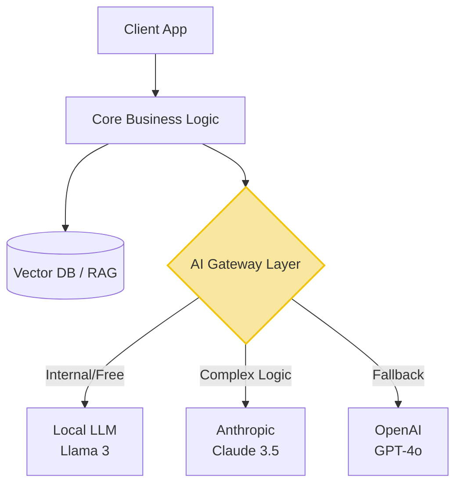

---

title: "Part 9 — LLM Integration: The Mindset of Building AI-Native Applications"
date: "2026-05-10T16:20:00+07:00"
lastmod: "2026-05-10T16:20:00+07:00"
draft: false
description: "Transitioning from using AI to write code to putting AI at the heart of the product. LLM-Agnostic architecture and RAG in practice."
ShowToc: true
TocOpen: true
weight: 10
categories: ["Series", "Software Engineering"]
tags: ["AI", "System Design", "Career"]
cover:
  image: "images/posts/ai-native-frontend-cover.png"
  alt: "AI-Driven Engineer series: evolving from code typist to AI-native software architect"
  relative: false
author: "Lê Tuấn Anh"
canonicalURL: "https://tanhdev.com/series/ai-driven-engineer/part-9-building-ai-native-architecture/"
mermaid: true
---

In the previous 8 parts, we dissected using AI as a **Tool** to assist programmers. We explored the [death of syntax memorization](/series/ai-driven-engineer/part-1-the-death-of-code-typists/), the [boundaries of responsibility](/series/ai-driven-engineer/part-2-man-vs-machine-boundaries/), navigated [AI review fatigue](/series/ai-driven-engineer/part-3-the-10x-productivity-reality/) and [legal landmines](/series/ai-driven-engineer/part-5-the-bod-perspective-risk-and-privacy/), and established the need for [Orchestration](/series/ai-driven-engineer/part-6-from-coder-to-orchestrator/) and [System Design](/series/ai-driven-engineer/part-7-system-design-survival/). But in this final part, we will flip the script entirely.

The ultimate mission of a System Architect (AI-Driven Architect) is not just coding faster, but **putting AI as the "heart" of the very product they are building**. We call this **AI-Native Application** architecture.

## AI-Bolted-on vs AI-Native

The market today is flooded with "AI-Bolted-on" applications. These are clunky old systems where devs slap an "AI Q&A" chatbox in the corner calling the ChatGPT API, and self-label it an "AI Product". This approach provides very low value and is easily copied by competitors.

A true **AI-Native** application must be rethought from the core:
- Instead of forcing the User to click through 5 menus to filter last month's order list, the User just types a sentence. The AI system (acting as a Router) automatically uses Function Calling to fetch data from the Database, draws a completely dynamic chart UI (Generative UI), and displays it to the User.
- Here, AI is not a "side feature", but AI is the **Control Layer** replacing dozens of traditional `if/else` branching flows.

> **[Case Study] [Klarna's AI-Native System](https://www.klarna.com/international/press/klarna-ai-assistant-handles-two-thirds-of-customer-service-chats-in-its-first-month/):** To see the power of AI-Native, look at the application of the Fintech company Klarna (Sweden). They deeply integrated LLMs into their internal system. The result: AI handled 2.3 million calls (equivalent to the workload of 700 full-time agents). Even more terrifying, customer problem Resolution Time **dropped from 11 minutes to just 2 minutes**, with accuracy comparable to humans. This is not an "assistive tool", this is a structural replacement of personnel.

## The Weapons of AI-Native: RAG and Agentic Workflows

To build AI-Native, programmers must master entirely new architectural concepts:

1. **RAG (Retrieval-Augmented Generation):** An LLM (like GPT-4) knows nothing about your company's internal data. Architects must know how to set up a Vector Database system (like Pinecone, Milvus) to turn the company's massive data warehouse into "context" injected into the AI's brain in real-time before it answers the user.
2. **Agentic Workflows:** It doesn't stop at AI answering in text; you must design systems where AI has the right to take **Action**. For example: AI reads a customer complaint email $\rightarrow$ automatically looks up the tracking code $\rightarrow$ calls the refund API $\rightarrow$ sends an apology email. Programmers must design extremely strict Guardrails so this AI doesn't "arbitrarily refund $1 billion" due to a hallucination.

## LLM-Agnostic Architecture: "Immunity" to Monopoly Traps

This is one of the most vital Architectural decisions an AI-Driven Engineer must make.

**The Problem (Vendor Lock-in):** If you hard-code your entire backend to directly call OpenAI's API (ChatGPT). The risk is: Tomorrow OpenAI triples their prices, or that model is removed, or laws demand your medical data cannot be sent overseas. Your system will be completely paralyzed.

**The Solution - LLM-Agnostic Architecture:**
You must design a system "immune" to the whims of AI giants. The core of it is building an **Abstraction Layer / AI Gateway** sitting between your Business Logic and the AI providers.



*   Your core system does not communicate directly with OpenAI or Anthropic. It communicates with the internal AI Gateway layer (or tools like LiteLLM).
*   This Gateway layer acts as a dispatcher: If it's a casual chat question $\rightarrow$ Calls Llama 3 API (Free, runs internally). If it's a complex logic analysis problem $\rightarrow$ Calls Claude 3.5 Sonnet API.
*   **Result:** Thanks to this architecture, if a cheaper and smarter AI model appears tomorrow, you only need to change 1 config line in the Gateway layer. The millions of lines of application logic code continue to run normally. The Enterprise fully controls the game.

## Conclusion to a Historic Roadmap

We have reached the end of **The AI-Driven Engineer: From Code Typist to Next-Generation System Architect** Roadmap.

> 🚀 **Ready for the next step?** Now that you've mastered the mindset, it's time to build the actual infrastructure. Continue your journey in Phase 2: **[The AI-Driven Engineer: Enterprise Playbook](/series/ai-driven-playbook/)**, where we get hands-on with AI Gateways, Enterprise RAG, and Agentic CI/CD pipelines.

Software industry history has witnessed many massive transformations: From writing Assembly code to C++, from physical servers to Cloud Computing. And now, we are in the midst of the greatest transition of all: The rise of Artificial Intelligence.

In this battle, AI will sweep away mechanical "Code Typists", those who are lazy to think, and those who refuse to change. But simultaneously, AI places into your hands **the power of an entire miniature engineering team**.

If you know how to inject context, master System Design, firmly validate architecture, and build agnostic AI-Native applications... You will not just survive. You will become Invaluable Engineers leading the next era of technology.

Thank you for joining this Roadmap. It's time to close the reading tab, open your IDE, and start "orchestrating" your own swarm of AI!

---
### 🛠 Practical Exercise: Experience an AI Gateway
1. **Challenge:** Avoid Vendor Lock-in for your next side project.
2. **Action:** Instead of calling the `openai` SDK directly in Node.js/Python, install an AI Gateway like [LiteLLM](https://docs.litellm.ai/). Configure it so that when you pass the model name `"gpt-4o"`, it routes to OpenAI, and `"claude-3-5"` routes to Anthropic, all using the exact same API format.
3. **Analysis:** You have just successfully implemented the Abstraction Layer pattern!

### 📚 External Resources & Tooling
- **AI Gateway Libraries:** [LiteLLM](https://github.com/BerriAI/litellm) (Standardize API formats), [LangChain](https://www.langchain.com/) / [LlamaIndex](https://www.llamaindex.ai/) (For RAG frameworks).
- **Architecture Trends:** [a16z: Emerging Architectures for LLM Applications](https://a16z.com/emerging-architectures-for-llm-applications/).

---
💬 **Discussion Corner:** The mindset shift from "Code Typist" to "System Architect" does not happen overnight. What is the biggest barrier preventing you from deeply integrating AI into your current product's core (becoming AI-Native)? Technical difficulties (Vector DB/RAG) or management barriers? Leave a comment!


### Go Vector DB Semantic Search Client

AI-native applications retrieve business context by querying vector databases. Below is a mock vector similarity retrieval client.

```go
package main

import (
	"bytes"
	"fmt"
	"net/http"
)

type VectorClient struct {
	URL string
}

func (vc *VectorClient) QuerySimilarDocuments(embedding []float32) int {
	// Send raw bytes representing embedding float slice to search REST api
	buf := new(bytes.Buffer)
	resp, err := http.Post(vc.URL+"/search", "application/octet-stream", buf)
	if err != nil {
		return 500
	}
	defer resp.Body.Close()
	return resp.StatusCode
}

func main() {
	client := &VectorClient{URL: "http://vector-db.local"}
	status := client.QuerySimilarDocuments([]float32{0.1, 0.44, -0.9})
	fmt.Printf("Vector database response status: %d\n", status)
}
```

### Layout of an AI-Native Retrieval Stack
AI-native architectures are structured around data pipelines:
- **Ingestion Pipeline:** Parse, chunk, and embed source documents using embedding models.
- **Vector Storage:** Index vectors in high-performance index graphs (HNSW).
- **Retrieval Engine:** Query vector DBs to fetch relevant source context.
- **Generative Loop:** Feed retrieved context into LLMs to synthesize answers.
- **Evaluation Loop:** Measure retrieval quality and accuracy in real time.

### Technical Appendix: HNSW Index Sizing & Cosine Similarity Metrics
To design scalable semantic search indexes:
- **HNSW Graph Construction:** Configure HNSW index parameters like `M` (max connection links per node) and `efConstruction` (size of dynamic candidate list during build) to balance recall accuracy and search latency.
- **Distance Metrics Selection:** Use Cosine Similarity or Dot Product metrics to compare floating-point embeddings depending on normalized vector length.
- **Memory Calculations:** Calculating RAM needed for vectors:
  - 1,000,000 documents with 1,536-dimensional embeddings using 32-bit floats.
  - Size per vector: 1,536 * 4 bytes = 6 KB.
  - Base memory: 1,000,000 * 6 KB = 6 GB.
  - Plus 50-100% graph overhead for HNSW: ~12 GB of RAM required, which must be partitioned and co-located to prevent page faults during execution.


## Operational Context: Part 9 Building Ai Native Architecture Appendix

### KPI Tracking and Code Quality Metrics
To evaluate the impact of AI-assisted development, track code quality indicators in the CI pipeline. Monitor the change lead time (from commit to production) alongside the code churn rate (lines deleted within 7 days). A rising churn rate indicates hallucinated patterns, requiring adjustment of the prompt templates.


## Operational Context: Part 9 Building Ai Native Architecture Appendix

### Sandbox Container Isolation and Security Profiles
Running code generated by AI models requires isolated runtimes. Deploy sandboxed containers utilizing kernel virtualization (like gVisor). Restrict container CPU shares and block internet access to prevent execution of unauthorized commands or network requests.


<div style="display: flex; justify-content: space-between; margin-top: 2rem;">
  <div><a href="/series/ai-driven-engineer/part-8-the-junior-paradox/">← Previous: Part 8</a></div>
  <div><a href="/series/ai-driven-playbook/">Explore the Playbook Series →</a></div>
</div>
