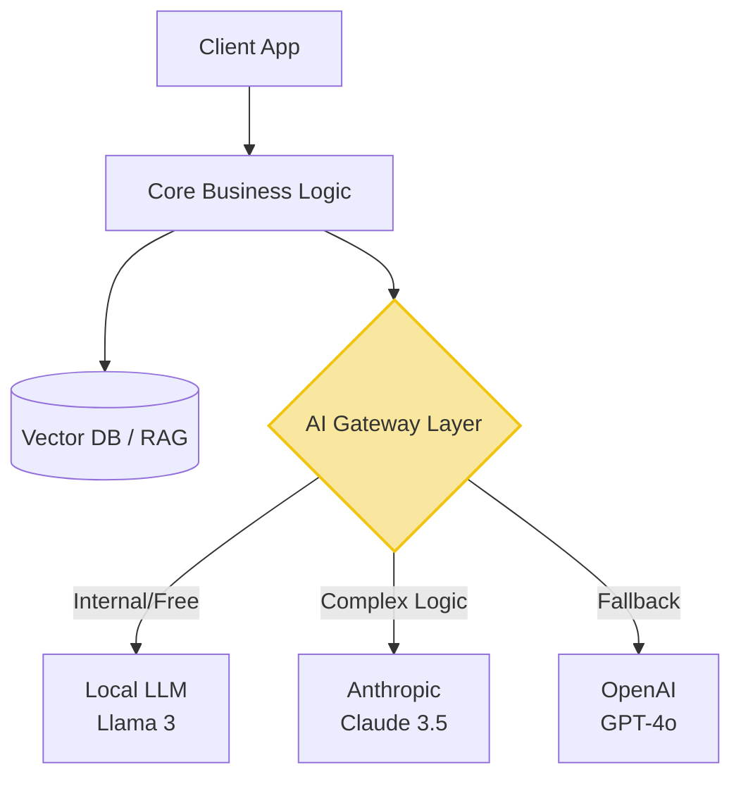

In the previous 8 parts, we dissected using AI as a **Tool** to assist programmers (boosting productivity, testing code, handling legacy). But in this final part, we will flip the script.

The ultimate mission of a System Architect (AI-Driven Architect) is not just coding faster, but **putting AI as the "heart" of the very product they are building**. We call this **AI-Native Application** architecture.

## AI-Bolted-on vs AI-Native

The market today is flooded with "AI-Bolted-on" applications. These are clunky old systems where devs slap an "AI Q&A" chatbox in the corner calling the ChatGPT API, and self-label it an "AI Product". This approach provides very low value and is easily copied by competitors.

A true **AI-Native** application must be rethought from the core:
- Instead of forcing the User to click through 5 menus to filter last month's order list, the User just types a sentence. The AI system (acting as a Router) automatically uses Function Calling to fetch data from the Database, draws a completely dynamic chart UI (Generative UI), and displays it to the User.
- Here, AI is not a "side feature", but AI is the **Control Layer** replacing dozens of traditional `if/else` branching flows.

> **[Case Study] [Klarna's AI-Native System](https://www.klarna.com/international/press/klarna-ai-assistant-handles-two-thirds-of-customer-service-chats-in-its-first-month/):** To see the power of AI-Native, look at the application of the Fintech company Klarna (Sweden). They deeply integrated LLMs into their internal system. The result: AI handled 2.3 million calls (equivalent to the workload of 700 full-time agents). Even more terrifying, customer problem Resolution Time **dropped from 11 minutes to just 2 minutes**, with accuracy comparable to humans. This is not an "assistive tool", this is a structural replacement of personnel.

## The Weapons of AI-Native: RAG and Agentic Workflows

To build AI-Native, programmers must master entirely new architectural concepts:

1. **RAG (Retrieval-Augmented Generation):** An LLM (like GPT-4) knows nothing about your company's internal data. Architects must know how to set up a Vector Database system (like Pinecone, Milvus) to turn the company's massive data warehouse into "context" injected into the AI's brain in real-time before it answers the user.
2. **Agentic Workflows:** It doesn't stop at AI answering in text; you must design systems where AI has the right to take **Action**. For example: AI reads a customer complaint email $\rightarrow$ automatically looks up the tracking code $\rightarrow$ calls the refund API $\rightarrow$ sends an apology email. Programmers must design extremely strict Guardrails so this AI doesn't "arbitrarily refund $1 billion" due to a hallucination.

## LLM-Agnostic Architecture: "Immunity" to Monopoly Traps

This is one of the most vital Architectural decisions an AI-Driven Engineer must make.

**The Problem (Vendor Lock-in):** If you hard-code your entire backend to directly call OpenAI's API (ChatGPT). The risk is: Tomorrow OpenAI triples their prices, or that model is removed, or laws demand your medical data cannot be sent overseas. Your system will be completely paralyzed.

**The Solution - LLM-Agnostic Architecture:**
You must design a system "immune" to the whims of AI giants. The core of it is building an **Abstraction Layer / AI Gateway** sitting between your Business Logic and the AI providers.

*   Your core system does not communicate directly with OpenAI or Anthropic. It communicates with the internal AI Gateway layer (or tools like LiteLLM).
*   This Gateway layer acts as a dispatcher: If it's a casual chat question $\rightarrow$ Calls Llama 3 API (Free, runs internally). If it's a complex logic analysis problem $\rightarrow$ Calls Claude 3.5 Sonnet API.
*   **Result:** Thanks to this architecture, if a cheaper and smarter AI model appears tomorrow, you only need to change 1 config line in the Gateway layer. The millions of lines of application logic code continue to run normally. The Enterprise fully controls the game.

## Conclusion to a Historic Roadmap

We have reached the end of **The AI-Driven Engineer: From Code Typist to Next-Generation System Architect** Roadmap.

Software industry history has witnessed many massive transformations: From writing Assembly code to C++, from physical servers to Cloud Computing. And now, we are in the midst of the greatest transition of all: The rise of Artificial Intelligence.

In this battle, AI will sweep away mechanical "Code Typists", those who are lazy to think, and those who refuse to change. But simultaneously, AI places into your hands **the power of an entire miniature engineering team**.

If you know how to inject context, master System Design, firmly validate architecture, and build agnostic AI-Native applications... You will not just survive. You will become Invaluable Engineers leading the next era of technology.

Thank you for joining this Roadmap. It's time to close the reading tab, open your IDE, and start "orchestrating" your own swarm of AI!

---
💬 **Discussion Corner:** The mindset shift from "Code Typist" to "System Architect" does not happen overnight. What is the biggest barrier preventing you from deeply integrating AI into your current product's core (becoming AI-Native)? Technical difficulties (Vector DB/RAG) or management barriers? Leave a comment!
