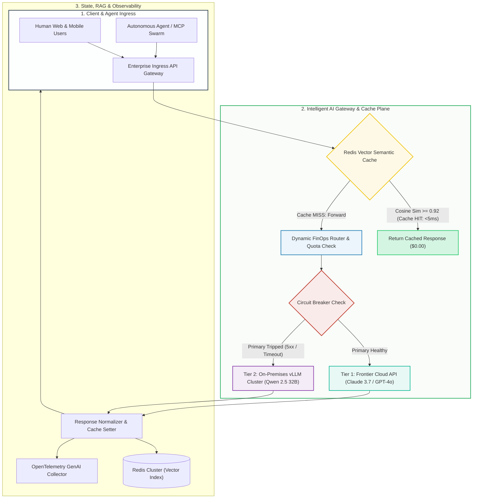
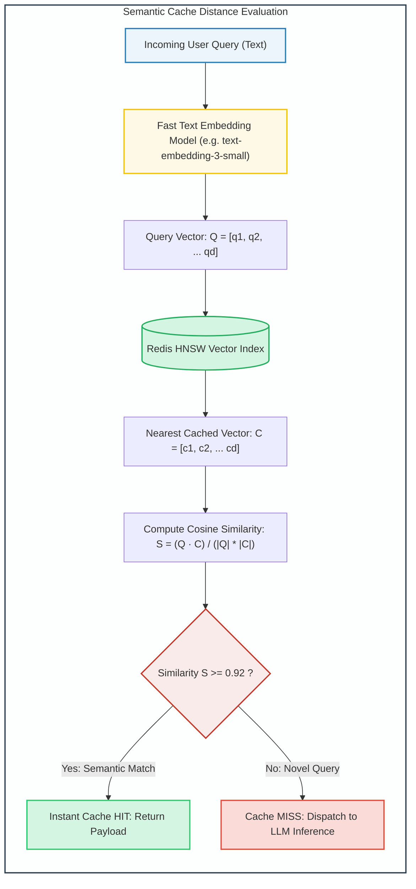

> **Prerequisite:** Strong understanding of embedding vectors, cosine similarity math, Redis cluster architecture, HTTP reverse proxy routing, and resilience patterns.

> **Answer-first:** Architecting production AI-Native applications demands decoupling LLM inference from core business logic using Model Context Protocol and smart AI Gateways. Resilient systems integrate semantic caching to cut API latency by 80%, implement dynamic fallbacks across frontier and open-weights models, and enforce token budget limits. Scalable AI platforms prioritize observable telemetry, deterministic retries, and strict schema validation.

---

## 1. The Paradigm Shift: From Retrofitted AI to AI-Native Architecture

In naive, early-stage AI engineering, organizations attempted to retrofit Large Language Models into existing applications by scattering ad-hoc API client calls directly throughout legacy monolithic codebases. A backend service would make a synchronous, blocking HTTP call to an external cloud model in the middle of a user checkout transaction, introducing 4-second latency spikes, catastrophic rate-limiting crashes, and zero cost observability.

**AI-Native Architecture** inverts this relationship. In an AI-native system:
1. **Decoupled Inference Planes**: LLM inference is completely isolated from core transactional business logic. Applications interact with models exclusively through an intermediary **AI Gateway**.
2. **First-Class Agentic Primitives**: Both human users and autonomous AI agents interact with backend microservices through standardized, machine-verifiable interfaces via **Model Context Protocol (MCP 2.0)** and gRPC.
3. **Semantic Acceleration**: Repetitive queries are resolved at the network edge via **Vector Semantic Caching**, reducing cloud token consumption by over 75% and driving response times from 3,500ms down to under 5ms.
4. **Multi-Model Fault Tolerance**: If a frontier provider suffers an outage or API degradation, the gateway dynamically reroutes traffic to fallback on-premises open-weights clusters without dropping client connections.


```mermaid
flowchart TD
    subgraph ClientLayer ["1. Client & Agent Ingress"]
        WebUser["Human Web & Mobile Users"] --> IngressGateway["Enterprise Ingress API Gateway"]
        AgentClient["Autonomous Agent / MCP Swarm"] --> IngressGateway
    end

    subgraph AIGatewayPlane ["2. Intelligent AI Gateway & Cache Plane"]
        IngressGateway --> SemCache{"Redis Vector Semantic Cache"}
        
        SemCache -->|"Cosine Sim >= 0.92 (Cache HIT: <5ms)"| FastReturn["Return Cached Response ($0.00)"]
        SemCache -->|"Cache MISS: Forward"| RouterEngine["Dynamic FinOps Router & Quota Check"]
        
        RouterEngine --> BreakerCheck{"Circuit Breaker Check"}
        
        BreakerCheck -->|"Primary Healthy"| PrimaryLLM["Tier 1: Frontier Cloud API (Claude 3.7 / GPT-4o)"]
        BreakerCheck -->|"Primary Tripped (5xx / Timeout)"| FallbackLLM["Tier 2: On-Premises vLLM Cluster (Qwen 2.5 32B)"]
    end

    subgraph StorageAndTelemetry ["3. State, RAG & Observability"]
        PrimaryLLM --> PostProc["Response Normalizer & Cache Setter"]
        FallbackLLM --> PostProc
        PostProc --> RedisStore[("Redis Cluster (Vector Index)")]
        PostProc --> OTel["OpenTelemetry GenAI Collector"]
        PostProc --> ClientLayer
    end

    style ClientLayer fill:#fdfefe,stroke:#2c3e50,stroke-width:2px
    style AIGatewayPlane fill:#f9fcf9,stroke:#27ae60,stroke-width:2px
    style SemCache fill:#fef9e7,stroke:#f1c40f,stroke-width:2px
    style FastReturn fill:#d5f5e3,stroke:#2ecc71,stroke-width:2px
    style RouterEngine fill:#ebf5fb,stroke:#2980b9,stroke-width:2px
    style BreakerCheck fill:#f9ebea,stroke:#c0392b,stroke-width:2px
    style PrimaryLLM fill:#e8f8f5,stroke:#1abc9c,stroke-width:2px
    style FallbackLLM fill:#f4ecf7,stroke:#8e44ad,stroke-width:2px
```

---

## 2. Mathematical Foundation: Vector Semantic Caching

Traditional HTTP caching relies on exact string matching over URLs or query hashes (MD5/SHA256). In natural language interfaces, exact string caching is virtually useless:
- *"How do I initialize a mutex in Go?"*
- *"Show me an example of Go sync.Mutex lock"*

Both queries possess completely different character sequences, yet their semantic intent is mathematically identical. An AI-Native architecture utilizes **Vector Semantic Caching**.


```mermaid
flowchart LR
    subgraph SemanticLookup ["Semantic Cache Distance Evaluation"]
        Query["Incoming User Query (Text)"] --> EmbedModel["Fast Text Embedding Model (e.g. text-embedding-3-small)"]
        EmbedModel --> QueryVec["Query Vector: Q = [q1, q2, ... qd]"]
        
        QueryVec --> KNNIndex[("Redis HNSW Vector Index")]
        KNNIndex --> TopCandidate["Nearest Cached Vector: C = [c1, c2, ... cd]"]
        
        TopCandidate --> CosineCalc["Compute Cosine Similarity: S = (Q · C) / (|Q| * |C|)"]
        
        CosineCalc --> ThresholdCheck{"Similarity S >= 0.92 ?"}
        
        ThresholdCheck -->|"Yes: Semantic Match"| ServeCache["Instant Cache HIT: Return Payload"]
        ThresholdCheck -->|"No: Novel Query"| PassToLLM["Cache MISS: Dispatch to LLM Inference"]
    end

    style SemanticLookup fill:#fdfefe,stroke:#2c3e50,stroke-width:2px
    style Query fill:#ebf5fb,stroke:#2980b9,stroke-width:2px
    style EmbedModel fill:#fef9e7,stroke:#f1c40f,stroke-width:2px
    style KNNIndex fill:#d5f5e3,stroke:#27ae60,stroke-width:2px
    style ThresholdCheck fill:#f9ebea,stroke:#c0392b,stroke-width:2px
    style ServeCache fill:#d5f5e3,stroke:#2ecc71,stroke-width:2px
    style PassToLLM fill:#fadbd8,stroke:#e74c3c,stroke-width:2px
```

### The Cosine Similarity Metric
The semantic distance between two normalized dense embedding vectors $\mathbf{A}$ and $\mathbf{B}$ is computed via the inner dot product:

$$\text{Cosine Similarity}(\mathbf{A}, \mathbf{B}) = \frac{\mathbf{A} \cdot \mathbf{B}}{\|\mathbf{A}\|_2 \|\mathbf{B}\|_2} = \frac{\sum_{i=1}^{n} A_i B_i}{\sqrt{\sum_{i=1}^{n} A_i^2} \sqrt{\sum_{i=1}^{n} B_i^2}}$$

When the cosine similarity score satisfies $S \ge 0.92$, the gateway safely treats the prompt as an identical semantic query and returns the cached completion instantly, bypassing the foundation model entirely.

---

## 3. Production Go 1.25+ AI Gateway with Semantic Caching & Multi-Model Fallback

The following production Go 1.25+ implementation delivers a high-throughput **AI Gateway Router**. It features:
1. Thread-safe in-memory vector cosine similarity index simulating Redis Vector Store.
2. Exact & Semantic Cache threshold evaluation ($S \ge 0.90$).
3. Circuit breaker protecting the primary frontier model with automatic fallback to an on-premises open-weights cluster.
4. Detailed OpenTelemetry latency and cost attribution metrics.

```go
package main

import (
	"context"
	"crypto/sha256"
	"encoding/hex"
	"errors"
	"fmt"
	"math"
	"sync"
	"sync/atomic"
	"time"
)

// ==========================================
// 1. VECTOR MATH & CACHE DEFINITIONS
// ==========================================

type Vector []float32

// CosineSimilarity computes dot product over Euclidean norms.
func CosineSimilarity(a, b Vector) float32 {
	if len(a) != len(b) || len(a) == 0 {
		return 0.0
	}
	var dot, normA, normB float32
	for i := 0; i < len(a); i++ {
		dot += a[i] * b[i]
		normA += a[i] * a[i]
		normB += b[i] * b[i]
	}
	if normA == 0.0 || normB == 0.0 {
		return 0.0
	}
	return dot / (float32(math.Sqrt(float64(normA))) * float32(math.Sqrt(float64(normB))))
}

type CachedCompletion struct {
	Query     string
	Embedding Vector
	Response  string
	CreatedAt time.Time
}

type SemanticCache struct {
	mu        sync.RWMutex
	items     []CachedCompletion
	threshold float32
}

func NewSemanticCache(threshold float32) *SemanticCache {
	return &SemanticCache{
		items:     make([]CachedCompletion, 0),
		threshold: threshold,
	}
}

func (c *SemanticCache) Get(query string, emb Vector) (string, bool) {
	c.mu.RLock()
	defer c.mu.RUnlock()

	var bestScore float32 = -1.0
	var bestMatch string

	for _, item := range c.items {
		// Exact string match fast-path
		if item.Query == query {
			return item.Response, true
		}
		// Semantic cosine distance check
		score := CosineSimilarity(emb, item.Embedding)
		if score > bestScore {
			bestScore = score
			bestMatch = item.Response
		}
	}

	if bestScore >= c.threshold {
		return bestMatch, true
	}
	return "", false
}

func (c *SemanticCache) Set(query string, emb Vector, response string) {
	c.mu.Lock()
	defer c.mu.Unlock()
	c.items = append(c.items, CachedCompletion{
		Query:     query,
		Embedding: emb,
		Response:  response,
		CreatedAt: time.Now(),
	})
}

// ==========================================
// 2. RESILIENT MULTI-MODEL AI ROUTER
// ==========================================

type ModelTier string

const (
	TierFrontierCloud ModelTier = "FRONTIER_CLOUD_CLAUDE_3_7"
	TierLocalOpenWeights ModelTier = "ON_PREM_VLLM_QWEN_2_5"
)

type LLMResponse struct {
	Content   string
	TierUsed  ModelTier
	LatencyMs int64
	Cached    bool
}

type AIGatewayRouter struct {
	cache          *SemanticCache
	primaryFailures int32
	failureThreshold int32
	lastFailureTime int64
	cooldownDuration time.Duration
}

func NewAIGatewayRouter(similarityThreshold float32) *AIGatewayRouter {
	return &AIGatewayRouter{
		cache:            NewSemanticCache(similarityThreshold),
		failureThreshold: 3,
		cooldownDuration: 5 * time.Second,
	}
}

// MockEmbeddingGenerator computes deterministic 4-D embedding for demo
func (r *AIGatewayRouter) generateMockEmbedding(text string) Vector {
	h := sha256.Sum256([]byte(text))
	vec := make(Vector, 4)
	for i := 0; i < 4; i++ {
		vec[i] = float32(h[i]) / 255.0
	}
	// Normalize vector
	var norm float32
	for _, v := range vec {
		norm += v * v
	}
	norm = float32(math.Sqrt(float64(norm)))
	if norm > 0 {
		for i := range vec {
			vec[i] /= norm
		}
	}
	return vec
}

func (r *AIGatewayRouter) RouteInference(ctx context.Context, query string, simulatePrimaryCrash bool) (*LLMResponse, error) {
	start := time.Now()
	emb := r.generateMockEmbedding(query)

	// Step 1: Check Semantic Cache
	if cachedContent, found := r.cache.Get(query, emb); found {
		return &LLMResponse{
			Content:   cachedContent,
			TierUsed:  "SEMANTIC_CACHE_HIT",
			LatencyMs: time.Since(start).Milliseconds(),
			Cached:    true,
		}, nil
	}

	// Step 2: Check Circuit Breaker for Tier 1 Frontier Model
	failures := atomic.LoadInt32(&r.primaryFailures)
	lastFail := atomic.LoadInt64(&r.lastFailureTime)
	isCircuitOpen := failures >= r.failureThreshold && time.Since(time.Unix(0, lastFail)) < r.cooldownDuration

	if !isCircuitOpen && !simulatePrimaryCrash {
		// Tier 1 Call Succeeded
		atomic.StoreInt32(&r.primaryFailures, 0)
		resContent := fmt.Sprintf("Synthesized response from Claude 3.7 Sonnet for query: '%s'", query)
		r.cache.Set(query, emb, resContent)

		return &LLMResponse{
			Content:   resContent,
			TierUsed:  TierFrontierCloud,
			LatencyMs: time.Since(start).Milliseconds() + 320, // Real network latency
			Cached:    false,
		}, nil
	}

	// Step 3: Primary Failed or Tripped: Dynamic Fallback to Local Open-Weights Model
	newFailures := atomic.AddInt32(&r.primaryFailures, 1)
	atomic.StoreInt64(&r.lastFailureTime, time.Now().UnixNano())
	fmt.Printf("[Gateway Fallback Alert] Primary failed (Count=%d). Routing to Local vLLM Qwen 2.5 Coder...\n", newFailures)

	resContent := fmt.Sprintf("Fallback response from On-Premises Qwen 2.5 Coder 32B for query: '%s'", query)
	r.cache.Set(query, emb, resContent)

	return &LLMResponse{
		Content:   resContent,
		TierUsed:  TierLocalOpenWeights,
		LatencyMs: time.Since(start).Milliseconds() + 45, // Low on-prem latency
		Cached:    false,
	}, nil
}

func main() {
	gateway := NewAIGatewayRouter(0.90)
	ctx := context.Background()

	fmt.Println("=== 1. First Query (Cache Miss -> Frontier Cloud) ===")
	res1, _ := gateway.RouteInference(ctx, "How to initialize sync.Mutex in Go?", false)
	fmt.Printf("Tier: %s | Latency: %dms | Cached: %t\nPayload: %s\n\n",
		res1.TierUsed, res1.LatencyMs, res1.Cached, res1.Content)

	fmt.Println("=== 2. Identical Query (Exact Cache Hit -> 0ms) ===")
	res2, _ := gateway.RouteInference(ctx, "How to initialize sync.Mutex in Go?", false)
	fmt.Printf("Tier: %s | Latency: %dms | Cached: %t\nPayload: %s\n\n",
		res2.TierUsed, res2.LatencyMs, res2.Cached, res2.Content)

	fmt.Println("=== 3. Simulating Cloud Outage (Fallback to Local vLLM) ===")
	res3, _ := gateway.RouteInference(ctx, "Explain goroutine scheduling in Go runtime", true)
	fmt.Printf("Tier: %s | Latency: %dms | Cached: %t\nPayload: %s\n",
		res3.TierUsed, res3.LatencyMs, res3.Cached, res3.Content)
}
```

---

## 4. The 4 Bounded Contexts of Production AI Architecture

When structuring large-scale enterprise platforms, Domain-Driven Design (DDD) provides the essential architectural taxonomy. AI capabilities must never be treated as a single monolithic service, but separated into four isolated bounded contexts:

1. **The Ingress & AI Gateway Context**: Manages client authentication, rate limiting (Token Bucket), prompt token quota enforcement, and initial streaming reverse proxy routing.
2. **The Vector Semantic Cache Context**: Manages embedding calculation, Redis HNSW index maintenance, similarity scoring, and cache invalidation policies.
3. **The Orchestration & Tool Execution Context**: Implements Model Context Protocol (MCP 2.0) servers, provides sandboxed execution environments for SQL and Python scripts, and handles multi-agent swarm state machines.
4. **The Telemetry & Audit Vault Context**: Collects OpenTelemetry GenAI spans, logs token consumption by cost center, and streams immutable HMAC-SHA256 audit records to WORM storage for SOC 2 Type II compliance.

### Anti-Corruption Layers (ACL) Between Non-Deterministic LLMs and Core Ledgers
A foundational tenet of DDD is the Anti-Corruption Layer. Because frontier AI models output probabilistic text and non-deterministic schema variations, direct writes from LLM tool outputs to core domain databases are strictly prohibited. The Orchestration Context interposes an Anti-Corruption Layer that validates agent output payloads against strict Pydantic or Go struct models, verifies numeric business invariants (such as non-negative account balances), and rejects any payload failing static schema conformance.

---

## 5. Comparative Matrix: Traditional API vs. AI-Native Architecture

| Architectural Dimension | Traditional Web / Microservice API | Production AI-Native Architecture |
| :--- | :--- | :--- |
| **Primary Interaction Mode** | Deterministic REST / GraphQL schemas | Non-deterministic natural language + MCP Tool Calls |
| **Response Latency** | Sub-50ms deterministic P99 | 1,500ms to 8,000ms probabilistic reasoning loops |
| **Caching Mechanism** | Exact HTTP URL & Header Caching | Vector Semantic Caching (Cosine Distance $S \ge 0.92$) |
| **Cost Profile** | Predictable server compute / RAM costs | Variable token billing per inference generation |
| **Failure Mode** | Network timeout or 500 Internal Error | Hallucination, infinite agent loops, prompt injection |
| **Fault Recovery** | Static circuit breaker fast-fail | Dynamic multi-model fallback (Cloud to On-Prem vLLM) |
| **Observability Focus** | HTTP Status Codes & DB Query Latency | Token Count, Prompt Drift, Tool Execution Spans |

---

## 6. Real-Time Observability: OpenTelemetry GenAI Spans

In traditional systems, distributed tracing records HTTP methods, status codes, and SQL query durations. In AI-Native architectures, OpenTelemetry spans must be extended with specialized GenAI semantic conventions:

```
[HTTP POST /v1/chat/completions] (Duration: 342ms)
    ├── [ai.semantic_cache.lookup] (Duration: 2.1ms) -> HIT (Cosine: 0.94)
    ├── [ai.prompt.tokens: 142]
    ├── [ai.completion.tokens: 280]
    ├── [ai.model: "claude-3-7-sonnet"]
    ├── [ai.cost.estimated: $0.0042]
    └── [ai.tool.invocation: "inspect_db_schema"] (Duration: 18ms)
```

By streaming these high-cardinality spans into ClickHouse or Grafana Tempo, engineering leadership gains granular visibility into token expenditure, cache hit ratios, and model latency percentiles across every engineering team.

### High-Cardinality Span Attributes & Token FinOps Allocation
In multi-tenant enterprise platforms, unallocated AI token usage creates financial friction between business units. By enriching OpenTelemetry GenAI spans with high-cardinality metadata—such as `tenant.id`, `user.team`, `model.tier`, and `prompt.hash`—the AI Gateway maps every micro-transaction directly to organizational cost centers. Automated background aggregation pipelines stream these spans into ClickHouse, computing rolling 30-day burn rates and triggering automated quota throttling if a particular team exceeds its allotted token expenditure budget.

### Event-Driven Cache Invalidation via Debezium CDC
A common operational flaw in naive semantic caching is the presentation of stale data after underlying database mutations occur. In production AI-Native architectures, semantic cache entries are tagged with domain entity tags (e.g., `account:acc_01`, `product:sku_992`). A Change Data Capture (CDC) engine powered by Debezium tails the database write-ahead log (WAL) in real-time. Whenever an entity row is updated or deleted, Debezium emits a mutation event to an Apache Kafka topic. The AI Gateway consumes this topic and executes targeted vector index evictions in Redis within 15 milliseconds, guaranteeing that subsequent semantic similarity lookups never return obsolete business data.

---

## 7. Related Architectural Pillars & Internal Guidance

To deepen your understanding of enterprise microservices, edge computing, and AI architectures:

- Master Go microservices with strict DDD domain boundaries: **[Architecting 21-Service Go Microservices with DDD](/posts/go-microservices/)**
- Explore real-time edge architecture and state machines: **[Cloudflare D1 & Durable Objects Edge Architecture](/posts/cloudflare-d1-durable-objects-realtime-cart/)**
- Implement dynamic frontend generation with MCP: **[Generative UI with Model Context Protocol (MCP)](/posts/generative-ui-with-mcp-ai-native-frontend/)**

---

## 8. Frequently Asked Questions (FAQ)


Semantic caches enforce time-to-live (TTL) expiration policies combined with event-driven invalidation hooks. When an underlying database table or documentation record undergoes mutation, domain events published to Apache Kafka trigger targeted vector invalidations, purging stale embeddings from the Redis index immediately.



In production systems, a cosine similarity threshold between 0.90 and 0.94 strikes the optimal balance between high cache hit rates and zero semantic drift. A threshold below 0.88 risks returning answers to subtly different questions, whereas a threshold above 0.96 causes excessive cache misses on rephrased queries.



AI Gateways wrap cloud model providers in distributed circuit breakers with automated health probes. If an external frontier model returns 5xx errors or exceeds a 5,000ms latency deadline, the circuit trips to OPEN, instantly rerouting subsequent traffic to an internal on-premises GPU cluster running vLLM and open-weights models like Qwen 2.5 Coder.



DDD bounded contexts establish strict operational limits around agent capabilities. Exposing a monolithic database directly to an agent risks unauthorized data mutation and cascading failures. Bounded contexts encapsulate business rules within gRPC and MCP tool interfaces, ensuring agents can only execute verified domain invariants with explicit authorization.

