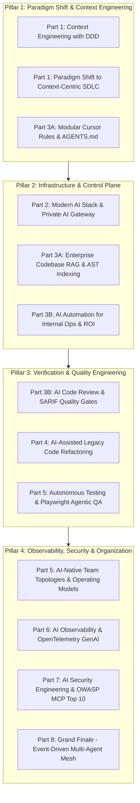

> **Answer-first:** The **AI-Driven Engineer Playbook** provides a battle-tested technical blueprint for software organizations transitioning to an AI-Native SDLC: establishing private AI Gateway control planes (LiteLLM), structuring machine-actionable Context Engineering via Domain-Driven Design and AGENTS.md, adopting the Model Context Protocol (MCP 2.0), automating multi-agent code reviews with SARIF, and executing vision-guided autonomous QA testing.

---

[📖 Phiên bản Tiếng Việt (Vietnamese Edition)](https://learn.tanhdev.com/series/ai-driven-playbook/) | [Next Chapter: Executive Summary →](/series/ai-driven-playbook/executive-summary/)

---

Welcome to **Phase 2** of the evolution into an AI-Native Software Engineer and Engineering Organization in 2026.

While the foundational series ([From Code Monkey to AI System Architect](/series/ai-driven-engineer/)) focused on **individual mindset transformation and engineer positioning**, this Playbook exists for a single imperative: **Enterprise Technical Execution**.

This playbook is engineered for software developers interacting with AI agents daily, Tech Leads setting SDLC quality standards for their teams, and Principal System Architects & CTOs modernizing enterprise infrastructure around agentic systems.

---

## 🚀 Breakthroughs in 2026 AI Engineering Standards

The state of AI-assisted software development in 2026 has progressed far beyond rudimentary autocomplete plugins and prompt engineering tricks. This Playbook reflects the latest verified industry standards:

1. **Hybrid Thinking & Reasoning Models**: Harnessing Chain-of-Thought reasoning from **DeepSeek-R1**, the hybrid thinking modes of **Claude 3.7 Sonnet**, and low-latency multimodal processing from **Gemini 2.0 Flash** to execute complex architectural refactoring with verbalized verification steps.
2. **Model Context Protocol 2.0 (MCP 2.0)**: Standardizing tool execution across distributed agent meshes using ratified JSON-RPC 2.0 over persistent WebSockets/SSE, decentralized tool discovery, and hardware-enforced linear memory sandboxing via WASI 0.3.
3. **Machine-Actionable Context Engineering**: Partitioning project rules using Domain-Driven Design (DDD) Bounded Contexts, formal **AGENTS.md** specifications, and glob-scoped **`.cursor/rules/*.mdc`** configurations that eliminate token contamination and context window degradation.
4. **Private AI Gateway & Cost Governance**: Deploying internal **LiteLLM / Envoy AI Gateways** backed by Redis Semantic Caching (<0.05 cosine similarity threshold, 65–75% hit rate) and self-hosted local LLMs (Ollama / vLLM / Apple Silicon), cutting cloud API costs by 70–85% while enforcing Zero Data Retention (ZDR).
5. **OpenTelemetry GenAI Observability**: Instrumenting distributed agentic traces with standard `gen_ai.*` semantic conventions (v1.30+), tracking prompt/completion tokens, latency bottlenecks, and automated hallucination evaluation pipelines (Ragas / Phoenix).

---

## 📚 Masterclass Curriculum (14 Comprehensive Chapters)

The Playbook is organized into structured pillars spanning foundational SDLC paradigms, infrastructure design, automated quality gates, and enterprise governance:

### 1. Executive Direction & Strategic Framework
- **[Executive Summary: Building AI-Native Engineering Organizations](/series/ai-driven-playbook/executive-summary/)**  
  *Strategic roadmap for CTOs, VPs of Engineering, and Tech Leads on transitioning organizations to AI-native workflows, managing FinOps spend, and proving 4x delivery velocity.*

### 2. Context Engineering & Architecture
- **[Part 1: Context Engineering: Domain-Driven Design for AI Agents](/series/ai-driven-playbook/part-1-context-engineering-ddd/)**  
  *Applying DDD bounded contexts, AST subgraphs, and Tree-sitter code chunking to eliminate hallucination in autonomous coding agents.*
- **[Part 1: The Paradigm Shift — From Code-Centric to Context-Centric SDLC](/series/ai-driven-playbook/part-1-paradigm-shift-ai-first-sdlc/)**  
  *Deconstructing the mental transition from manual syntax production to architectural context curation and automated verification gates.*
- **[Part 3A: Advanced Context Engineering & Modular Cursor Rules](/series/ai-driven-playbook/part-3a-context-engineering-cursor-rules/)**  
  *Designing machine-actionable rules, AGENTS.md specifications, .cursor/rules/*.mdc glob-scoped configurations, and MCP tool boundaries.*

### 3. AI Infrastructure & Internal Platforms
- **[Part 2: Modern AI Engineering Stack & Private AI Gateway Infrastructure](/series/ai-driven-playbook/part-2-modern-ai-engineering-stack/)**  
  *Building a multi-tenant LiteLLM gateway, Redis semantic caching, dynamic model routing, and local GPU inference runtimes.*
- **[Part 3A: Enterprise RAG Architecture & Codebase Brain](/series/ai-driven-playbook/part-3a-enterprise-rag-architecture/)**  
  *Constructing an internal knowledge engine combining layout-aware parsing, hybrid dense-sparse vector search, and cross-encoder reranking (<400ms P99).*
- **[Part 3B: AI Automation for Internal Operations & Proving ROI](/series/ai-driven-playbook/part-3b-ai-automation-internal-ops/)**  
  *Automating incident triage, dependency version migrations, and documenting positive ROI within 90 days.*

### 4. Quality Gates, Refactoring & Testing
- **[Part 3B: AI Code Review & Automated Quality Gates in CI/CD](/series/ai-driven-playbook/part-3b-ai-code-review-quality-gates/)**  
  *Building automated inspection pipelines with LLM-as-a-Judge, deterministic Semgrep AST linters, and SARIF output in GitHub Actions.*
- **[Part 4: AI-Assisted Legacy Code Refactoring & Modernization](/series/ai-driven-playbook/part-4-ai-assisted-refactoring-legacy-code/)**  
  *Safely modernizing legacy monoliths using Golden Master testing, AST-aware refactoring, and DeepSeek-R1 reasoning verification.*
- **[Part 5: Autonomous Testing & Agentic QA Automation](/series/ai-driven-playbook/part-5-autonomous-testing-qa-automation/)**  
  *The autonomous testing revolution: Playwright MCP servers, vision-guided browser agents, self-healing selectors, and mutation testing.*

### 5. Organization, Observability & Security
- **[Part 5: Engineering Operating Models & Team Topologies](/series/ai-driven-playbook/part-5-operating-model/)**  
  *Restructuring traditional engineering squads into 3–4 person AI-Native Pods achieving Elite DORA metrics.*
- **[Part 6: AI Observability & OpenTelemetry GenAI Governance](/series/ai-driven-playbook/part-6-ai-observability-governance/)**  
  *Eliminating operational blind spots using OpenTelemetry GenAI semantic conventions, Langfuse tracing, and automated eval suites.*
- **[Part 7: AI Security Engineering & OWASP MCP Top 10](/series/ai-driven-playbook/part-7-ai-security-engineering/)**  
  *Hardening systems against Prompt Injection, Data Exfiltration, and Tool Poisoning via Zero-Trust Control Planes and OPA/Rego policies.*
- **[Part 8: Grand Finale — Event-Driven Multi-Agent System Architecture](/series/ai-driven-playbook/part-8-ai-native-system-architecture/)**  
  *Unifying all architectural building blocks into an enterprise-scale, event-driven multi-agent mesh running reliably in production.*

---

## ❓ Frequently Asked Questions (FAQ)


Enterprises enforce a 3-tier Private AI Architecture: (1) An internal AI Gateway (LiteLLM / Envoy) that performs real-time client-side PII and secret redaction, (2) Self-hosted open-source models (DeepSeek-R1, Qwen 2.5 Coder) running on internal Kubernetes GPU nodes or Apple Silicon workstations, and (3) Zero Data Retention (ZDR) enterprise agreements with frontier cloud providers.



Traditional documentation (Confluence/Wikis) suffers from rapid factual decay and requires manual human lookup. Cursor rules (`.cursor/rules/*.mdc`) and `AGENTS.md` files are machine-actionable constraints. They are dynamically injected into the AI agent context window based on glob patterns matching the files currently being modified, ensuring code generation strictly adheres to architectural standards.



Without MCP, integrating AI agents with databases, issue trackers, and CI/CD tools requires writing custom API wrappers for every combination of LLM and tool. MCP 2.0 acts as a universal protocol ('USB-C for AI'), providing standardized JSON-RPC schemas, bidirectional multiplexing, and cryptographic workload attestation (SPIFFE/mTLS) across the entire enterprise stack.

