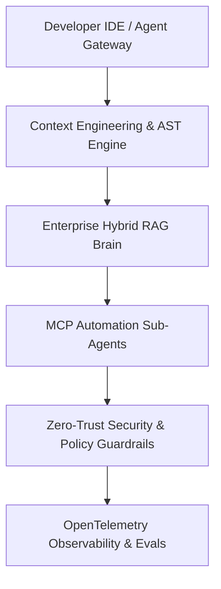

# The AI-Driven Engineer Playbook: Enterprise Masterclass

> **Answer-First Summary**: The AI-Driven Engineer Enterprise Playbook is a hands-on execution guide for software engineers, tech leads, and architects modernizing production development. It delivers production architectures, Model Context Protocol (MCP) integrations, AST-aware context engines, OpenTelemetry observability, zero-trust security guardrails, and quantitative ROI models for enterprise AI adoption in 2026.

Welcome to **Phase 2** of your structured methodology for evolving into a next-generation AI platform software engineer. 

If the previous series ([From Code Typist to Architect](/series/ai-driven-engineer/)) focused on **Mindset shifts and strategic planning**, this series exists for one single purpose: **Execution**.

This is the **Hands-on Playbook** designed specifically for developers writing code every day, Tech Leads setting team standards, and Architects looking to restructure the entire organization around AI platforms.

## Playbook Table of Contents

This playbook covers production system architectures, configuration files, and operational engineering patterns distilled from enterprise environments. The playbook is divided into core architectural pillars:

- **Executive Summary:** [AI Executive Summary & Enterprise Playbook](/series/ai-driven-playbook/executive-summary/)
- **Part 1:** [Context Engineering: Domain-Driven Design for AI](/series/ai-driven-playbook/part-1-context-engineering-ddd/)
- **Part 2:** [AI Platform Layer: Building a Private AI Ecosystem & Architectural Freedom](/series/ai-driven-playbook/)
- **Part 3A:** [Enterprise RAG Architecture: Building the Internal "Brain"](/series/ai-driven-playbook/part-3a-enterprise-rag-architecture/)
- **Part 3B:** [AI Automation for Internal Ops & Proving ROI](/series/ai-driven-playbook/part-3b-ai-automation-internal-ops/)
- **Part 4:** [Policy-as-Code: Agentic CI/CD Guardrails](/series/ai-driven-playbook/)
- **Part 5:** [Operating Model: Evolving AI-Era Operations](/series/ai-driven-playbook/part-5-operating-model/)
- **Part 6:** [AI Observability & Evals: Eliminating Operational Blind Spots](/series/ai-driven-playbook/part-6-ai-observability-governance/)
- **Part 7:** [AI Security Engineering: Ironclad Armor for New Attack Surfaces](/series/ai-driven-playbook/part-7-ai-security-engineering/)
- **Part 8:** [Grand Finale: Comprehensive AI-Native System Architecture](/series/ai-driven-playbook/)

## Pillar Overview & Architecture Blueprint

**Enterprise AI-Driven Engineering Architecture Topology:** The architecture diagram maps the core integration topology across AST context pruning engines, enterprise hybrid RAG pipelines, MCP internal automation agents, and zero-trust security guardrails.

| Pillar | Focus | Technology & Tooling | Engineering Target |
|---|---|---|---|
| **Context Engineering** | AST pruning & bounded context design | Python AST, Tree-sitter, Protobuf, Pydantic v2 | Sub-1000 token pristine prompt payloads |
| **Enterprise RAG** | Hybrid Search & GraphRAG | Qdrant, pgvector HNSW, BM25, Cohere Rerank | High-precision retrieval across codebase |
| **AI Automation** | Internal Ops Sub-Agents | MCP Servers, OpenTelemetry GenAI, LiteLLM | Automated incident triage & MTTR reduction |
| **Security Engineering** | AI Guardrails & Prompt Injection Defense | Pydantic, OWASP LLM 2026, AST Filters | Zero untrusted prompt execution |

## Target Audience & System Prerequisites

Designed for **Lead Software Engineers, Technical Directors, and AI Systems Architects** modernizing internal development workflows and building production AI platforms.

**System & Infrastructure Prerequisites:**
- Python 3.12+ and Go 1.24+ runtime environments with Pydantic v2 data validation schemas.
- Vector database deployment (Qdrant, pgvector with HNSW index tuning `M=16, efConstruction=200`).
- OpenTelemetry GenAI semantic convention collector infrastructure paired with LiteLLM gateway failover proxies.
- Tree-sitter or native AST parser integration for multi-language context extraction.

## Key System Invariants

1. **Pristine Prompt Contexts**: AST-aware code pruners isolate essential function signatures, eliminating context bloat and keeping prompt tokens under 1,000.
2. **Multi-Agent Governance**: Strict RBAC security gates and OpenTelemetry tracing track all sub-agent tool executions in real time.

## Frequently Asked Questions

### Who is this enterprise playbook designed for?
This playbook is engineered for Lead Software Engineers, Technical Directors, and AI Systems Architects building production-grade AI platforms. It provides actionable configuration patterns, operational code implementations, and SRE monitoring blueprints rather than high-level theoretical concepts.

### How does this playbook differ from generic AI coding tutorials?
Generic tutorials focus on simple API calls and naive character chunking over small static files. This playbook addresses enterprise scale, including AST context pruning, multi-tenant vector Row-Level Security (RLS), OpenTelemetry GenAI tracing, and OWASP 2026 AI security boundaries.

### What prerequisites are needed before implementing these architecture patterns?
Engineers should be proficient in distributed system design, container orchestration (Docker/Kubernetes), and modern programming languages such as Go 1.24+, Python 3.12+, or TypeScript. Familiarity with Pydantic v2 schemas, vector databases, and LLM orchestration proxies is recommended.

