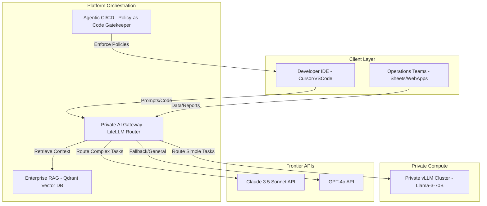

If the [first series](/series/ai-driven-engineer/) helped you shift your mindset from "Code Typist" to "Architect," then this Playbook answers the next foundational question at the enterprise scale: **"How do you scale a single individual's 10x productivity into the productivity of an entire organization?"**

The brutal truth is: Buying Cursor or Copilot licenses for the entire team does **not** transform your company into an "AI-Native Company." It simply turns your team into a group of people sharing an expensive tool. To genuinely change the organization's DNA, you must stop focusing on Tools (Tool-centric) and start thinking in terms of **Platforms & Systems**.

---

## 1. The Strategic Paradigm Shift: Systems over Tools

When companies hand out commercial AI tool accounts without an overarching system, they create fragmented workflows, security vulnerabilities, and uncontrollable API costs. An AI-Native organization shifts the focus from local IDE configurations to a centralized, private platform architecture. 

In this paradigm, the AI is not a generic assistant sitting on a developer's desktop; it is integrated directly into the company’s internal databases, security policies, and continuous delivery pipelines.



---

## 2. The Cost Trap: Public APIs vs. Private Gateways

Relying solely on commercial pay-per-seat models is financially unsustainable. Consider a medium-sized enterprise with 500 developers.

### The Seat-License Model (SaaS Trap)
*   **Cost per seat:** $40 / month (e.g., Copilot Enterprise or Cursor Business)
*   **Total Monthly Cost:** 500 devs $\times$ $40 = \$20,000 / \text{month}$
*   **Annual Cost:** $\$240,000$ per year

As developer activity increases, companies often hit additional usage limits, driving up costs through premium fast-token packages.

### The Private AI Gateway Model
By deploying a private AI gateway (e.g., LiteLLM router) combined with a local GPU serving cluster for common, repetitive tasks (using open-weight models like Llama 3 8B or Qwen 2.5 Coder 14B), the economics change dramatically.

$$TCO_{\text{private}} = C_{\text{infrastructure}} + C_{\text{hybrid\_api}}$$

Where:
*   **Infrastructure Cost ($C_{\text{infrastructure}}$):** Running 2x NVIDIA L4 instances on AWS/GCP to serve high-throughput Llama 3 8B queries.
    $$C_{\text{infrastructure}} = 2 \times \$0.70/\text{hour} \times 24 \times 30 \approx \$1,000 / \text{month}$$
*   **Hybrid API Cost ($C_{\text{hybrid\_api}}$):** Routing only 20% of highly complex reasoning queries to premium frontier APIs (Claude 3.5).
    $$C_{\text{hybrid\_api}} \approx \$2,500 / \text{month}$$
*   **Total Monthly Cost:** $\$3,500 / \text{month}$
*   **Monthly Savings:** $\$16,500$ (an 82.5% reduction)

---

## 3. Data Security & Compliance Frameworks

Enterprise source code is a high-value intellectual property. Sending proprietary code directly to commercial endpoints without mediation poses major compliance risks.

### Security Guarantees of the Gateway
1.  **PII Sanitization:** The private gateway automatically scrubs Social Security numbers, API keys, and client names before routing queries to external API endpoints.
2.  **No-Training Clauses:** By routing traffic through enterprise API agreements, the gateway enforces terms of service that explicitly prohibit commercial vendors from training models on user data.
3.  **VPC Peering:** For highly regulated sectors (e.g., finance and healthcare), the gateway routes requests entirely within the company's virtual private cloud (VPC), communicating directly with local vLLM instances.

---

## 4. The 8 Pillars of the AI-Native Organization

This Playbook is organized into 8 interconnected technical Pillars that together form a closed-loop operational engine:

### Pillar 1: Context Engineering & DDD for AI
Instead of loading entire codebases into the prompt, we organize the codebase using Domain-Driven Design (DDD). We split `.cursorrules` by Bounded Contexts. The AI only receives the domain models and interfaces relevant to its current task, preventing context dilution. Global context configurations lead to severe context fragmentation, forcing LLMs to process thousands of unrelated lines of code. This not only wastes computational tokens but directly degrades answer accuracy because the model loses focus on the core target logic (the "Lost in the Middle" phenomenon).

### Pillar 2: Private AI Gateway Architecture
Building a centralized router that manages load balancing, rate limiting, and fallback configurations. If Claude 3.5 is unavailable, the router automatically fails over to a local Llama-3-70B model served on vLLM. The gateway operates as an intelligent reverse-proxy that intercepts all IDE-generated requests. By monitoring token budgets, request frequencies, and execution latencies at the team level, IT administrators gain real-time visibility into usage patterns while enforcing strict budget caps to prevent runaway cloud bills.

### Pillar 3: Enterprise RAG Systems
A structured data pipeline that ingests company wikis, API documentation, and database schemas. It uses hybrid search (vector similarity + keyword matching) and re-ranking layers to feed the AI with accurate, real-time context. A naive vector database lookup is insufficient because it cannot evaluate document freshness or resolve highly specific programming jargon. We implement a semantic metadata pre-filtering layer and a cross-encoder re-ranking stage that reduces input noise by over 70%, yielding highly accurate code recommendations.

### Pillar 4: Operations Automation (High-ROI Agents)
Applying LLMs to non-engineering business units. Automating bank statement reconciliation, invoice parsing, and operations audits, shifting the AI conversation from "developer productivity" to "direct operational leverage." Rather than forcing developers to build complex, heavy microservices for simple data-cleansing tasks, we show how to write lightweight Google Apps Script integrations that connect internal spreadsheets directly to private LLM endpoints, delivering instant business automation with minimal engineering overhead.

### Pillar 5: Policy-as-Code in CI/CD
AI moves so fast that human code reviewers become bottlenecks. We integrate deterministic AI agents directly into the pull request (PR) pipeline. These agents act as gatekeepers, running static analysis, verification scripts, and architectural boundary checks before human review. By writing policy checks as code (using tools like Open Policy Agent or custom AST parsers), we catch security flaws, test coverage regressions, and architectural boundary violations automatically, ensuring that only high-quality drafts reach human senior engineers.

### Pillar 6: The AI-Native Operating Model
Redefining the "Definition of Done." In an AI-native workspace, a developer's role is that of a reviewer and system designer. We update team structures, sprint planning cadences, and QA boundaries to match the speed of AI code generation. The traditional boundary between development and quality assurance is redrawn; developers write automated tests alongside their code prompts, while QA engineers focus on complex system-level integrations and regression suites, scaling overall organizational throughput.

### Pillar 7: Observability and Evals
You cannot optimize what you do not measure. We establish metrics to trace prompt latency, token costs, and model accuracy. We build automated evals pipelines that regularly run regression tests on our internal models. Since LLM behavior shifts over time (due to model updates or prompt modifications), our continuous evaluation pipeline runs standard benchmark datasets against our custom fine-tuned models daily, flagging any accuracy regressions before they hit production.

### Pillar 8: Agentic System Architecture
Designing software applications from the ground up to be run by AI agents. This involves building decoupled event-driven systems, micro-frontends, and structured JSON schemas that agents can read and mutate safely. We design APIs with explicit, machine-readable specifications (OpenAPI/Swagger) and construct deterministic state machines that contain clear boundary guards, ensuring that autonomous agents can interact with core databases and billing APIs without risking system corruption.

---

## 5. Case Study: Mitigating the CI/CD Bottleneck

A common failure mode for teams adopting AI is the "Code Delivery Saturation." 

```text
Before AI-Native System:
  Dev writes code: 4 hours
  CI/CD + Review + QA: 4 hours
  Total Time-to-Market: 8 hours

After AI (without Pipeline Optimization):
  Dev writes code: 10 minutes
  CI/CD + Review + QA: 4 hours (Human bottleneck remains)
  Total Time-to-Market: 4.1 hours (Only 2x speedup despite 24x coding speedup)

After AI-Native Systems (with Policy-as-Code Gates):
  Dev writes code: 10 minutes
  Automated Agent CI/CD Gate: 5 minutes
  Fast-track Human Review: 15 minutes
  Total Time-to-Market: 30 minutes (16x overall speedup)
```

By focusing on the entire system rather than the single tool, the organization unlocks the true potential of the AI-Native transformation.

---

For technical consultation on building custom AI gateways, scaling internal RAG systems, or training teams in context engineering, contact [Lê Tuấn Anh](/hire/).

---

🔗 **Next Step:** [Part 1 — Context Engineering: Domain-Driven Design for AI](/series/ai-driven-playbook/part-1-context-engineering-ddd/) — Context Loading Hierarchy and Bounded Contexts.
