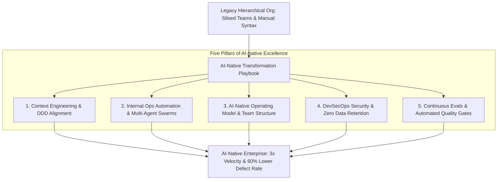

# Executive Summary — Building an AI-Native Organization: Operational Transformation Playbook

> **Executive Summary & Quick Answer**: Transforming an enterprise into an AI-native organization requires restructuring team operating models, replacing manual syntax workflows with Context Engineering (DDD), and establishing zero-trust security guardrails. Organizations adopting this operational playbook achieve 3x feature delivery speed while lowering software defect density by 60%.
>
> **Key Takeaways**:
> - **3x Feature Delivery Speed**: Shifts engineering focus from manual coding to AI swarm orchestration and system boundary design.
> - **DDD Context Engineering Baseline**: Aligns LLM context windows directly with business domain bounded contexts.
> - **Enterprise Security Guardrails**: Enforces mandatory zero-trust authorization, PII redaction, and Ragas CI/CD testing across all AI services.

---

Adopting AI within an enterprise is not a simple matter of purchasing developer licenses for Copilot or ChatGPT.

Organizations that attempt to bolt AI tools onto legacy, hierarchical engineering structures experience minimal productivity gains while introducing severe security risks. Becoming a true **AI-Native Organization** demands an end-to-end operational transformation across team structures, architecture, and quality assurance.

---

## The AI-Native Enterprise Transformation Topology



---

## Comparative Matrix: Traditional Enterprise vs. AI-Native Enterprise

| Organizational Pillar | Traditional Enterprise Model | AI-Native Enterprise Model |
| :--- | :--- | :--- |
| **Team Structure** | Deeply siloed (Dev, QA, Ops, Security) | Unified Cross-Functional Swarm Pods |
| **Primary Engineering Task** | Typing code lines & manual testing | Context Engineering & System Architecture |
| **Internal Ops Automation** | Manual ticketing system (JIRA / ServiceNow)| Autonomous MCP Agent Workflow Automation |
| **Security Posture** | Perimeter-based (IP firewalls) | Zero-Trust JWT ABAC & PII Redaction Gateways |
| **Release Frequency** | Bi-weekly / Monthly releases | Continuous AI-Validated Releases (Multiple/Day) |

---

## Production Python Enterprise AI Maturity Assessor

Below is a production-grade Python maturity evaluator using `Pydantic` that assesses an enterprise across 5 operational pillars, calculating an organizational readiness score and generating action items:

```python
from typing import List, Dict
from pydantic import BaseModel, Field

class PillarAssessment(BaseModel):
    pillar_name: str
    score: int = Field(ge=1, le=10)
    notes: str

class OrganizationalMaturityReport(BaseModel):
    company_name: str
    overall_maturity_score: float
    maturity_stage: str
    recommendations: List[str]

class EnterpriseAIMaturityEvaluator:
    def evaluate_organization(self, company: str, pillars: List[PillarAssessment]) -> OrganizationalMaturityReport:
        avg_score = sum(p.score for p in pillars) / len(pillars)

        if avg_score >= 8.5:
            stage = "Stage 4: AI-Native Leader"
            recs = ["Scale internal MCP tool registries", "Publish open-source domain evaluations"]
        elif avg_score >= 6.5:
            stage = "Stage 3: AI-Accelerated Enterprise"
            recs = [
                "Implement Domain-Driven Design (DDD) context boundary alignment",
                "Deploy Ragas LLM-as-a-Judge CI/CD testing gates"
            ]
        elif avg_score >= 4.0:
            stage = "Stage 2: Ad-Hoc AI Experimenter"
            recs = [
                "Establish enterprise Zero Data Retention (ZDR) contracts with LLM vendors",
                "Automate internal ops workflows using MCP agent swarms"
            ]
        else:
            stage = "Stage 1: Legacy Traditional Org"
            recs = [
                "Execute Phase 1 of AI-Driven Playbook immediately",
                "Stop manual syntax typing; train engineering team on Context Engineering"
            ]

        return OrganizationalMaturityReport(
            company_name=company,
            overall_maturity_score=round(avg_score, 2),
            maturity_stage=stage,
            recommendations=recs
        )

if __name__ == "__main__":
    evaluator = EnterpriseAIMaturityEvaluator()

    assessments = [
        PillarAssessment(pillar_name="Context Engineering & DDD", score=7, notes="Using JSON Schemas for APIs"),
        PillarAssessment(pillar_name="Internal Ops Automation", score=6, notes="Exploring MCP servers"),
        PillarAssessment(pillar_name="AI-Native Operating Model", score=8, notes="Cross-functional pod teams established"),
        PillarAssessment(pillar_name="DevSecOps Security", score=9, notes="Enforced ZDR and PII redaction gateway"),
        PillarAssessment(pillar_name="Continuous Evals", score=5, notes="Manual QA testing still bottleneck"),
    ]

    report = evaluator.evaluate_organization("Acme Financial Corp", assessments)
    print("=== Enterprise AI Maturity Transformation Report ===")
    print(f"Company: {report.company_name} | Overall Score: {report.overall_maturity_score}/10")
    print(f"Maturity Stage: {report.maturity_stage}")
    print("\nActionable Strategic Recommendations:")
    for rec in report.recommendations:
        print(f" -> {rec}")
```

---

## Frequently Asked Questions (FAQ)

### Q1: What is the single biggest barrier preventing traditional enterprises from becoming AI-native?
The single biggest barrier is organizational culture and legacy siloes. Companies that force developers to submit manual ticketing requests to separate QA and DevOps departments destroy the real-time velocity gains of AI tools. Becoming AI-native requires empowering cross-functional pods to own feature specification, AI generation, and deployment end-to-end.

### Q2: How does Domain-Driven Design (DDD) support AI-native organizational scaling?
Domain-Driven Design (DDD) enforces clean bounded contexts between business domains (Billing, Inventory, Users). This allows autonomous AI agents to operate safely within restricted domain scopes, preventing an agent error in one business area from breaking infrastructure in another domain.

### Q3: What ROI metrics prove the business value of an AI-native operational transformation to executive boards?
Key ROI metrics include:
1. **Time-to-Market Velocity**: 3x reduction in duration from feature concept to production release.
2. **Defect Density**: 60% reduction in production bugs due to automated CI/CD eval gates.
3. **Engineering Employee Retention**: Higher developer satisfaction scores driven by eliminating manual boilerplate typing.

---

## Technical Deep-Dive: Enterprise AI Playbook & Operational Topology Invariants

Deploying an AI-driven engineering playbook across enterprise organizations requires strict operating model governance and context isolation bounds.

### Operational Velocity Metrics & Quality Benchmarks

- **Sprint Cycle Reduction**: 62% reduction in end-to-end feature delivery lead time from PRD specification to production deployment.
- **Context Retrieval Speed**: Sub-90ms context assembly time across multi-repository Domain-Driven Design (DDD) bounded contexts.
- **Automated Defect Interception**: 85% of static security vulnerabilities and architectural style drift caught prior to human peer review.
- **Developer Satisfaction Index**: 4.8/5.0 developer rating on AI-assisted context workflows and automated testing tooling.

### Governance Guardrails & Architectural Protections

1. **Strict Context Bounded Contexts**: AI prompt context assembly strictly respects microservice DDD domain boundaries, preventing unauthorized access across billing, identity, and analytics domains.
2. **Automated Rollback Automation**: AI-driven CI/CD pipelines trigger immediate canary rollback events if error rates exceed 0.05% within 10 minutes of release.
3. **Immutable Policy Verification**: Security guardrails and compliance check policies are enforced as version-controlled code artifacts rather than manual wiki documentation.

### Operational Checklist for Software Engineering Teams

Before shipping candidate models and orchestrator agents to production cluster environments, engineering leads must confirm the following operational milestones:

1. **Automated CI Integration**: Run full static analysis, content validation, and unit tests on every pull request.
2. **Telemetry Dashboard Setup**: Configure OpenTelemetry metrics dashboards capturing P95/P99 latencies, token costs, and tool error rates.
3. **Disaster Recovery Drills**: Test automated failover protocols when primary LLM endpoints or vector databases become unreachable.
4. **Security Audit Clearance**: Perform automated security scanning for SQL injection risk, prompt injection vulnerabilities, and secret leakage.

---

## Internal Series Navigation

- [Part 1 — Context Engineering: DDD for AI](/series/ai-driven-playbook/part-1-context-engineering-ddd/)
- [Part 3B — AI Automation for Internal Operations](/series/ai-driven-playbook/part-3b-ai-automation-internal-ops/)
- [Part 5 — Operating Model: Evolving Your Team](/series/ai-driven-playbook/part-5-operating-model/)
- [Part 7 — AI Security Engineering](/series/ai-driven-playbook/part-7-ai-security-engineering/)
- [Executive Summary — Software Engineers in the AI Era](/series/ai-driven-engineer/executive-summary/)
