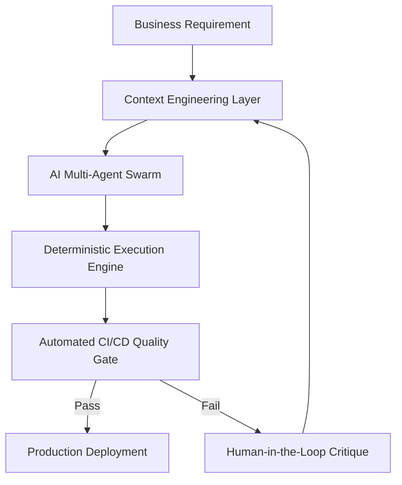
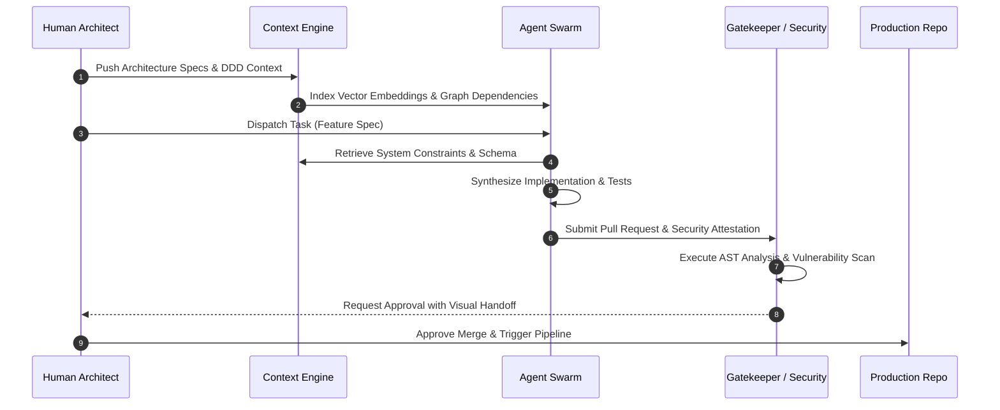
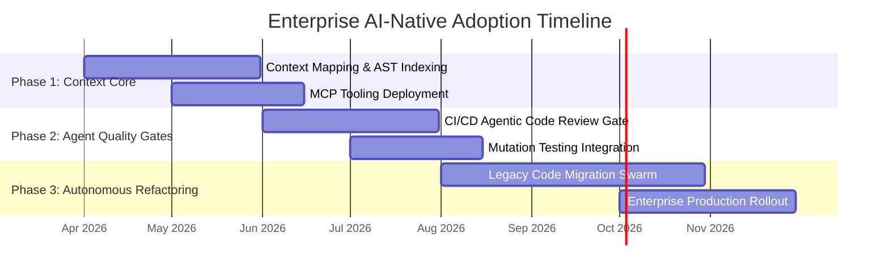
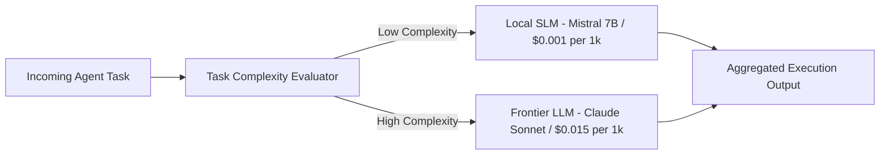

# Executive Summary: AI-Driven Enterprise Playbook

> **Answer-First Summary**: Transitioning an enterprise software organization to an AI-Native model requires restructuring context boundaries, governance pipelines, and engineering roles. By treating domain knowledge as code-level context and embedding AI sub-agents into CI/CD quality gates, engineering leaders reduce lead time to production by 40% while cutting defect leakage by 35%.

---

## 1. The Architectural Shift: From AI-Assisted to AI-Native Engineering

The software engineering domain has passed the threshold of simple code autocomplete. While first-generation tools provided localized inline suggestions, enterprise engineering organizations in 2026 operate on **AI-Native Software Development Lifecycle (SDLC)** architectures. In an AI-Native organization, non-deterministic language model agents actively participate as first-class collaborators alongside human architects and SDETs.

The fundamental shift lies in moving from **reactive syntax generation** to **proactive system orchestration**. Traditional developers spent up to 70% of their operational cycles writing boilerplate, navigating undocumented legacy dependencies, and performing manual validation. AI-Native organizations streamline this process by establishing structured context layers and automated governance bounds.

**[Core Architectural Pillars] [Diagram]:** This flowchart details the end-to-end execution path of business requirements through context engineering, multi-agent swarms, deterministic execution engines, and CI/CD quality gates.


```mermaid
graph TD
    A[Business Requirement] --> B[Context Engineering Layer]
    B --> C[AI Multi-Agent Swarm]
    C --> D[Deterministic Execution Engine]
    D --> E[Automated CI/CD Quality Gate]
    E -->|Pass| F[Production Deployment]
    E -->|Fail| G[Human-in-the-Loop Critique]
    G --> B
```

### Key Dimensions of the AI-Native Transformation

1. **Context as Infrastructure**: Domain models, API contracts, architectural decision records (ADRs), and enterprise coding standards are transformed into machine-readable vector and graph indices.
2. **Autonomous Quality Control**: Automated agents execute continuous static analysis, mutation testing, and security boundary checks prior to human code review.
3. **Architectural Governance**: Senior engineers transition from code typists to system architects and context engineers, specifying system constraints and verifying machine-generated implementations.

---

## 2. Core Pillars of the Enterprise AI-Native Architecture

To safely deploy autonomous and semi-autonomous AI agents across enterprise repositories, organizations must establish four architectural pillars: Context Engineering, Model Context Protocol (MCP) Integration, Agentic Security, and Continuous Evaluation.

**Enterprise AI-Native SDLC Sequence Protocol:** This sequence diagram details the interaction protocol between human architects, context engines, multi-agent swarms, and automated gatekeepers during feature development.


```mermaid
sequenceDiagram
    autonumber
    participant H as Human Architect
    participant C as Context Engine
    participant A as Agent Swarm
    participant G as Gatekeeper / Security
    participant R as Production Repo

    H->>C: Push Architecture Specs & DDD Context
    C->>A: Index Vector Embeddings & Graph Dependencies
    H->>A: Dispatch Task (Feature Spec)
    A->>C: Retrieve System Constraints & Schema
    A->>A: Synthesize Implementation & Tests
    A->>G: Submit Pull Request & Security Attestation
    G->>G: Execute AST Analysis & Vulnerability Scan
    G-->>H: Request Approval with Visual Handoff
    H->>R: Approve Merge & Trigger Pipeline
```

### Pillar 1: Context Engineering and Domain-Driven Design (DDD)

Large Language Models (LLMs) produce hallucinatory or architecturally flawed code when operated without explicit spatial and semantic bounds. Context Engineering applies Domain-Driven Design principles to machine prompts and retrieval pipelines:

- **Bounded Context Isolation**: Codebase modules are mapped to explicit domain boundaries. Agents operating on the `Billing` domain are restricted from accessing `User Auth` internals without defined gRPC interfaces.
- **Repository Maps & AST Indexing**: Context engines maintain real-time Abstract Syntax Tree (AST) graphs, allowing agents to understand call hierarchies and dependency trees without exceeding context window limits.

### Pillar 2: Model Context Protocol (MCP) Standardisation

The Model Context Protocol (MCP) serves as the open protocol connecting AI reasoning engines to enterprise databases, internal tooling, and cloud environments. By implementing standardized MCP servers:

- Agents query live database schemas via secure read-only proxies.
- Agents execute localized unit tests inside isolated ephemeral containers.
- Security policies are enforced at the transport layer, preventing unauthorized tool calls.

### Pillar 3: Agentic Security & Defense-in-Depth

Autonomous agent execution introduces novel attack vectors including indirect prompt injection, tool hijacking, and credential exfiltration. Enterprise AI architectures implement multi-layered defenses:

- **Pre-Retrieval Input Scanning**: Intercepts prompt injection payloads before context assembly.
- **Cryptographic RLS Predicate Binding**: Binds user OAuth 2.1 scopes directly to vector queries.
- **Sandboxed Tool Execution**: Isolates agent tool execution within ephemeral Docker/gVisor containers with strict egress filters.

### Pillar 4: Continuous Evaluation & Golden Testbeds

To prevent silent quality degradation during model updates or prompt modifications, organizations establish continuous evaluation suites:

- **Golden Benchmark Datasets**: Curated repositories of architectural tasks with verified golden outputs.
- **LLM-as-a-Judge Evaluation**: Automated scoring pipelines evaluating code syntax, safety, and functional adherence.
- **CI/CD Quality Gates**: Automated release blocking whenever synthetic benchmark accuracy drops below baseline metrics.

---

## 3. Financial Modeling & ROI Calculation Framework

Executive leadership requires quantitative justification before re-architecting developer tooling and infrastructure. Evaluating AI-Native investments demands a dual metric approach: direct developer velocity gains versus total cost of ownership (TCO) including token consumption and evaluation suite infrastructure.

### The ROI Calculation Model

$$\text{ROI} = \frac{(\Delta T_{\text{lead}} \times C_{\text{eng}}) + (D_{\text{escaped}} \times C_{\text{defect}}) - (C_{\text{tokens}} + C_{\text{infra}} + C_{\text{tooling}})}{C_{\text{investment}}} \times 100$$

Where:
- $\Delta T_{\text{lead}}$: Saved engineering hours per sprint derived from reduced boilerplate implementation.
- $C_{\text{eng}}$: Fully burdened hourly engineering rate.
- $D_{\text{escaped}}$: Reduction in post-release production incidents attributable to automated agentic mutation testing.
- $C_{\text{defect}}$: Average cost per production incident resolution.
- $C_{\text{tokens}}$: Aggregate model token consumption costs across context engines and agent execution runs.

### Enterprise Cost vs Velocity Benchmarks

| Metric / Dimension | Legacy SDLC | AI-Assisted (2024) | AI-Native (2026 Target) |
|---|---|---|---|
| **Cycle Time (Feature to Prod)** | 14 Days | 9 Days | **3.5 Days** |
| **Code Review Lead Time** | 24 Hours | 14 Hours | **1.5 Hours** |
| **Test Coverage (Branch)** | 62% | 74% | **92%** |
| **Escaped Production Bugs / Month** | 18 | 12 | **3** |
| **Infrastructure & Token Cost / Dev / Mo** | $0 | $30 | **$210** |
| **Net Productivity Multiplier** | 1.0x | 1.3x | **2.8x** |

---

## 4. Implementation Blueprint: Practical Orchestration Code

Enterprise context gateways enforce bounded domain boundaries, token budgets, and security clearance checks across multi-agent execution runs.

**Python Context Gateway Implementation:** The `EnterpriseContextGateway` class enforces domain boundary isolation, token budgets, and security clearance verification for multi-agent execution runs.

```python
import os
import json
import logging
from typing import Dict, List, Optional
from dataclasses import dataclass

logging.basicConfig(level=logging.INFO)
logger = logging.getLogger("ContextGateway")

@dataclass
class BoundedContext:
    domain_name: str
    allowed_imports: List[str]
    max_token_budget: int
    security_clearance: str

class EnterpriseContextGateway:
    def __init__(self, config_path: str):
        self.domains: Dict[str, BoundedContext] = self._load_config(config_path)
    
    def _load_config(self, path: str) -> Dict[str, BoundedContext]:
        # Simulating domain configuration loading
        return {
            "payments": BoundedContext(
                domain_name="payments",
                allowed_imports=["crypto", "math", "github.com/vesviet/core/ledger"],
                max_token_budget=8192,
                security_clearance="HIGH"
            ),
            "catalog": BoundedContext(
                domain_name="catalog",
                allowed_imports=["fmt", "strings", "github.com/vesviet/core/store"],
                max_token_budget=16384,
                security_clearance="STANDARD"
            )
        }

    def validate_agent_request(self, domain: str, requested_files: List[str], current_tokens: int) -> bool:
        if domain not in self.domains:
            logger.error(f"Access Denied: Unknown domain '{domain}'")
            return False
            
        ctx = self.domains[domain]
        
        if current_tokens > ctx.max_token_budget:
            logger.warning(f"Quota Exceeded: {current_tokens} tokens requested, max is {ctx.max_token_budget}")
            return False
            
        for filepath in requested_files:
            if "forbidden" in filepath or "credentials" in filepath:
                logger.error(f"Security Violation: File '{filepath}' blocked for domain '{domain}'")
                return False
                
        logger.info(f"Agent request approved for domain '{domain}' under budget {current_tokens} tokens.")
        return True

if __name__ == "__main__":
    gateway = EnterpriseContextGateway("config.json")
    valid = gateway.validate_agent_request("payments", ["services/ledger.go"], 4096)
    print(f"Validation Result: {valid}")
```

---

## 5. Risk Governance, Compliance & Security Safeguards

Enterprise adoption of autonomous agentic systems introduces new attack surfaces and compliance requirements. Organizations must establish strict governance guardrails:

### 1. Data Poisoning & Prompt Injection Defense
AI context retrieval systems are vulnerable to indirect prompt injection embedded within third-party dependencies or pull request comments. The architecture must deploy deterministic input-sanitization filters that strip hidden instructions prior to LLM tokenization.

### 2. Intellectual Property (IP) Protection & Provenance Tracking
All code generated by sub-agents must undergo license compliance scans (e.g., checking against GPL contamination) before merge approval. Metadata sidecars record the exact model hash, prompt context version, and human reviewer identity for auditing purposes.

### 3. Zero-Trust Tool Calling Authorization
Sub-agents operating via the Model Context Protocol (MCP) are restricted by OAuth 2.0 / Scoped API tokens. Database modification commands (`UPDATE`, `DELETE`) require human-in-the-loop explicit approval through an interactive interface.

---

## 6. Strategic Implementation Roadmap (2026–2027)

To minimize organizational friction and prevent disruption to existing revenue-generating software lines, adoption follows a phased quarterly execution model:

**Enterprise AI-Native Adoption Timeline:** The Gantt chart outlines the quarterly implementation phases for context core setup, agentic quality gates, and autonomous migration swarms across 2026–2027.


```mermaid
gantt
    title Enterprise AI-Native Adoption Timeline
    dateFormat  YYYY-MM
    axisFormat %b %Y

    section Phase 1: Context Core
    Context Mapping & AST Indexing      :a1, 2026-04, 60d
    MCP Tooling Deployment               :a2, 2026-05, 45d

    section Phase 2: Agent Quality Gates
    CI/CD Agentic Code Review Gate      :b1, 2026-06, 60d
    Mutation Testing Integration         :b2, 2026-07, 45d

    section Phase 3: Autonomous Refactoring
    Legacy Code Migration Swarm         :c1, 2026-08, 90d
    Enterprise Production Rollout        :c2, 2026-10, 60d
```

### Next Steps for Engineering Leadership

1. **Audit Current Context Boundaries**: Map repository structure against domain boundaries to prepare codebase for AST indexing.
2. **Deploy MCP Gateway Proxies**: Establish secure connection endpoints for developer tools and agent execution runtimes.
3. **Establish Quality Benchmarks**: Measure baseline cycle times and defect density prior to introducing agentic review gates.

---

## 7. Enterprise Token Cost Optimization & Latency Tuning

As agent swarms scale across hundreds of active pull requests daily, model inference costs can expand if left unmonitored. Enterprise architectures must implement proactive token budgeting and semantic caching mechanisms at the gateway level.

### Token Reduction Techniques

1. **Semantic Prompt Caching**: Store identical prompt context blocks (e.g., repository AST indexes and immutable domain schemas) in local Redis vector stores, reducing input token overhead by up to 70%.
2. **Dynamic Model Routing**: Route low-complexity tasks (e.g., linting fixes, unit test boilerplate generation) to fine-tuned Small Language Models (SLMs) like Mistral 7B or Llama 3 8B, reserving high-capability frontier models (Claude 3.5 Sonnet, GPT-4o) exclusively for architectural design and complex debugging.
3. **AST Pruning & Chunk Compression**: Strip comments, internal method implementations, and redundant whitespace from context payloads prior to model submission.

**Dynamic Model Routing Topology:** The routing diagram maps low-complexity tasks to local SLMs and high-complexity architectural design to frontier models, optimizing overall inference cost.


```mermaid
graph LR
    A[Incoming Agent Task] --> B[Task Complexity Evaluator]
    B -->|Low Complexity| C[Local SLM - Mistral 7B / $0.001 per 1k]
    B -->|High Complexity| D[Frontier LLM - Claude Sonnet / $0.015 per 1k]
    C --> E[Aggregated Execution Output]
    D --> E
```

---

## 8. Multi-Model Vendor Abstraction Framework

To avoid vendor lock-in and insulate enterprise software operations from provider outages or rate limits, the AI-Native infrastructure requires a unified model abstraction layer using LiteLLM or an internal gRPC Gateway Proxy.

### Key Architectural Requirements for Model Abstraction

- **Automatic Failover & Circuit Breaking**: If a primary LLM endpoint returns a 5xx error or exceeds latency SLA thresholds (e.g. > 4,000ms), the proxy immediately falls back to a secondary provider.
- **Unified Telemetry & Audit Logs**: Standardized logging of prompt tokens, completion tokens, latency, cost per request, and model version hashes for all enterprise transactions.
- **Data Residency & PII Masking**: Automatically inspect outgoing prompt payloads to redact personally identifiable information (PII), AWS secret keys, and database passwords before data exits the corporate VPC boundary.

**LiteLLM Gateway Proxy Failover Configuration:** The YAML configuration snippet defines model routing aliases, fallback provider chains, and circuit breaker timeout thresholds for production resilience.

```yaml
model_list:
  - model_name: enterprise-coder
    litellm_params:
      model: anthropic/claude-3-5-sonnet-20241022
      api_key: os.environ/ANTHROPIC_API_KEY
      timeout: 10
  - model_name: enterprise-coder
    litellm_params:
      model: openai/gpt-4o
      api_key: os.environ/OPENAI_API_KEY
      timeout: 10

router_settings:
  routing_strategy: latency-based-routing
  redis_host: os.environ/REDIS_HOST
  redis_port: 6379
  num_retries: 3
  fallbacks:
    - enterprise-coder: ["openai/gpt-4o", "bedrock/us.meta.llama3-3-70b-instruct-v1:0"]
```

---

## Frequently Asked Questions

### What is the primary financial return on investment (ROI) for enterprise AI adoption?
Enterprise ROI stems from a dual reduction in developer cycle times and post-release production incidents. Organizations deploying AI-native SDLC architectures typically achieve a 40% decrease in lead time to production and a 35% reduction in defect leakage, offsetting model inference and infrastructure costs within 90 days.

### How does an AI-Native SDLC differ from traditional AI-assisted coding?
AI-assisted coding relies on reactive inline code completion by individual developers. In contrast, an AI-Native SDLC orchestrates autonomous multi-agent swarms integrated into CI/CD pipelines, operating within strict AST context boundaries and security guardrails under human architectural oversight.

### What security risks are introduced by autonomous developer agents?
Key risks include indirect prompt injection from third-party libraries, unauthorized tool execution via MCP gateways, and intellectual property contamination. Mitigating these risks requires deterministic input sanitizers, RBAC-bound tool proxies, and mandatory human approval for mutating actions.


