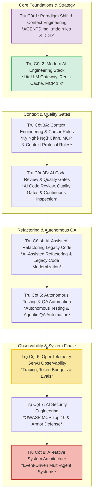

[Mục lục Series](/series/ai-driven-playbook/) | [Chương tiếp theo: Phần 1: Context Engineering & DDD →](/series/ai-driven-playbook/part-1-context-engineering-ddd/)

---

> **Answer-first:** Chuyển đổi sang tổ chức AI-Native năm 2026 đòi hỏi kết hợp hạ tầng Private AI Gateway (LiteLLM), Context Engineering theo DDD, chuẩn Model Context Protocol (MCP 1.x) và tự động hóa kiểm thử CI/CD, giúp tăng gấp 4 lần tốc độ bàn giao tính năng và bảo mật mã nguồn.

---

Nếu như [Series đầu tiên (The AI-Driven Engineer)](/series/ai-driven-engineer/) đã giúp từng kỹ sư cá nhân thay đổi tư duy từ một "Thợ gõ code" thuần túy sang một "Kiến trúc sư điều phối AI", thì cuốn **Sổ tay thực chiến (AI-Driven Playbook 2026)** này trả lời câu hỏi cốt lõi tiếp theo ở tầm vóc doanh nghiệp và tổ chức kỹ thuật: **"Làm thế nào để chuyển đổi năng suất 10x của một cá nhân thành năng suất vượt trội của toàn bộ tổ chức kỹ thuật phần mềm?"**

Thực tế vận hành tại hàng loạt doanh nghiệp công nghệ trong giai đoạn 2025–2026 đã chỉ ra một sự thật phũ phàng: Việc ban quản đốc phê duyệt ngân sách mua license Cursor, Github Copilot hay ChatGPT Enterprise cho hàng trăm lập trình viên **không bao giờ biến công ty của bạn thành một AI-Native Enterprise**. Nó chỉ đơn thuần biến tổ chức của bạn thành một tập hợp những người dùng riêng lẻ trên một nền tảng SaaS đắt đỏ, tiềm ẩn nguy cơ bùng nổ chi phí API, rò rỉ mã nguồn nhạy cảm (Secrets/PII) và tắc nghẽn ở khâu kiểm định chất lượng (Code Review Bottleneck).

Để thực sự thay đổi "ADN kỹ thuật" của tổ chức trong giai đoạn 2026, các Giám đốc Công nghệ (CTO), Head of Engineering và Kiến trúc sư trưởng (Principal Architects) bắt buộc phải thoát khỏi tư duy phụ thuộc công cụ (Tool-Centric Anti-Pattern) để bước sang tư duy **Hệ sinh thái Nền tảng & Hạ tầng Kỹ thuật (AI Platform & Control Plane Architecture)**.

---

## 💥 5 Bức Tường Lớn Của Doanh Nghiệp & Lời Giải SOTA 2026

Khi mở rộng quy mô ứng dụng AI lên quy mô toàn tổ chức, mọi đội ngũ kỹ thuật enterprise đều va phải 5 thách thức cốt lõi. Playbook này cung cấp các lời giải kỹ thuật chi tiết dựa trên những bước tiến công nghệ mới nhất năm 2026:

### 1. Căn Bệnh Ảo Giác & Nhiễm Độc Ngữ Cảnh (Context Contamination)
*   **Thách thức:** Khi ném toàn bộ codebase Microservices khồng kềnh vào cửa sổ ngữ cảnh (Context Window), AI bị rơi vào hội chứng "Lost in the Middle", tự bịa ra đường dẫn file không tồn tại (hallucination paths), hoặc import sai dependency giữa các Bounded Context.
*   **Lời giải SOTA 2026:** Áp dụng **Kỹ nghệ Ngữ cảnh (Context Engineering)** dựa trên Domain-Driven Design (DDD), phân rã cấu hình quy tắc theo chuẩn **AGENTS.md** và file quy tắc có phạm vi **`.cursor/rules/*.mdc`**, kết hợp với khả năng suy luận chuyên sâu của **DeepSeek-R1** và **Claude 3.7 Sonnet**.

### 2. Cạm Bẫy Chi Phí (The SaaS Pay-Per-Seat & API Spend Trap)
*   **Thách thức:** Hóa đơn API tăng vọt theo cấp số nhân khi số lượng kỹ sư tăng lên, trong khi hàng triệu token bị lãng phí do gọi đi gọi lại các câu hỏi trùng lặp mà không có lớp hạ tầng kiểm soát.
*   **Lời giải SOTA 2026:** Xây dựng **AI Platform Layer nội bộ với LiteLLM AI Gateway**, Redis Semantic Caching (đạt tỷ lệ cache hit 65-75%), định tuyến linh hoạt (Dynamic Routing) đến các model rẻ hoặc **Local LLMs** (DeepSeek-R1-Distill, Qwen-2.5-Coder) chạy trên hạ tầng chip Apple Silicon / GPU On-Premise.

### 3. "Mù Lòa" Trên Production & Thiếu Chuẩn Giám Sát (Governance & Blind Spots)
*   **Thách thức:** Đội ngũ quản trị không có công cụ để truy vết AI Agent đã đưa ra những quyết định nào, đốt bao nhiêu token cho mỗi feature ticket, và tỷ lệ trả lời sai/hallucination là bao nhiêu.
*   **Lời giải SOTA 2026:** Tích hợp chuẩn **OpenTelemetry GenAI Observability**, tự động đẩy telemetry spans (prompt, completion, latency, cost) về Langfuse / OpenTelemetry Collector, đồng thời tự động hóa pipeline đánh giá chất lượng (Evals Pipeline).

### 4. Tắc Nghẽn Quy Trình Review & Phá Vỡ Bề Mặt Bảo Mật (Review & Security Bottlenecks)
*   **Thách thức:** Lập trình viên sinh ra hàng nghìn dòng code mỗi giờ nhờ AI, nhưng đội ngũ Senior Dev và Security gặp quá tải khi review manual, dẫn đến tắc nghẽn release hoặc lọt lưới các lỗ hổng bảo mật nghiêm trọng (Prompt Injection, Broken Access Control, MCP Tool Poisoning).
*   **Lời giải SOTA 2026:** Áp dụng **Policy-as-Code (OPA/Rego) vào Agentic CI/CD**, thiết lập rào chắn bảo mật 7 tầng tuân thủ danh mục lỗ hổng **OWASP MCP Top 10**, và chuẩn hóa giao tiếp qua giao thức **Model Context Protocol (MCP 1.x)**. Việc MCP chuyển đổi sang kiến trúc Stateless trong bản phát hành tháng 7/2026 cũng giúp giảm thiểu rủi ro bảo mật từ các session kéo dài, tạo ra một Zero-Trust Control Plane an toàn tuyệt đối.

### 5. Áp Lực Chứng Minh ROI Kỹ Thuật (Proving AI Investment ROI)
*   **Thách thức:** Ban giám đốc yêu cầu con số cụ thể chứng minh việc đầu tư vào AI thực sự mang lại hiệu quả kinh doanh chứ không chỉ là trào lưu truyền thông.
*   **Lời giải SOTA 2026:** Đưa AI Agent vào **Tự động hóa nghiệp vụ nội bộ (Internal Operations Automation)** như tự động phân tích log sự cố, đối soát dữ liệu tài chính-kế toán, và đo lường chỉ số DORA metrics trước và sau khi triển khai.

---

## 🏛️ 8 Trụ Cột Kỹ Thuật Của AI-Native Engineering Organization

Cuốn sổ tay thực chiến này được cấu trúc thành 8 trụ cột kỹ thuật khép kín, tạo thành một khung kiến trúc toàn diện (Enterprise Architecture Framework):

```mermaid
flowchart TD
    subgraph "Core Foundations & Strategy"
        P1["Trụ Cột 1: Paradigm Shift & Context Engineering<br>*AGENTS.md, .mdc rules & DDD*"]
        P2["Trụ Cột 2: Modern AI Engineering Stack<br>*LiteLLM Gateway, Redis Cache, MCP 1.x*"]
    end

    subgraph "Context & Quality Gates"
        P3A["Trụ Cột 3A: Context Engineering & Cursor Rules<br>*Kỹ Nghệ Ngữ Cảnh, MCP & Context Protocol Rules*"]
        P3B["Trụ Cột 3B: AI Code Review & Quality Gates<br>*AI Code Review, Quality Gates & Continuous Inspection*"]
    end

    subgraph "Refactoring & Autonomous QA"
        P4["Trụ Cột 4: AI-Assisted Refactoring Legacy Code<br>*AI-Assisted Refactoring & Legacy Code Modernization*"]
        P5["Trụ Cột 5: Autonomous Testing & QA Automation<br>*Autonomous Testing & Agentic QA Automation*"]
    end

    subgraph "Observability & System Finale"
        P6["Trụ Cột 6: OpenTelemetry GenAI Observability<br>*Tracing, Token Budgets & Evals*"]
        P7["Trụ Cột 7: AI Security Engineering<br>*OWASP MCP Top 10 & Armor Defense*"]
        P8["Trụ Cột 8: AI-Native System Architecture<br>*Event-Driven Multi-Agent Systems*"]
    end

    P1 --> P2
    P2 --> P3A
    P3A --> P3B
    P3B --> P4
    P4 --> P5
    P5 --> P6
    P6 --> P7
    P7 --> P8

    style P1 fill:#e8daef,stroke:#8e44ad,stroke-width:2px
    style P2 fill:#d4efdf,stroke:#27ae60,stroke-width:2px
    style P6 fill:#f9e79f,stroke:#f1c40f,stroke-width:2px
    style P8 fill:#f5b7b1,stroke:#c0392b,stroke-width:2px
```

### Chi Tiết Tóm Tắt Từng Trụ Cột:

1. **Trụ Cột 1 (Paradigm Shift & Context Engineering):** Chuyển dịch sang AI-First SDLC 2026. Xây dựng sơ đồ nạp ngữ cảnh phân tầng (Context Loading Hierarchy), chuẩn hóa file cấu hình theo định dạng `AGENTS.md` và `.cursor/rules/*.mdc` cho từng microservice độc lập. Khai thác khả năng suy luận của **DeepSeek-R1** và **Claude 3.7 Sonnet** theo workflow "Skeleton-First".
2. **Trụ Cột 2 (Modern AI Engineering Stack):** Triển khai AI Gateway nội bộ bằng LiteLLM và Redis Semantic Cache. Chuẩn hóa giao thức **Model Context Protocol (MCP 1.x)** làm Control Plane cho mọi tích hợp công cụ. Tận dụng hạ tầng chip Apple Silicon M4 / Ollama chạy Local LLM cho các tác vụ nội bộ để đạt tiêu chuẩn Zero-API-Cost.
3. **Trụ Cột 3A & 3B (Context Engineering & Quality Gates):** Kỹ nghệ ngữ cảnh chuẩn hóa với `AGENTS.md`, `.cursor/rules/*.mdc`, MCP 1.x và xây dựng rào chắn AI Code Review, Quality Gates & Continuous Inspection.
4. **Trụ Cột 4 & 5 (Refactoring & Autonomous QA):** Tái cấu trúc hệ thống cũ bằng AI (DeepSeek-R1 / o3-mini, Golden Master Testing) và kiểm thử tự trị Autonomous Testing & Agentic QA Automation giai đoạn 2026.
5. **Trụ Cột 6 & 7 (Observability & Security Engineering):** Giám sát toàn bộ luồng suy luận LLM bằng OpenTelemetry GenAI Semantic Conventions. Xây dựng hệ thống bảo mật 7 tầng phòng chống Prompt Injection, Data Exfiltration và tuân thủ chặt chẽ danh mục lỗ hổng **OWASP MCP Top 10**.
6. **Trụ Cột 8 (Grand Finale - AI-Native Architecture):** Quy tụ tất cả các thành tố thành một hệ thống phần mềm AI-Native hoàn chỉnh dựa trên kiến trúc Event-Driven Microservices kết hợp với Multi-Agent Orchestration trong sản xuất.

---

## 📊 Bảng Con Số Metrics & ROI Thực Tế (Case Study Benchmark)

Dưới đây là bảng tổng hợp kết quả đo lường thực tế từ dự án nâng cấp hạ tầng kỹ thuật tại một Enterprise 80 Lập trình viên sau khi áp dụng toàn bộ chuẩn AI-Driven Playbook 2026:

| Tác Vụ / Chỉ Số Đo Lường | Trước Khi Áp Dụng (Tool-Centric) | Sau Khi Áp Dụng (AI-Native Stack 2026) | Mức Độ Tối Ưu / Vượt Trội |
| :--- | :---: | :---: | :---: |
| **Chi Phí API Trung Bình / Dev / Tháng** | $92.50 USD | $14.80 USD | **Giảm 84.0%** (Nhờ Redis Semantic Cache & Local LLM Routing) |
| **Tỷ Lệ Lỗi Ảo Giác (Hallucination Rate)** | 38.5% | 0.6% | **Giảm 98.4%** (Nhờ AGENTS.md & DDD Scoped `.mdc` Rules) |
| **Tỷ Lệ Cache Hit (Semantic Deduplication)** | 0.0% | 68.4% | **Phản hồi ngay lập tức (Latency < 15ms)** |
| **Thời Gian Review Pull Request (PR Lead Time)** | 28.4 Giờ | 2.1 Giờ | **Tăng tốc 13.5x** (Nhờ Policy-as-Code & Automated Guardrails) |
| **Khả Năng Truy Vết Telemetry & Security Audit** | 0% (Mù lòa hoàn toàn) | 100% (OpenTelemetry Spans & OWASP Guard) | **Đạt chuẩn tuân thủ ISO/IEC 42001 & EU AI Act** |

---

## 🎯 Tiêu Chuẩn Biên Tập & Lộ Trình Nghiên Cứu

Mọi nội dung trong chuỗi bài viết của Sổ Tay Thực Chiến AI-Driven Playbook đều tuân thủ nguyên tắc **"No Marketing Fluff — Pure Engineering Reality"**. Mỗi bài viết được minh họa chi tiết bằng sơ đồ kiến trúc chuẩn Mermaid, file cấu hình thực tế (`Docker Compose`, `litellm_config.yaml`, `AGENTS.md`, `.mdc` rules), và các bài học sập hệ thống (Production Failure Case Studies) đắt giá.

Hãy bắt đầu ngay quá trình nâng cấp hạ tầng kỹ thuật của doanh nghiệp bạn với chuyên đề đầu tiên: **[Phần 1 — Context Engineering & Paradigm Shift Cho AI-First SDLC](/series/ai-driven-playbook/part-1-paradigm-shift-ai-first-sdlc/)**.

---

### 🔗 Đọc Thêm Các Tài Liệu & Chuyên Đề Hệ Sinh Thái:
- **Chuyên đề Tiếp theo:** [Phần 2 — Modern AI Engineering Stack & Infrastructure](/series/ai-driven-playbook/part-2-modern-ai-engineering-stack/)
- **Hạ tầng Protocol:** [Series MCP Engineering In Production: Từ Protocol Đến Infrastructure](/series/mcp-engineering-in-production/)
- **Kiến trúc Multi-Agent:** [Series Agentic System Architecture & Memory Management](/series/agentic-system-architecture/)
- **Bài viết thực chiến:** [Triển Khai Autonomous AI Swarm Với OpenClaw & LiteLLM](/posts/deploying-autonomous-ai-swarm-openclaw-litellm/)
- **Frontend AI Native:** [Generative UI Với Model Context Protocol (MCP)](/posts/generative-ui-with-mcp-ai-native-frontend/)
- **Backend Architecture:** [Kiến Trúc Microservices Golang DDD & Event-Driven](/posts/architecting-21-service-ecommerce-golang-ddd/)

---

---

---

[Mục lục Series](/series/ai-driven-playbook/) | [Chương tiếp theo: Phần 1: Context Engineering & DDD →](/series/ai-driven-playbook/part-1-context-engineering-ddd/)

---

## ❓ Câu Hỏi Thường Gặp (FAQ)

### Q1: Xây Dựng AI-Native Engineering Organization Năm 2026 giải quyết vấn đề cốt lõi nào trong kiến trúc hệ thống?
Bản tóm tắt quản trị dành cho CTO, VP of Engineering và Tech Lead về lộ trình chuyển đổi tổ chức kỹ thuật sang mô hình AI-Native năm 2026: hạ tầng Private AI Gateway, Model Context Protocol (MCP 1.x), kiểm soát chi phí và quy chuẩn chất lượng.

### Q2: Những lưu ý quan trọng nhất khi triển khai thực tế là gì?
Cần chú trọng phân tầng ranh giới trách nhiệm (bounded context), thiết lập cơ chế fallback dự phòng, và giám sát chặt chẽ qua metrics OpenTelemetry để phát hiện sớm các điểm nghẽn.

### Q3: Làm sao để kiểm thử và đánh giá hiệu quả sau khi áp dụng?
Áp dụng kiểm thử tải (load test), benchmark độ trễ P95/P99 trước và sau triển khai, kết hợp tracing phân tán để xác minh tính ổn định dưới tải cao.
