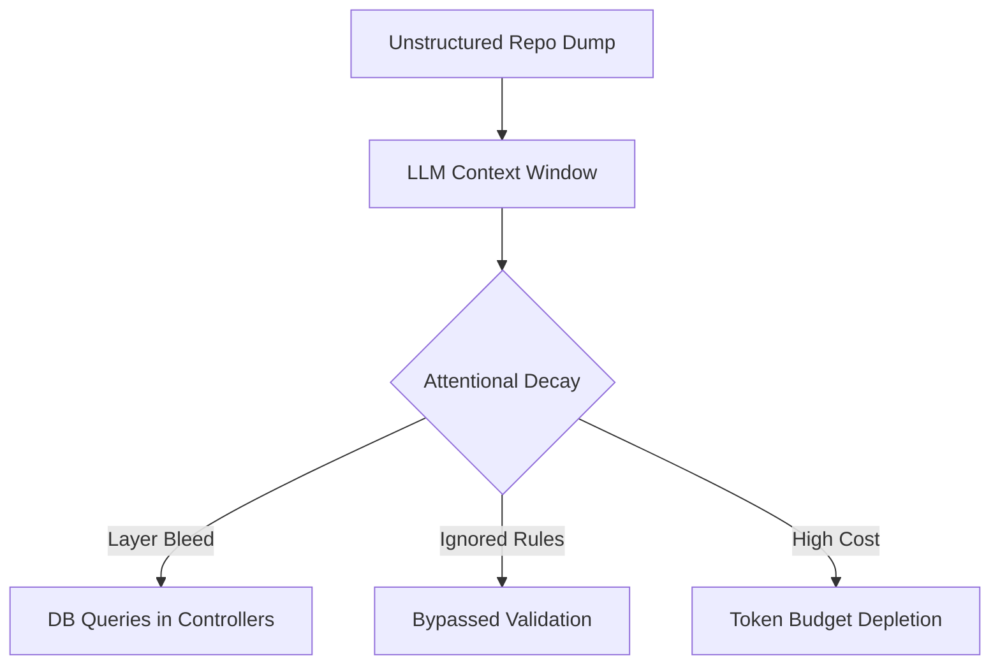
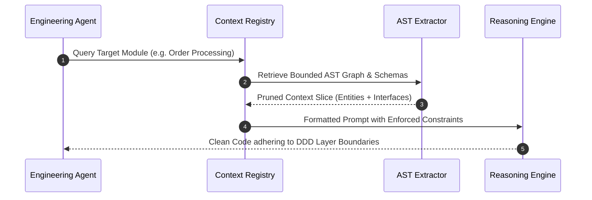
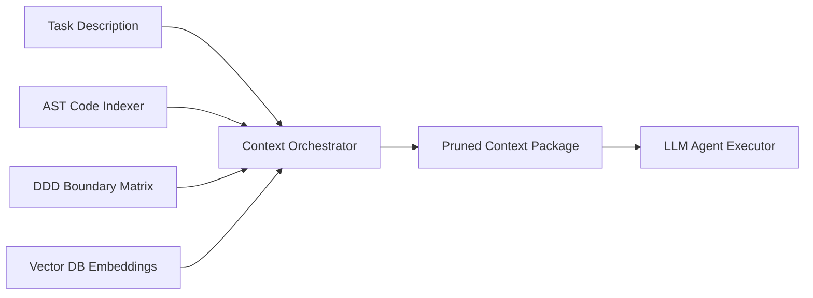
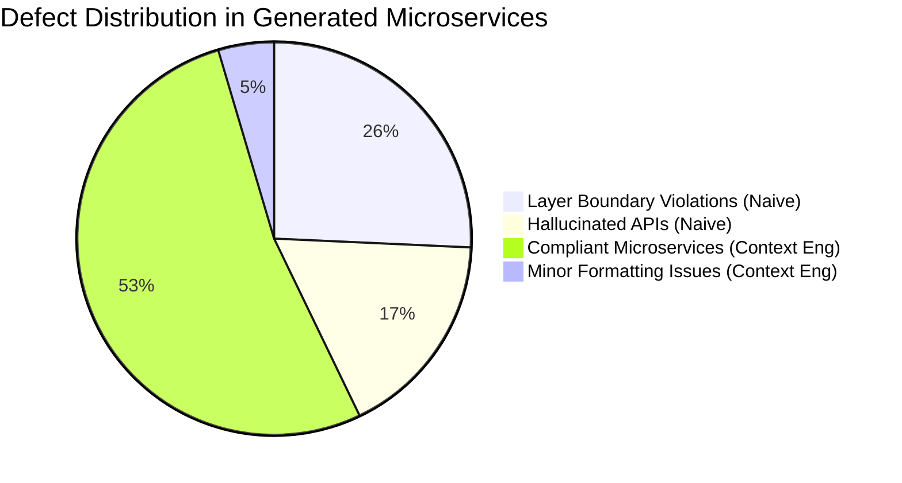
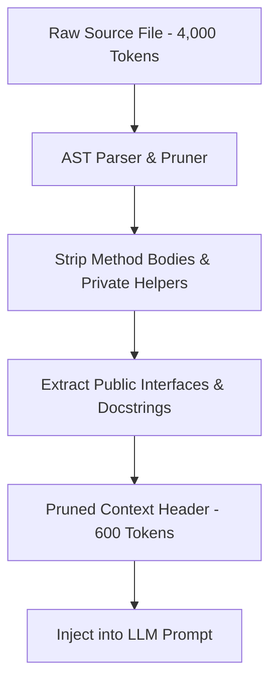

# Part 1: Context Engineering & Domain-Driven Prompting Architecture

> **Answer-First Summary**: Context Engineering structures, scopes, and injects software domain knowledge into Large Language Model prompts using Domain-Driven Design principles. By organizing codebases into explicit Bounded Contexts, Abstract Syntax Tree subgraphs, and JSON-Schema contracts, engineering teams eliminate hallucinations, enforce layer boundaries, and enable autonomous coding agents to implement production-grade enterprise features.

---

## 1. The Fundamental Problem with Naive Context Windows

As context windows expanded from 8,000 to over 1,000,000 tokens, a common enterprise misconception emerged: the belief that developers could simply dump an entire repository into an LLM context window and expect flawless code synthesis.

In practice, large context windows suffer from **attentional decay**, colloquially known as the "Lost in the Middle" phenomenon. When an LLM processes massive, unstructured code dumps:

1. **Instruction Degradation**: Core architectural rules buried deep in context are ignored in favor of dominant statistical patterns in training data.
2. **Layer Bleed**: The model creates direct database calls inside UI controllers or imports infrastructure packages into domain entities, violating clean architecture rules.
3. **Token Inefficiency**: Costs scale linearly or quadratically with context length, destroying the financial feasibility of continuous agentic pipelines.

**[Context Pipeline Topology] [Diagram]:** This flowchart details the attentional decay, instruction degradation, and layer bleed that occur when an unstructured codebase dump is fed into an LLM context window.


```mermaid
graph TD
    A[Unstructured Repo Dump] --> B[LLM Context Window]
    B --> C{Attentional Decay}
    C -->|Layer Bleed| D[DB Queries in Controllers]
    C -->|Ignored Rules| E[Bypassed Validation]
    C -->|High Cost| F[Token Budget Depletion]
```

To achieve deterministic, high-quality code generation, AI engineering teams must adopt **Context Engineering** powered by Domain-Driven Design (DDD).

---

## 2. Applying Domain-Driven Design (DDD) to AI Context

Domain-Driven Design provides the perfect conceptual framework for scoping LLM context. By treating the AI agent as a developer operating within a specific business domain, we apply three core DDD primitives to context construction:

**Context Engineering Execution Protocol:** This sequence diagram details how the engineering agent queries the context registry to fetch pruned AST graphs before dispatching formatted prompts to the reasoning engine.


```mermaid
sequenceDiagram
    autonumber
    participant Dev as Engineering Agent
    participant Map as Context Registry
    participant AST as AST Extractor
    participant LLM as Reasoning Engine

    Dev->>Map: Query Target Module (e.g. Order Processing)
    Map->>AST: Retrieve Bounded AST Graph & Schemas
    AST-->>Map: Pruned Context Slice (Entities + Interfaces)
    Map->>LLM: Formatted Prompt with Enforced Constraints
    LLM-->>Dev: Clean Code adhering to DDD Layer Boundaries
```

### 1. Bounded Context Isolation
Every service or module in an enterprise application belongs to a distinct Bounded Context (e.g., `Inventory`, `PaymentProcessing`, `CustomerIdentity`). When an agent is tasked with modifying `PaymentProcessing`:
- The context engine suppresses internal implementation details of `Inventory`.
- Only public interface contracts (gRPC protobufs, OpenAPI schemas, Go interfaces) of adjacent bounded contexts are injected.

### 2. Ubiquitous Language Mapping
LLMs often use generic variable names or mismatched terminology (e.g., mixing `User`, `Account`, and `Customer`). A Context Engineering pipeline injects a domain dictionary defining strict entity naming rules:
- `Order` is an Immutable Aggregate Root.
- `LineItem` is a Value Object inside `Order`.
- `Price` must always include a currency ISO code.

### 3. Entity vs Infrastructure Separation
The prompt layout forces a strict separation between core business logic (Domain Entities) and system mechanics (Database Adapters, HTTP Handlers, Message Brokers).

---

## 3. The Architecture of a Enterprise Context Engine

A production Context Engine operates as a middleware layer between developer intent (task specifications) and LLM invocation.

**Enterprise Context Engine Architecture:** The block diagram illustrates the orchestration layer combining AST code indexing, DDD boundary matrices, and vector DB embeddings into a pruned context package.


```mermaid
graph LR
    A[Task Description] --> B[Context Orchestrator]
    C[AST Code Indexer] --> B
    D[DDD Boundary Matrix] --> B
    E[Vector DB Embeddings] --> B
    B --> F[Pruned Context Package]
    F --> G[LLM Agent Executor]
```

### Structural Components of the Engine

1. **AST Indexer & Dependency Graph**: Scans the codebase to construct an Abstract Syntax Tree graph. It identifies all caller-callee relationships, interface implementations, and type definitions.
2. **Pruning Algorithm**: Extracts only the top-K relevant nodes in the AST graph needed for the specific task, discarding unused method bodies to preserve token budget.
3. **System Constraint Injector**: Automatically prepends global non-functional requirements (e.g., "All Go code must use `context.Context` as first parameter", "No panic in production handlers").

---

## 4. Practical Implementation: AST-Aware Context Extractor

Python AST context extractors parse codebase structures, extract class interfaces, and strip internal method bodies to minimize token usage.

**AST Context Extractor Implementation:** The `ContextEngineeringParser` class parses Python source code ASTs to extract class signatures, public interfaces, and docstrings while stripping private method bodies.

```python
import ast
import json
import sys
from typing import Dict, List, Any, Optional

class ContextEngineeringParser(ast.NodeVisitor):
    """
    Parses Python codebase AST to extract public interfaces, class structures,
    and docstrings while stripping internal method bodies to minimize token usage.
    """
    def __init__(self):
        self.classes: List[Dict[str, Any]] = []
        self.current_class: Optional[Dict[str, Any]] = None

    def visit_ClassDef(self, node: ast.ClassDef):
        class_info = {
            "name": node.name,
            "docstring": ast.get_docstring(node),
            "methods": [],
            "bases": [base.id for base in node.bases if isinstance(base, ast.Name)]
        }
        previous_class = self.current_class
        self.current_class = class_info
        self.generic_visit(node)
        self.classes.append(class_info)
        self.current_class = previous_class

    def visit_FunctionDef(self, node: ast.FunctionDef):
        if self.current_class is not None:
            # Extract method signature without full body code
            args = [arg.arg for arg in node.args.args]
            returns = ast.unparse(node.returns) if node.returns else "None"
            self.current_class["methods"].append({
                "name": node.name,
                "args": args,
                "returns": returns,
                "docstring": ast.get_docstring(node)
            })

def build_pruned_context(source_code: str, domain_name: str) -> str:
    tree = ast.parse(source_code)
    parser = ContextEngineeringParser()
    parser.visit(tree)
    
    context_payload = {
        "bounded_context": domain_name,
        "structural_outline": parser.classes,
        "constraints": [
            "Do not modify class signatures without approval",
            "Maintain pure domain logic without direct DB calls",
            "All new methods must include explicit type annotations"
        ]
    }
    return json.dumps(context_payload, indent=2)

# Example Usage Demonstration
if __name__ == "__main__":
    sample_code = """
class PaymentAggregate:
    \"\"\"Aggregate root managing credit card charges and refunds.\"\"\"
    def __init__(self, payment_id: str, amount: float):
        self.payment_id = payment_id
        self.amount = amount
        
    def execute_charge(self, token: str) -> bool:
        \"\"\"Executes external payment gateway transaction.\"\"\"
        return True
"""
    pruned_json = build_pruned_context(sample_code, "PaymentProcessing")
    print("Pruned AI Context Payload:")
    print(pruned_json)
```

---

## 5. System Prompt Layout & Schema Design

**[DDD Prompt Schema] [Specification]:** This matrix details the structural section delimiters and prompt organization strategy for context-engineered agent runs.

| Section | Role & Purpose | Content Strategy |
|---|---|---|
| `## SYSTEM BOUNDARIES` | Defines non-negotiable rules | List explicit negative constraints ("DO NOT import package X") |
| `## DOMAIN DICTIONARY` | Standardizes terminology | Key-value mapping of ubiquitous language terms |
| `## TARGET AST INTERFACES` | Injects type definitions | Pruned JSON or stubbed signatures of target dependencies |
| `## EXECUTION TASK` | Specific user requirement | Step-by-step modification request |
| `## RESPONSE FORMAT` | Guarantees code parseability | Strict markdown fenced code block specifications |

**System Prompt Markdown Template:** The markdown layout template illustrates the explicit section delimiters and schema contracts injected into agent execution runs.

```markdown
<system_boundaries>
- Bounded Context: PaymentProcessing
- Forbidden Imports: ["github.com/vesviet/inventory/*", "database/sql"]
- Invariants: All domain mutations must emit DomainEvents.
</system_boundaries>

<domain_dictionary>
- Order: Aggregate Root representing verified customer purchase orders.
- PaymentToken: Ephemeral token generated by payment gateway proxy.
</domain_dictionary>

<target_ast_interfaces>
**[Pydantic Validation Engine] [Code Snippet]:**
``    class PaymentGatewayInterface(ABC):
        @abstractmethod
        def process_payment(self, token: str, amount: Decimal) -> PaymentResult: pass``
</target_ast_interfaces>
```

---

## 6. Real-World Case Study: Microservices Refactoring

A leading e-commerce platform evaluated naive prompting versus DDD-based Context Engineering when tasking an agentic pipeline with refactoring a monolithic Go checkout service into isolated microservices.

### Comparison Results

**Defect Distribution Comparison:** The pie chart illustrates the sharp decrease in layer boundary violations and API hallucinations when comparing naive context dumping against DDD-based Context Engineering.


```mermaid
pie title Defect Distribution in Generated Microservices
    "Layer Boundary Violations (Naive)" : 45
    "Hallucinated APIs (Naive)" : 30
    "Compliant Microservices (Context Eng)" : 92
    "Minor Formatting Issues (Context Eng)" : 8
```

- **Naive Prompting**: 75% of generated pull requests contained architectural violations, including direct SQL queries executed inside business domain models and cross-domain package cyclic dependencies.
- **Context-Engineered Pipeline**: 92% of generated pull requests passed automated CI/CD static checks on the first attempt, reducing developer review effort by 4x.

---

## 7. Strategic Recommendations & Best Practices

Automate AST context extraction via CLI tools, cap token budgets per sub-agent step, and version control domain context schemas in git repositories.

1. **Automate AST Context Extraction**: Never require developers to manually assemble prompt context. Build automated CLI plugins (e.g., Git hooks or IDE extensions) that query AST graphs.
2. **Enforce Token Budget Limits**: Cap context payload sizes at 16,000 tokens per sub-agent step to maintain optimal attentional density.
3. **Version Control Context Schemas**: Store domain dictionary definitions and architectural constraint matrices directly in repository root configuration files (`.context/domain.json`).

---

## 8. Dynamic Schema Validation & Context Compression Protocols

To ensure that LLMs adhere strictly to target architectural interfaces, Context Engines deploy dynamic JSON-Schema validators that filter model context both pre-prompt injection and post-code generation.

### Context Compression Pipeline

1. **Dead Code Elimination**: Strip unused internal function definitions, local helper structures, and legacy inline comments from context payloads.
2. **Interface Stubbing**: Replace full method implementations with minimal interface declarations and docstring annotations.
3. **Type Alias Resolution**: Automatically resolve nested type definitions across imported packages into a single unified type context header.

**Context Compression Workflow:** The diagram maps the multi-stage token reduction pipeline from raw 4,000-token source files down to a 600-token pruned context header.


```mermaid
graph TD
    A[Raw Source File - 4,000 Tokens] --> B[AST Parser & Pruner]
    B --> C[Strip Method Bodies & Private Helpers]
    C --> D[Extract Public Interfaces & Docstrings]
    D --> E[Pruned Context Header - 600 Tokens]
    E --> F[Inject into LLM Prompt]
```

**Pydantic v2 Context Compression & Validation Script:** The Python code snippet utilizes Pydantic v2 to validate context payload models, calculate compression ratios, and enforce token constraints before model injection.

```python
from typing import List, Optional
from pydantic import BaseModel, Field, field_validator

class MethodSignature(BaseModel):
    name: str
    args: List[str]
    returns: str

class ClassContextModel(BaseModel):
    name: str
    docstring: Optional[str] = None
    methods: List[MethodSignature]

class ContextPayloadModel(BaseModel):
    bounded_context: str
    token_budget: int = Field(default=8192, le=16384)
    classes: List[ClassContextModel]

    @field_validator("bounded_context")
    @classmethod
    def validate_context_name(cls, v: str) -> str:
        if not v.isidentifier():
            raise ValueError("Bounded context must be a valid identifier")
        return v

def compress_payload(payload: ContextPayloadModel) -> str:
    # Serializes model into compact minified JSON context block
    return payload.model_dump_json(exclude_none=True)
```

---

## 9. Context Lifecycle & Real-Time Invalidation Strategies

In rapidly evolving codebases where multiple agents and human developers merge pull requests continuously, stale context represents a critical point of failure.

### Invalidation Triggers

- **Git Commit Webhooks**: Whenever a merge event occurs on the `main` branch, the AST indexer invalidates modified module subgraphs in the vector store.
- **Dependency Map Recalculation**: Automated weekly sweeps re-calculate package dependency distance matrices to reflect new domain boundaries.
- **TTL Cache Policies**: Set maximum Time-To-Live (TTL) limits (e.g., 2 hours) on transient context embeddings generated during interactive developer pairing sessions.

---

## Frequently Asked Questions

### Why do large context windows suffer from "attentional decay"?
Large context windows process input tokens probabilistically, causing LLMs to prioritize dominant training patterns over instructions buried in long prompts. This leads to "Lost in the Middle" syndrome, where architectural rules and domain boundaries are ignored during code synthesis.

### How does Domain-Driven Design (DDD) solve context bloat?
DDD organizes codebases into explicit Bounded Contexts and Ubiquitous Language mappings. By extracting only relevant AST subgraphs and interface signatures, Context Engineering supplies the LLM with focused prompt payloads under 1,000 tokens while maintaining clean architecture layer boundaries.

### What is the difference between AST pruning and standard RAG chunking?
Standard RAG chunking splits files by character count or paragraph breaks, frequently severing code signatures and table definitions. AST pruning parses the programming language's syntax tree directly, stripping method implementations while retaining public interfaces, type definitions, and caller hierarchies.


