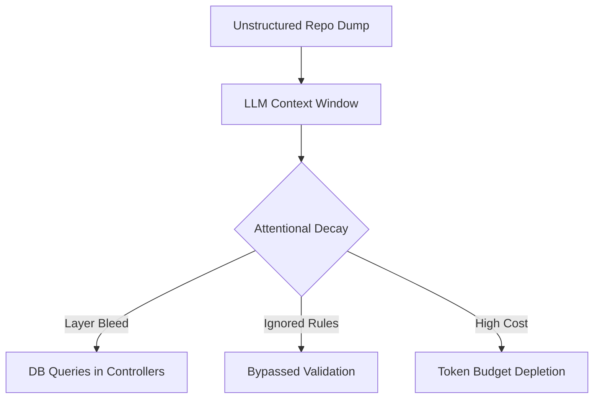
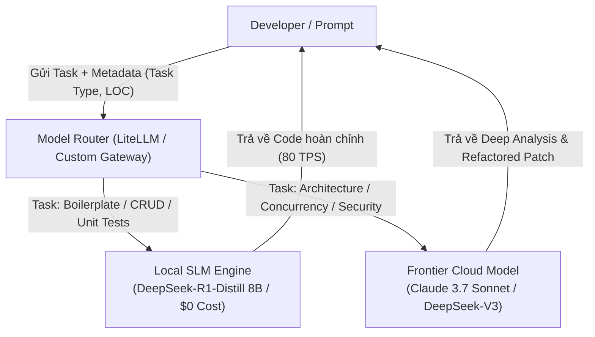
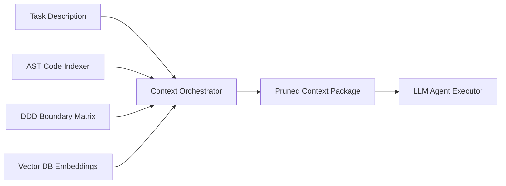
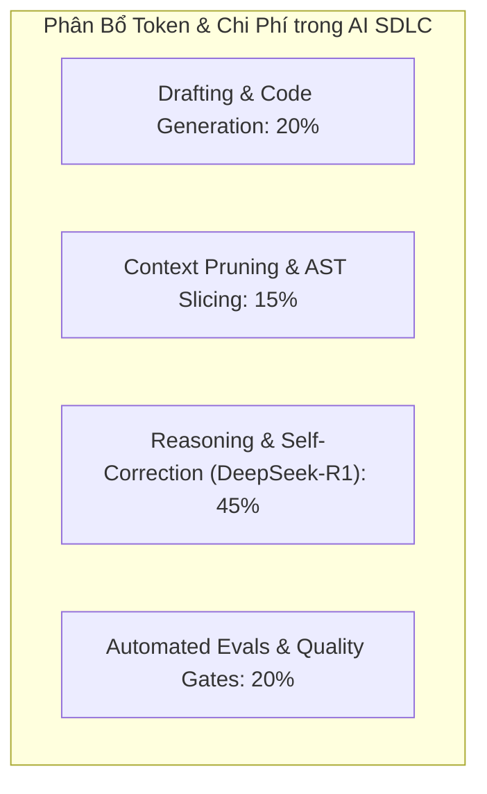
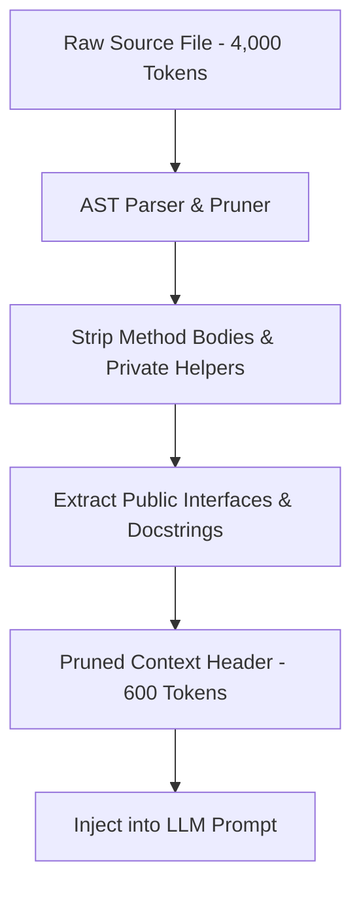

[← Chương trước: Executive Summary](/series/ai-driven-playbook/executive-summary/) | [Mục lục Series](/series/ai-driven-playbook/) | [Chương tiếp theo: Phần 1: AI-First SDLC Paradigm Shift →](/series/ai-driven-playbook/part-1-paradigm-shift-ai-first-sdlc/)

---

> **Answer-first:** Ứng dụng Domain-Driven Design vào Context Engineering giúp chia nhỏ codebase thành các Bounded Contexts độc lập, giảm thiểu hiện tượng ảo giác (hallucination) của AI Coding Agents nhờ giới hạn phạm vi truy xuất AST và sơ đồ phụ thuộc (subgraphs), nâng cao độ chính xác khi sinh mã microservices.

---

## 1. Vấn đề cốt lõi với các Context Windows ngây ngô (Naive Context Windows)

Khi các context window được mở rộng từ 8,000 lên hơn 1,000,000 tokens, một quan niệm sai lầm phổ biến ở cấp doanh nghiệp đã xuất hiện: niềm tin rằng các lập trình viên chỉ việc ném toàn bộ một repository vào context window của LLM và mong đợi việc tổng hợp code (code synthesis) hoàn hảo.

Trong thực tế, các context window lớn gặp phải tình trạng **suy giảm sự chú ý (attentional decay)**, thường được biết đến qua hiện tượng "Lost in the Middle" (lạc lối giữa chừng). Khi một LLM xử lý những khối lượng code đồ sộ, không có cấu trúc:

1. **Sự suy thoái chỉ thị (Instruction Degradation)**: Các quy tắc kiến trúc cốt lõi bị chôn vùi sâu trong context sẽ bị bỏ qua và nhường chỗ cho các khuôn mẫu thống kê chiếm ưu thế trong dữ liệu huấn luyện.
2. **Xuyên thủng ranh giới (Layer Bleed)**: Model tạo ra các truy vấn database trực tiếp bên trong các UI controller hoặc import các infrastructure package vào các domain entity, vi phạm các quy tắc kiến trúc sạch (clean architecture).
3. **Hiệu suất Token kém (Token Inefficiency)**: Chi phí tăng tuyến tính hoặc theo hàm bậc hai với chiều dài của context, phá hủy tính khả thi về mặt tài chính của các agentic pipelines hoạt động liên tục.

**[Context Pipeline Topology] [Diagram]:** Sơ đồ khối (flowchart) này chi tiết quá trình attentional decay, instruction degradation và layer bleed xảy ra khi ném một codebase không cấu trúc vào LLM context window.


```mermaid
flowchart TD
    A["Unstructured Repo Dump"] --> B["LLM Context Window"]
    B --> C{"Attentional Decay"}
    C -->|Layer Bleed| D["DB Queries in Controllers"]
    C -->|Ignored Rules| E["Bypassed Validation"]
    C -->|High Cost| F["Token Budget Depletion"]
```

Để đạt được code generation chất lượng cao và có tính tất định (deterministic), đội ngũ kỹ sư AI cần áp dụng **Context Engineering** được hỗ trợ bởi Domain-Driven Design (DDD).

---

## 2. Áp dụng Domain-Driven Design (DDD) vào AI Context

Domain-Driven Design mang đến một framework ý niệm hoàn hảo để xác định phạm vi (scoping) context cho LLM. Bằng cách đối xử với AI agent như một developer hoạt động bên trong một business domain cụ thể, chúng ta áp dụng ba thành phần cơ bản (primitives) của DDD vào việc xây dựng context:

**Context Engineering Execution Protocol:** Sơ đồ tuần tự (sequence diagram) này mô tả cách engineering agent truy vấn vào context registry để lấy ra các đồ thị AST đã được cắt tỉa (pruned AST graphs) trước khi gửi đi các prompt đã được định dạng tới reasoning engine.


```mermaid
flowchart TD
    Dev["Developer / Prompt"] -->|"Gửi Task + Metadata (Task Type, LOC)"| Router["Model Router (LiteLLM / Custom Gateway)"]
    
    Router -->|"Task: Boilerplate / CRUD / Unit Tests"| Local["Local SLM Engine<br/>(DeepSeek-R1-Distill 8B / $0 Cost)"]
    Router -->|"Task: Architecture / Concurrency / Security"| Frontier["Frontier Cloud Model<br/>(Claude 3.7 Sonnet / DeepSeek-V3)"]
    
    Local -->|"Trả về Code hoàn chỉnh (80 TPS)"| Dev
    Frontier -->|"Trả về Deep Analysis & Refactored Patch"| Dev
```

### 1. Cách ly bằng Bounded Context
Mỗi service hoặc module trong một ứng dụng doanh nghiệp thuộc về một Bounded Context riêng biệt (ví dụ: `Inventory`, `PaymentProcessing`, `CustomerIdentity`). Khi agent được giao nhiệm vụ chỉnh sửa `PaymentProcessing`:
- Context engine sẽ ẩn đi các chi tiết triển khai bên trong của `Inventory`.
- Chỉ những interface contracts công khai (gRPC protobufs, OpenAPI schemas, Go interfaces) của các bounded context lân cận được nhúng vào (injected).

### 2. Ánh xạ Ubiquitous Language (Ngôn ngữ đồng nhất)
LLM thường sử dụng tên biến chung chung hoặc thuật ngữ không nhất quán (ví dụ, dùng lẫn lộn giữa `User`, `Account`, và `Customer`). Một pipeline Context Engineering sẽ tiêm (inject) vào một từ điển domain nhằm định nghĩa các quy tắc đặt tên thực thể (entity) nghiêm ngặt:
- `Order` là một Aggregate Root bất biến (Immutable Aggregate Root).
- `LineItem` là một Value Object bên trong `Order`.
- `Price` phải luôn đi kèm với mã tiền tệ ISO (currency ISO code).

### 3. Phân tách Entity và Infrastructure
Cấu trúc prompt ép buộc sự phân tách nghiêm ngặt giữa core business logic (Domain Entities) và system mechanics (Database Adapters, HTTP Handlers, Message Brokers).

---

## 3. Kiến trúc của một Enterprise Context Engine

Một Context Engine trên môi trường production hoạt động như một tầng middleware nằm giữa ý định của developer (task specifications) và quá trình gọi LLM (LLM invocation).

**Enterprise Context Engine Architecture:** Sơ đồ khối minh họa cho tầng điều phối (orchestration layer) kết hợp quá trình AST code indexing, DDD boundary matrices, và vector DB embeddings để tạo ra một pruned context package.


```mermaid
flowchart LR
    A["Task Description"] --> B["Context Orchestrator"]
    C["AST Code Indexer"] --> B
    D["DDD Boundary Matrix"] --> B
    E["Vector DB Embeddings"] --> B
    B --> F["Pruned Context Package"]
    F --> G["LLM Agent Executor"]
```

### Các thành phần cấu trúc của Engine

1. **AST Indexer & Dependency Graph**: Quét (scan) codebase để xây dựng một đồ thị Abstract Syntax Tree. Nó nhận dạng tất cả mối quan hệ caller-callee, các interface implementations, và type definitions.
2. **Pruning Algorithm (Thuật toán cắt tỉa)**: Chỉ trích xuất top-K các node liên quan nhất trong đồ thị AST cần thiết cho một task cụ thể, loại bỏ những phần thân hàm (method bodies) không được sử dụng để tiết kiệm ngân sách token (token budget).
3. **System Constraint Injector**: Tự động chèn lên đầu các yêu cầu phi chức năng ở mức toàn cục (ví dụ: "Tất cả Go code phải sử dụng `context.Context` làm tham số đầu tiên", "Không được panic trong các production handlers").

---

## 4. Triển khai thực tế: AST-Aware Context Extractor

Các trình trích xuất AST context của Python có khả năng phân tích (parse) cấu trúc codebase, lấy ra các class interface, và cắt bỏ các internal method bodies (phần thân hàm nội bộ) để tối thiểu hóa lượng token sử dụng.

**AST Context Extractor Implementation:** Class `ContextEngineeringParser` sẽ phân tích các AST source code Python để trích xuất chữ ký của class (class signatures), public interfaces, và docstrings trong khi loại bỏ đi các thân phương thức private (private method bodies).

```python
import ast
import json
import sys
from typing import Dict, List, Any, Optional

class ContextEngineeringParser(ast.NodeVisitor):
    """
    Parses Python codebase AST to extract public interfaces, class structures,
    and docstrings while stripping internal method bodies to minimize token usage.
    """
    def __init__(self):
        self.classes: List[Dict[str, Any]] = []
        self.current_class: Optional[Dict[str, Any]] = None

    def visit_ClassDef(self, node: ast.ClassDef):
        class_info = {
            "name": node.name,
            "docstring": ast.get_docstring(node),
            "methods": [],
            "bases": [base.id for base in node.bases if isinstance(base, ast.Name)]
        }
        previous_class = self.current_class
        self.current_class = class_info
        self.generic_visit(node)
        self.classes.append(class_info)
        self.current_class = previous_class

    def visit_FunctionDef(self, node: ast.FunctionDef):
        if self.current_class is not None:
            # Extract method signature without full body code
            args = [arg.arg for arg in node.args.args]
            returns = ast.unparse(node.returns) if node.returns else "None"
            self.current_class["methods"].append({
                "name": node.name,
                "args": args,
                "returns": returns,
                "docstring": ast.get_docstring(node)
            })

def build_pruned_context(source_code: str, domain_name: str) -> str:
    tree = ast.parse(source_code)
    parser = ContextEngineeringParser()
    parser.visit(tree)
    
    context_payload = {
        "bounded_context": domain_name,
        "structural_outline": parser.classes,
        "constraints": [
            "Do not modify class signatures without approval",
            "Maintain pure domain logic without direct DB calls",
            "All new methods must include explicit type annotations"
        ]
    }
    return json.dumps(context_payload, indent=2)

# Example Usage Demonstration
if __name__ == "__main__":
    sample_code = """
class PaymentAggregate:
    \"\"\"Aggregate root managing credit card charges and refunds.\"\"\"
    def __init__(self, payment_id: str, amount: float):
        self.payment_id = payment_id
        self.amount = amount
        
    def execute_charge(self, token: str) -> bool:
        \"\"\"Executes external payment gateway transaction.\"\"\"
        return True
"""
    pruned_json = build_pruned_context(sample_code, "PaymentProcessing")
    print("Pruned AI Context Payload:")
    print(pruned_json)
```

---

## 5. Bố cục System Prompt & Thiết kế Schema

**[DDD Prompt Schema] [Specification]:** Ma trận (matrix) này chi tiết về các bộ phân tách phần cấu trúc (structural section delimiters) và chiến lược tổ chức prompt cho các lần chạy agent có sử dụng context engineering.

| Section | Role & Purpose | Content Strategy |
|---|---|---|
| `## SYSTEM BOUNDARIES` | Định nghĩa các quy tắc không thể thương lượng | Danh sách các rào cản phủ định rõ ràng ("DO NOT import package X") |
| `## DOMAIN DICTIONARY` | Chuẩn hóa thuật ngữ | Cặp key-value map các thuật ngữ của ubiquitous language |
| `## TARGET AST INTERFACES` | Tiêm vào các định nghĩa kiểu dữ liệu (type definitions) | Dữ liệu JSON đã cắt tỉa hoặc stubbed signatures của các dependency mục tiêu |
| `## EXECUTION TASK` | Yêu cầu cụ thể từ người dùng | Yêu cầu thay đổi theo từng bước |
| `## RESPONSE FORMAT` | Đảm bảo code có thể parse được | Đặc tả strict markdown fenced code block |

**System Prompt Markdown Template:** Markdown layout template minh họa các section delimiters rõ ràng và schema contracts được nhúng vào trong các lần chạy thực thi của agent.

```markdown
<system_boundaries>
- Bounded Context: PaymentProcessing
- Forbidden Imports: ["github.com/vesviet/inventory/*", "database/sql"]
- Invariants: All domain mutations must emit DomainEvents.
</system_boundaries>

<domain_dictionary>
- Order: Aggregate Root representing verified customer purchase orders.
- PaymentToken: Ephemeral token generated by payment gateway proxy.
</domain_dictionary>

<target_ast_interfaces>
**[Pydantic Validation Engine] [Code Snippet]:**
``    class PaymentGatewayInterface(ABC):
        @abstractmethod
        def process_payment(self, token: str, amount: Decimal) -> PaymentResult: pass``
</target_ast_interfaces>
```

---

## 6. Case Study Thực Tế: Refactor các Microservices

Một nền tảng thương mại điện tử hàng đầu đã đánh giá sự khác biệt giữa naive prompting so với Context Engineering dựa trên DDD khi giao cho một agentic pipeline nhiệm vụ refactor một Go checkout service (monolithic) thành các microservice biệt lập.

### Kết quả so sánh

**Defect Distribution Comparison:** Biểu đồ tròn minh họa sự sụt giảm mạnh số lượng vi phạm layer boundary và hallucination API khi so sánh naive context dumping với Context Engineering dựa trên DDD.


```mermaid
flowchart TD
    subgraph Token_Breakdown["Phân Bổ Token & Chi Phí trong AI SDLC"]
        C1["Drafting & Code Generation: 20%"]
        C2["Context Pruning & AST Slicing: 15%"]
        C3["Reasoning & Self-Correction (DeepSeek-R1): 45%"]
        C4["Automated Evals & Quality Gates: 20%"]
    end
```

- **Naive Prompting**: 75% các pull request được sinh ra chứa vi phạm về kiến trúc, bao gồm việc thực thi SQL queries trực tiếp bên trong business domain models và các phụ thuộc vòng (cyclic dependencies) chéo giữa các domain package.
- **Context-Engineered Pipeline**: 92% các pull request sinh ra đã vượt qua khâu automated CI/CD static checks ngay lần thử đầu tiên, làm giảm 4 lần công sức review của lập trình viên.

---

## 7. Các Khuyến nghị Chiến lược & Best Practices

Hãy tự động hóa quá trình trích xuất AST context qua các công cụ CLI, giới hạn token budget cho mỗi bước của sub-agent, và version control các domain context schema trực tiếp trong git repository.

1. **Tự động hóa AST Context Extraction**: Không bao giờ yêu cầu các lập trình viên lắp ráp thủ công prompt context. Hãy xây dựng các CLI plugins tự động (như Git hooks hay IDE extensions) để truy vấn vào đồ thị AST.
2. **Thực thi Token Budget Limits**: Giới hạn kích thước payload context ở mức 16,000 token cho mỗi sub-agent step nhằm duy trì mật độ chú ý (attentional density) tối ưu.
3. **Version Control Context Schemas**: Lưu trữ các định nghĩa domain dictionary và các ma trận kiến trúc ràng buộc trực tiếp trong thư mục gốc của repo (`.context/domain.json`).

---

## 8. Dynamic Schema Validation & Các Giao thức Nén Context

Để đảm bảo rằng các LLMs luôn tuân thủ nghiêm ngặt các target architectural interfaces (giao diện kiến trúc mục tiêu), các Context Engine triển khai các bộ validate JSON-Schema động (dynamic JSON-Schema validators), giúp lọc model context ở cả bước trước khi đưa vào prompt và sau khi sinh code.

### Pipeline Nén Context (Context Compression Pipeline)

1. **Dead Code Elimination**: Bỏ đi những định nghĩa internal function không sử dụng, các cấu trúc helper nội bộ, và các dòng comment inline từ xa xưa ra khỏi context payload.
2. **Interface Stubbing**: Thay thế các method implementations đồ sộ bằng các interface declarations tối thiểu và docstring annotations.
3. **Type Alias Resolution**: Tự động giải mã (resolve) các type definitions lồng nhau xuyên suốt các package đã import thành một type context header duy nhất.

**Context Compression Workflow:** Sơ đồ này vẽ ra pipeline giảm token qua nhiều giai đoạn từ các file source gốc nặng 4,000 token xuống thành một pruned context header gói gọn trong 600 token.


```mermaid
flowchart TD
    A["Raw Source File - 4,000 Tokens"] --> B["AST Parser & Pruner"]
    B --> C["Strip Method Bodies & Private Helpers"]
    C --> D["Extract Public Interfaces & Docstrings"]
    D --> E["Pruned Context Header - 600 Tokens"]
    E --> F["Inject into LLM Prompt"]
```

**Pydantic v2 Context Compression & Validation Script:** Đoạn code Python này sử dụng Pydantic v2 để validate (kiểm tra tính hợp lệ) các context payload models, tính toán tỷ lệ nén, và áp đặt giới hạn token trước khi nhúng vào model.

```python
from typing import List, Optional
from pydantic import BaseModel, Field, field_validator

class MethodSignature(BaseModel):
    name: str
    args: List[str]
    returns: str

class ClassContextModel(BaseModel):
    name: str
    docstring: Optional[str] = None
    methods: List[MethodSignature]

class ContextPayloadModel(BaseModel):
    bounded_context: str
    token_budget: int = Field(default=8192, le=16384)
    classes: List[ClassContextModel]

    @field_validator("bounded_context")
    @classmethod
    def validate_context_name(cls, v: str) -> str:
        if not v.isidentifier():
            raise ValueError("Bounded context must be a valid identifier")
        return v

def compress_payload(payload: ContextPayloadModel) -> str:
    # Serializes model into compact minified JSON context block
    return payload.model_dump_json(exclude_none=True)
```

---

## 9. Vòng Đời Context & Chiến lược Xóa Bỏ Context Real-Time

Trong các codebase phát triển nhanh chóng nơi nhiều agent và human developer cùng kết hợp các pull request liên tục, context bị cũ (stale context) đại diện cho một điểm lỗi nghiêm trọng (critical point of failure).

### Triggers để Xóa bỏ (Invalidation Triggers)

- **Git Commit Webhooks**: Bất cứ khi nào có một sự kiện merge xảy ra trên branch `main`, AST indexer sẽ invalidate (vô hiệu hóa) những module subgraph đã thay đổi trong vector store.
- **Dependency Map Recalculation**: Các đợt càn quét (sweeps) hàng tuần tự động sẽ tính toán lại ma trận khoảng cách package dependency để phản ánh các boundary mới của domain.
- **TTL Cache Policies**: Thiết lập giới hạn Time-To-Live (TTL) cao nhất (ví dụ: 2 giờ) cho các context embeddings tạm thời được sinh ra trong các phiên pair-programming tương tác (interactive developer pairing sessions).

---

## Các Câu Hỏi Thường Gặp (FAQ)

### Tại sao các context window lớn lại mắc phải "attentional decay"?
Các context window lớn xử lý các input token theo xác suất, dẫn đến việc LLM ưu tiên các mẫu dữ liệu huấn luyện chiếm ưu thế hơn là các hướng dẫn bị kẹp giữa những đoạn prompt quá dài. Điều này tạo ra hội chứng "Lost in the Middle" (lạc lối giữa chừng), nơi các quy tắc kiến trúc và các boundary của domain bị phớt lờ hoàn toàn trong suốt quá trình code synthesis (tổng hợp mã).

### Domain-Driven Design (DDD) giải quyết vấn đề context bloat (phình to context) ra sao?
DDD tổ chức codebase thành các Bounded Contexts (ngữ cảnh giới hạn) và các phép ánh xạ Ubiquitous Language (ngôn ngữ đồng nhất) cụ thể. Bằng cách chỉ lấy ra những subgraph AST và các interface signatures có liên quan, Context Engineering sẽ cấp cho LLM các phần nội dung prompt tập trung, dung lượng dưới 1,000 token, mà vẫn giữ được ranh giới rõ ràng của các tầng kiến trúc sạch (clean architecture layer boundaries).

### Sự khác biệt giữa AST pruning (cắt tỉa AST) và RAG chunking thông thường là gì?
Phương pháp RAG chunking tiêu chuẩn sẽ chia (split) file thông qua lượng ký tự (character count) hoặc qua các dấu ngắt đoạn, điều này thường làm đứt đoạn các chữ ký code và định nghĩa bảng. AST pruning tiến hành parser (phân tích) trực tiếp cây cú pháp (syntax tree) của ngôn ngữ lập trình, loại bỏ đi những code triển khai bên trong method nhưng vẫn giữ lại các public interfaces, type definitions và phân cấp các lời gọi hàm (caller hierarchies).

🔗 **Bước tiếp theo:** Hãy chuyển tới [Phần 3A — Enterprise Rag Architecture](/series/ai-driven-playbook/part-3a-enterprise-rag-architecture/) cho học phần tiếp theo trong series này.

---

---

---

[← Chương trước: Executive Summary](/series/ai-driven-playbook/executive-summary/) | [Mục lục Series](/series/ai-driven-playbook/) | [Chương tiếp theo: Phần 1: AI-First SDLC Paradigm Shift →](/series/ai-driven-playbook/part-1-paradigm-shift-ai-first-sdlc/)


---

## ❓ Câu Hỏi Thường Gặp (FAQ)

### Q1: Context Engineering: Domain-Driven Design Cho AI giải quyết vấn đề cốt lõi nào trong kiến trúc hệ thống?
Ứng dụng Domain-Driven Design vào Context Engineering để khoanh vùng Bounded Contexts, xây dựng subgraphs AST và triệt tiêu hallucination cho AI coding agents.

### Q2: Những lưu ý quan trọng nhất khi triển khai thực tế là gì?
Cần chú trọng phân tầng ranh giới trách nhiệm (bounded context), thiết lập cơ chế fallback dự phòng, và giám sát chặt chẽ qua metrics OpenTelemetry để phát hiện sớm các điểm nghẽn.

### Q3: Làm sao để kiểm thử và đánh giá hiệu quả sau khi áp dụng?
Áp dụng kiểm thử tải (load test), benchmark độ trễ P95/P99 trước và sau triển khai, kết hợp tracing phân tán để xác minh tính ổn định dưới tải cao.
