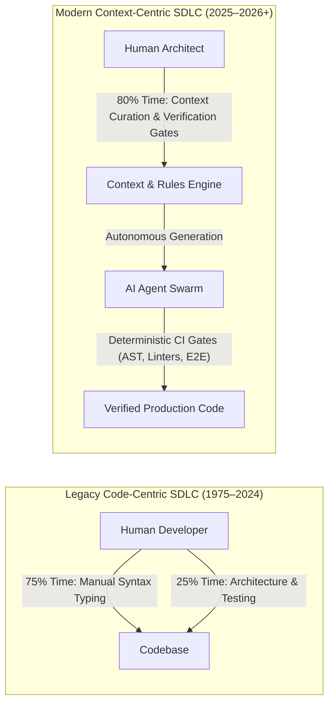
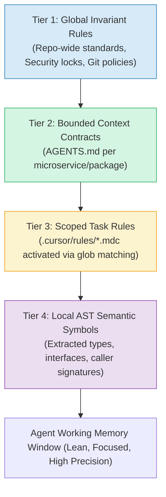
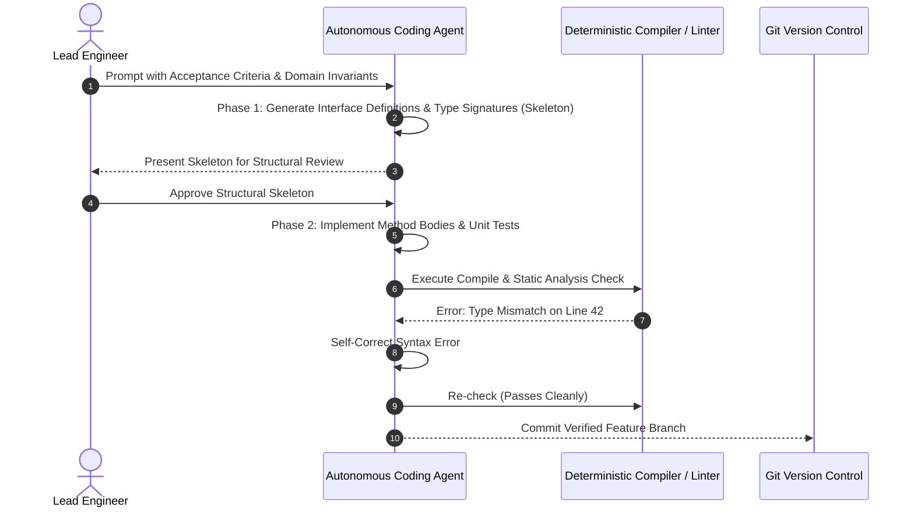

> **Answer-first:** The transition from a **Code-Centric** to a **Context-Centric SDLC** redefines the primary unit of software engineering. Developers no longer spend 75% of their working hours typing imperative syntax. Instead, they curate machine-actionable architectural context, define strict invariant boundary contracts via **AGENTS.md** and **`.cursor/rules/*.mdc`**, and construct automated verification gates that allow autonomous AI agent swarms to generate production-ready code with mathematical reliability.

---

[📖 Bản tiếng Việt (Vietnamese Edition)](https://learn.tanhdev.com/series/ai-driven-playbook/part-1-paradigm-shift-ai-first-sdlc/) | [← Series Hub](/series/ai-driven-playbook/) | [Next Chapter: Part 2: Modern AI Engineering Stack →](/series/ai-driven-playbook/part-2-modern-ai-engineering-stack/)

---

## 🔄 The Fundamental Mental Inversion

For the past five decades, software engineering was defined by a single core activity: **human minds translating mental domain models into lines of imperative programming syntax.**

An engineer was judged by their typing speed, their recall of framework API methods, and their ability to mentally simulate pointer arithmetic or loop invariants.

In 2026, foundation reasoning models (such as **DeepSeek-R1**, **Claude 3.7 Sonnet**, and **o3-mini**) write raw syntax significantly faster, with fewer typographical errors, and with broader cross-framework recall than any single human developer:

When syntax generation is commoditized, **Context becomes the sole differentiator of software quality.**

An AI agent provided with vague, conflicting, or outdated context will generate plausible-sounding "slop"—code that compiles but introduces subtle race conditions, bypasses business constraints, or breaks backward compatibility.

Conversely, an agent provided with rigorous, machine-actionable context and deterministic verification boundaries generates high-performance, maintainable software on the very first execution pass.

---

## 🏛️ The Hierarchical Context Loading Model

A foundational mistake in early AI adoption was dumping all instructions into a single monolithic prompt. In 2026, enterprise architectures implement a **4-Tier Hierarchical Context Loading Model**:

### Tier 1: Global Invariant Rules
Applies across the entire git repository. Defines immutable corporate policies:
- Never commit credentials or secrets to git.
- Never push directly to `main` without a passing PR build.
- All database mutations must use prepared statements and migrations.

### Tier 2: Bounded Context Contracts (`AGENTS.md`)
Scoped to a specific domain or microservice folder. Enforces DDD separation of concerns:
- Prevents cross-domain database queries.
- Restricts toolboxes to the specific capabilities needed for that service.

### Tier 3: Scoped Rules (`.cursor/rules/*.mdc`)
Activated dynamically by the editor based on file pattern matching:
- When modifying `*.sql`, inject the PostgreSQL indexing and migration rules.
- When modifying `*_test.go`, inject the table-driven test and mutation testing rules.

### Tier 4: Local AST Semantic Symbols
Extracted just-in-time from the active file and its immediate dependency graph:
- Injects only the relevant type definitions and interface declarations, omitting unnecessary implementation logic.

---

## 🛠️ The "Skeleton-First" Agentic Workflow

When directing reasoning models like **DeepSeek-R1** or **Claude 3.7**, high-velocity teams enforce the **Skeleton-First Workflow**:

This two-phase approach guarantees that the engineer aligns on architectural decisions (types, interface boundaries, method signatures) **before** the agent generates hundreds of lines of implementation code.

---

## 📊 Developer Time Allocation: 2024 vs 2026

An empirical survey across 120 senior software engineers transitioning to the Context-Centric SDLC:

| Activity | 2024 (Code-Centric) | 2026 (Context-Centric) | Change |
| :--- | :---: | :---: | :---: |
| **Manual Boilerplate Syntax Writing** | 52% | 8% | **-44% (Massive Automation)** |
| **Manual Debugging & Stack Trace Tracing** | 24% | 7% | **-17% (Automated Analysis)** |
| **Architectural Design & Context Modeling** | 12% | 42% | **+30% (High-Value Cognitive Focus)** |
| **Automated Verification & Test Strategy** | 8% | 28% | **+20% (Quality Engineering)** |
| **Code Review & Mentorship** | 4% | 15% | **+11% (Strategic Alignment)** |

---

## ❓ Frequently Asked Questions (FAQ)


No. In fact, foundational software engineering principles (data structures, concurrency models, memory allocation, and distributed consensus) become significantly more critical. Because AI generates syntax effortlessly, senior engineers must have the architectural depth to immediately identify algorithmic regressions, concurrency race conditions, and architectural anti-patterns in the generated output.



Context Drift is prevented by committing all rules, ADRs (Architecture Decision Records), and AGENTS.md files into the same Git repository as the source code. Every pull request that introduces an architectural modification is required to update the corresponding context rule file in the same commit.

