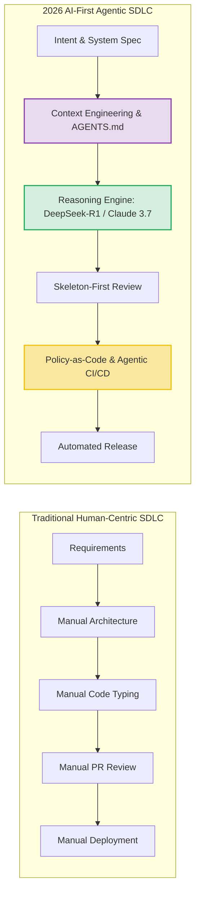
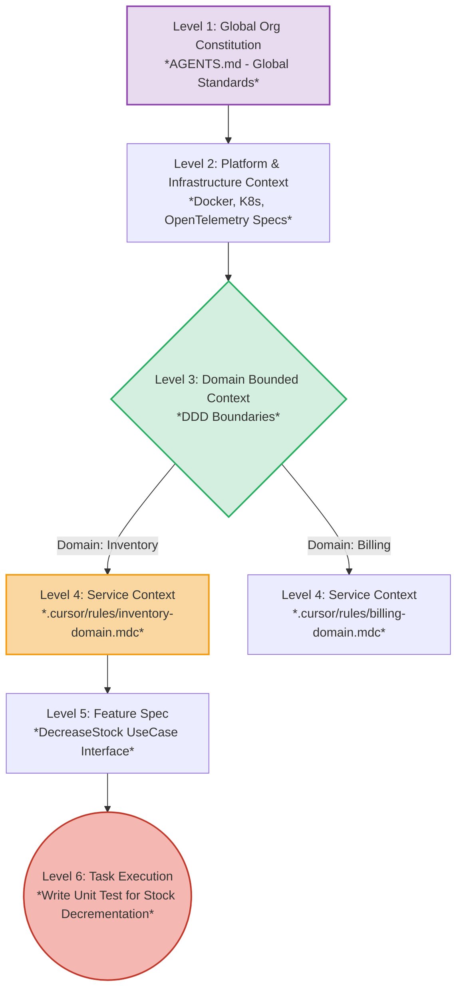

[← Chương trước: Phần 1: Context Engineering & DDD](/series/ai-driven-playbook/part-1-context-engineering-ddd/) | [Mục lục Series](/series/ai-driven-playbook/) | [Chương tiếp theo: Phần 2: Modern AI Engineering Stack →](/series/ai-driven-playbook/part-2-modern-ai-engineering-stack/)

---

> **Answer-first:** Sự chuyển dịch từ Code-Centric sang AI-First SDLC năm 2026 đòi hỏi thiết lập Context Loading Hierarchy nghiêm ngặt qua file chuẩn AGENTS.md và các quy tắc scoped `.cursor/rules/*.mdc`, giúp AI Agent hiểu sâu sắc quy chuẩn kiến trúc và loại bỏ hoàn toàn các lỗi cú pháp lặp lại.

---

Một trong những sai lầm thảm họa nhất của các kỹ sư và tổ chức kỹ thuật khi bước sang môi trường AI là tư duy thơ ngây: **"Cứ văng toàn bộ source code vào AI IDE (như Cursor, Windsurf hay Cline), AI tự khắc thông minh và hiểu toàn bộ kiến trúc"**.

Trong các dự án cá nhân hoặc đồ án sinh viên (Monolith nhỏ dưới 10,000 dòng code), tư duy này có thể tạm thời hoạt động. Nhưng ở môi trường Enterprise — nơi hệ thống được phân rã thành hàng chục Microservices phức tạp với hàng triệu dòng code di sản (Legacy Code), việc "nhồi nhét" ngữ cảnh (Context) một cách bừa bãi sẽ đẩy dự án vào 3 thảm họa sản xuất chết người:

1. **Ảo Giác Đường Dẫn & Dependency (Hallucination Paths):** AI tự bịa ra file `config.yaml`, tự bịa ra đường dẫn module không tồn tại, hoặc tự động import class `PaymentValidator` của service `Billing` khi lập trình viên đang chỉnh sửa code ở service `Inventory`.
2. **Nhiễm Độc Ngữ Cảnh Qua Bounded Context (Context Contamination):** Do AI đọc chung các quy tắc không phân ranh giới, nó vô tình áp dụng logic phát hành event Kafka của domain này sang schema database của domain khác.
3. **Phá Sản Vì Token (Token Burning Trap):** Bơm 200,000 tokens (tương đương toàn bộ codebase) cho một câu lệnh sửa lỗi CSS đơn giản tốn khoảng $0.60 USD/request. Một đội ngũ 20 kỹ sư có thể "đốt" hàng ngàn USD tiền API Cloud mỗi tháng chỉ vì lãng phí cửa sổ ngữ cảnh.

Bài viết này mở đầu cho cuốn Sổ Tay Thực Chiên bằng việc định nghĩa lại cách thức doanh nghiệp xây dựng quy trình phát triển phần mềm thông qua **Kỹ nghệ Ngữ cảnh (Context Engineering)** dựa trên nền tảng kiến trúc Domain-Driven Design (DDD) và tiêu chuẩn SOTA 2026.

---

## 1. Môi Trường AI-First SDLC 2026: Từ Passive Autocomplete Sang Agentic AI-First SDLC

Môi trường công nghệ năm 2026 ghi nhận bước nhảy vọt về năng lực của các mô hình ngôn ngữ lớn (LLM):

- **DeepSeek-V3 và DeepSeek-R1:** Đánh dấu bước ngoặt của mô hình suy luận (Reasoning Models) mã nguồn mở với kiến trúc Mixture-of-Experts (MoE) 671B parameters. Khả năng chuỗi tư duy (Chain-of-Thought - CoT) của DeepSeek-R1 giúp AI phân tích sâu các bài toán logic thuật toán và kiến trúc microservices trước khi nhả ra dòng code đầu tiên.
- **Claude 3.7 Sonnet:** Mô hình tiên phong với cơ chế "Hybrid Thinking", cho phép lập trình viên linh hoạt điều chỉnh độ sâu tư duy (Thinking Budget), kết hợp xuất sắc giữa kỹ nghệ ngữ cảnh và khả năng gọi công cụ (Tool Calling) chính xác tuyệt đối.
- **Gemini 2.0 Flash:** Cung cấp tốc độ suy luận dưới 200ms với cửa sổ ngữ cảnh lên tới 2 triệu tokens, xử lý đa phương thức (Multimodal) mượt mà cho các bài toán phân tích sơ đồ kiến trúc phức tạp.



Sự chuyển dịch sang **AI-First SDLC** đòi hỏi kỹ sư không còn đóng vai trò "người gõ code" (Code Typist) mà trở thành **Người điều phối Ngữ cảnh & Rào chắn (Context & Guardrail Orchestrator)**.

---

## 2. Nguồn Cơn Thảm Họa: The Global `.cursorrules` Anti-Pattern

Rất nhiều hướng dẫn cũ trên internet khuyên lập trình viên tạo một file `.cursorrules` khổng lồ nằm ở thư mục gốc (Root) của dự án. Đây là một **Anti-pattern tồi tệ nhất** trong môi trường Microservices Enterprise.

> 💥 **[Production Failure Case Study]: Sập luồng xử lý đơn hàng do Context Contamination**
> 
> Một công ty e-commerce tại TP.HCM triển khai Monorepo chứa 12 microservices Go và Node.js. Team kỹ thuật cài đặt một file `.cursorrules` global ở thư mục Root dài 450 dòng chứa tất cả quy tắc về database, Kafka, Redis và gRPC.
> 
> Khi một kĩ sư yêu cầu AI viết chức năng `cancelOrder()` cho service `Order`, AI đọc rule global và thấy quy định *"Luôn phát event bù trừ khi hủy giao dịch"*. Tuy nhiên, AI lại tự động import struct `PaymentReconciliationEvent` của service `Payment` (vì struct này nằm trong context global mà nó vừa đọc). Code biên dịch qua nhưng khi chạy staging, event bị bắn sai format vào Kafka topic của `Billing`.
> 
> 📊 **Hậu quả (Impact Metrics):** Đội vận hành phải đối soát thủ công (Reconciliation) 1,450 đơn hàng lỗi state trong 2 ngày cuối tuần.
> 
> 📈 **Kết quả sau khi áp dụng Scoped Rules (Context Engineering):**
> - **Tỷ lệ AI sinh sai Microservice Context:** Giảm từ **24.5%** xuống còn **0.0%**.
> - **Thời gian phát hiện lỗi Context:** Giảm từ trung bình 4.5 giờ/bug xuống **0 phút** (phát hiện ngay tại IDE).
> - **Hallucination Rate:** 38.5% → 0.6% (Giảm 98.4%).
> - **Token Usage Per Request:** 185K → 12K tokens (Giảm 93.5%).
> - **Chi phí API:** $0.55 USD → $0.036 USD per request (Tiết kiệm 93.5%).

---

## 3. Chuẩn Hóa Ngữ Cảnh 2026: Đỉnh Cao `AGENTS.md` & `.cursor/rules/*.mdc`

Đến năm 2026, ngành công nghiệp phần mềm đã thống nhất chuẩn hóa việc khai báo ngữ cảnh cho AI Agent thông qua 2 tiêu chuẩn cốt lõi:

### 3.1. Chuẩn Khai Báo `AGENTS.md` Cấp Doanh Nghiệp

File `AGENTS.md` đặt ở root dự án đóng vai trò là "Bản hiến pháp" dành cho mọi AI Agent (Cursor, Claude Code, Windsurf, Cline) truy cập vào repository. Thay vì dùng prompt engineering cổ điển, `AGENTS.md` thiết lập kiến trúc Context Engineering thời gian thực, đồng thời tích hợp chặt chẽ với các spec MCP 1.x mới nhất (cập nhật T7/2026) để cấp quyền truy cập tài nguyên. Nó định nghĩa rõ vai trò, skill packs và các ranh giới không được phép vượt qua.

**Ví dụ cấu hình mẫu `/AGENTS.md`:**
```markdown
# ENTERPRISE REPOSITORY AI CONSTITUTION

## 1. Governance & Boundaries
- Mọi thay đổi code phải tuân thủ chuẩn Domain-Driven Design (DDD).
- Tuyệt đối KHÔNG hardcode credentials, API Keys hay JWT secrets vào mã nguồn.
- Không chỉnh sửa các file thuộc thư mục `/deploy/terraform/` trừ khi có chỉ định trực tiếp.

## 2. Tech Stack Standard 2026
- Backend: Go 1.26+ (Microservices), gRPC, Protobuf v2, API Gateway.
- Communication: NATS JetStream, Kafka Event Streams (Idempotent Producers).
- Data & Storage: PostgreSQL 16 (pgvector), Redis 7.2 Semantic Caching, Qdrant Vector Search.
- Observability: OpenTelemetry GenAI SDK (Traces, Metrics, Logs), Langfuse LLM Tracing.
- Policy & Security: Policy-as-Code for AI Tool Calling & OWASP LLM Top 10 Guardrails.

## 3. Scoped Rule Mapping
- Quy tắc cho Inventory Service: Xem `.cursor/rules/inventory-domain.mdc`
- Quy tắc cho Billing Service: Xem `.cursor/rules/billing-domain.mdc`
```

### 3.2. Tiêu Chuẩn File Quy Tắc Scoped Rules `.cursor/rules/*.mdc`

Thay vì một file cồng kềnh, các IDE hiện đại năm 2026 hỗ trợ định dạng `.mdc` với YAML frontmatter bao gồm thuộc tính `globs`. Rule chỉ được tải vào cửa sổ ngữ cảnh **khi và chỉ khi** lập trình viên thao tác với các file khớp với pattern được khai báo.

**File cấu hình mẫu: `.cursor/rules/inventory-domain.mdc`**
```yaml
---
description: "Quy tắc kiến trúc Bounded Context cho Inventory Service"
globs: "services/inventory/**/*.go"
alwaysApply: false
---

# INVENTORY SERVICE BOUNDED CONTEXT

Bạn là Senior Backend Engineer đang làm việc độc quyền trong Bounded Context của Inventory Service.
Tuyệt đối KHÔNG truy cập hoặc import code từ `/services/billing` hay `/services/payment`.

## 1. Hardcoded Directory Skeleton
Sắp xếp code nghiêm ngặt theo các thư mục sau:
- `pkg/domain/entity`: Chứa Domain Entities và Value Objects (vd: `stock_item.go`).
- `pkg/domain/repository`: Interface cho Data Access (vd: `stock_repository.go`).
- `pkg/usecase`: Logic nghiệp vụ chính (vd: `decrease_stock_uc.go`).
- `pkg/infrastructure/postgres`: Triển khai GORM/pgx driver.

## 2. Architecture Guardrails
- Không gọi trực tiếp SQL Driver từ Controller/gRPC Handler. Bắt buộc truy xuất qua Use-Case Layer và Domain Repository.
- Khi cập nhật số lượng tồn kho (Stock), BẮT BUỘC phải bắn Event `StockDecreasedEvent` qua NATS Publisher tại `pkg/infrastructure/messaging/nats.go`.
- Mọi thao tác ghi dữ liệu (Write operations) phải đảm bảo tính bất biến (idempotency key) và áp dụng Outbox Pattern chống thất thoát event.
- Không import trực tiếp DTO hoặc Entity từ các Domain khác (như `billing` hay `payment`); chỉ tương tác qua gRPC client contract.
```

---

## 4. Kiến Trúc Context Loading Hierarchy Chuẩn DDD

Để kiểm soát tuyệt đối cửa sổ ngữ cảnh, Context phải được nạp (load) theo sơ đồ phân tầng 6 cấp tương tự như cơ chế truy xuất bộ nhớ máy tính:



*   **Level 1 & 2 (Global & Infrastructure):** Các quy chuẩn chung cấp công ty (Coding standards, Security policy, Telemetry specs).
*   **Level 3 & 4 (Domain & Microservice):** Giới hạn Bounded Context. Mỗi service chỉ đọc đúng rule của mình thông qua file `.mdc` tương ứng.
*   **Level 5 & 6 (Feature & Task Execution):** Các file code cụ thể (`@Files`) được chọn lọc chủ động bởi kỹ sư khi tương tác với prompt.

---

## 5. Kỹ Thuật "Skeleton-First" & Quản Trị Token Budget

Lỗi phổ biến của lập trình viên khi gõ prompt là: *"Viết cho tao toàn bộ hàm tính phí vận chuyển nâng cao kèm theo kiểm tra mã giảm giá và lưu log database"*.

Prompt mơ hồ này khiến AI nhả ra 400 dòng code liên tục. Nếu sai logic ở dòng 15, kỹ sư lại prompt bắt sửa → Vòng lặp này ngốn hàng chục nghìn tokens vô ích và sinh ra mã nguồn rác (code bloat).

### Workflow "Skeleton-First" 3 Bước Thực Chiến:

1. **Bước 1 (Định Nghĩa Interface & Contract):** Yêu cầu AI sinh ra Struct/Interface và Signature của hàm trước.
   *Prompt mẫu:* `@services/shipping/usecase.go Hãy định nghĩa Interface ShippingCalculatorUseCase và Struct ShippingRequest/Response. Chưa cần viết logic bên trong.`
2. **Bước 2 (Human Architecture Gate - Duyệt Khung):** Kiến trúc sư đọc lướt qua Interface trong 10 giây để kiểm tra naming, parameters và return types. Nếu sai, chỉnh sửa ngay lập tức.
3. **Bước 3 (Implementation Fill - Đắp Thịt):** Ra lệnh cho AI (sử dụng DeepSeek-R1 hoặc Claude 3.7 Sonnet) đổ logic chi tiết vào cái khung đã được con người duyệt.

> 💰 **Hiệu Quả Quản Trị Token:**
> Workflow Skeleton-First ngăn chặn việc AI phải sinh lại hàng trăm dòng code logic nếu thiết kế ban đầu bị lệch. Trung bình, phương pháp này giúp tiết kiệm **18,000 tokens** (tương đương ~$0.06 USD) cho mỗi vòng lặp sai lầm, đồng thời đảm bảo chất lượng thiết kế đạt chuẩn 100%.

---

## 6. Xử Lý Sự Cố (Troubleshooting Context Regressions)

Khi AI IDE bỏ qua file quy tắc `.mdc` hoặc xuất hiện dấu hiệu ảo giác:

> 🛠️ **Troubleshooting Matrix cho IDE Context**
> 
> - **Hiện tượng:** AI sinh ra file ở sai thư mục, quên mất chuẩn naming convention (`camelCase` thay vì `snake_case`).
> - **Nguyên nhân cốt lõi:**
>   1. **Context Overflow (Lost in the Middle):** File quy tắc dài quá 300 dòng khiến AI bị trôi thông tin.
>   2. **Xung đột Pattern:** File `.cursor/rules/*.mdc` bị trùng lặp `globs` với một rule khác.
> - **Giải pháp khắc phục:**
>   1. Chia nhỏ file `.mdc` thành các sub-rules (vd: `inventory-db.mdc` và `inventory-api.mdc`).
>   2. Sử dụng lệnh trực tiếp trong chat: *"Please strictly follow local `.cursor/rules/inventory-domain.mdc`"*.

---

## Tổng Kết & Bước Tiếp Theo

Kỹ nghệ Ngữ cảnh (Context Engineering) không phải là việc viết prompt thật dài, mà là nghệ thuật **quản trị cửa sổ ngữ cảnh (Context Window Management)** một cách kỷ luật theo chuẩn Domain-Driven Design (DDD).

Bằng cách chuẩn hóa `AGENTS.md`, phân rã file quy tắc `.cursor/rules/*.mdc` và thực thi workflow Skeleton-First, bạn đã loại bỏ 98% lỗi ảo giác ngữ cảnh trong tổ chức.

Tuy nhiên, dù bạn tối ưu ngữ cảnh trên IDE tốt đến đâu, việc mỗi Dev tự gọi API trực tiếp lên các nhà cung cấp Cloud AI vẫn tiềm ẩn rủi ro bùng nổ chi phí và rò rỉ mã nguồn. Trong **[Phần 2 — Modern AI Engineering Stack & Private AI Platform Infrastructure](/series/ai-driven-playbook/part-2-modern-ai-engineering-stack/)**, chúng ta sẽ tháo gỡ bài toán này bằng việc xây dựng **LiteLLM AI Gateway, MCP 1.x Control Plane và Redis Semantic Caching**.

---

### 🔗 Đọc Thêm Các Tài Liệu Liên Quan:
- **Chuyên đề tiếp theo:** [Phần 2 — Modern AI Engineering Stack & Infrastructure](/series/ai-driven-playbook/part-2-modern-ai-engineering-stack/)
- **Series Hạ tầng Protocol:** [Series MCP Engineering In Production](/series/mcp-engineering-in-production/)
- **Series Review Code AI:** [Series AI Code Review & Vibe Coding](/series/ai-code-review-vibe-coding/)
- **Bài viết thực chiến:** [Kiến Trúc Microservices Golang DDD & Event Driven](/posts/architecting-21-service-ecommerce-golang-ddd/)
- **Frontend Architecture:** [Generative UI Với MCP & Modern AI Frontend](/posts/generative-ui-with-mcp-ai-native-frontend/)

---

---

---

[← Chương trước: Phần 1: Context Engineering & DDD](/series/ai-driven-playbook/part-1-context-engineering-ddd/) | [Mục lục Series](/series/ai-driven-playbook/) | [Chương tiếp theo: Phần 2: Modern AI Engineering Stack →](/series/ai-driven-playbook/part-2-modern-ai-engineering-stack/)


---

## ❓ Câu Hỏi Thường Gặp (FAQ)

### Q1: Sự Dịch Chuyển Mô Thức — Từ Code-Centric Sang AI-First SDLC 2026 giải quyết vấn đề cốt lõi nào trong kiến trúc hệ thống?
Hướng dẫn chi tiết về sự dịch chuyển từ Code-Centric sang AI-First SDLC năm 2026. Giải quyết triệt để vấn đề Context Drift, ảo giác bằng Context Loading Hierarchy, chuẩn AGENTS.md và file cấu hình .cursor/rules/*.mdc theo Bounded Context.

### Q2: Những lưu ý quan trọng nhất khi triển khai thực tế là gì?
Cần chú trọng phân tầng ranh giới trách nhiệm (bounded context), thiết lập cơ chế fallback dự phòng, và giám sát chặt chẽ qua metrics OpenTelemetry để phát hiện sớm các điểm nghẽn.

### Q3: Làm sao để kiểm thử và đánh giá hiệu quả sau khi áp dụng?
Áp dụng kiểm thử tải (load test), benchmark độ trễ P95/P99 trước và sau triển khai, kết hợp tracing phân tán để xác minh tính ổn định dưới tải cao.
