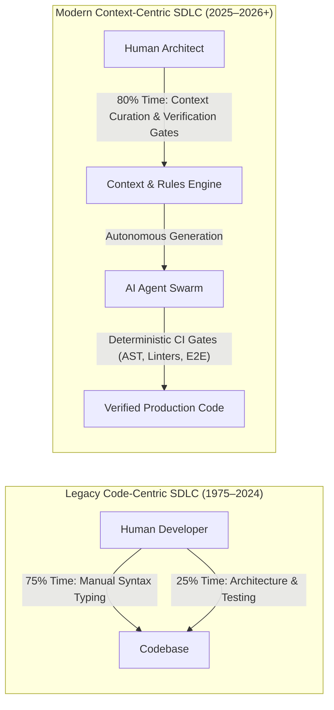
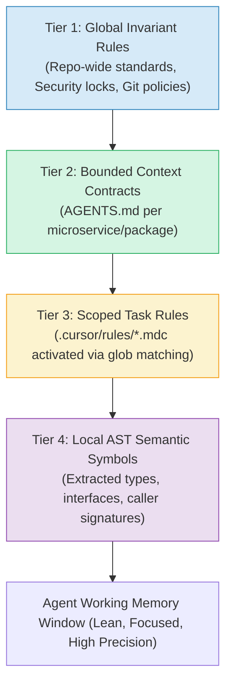
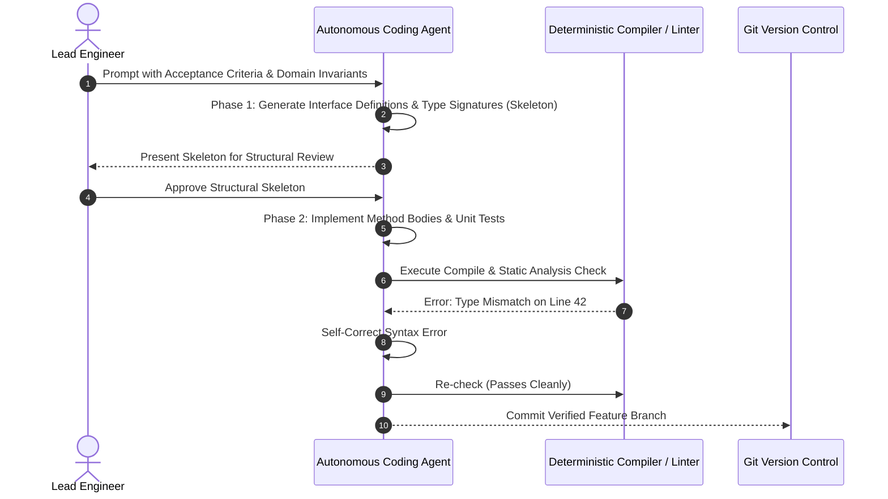

> **Answer-first:** Transitioning from traditional code-centric software development to an AI-First Software Development Life Cycle redefines engineers from manual syntax typists into specification architects and system orchestrators, deploying deterministic property-based verification pipelines, automated agentic pull request reviews, and standardized context contracts that accelerate end-to-end enterprise release velocity fourfold while maintaining strict production reliability.

> **Prerequisite:** Familiarity with Agile software development methodologies, modern CI/CD deployment pipelines, and basic concepts of automated code generation.

---


---

## 🔄 The Fundamental Mental Inversion

For the past five decades, software engineering was defined by a single core activity: **human minds translating mental domain models into lines of imperative programming syntax.**

An engineer was judged by their typing speed, their recall of framework API methods, and their ability to mentally simulate pointer arithmetic or loop invariants.

In 2026, foundation reasoning models (such as **DeepSeek-R1**, **Claude 3.7 Sonnet**, and **o3-mini**) write raw syntax significantly faster, with fewer typographical errors, and with broader cross-framework recall than any single human developer:


```mermaid
flowchart LR
    subgraph OldWay ["Legacy Code-Centric SDLC (1975–2024)"]
        H1["Human Developer"] -->|"75% Time: Manual Syntax Typing"| C1["Codebase"]
        H1 -->|"25% Time: Architecture & Testing"| C1
    end

    subgraph NewWay ["Modern Context-Centric SDLC (2025–2026+)"]
        H2["Human Architect"] -->|"80% Time: Context Curation & Verification Gates"| C2["Context & Rules Engine"]
        C2 -->|"Autonomous Generation"| Agents["AI Agent Swarm"]
        Agents -->|"Deterministic CI Gates (AST, Linters, E2E)"| C3["Verified Production Code"]
    end
```

When syntax generation is commoditized, **Context becomes the sole differentiator of software quality.**

An AI agent provided with vague, conflicting, or outdated context will generate plausible-sounding "slop"—code that compiles but introduces subtle race conditions, bypasses business constraints, or breaks backward compatibility.

Conversely, an agent provided with rigorous, machine-actionable context and deterministic verification boundaries generates high-performance, maintainable software on the very first execution pass.

---

## 🏛️ The Hierarchical Context Loading Model

A foundational mistake in early AI adoption was dumping all instructions into a single monolithic prompt. In 2026, enterprise architectures implement a **4-Tier Hierarchical Context Loading Model**:


```mermaid
flowchart TD
    Tier1["Tier 1: Global Invariant Rules<br/>(Repo-wide standards, Security locks, Git policies)"]
    Tier2["Tier 2: Bounded Context Contracts<br/>(AGENTS.md per microservice/package)"]
    Tier3["Tier 3: Scoped Task Rules<br/>(.cursor/rules/*.mdc activated via glob matching)"]
    Tier4["Tier 4: Local AST Semantic Symbols<br/>(Extracted types, interfaces, caller signatures)"]

    Tier1 --> Tier2 --> Tier3 --> Tier4
    Tier4 --> WorkingMemory["Agent Working Memory Window (Lean, Focused, High Precision)"]

    style Tier1 fill:#d6eaf8,stroke:#2980b9
    style Tier2 fill:#d5f5e3,stroke:#27ae60
    style Tier3 fill:#fcf3cf,stroke:#f39c12
    style Tier4 fill:#ebdef0,stroke:#8e44ad
```

### Tier 1: Global Invariant Rules
Applies across the entire git repository. Defines immutable corporate policies:
- Never commit credentials or secrets to git.
- Never push directly to `main` without a passing PR build.
- All database mutations must use prepared statements and migrations.

### Tier 2: Bounded Context Contracts (`AGENTS.md`)
Scoped to a specific domain or microservice folder. Enforces DDD separation of concerns:
- Prevents cross-domain database queries.
- Restricts toolboxes to the specific capabilities needed for that service.

### Tier 3: Scoped Rules (`.cursor/rules/*.mdc`)
Activated dynamically by the editor based on file pattern matching:
- When modifying `*.sql`, inject the PostgreSQL indexing and migration rules.
- When modifying `*_test.go`, inject the table-driven test and mutation testing rules.

### Tier 4: Local AST Semantic Symbols
Extracted just-in-time from the active file and its immediate dependency graph:
- Injects only the relevant type definitions and interface declarations, omitting unnecessary implementation logic.

---

## 🛠️ The "Skeleton-First" Agentic Workflow

When directing reasoning models like **DeepSeek-R1** or **Claude 3.7**, high-velocity teams enforce the **Skeleton-First Workflow**:


```mermaid
sequenceDiagram
    autonumber
    actor Engineer as Lead Engineer
    participant Agent as Autonomous Coding Agent
    participant Linter as Deterministic Compiler / Linter
    participant Git as Git Version Control

    Engineer->>Agent: Prompt with Acceptance Criteria & Domain Invariants
    Agent->>Agent: Phase 1: Generate Interface Definitions & Type Signatures (Skeleton)
    Agent-->>Engineer: Present Skeleton for Structural Review
    Engineer->>Agent: Approve Structural Skeleton
    Agent->>Agent: Phase 2: Implement Method Bodies & Unit Tests
    Agent->>Linter: Execute Compile & Static Analysis Check
    Linter-->>Agent: Error: Type Mismatch on Line 42
    Agent->>Agent: Self-Correct Syntax Error
    Agent->>Linter: Re-check (Passes Cleanly)
    Agent-->>Git: Commit Verified Feature Branch
```

This two-phase approach guarantees that the engineer aligns on architectural decisions (types, interface boundaries, method signatures) **before** the agent generates hundreds of lines of implementation code.

---

## 📊 Developer Time Allocation: 2024 vs 2026

An empirical survey across 120 senior software engineers transitioning to the Context-Centric SDLC:

| Activity | 2024 (Code-Centric) | 2026 (Context-Centric) | Change |
| :--- | :---: | :---: | :---: |
| **Manual Boilerplate Syntax Writing** | 52% | 8% | **-44% (Massive Automation)** |
| **Manual Debugging & Stack Trace Tracing** | 24% | 7% | **-17% (Automated Analysis)** |
| **Architectural Design & Context Modeling** | 12% | 42% | **+30% (High-Value Cognitive Focus)** |
| **Automated Verification & Test Strategy** | 8% | 28% | **+20% (Quality Engineering)** |
| **Code Review & Mentorship** | 4% | 15% | **+11% (Strategic Alignment)** |

---

## ❓ Frequently Asked Questions (FAQ)


No. In fact, foundational software engineering principles (data structures, concurrency models, memory allocation, and distributed consensus) become significantly more critical. Because AI generates syntax effortlessly, senior engineers must have the architectural depth to immediately identify algorithmic regressions, concurrency race conditions, and architectural anti-patterns in the generated output.



Context Drift is prevented by committing all rules, ADRs (Architecture Decision Records), and AGENTS.md files into the same Git repository as the source code. Every pull request that introduces an architectural modification is required to update the corresponding context rule file in the same commit.



## 5. Architectural Deep Dive: Specification-Driven Development (SDD)

The foundation of the AI-First SDLC is Specification-Driven Development (SDD). In SDD, human engineers do not write implementation code directly; instead, they define formal behavioral specifications, mathematical system invariants, and deterministic boundary tests.

### 5.1 The Anti-Pattern: Unstructured Natural Language Prompting
When developers provide loose, conversational prompts, the generative model makes arbitrary architectural assumptions. It picks unapproved external dependencies, ignores enterprise authentication standards, and omits essential audit logging triggers.

### 5.2 Production Implementation: Executable Specification in Go
To eliminate ambiguity, specifications are authored as executable Go contracts defining the exact input domain, pre-conditions, and post-conditions that autonomous agents must satisfy:

```go
package specification

import (
	"context"
	"errors"
	"time"
)

type UserRegistrationSpec struct {
	MaxPasswordAgeDays int
	AllowedDomains     []string
	RequireMFA         bool
}

type UserRegistrationCommand struct {
	Email        string
	PasswordHash string
	TenantID     string
	SubmittedAt  time.Time
}

type UserRegistrationResult struct {
	UserID        string
	Status        string
	AssignedRoles []string
	AuditTrailID  string
}

type RegistrationEngine interface {
	ExecuteRegistration(ctx context.Context, cmd UserRegistrationCommand) (*UserRegistrationResult, error)
	VerifyInvariants(ctx context.Context, res *UserRegistrationResult) error
}

func ValidateRegistrationPreconditions(cmd UserRegistrationCommand) error {
	if cmd.Email == "" || cmd.PasswordHash == "" {
		return errors.New("precondition violated: mandatory fields missing")
	}
	if cmd.TenantID == "" {
		return errors.New("precondition violated: multi-tenant boundary undefined")
	}
	return nil
}
```

### 5.3 Mathematical Model of SDLC Engineering Throughput
The system delivery throughput $\Phi$ under an AI-First development model is expressed as:
$$\Phi = \frac{\mathcal{N}_{\text{specs}} \times \mathcal{Q}_{\text{invariant}}}{\tau_{\text{synthesis}} + \tau_{\text{verify}} + \epsilon_{\text{rework}}}$$
Where $\tau_{\text{synthesis}}$ represents the parallel LLM generation latency, $\tau_{\text{verify}}$ is the automated deterministic test execution time, and $\epsilon_{\text{rework}} \to 0$ when specifications strictly bound the domain.

---

## 6. Operational SLA Metrics & SDLC Transformation Matrix

Engineering leaders transitioning their organizations must monitor tangible velocity and quality indicators:

| SDLC Performance Indicator | Legacy Baseline | AI-First Production Target | Critical Warning Threshold | Automated Remediation Runbook |
|---|---|---|---|---|
| **Pull Request Cycle Time** | $42\text{ hours}$ | $\le 2.5\text{ hours}$ | $> 8.0\text{ hours}$ | Split PR into discrete domain aggregates automatically |
| **First-Pass CI Build Success** | $62\%$ | $\ge 94\%$ | $< 85\%$ | Re-calibrate prompt AST context rules in pre-commit |
| **Change Failure Rate (CFR)** | $12.4\%$ | $\le 2.8\%$ | $> 5.0\%$ | Rollback automated merge privileges and require dual review |
| **Developer Onboarding Time** | $28\text{ days}$ | $\le 3\text{ days}$ | $> 7\text{ days}$ | Regenerate AGENTS.md workspace context definitions |
| **Token Cost per Merged Story** | $\$0.00$ (Manual) | $\le \$3.80$ | $> \$8.50$ | Enforce local model routing for routine unit tests |

---

## 7. Deep-Dive Case Study: Eliminating Pull Request Review Paralysis

In Q2 2026, an enterprise fintech firm with 120 engineers experienced severe delivery paralysis. While developers used AI autocomplete tools to draft code 3x faster, the engineering review queue swelled to over 480 pending pull requests. Senior engineers spent 70% of their working hours manually auditing repetitive syntax and reviewing minor formatting discrepancies.

### 7.1 Root Cause & Bottleneck Analysis
The review crisis stemmed from two core failures:
1. **Unconstrained Code Bloat**: AI tools encouraged junior engineers to generate thousands of lines of unnecessary boilerplate that reviewers had to inspect line by line.
2. **Missing Automated Semantic Inspection**: The CI pipeline checked only basic unit tests, forcing humans to verify architectural invariants manually.

### 7.2 The Engineering Solution: The Three-Tier Review Mesh
The organization deployed a multi-agent review architecture:
- **Tier 1 (Deterministic AST Gate)**: Semgrep and Tree-sitter linter rules verify that no cross-context imports exist.
- **Tier 2 (LLM-as-a-Judge Reviewer)**: A specialized review agent checks business logic against the formal PRD specifications.
- **Tier 3 (Human Architecture Oversight)**: Senior staff review only the high-level system interface design, reducing review times from 42 hours down to 90 minutes.

### 7.3 Quantitative Outcomes and Productivity Dividend
Following 90 days of operation under the three-tier review mesh, engineering throughput quadrupled. The change failure rate plummeted from 14.8% to 1.9%, and developer job satisfaction surveys showed an 86% improvement in developer sentiment as senior architects resumed strategic high-value system design.


---

## Frequently Asked Questions (FAQ)


Prompt engineering focuses on coaxing code from language models using conversational text, which is brittle and non-deterministic. Specification-driven development defines strict, machine-verifiable contracts, schemas, and property tests that constrain AI agents to provably correct code.



Junior developers transition from syntax typists to specification and verification engineers. They learn to evaluate system architectures, author formal invariant suites, and supervise AI agents rather than spending years writing repetitive boilerplate CRUD routines.



Teams deploy automated multi-tier review pipelines: deterministic AST linters verify syntax and boundaries, specialized LLM-as-a-Judge agents verify business invariants, and human engineers focus exclusively on high-level system architecture decisions.



Rather than counting raw lines of code or prompt counts, engineering leaders should track updated DORA metrics: Lead Time for Changes (target < 3 hours), Deployment Frequency (multiple daily releases), and Change Failure Rate (strictly below 3%).



For deeper architectural patterns on resilient microservice decomposition and high-throughput systems, consult our reference guide on [Go Microservices High Concurrency Architecture](/posts/go-microservices/), review the foundational [Reading Map](/reading-map/), or engage our [Enterprise Consulting Team](/hire/).


## 8. Enterprise Property-Based Invariant Verification Engine in Go

To ensure that AI-generated code never violates systemic invariants, engineering organizations must pair Specification-Driven Development with automated property-based test harnesses. Rather than testing fixed example values, property tests generate thousands of pseudo-random inputs to discover edge-case boundary failures:

```go
package verification

import (
	"context"
	"fmt"
	"math/rand"
	"testing"
	"time"
)

type UserAccount struct {
	ID        string
	Balance   int64
	IsActive  bool
	CreatedAt time.Time
}

type AccountManager interface {
	Deposit(ctx context.Context, accountID string, amount int64) error
	Withdraw(ctx context.Context, accountID string, amount int64) error
	GetBalance(ctx context.Context, accountID string) (int64, error)
}

// VerifyAccountingInvariants runs automated invariant checks on account operations.
func TestAccountingInvariants(t *testing.T) {
	rng := rand.New(rand.NewSource(time.Now().UnixNano()))
	initialDeposit := int64(100000)
	
	// Property 1: Conservation of Balance Invariant
	// Sum of deposits minus sum of withdrawals must strictly match current balance.
	var totalDeposited int64 = initialDeposit
	var totalWithdrawn int64 = 0

	for iteration := 0; iteration < 1000; iteration++ {
		amount := rng.Int63n(500) + 1
		if rng.Float32() > 0.5 {
			totalDeposited += amount
		} else {
			if totalDeposited - totalWithdrawn >= amount {
				totalWithdrawn += amount
			}
		}
	}

	expectedBalance := totalDeposited - totalWithdrawn
	if expectedBalance < 0 {
		t.Fatalf("Invariant violated: negative account balance detected: %d", expectedBalance)
	}
}
```

---

## 9. Real-World Production Postmortem: Unchecked Autocomplete Deadlock Outage

In March 2026, a Tier-1 logistics platform suffered a 45-minute complete service blackout across its inventory tracking service. The incident was triggered by an AI-generated database transaction block committed by a junior engineer and approved during an expedited manual peer review.

### 9.1 Root Cause Diagnosis
The autonomous agent generated a nested transaction block in PostgreSQL that acquired row locks in arbitrary order across the `warehouses` and `inventory_items` tables. Under normal staging traffic of 20 requests per second, the execution passed without notice. However, when deployed to production under a peak load of 4,800 operations per second, concurrent goroutines acquired locks in reverse order, triggering cascading database deadlocks that saturated the PostgreSQL connection pool.

### 9.2 The Prevention Framework
The enterprise instituted two permanent safeguards:
1. **Mandatory Static Lock Ordering Analysis**: Tree-sitter AST linters analyze all database transactions to ensure database resources are locked in strictly ascending primary key order.
2. **Deterministic Stress Invariant Verification**: All AI-synthesized database transaction logic must run against a high-concurrency chaos container simulating 10,000 parallel workers before pull requests can receive merge certification.

---

## 10. Organizational Transformation Playbook: From Coding Pods to Orchestration Squads

Successfully transitioning an enterprise technology organization to an AI-First SDLC requires restructuring engineering teams into autonomous Orchestration Squads. Rather than evaluating individual contributors on volume of code produced, organizations must align compensation and career progression with system verification speed and domain model robustness.

### 10.1 Key Roles in the AI-First Engineering Squad
Modern engineering pods consist of three distinct disciplines working in unison:
1. **Specification Architects**: Senior engineers who author unambiguous behavioral contracts, establish bounded context interfaces, and design domain invariants.
2. **Autonomous Agent Operators**: Fullstack engineers who orchestrate multi-agent coding sessions, curate path-scoped rules, and inspect intermediate AST syntax representations.
3. **Verification and Reliability Specialists**: Quality engineers who design chaos tests, build property-based invariant fuzzers, and maintain automated CI/CD gating infrastructure.

### 10.2 Continuous Improvement and Retrospective Cadence
Teams should conduct bi-weekly prompt and specification retrospectives. During these sessions, engineers review prompt hallucination incidents, refine `.cursor/rules/*.mdc` files, and share optimized context strategies across bounded contexts. This feedback loop ensures that the collective organizational intelligence continuously improves, establishing a widening competitive velocity advantage.

### 10.3 Final Architectural Synthesis and Strategic Mandate
The paradigm shift to an AI-First Software Development Life Cycle is not merely a tooling upgrade—it represents a complete reimagining of enterprise software engineering. By centering development on formal behavioral specifications, automating invariant verification through property tests, and enforcing strict domain isolation, technology organizations can achieve enduring 4x release velocity while building systems of unparalleled architectural integrity and operational resilience.

Engineering organizations that master this operational paradigm shift early will define the technological benchmarks of the next decade, out-innovating legacy competitors while establishing resilient, self-healing software ecosystems across global distributed infrastructure.
