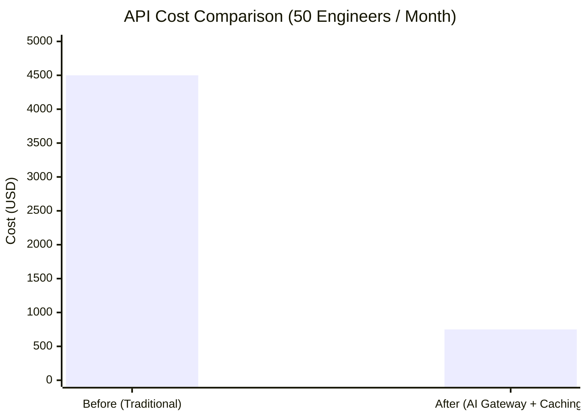
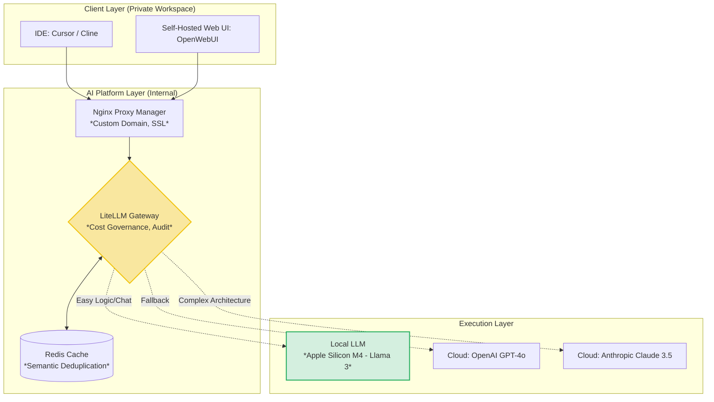

---
title: "Part 2 — AI Platform Layer: Building a Private AI Ecosystem & Architectural Freedom"
date: 2026-05-14T08:00:00+07:00
lastmod: 2026-05-14T08:00:00+07:00
draft: false
description: "Escape the Pay-per-seat and Vendor Lock-in traps by building an internal AI Gateway, enforcing Cost Governance, and leveraging the power of Local LLMs."
ShowToc: true
TocOpen: true
weight: 3
categories: ["Series", "Enterprise Playbook"]
tags: ["AI", "Enterprise Architecture", "CTO", "Tech Lead"]
cover:
  image: "/images/posts/hybrid-ai-pipeline-cover.png"
  alt: "AI-Driven Engineer Enterprise Playbook series: workflows, autonomous pipelines, and tooling"
  relative: false
---

In [Part 1](/series/ai-driven-playbook/part-1-context-engineering-ddd/), we solved the code quality problem using *Context Engineering*. But when you start scaling AI across the entire organization, Chief Technology Officers (CTOs) immediately hit another wall: **Cost and Security**.

## 1. The "Pay-per-seat" Trap and Data "Blind Spots"

Consider this analogy: Buying GitHub Copilot or ChatGPT Enterprise licenses for 100 engineers is like buying traditional "Pay-per-seat" SaaS software. As your team balloons, costs multiply exponentially. Worse, if OpenAI decides to double their prices tomorrow, you have absolutely **no way out (Vendor Lock-in)**.

> **[Production Failure Case Study]: Source Code Leakage & Cost Explosion**
> A Fintech company in Vietnam gave their Dev team a budget to buy Claude API keys for their IDEs. The consequences:
> 1. In the first month, the API bill hit **$4,500** because Devs used automated prompts to generate test cases running silently on CI/CD without any Caching mechanism.
> 2. The Security team discovered a Junior Dev accidentally "pasted" a code snippet containing a Database connection string (with passwords) into a third-party Chatbot Web UI with no security SLA.
> 📊 **Impact Metrics:** Leaked 1 production credential, R&D budget overrun exceeded 300%.
> 📈 **Before/After (Post Private AI Gateway Implementation):**
> - **Before:** Average API cost was **~$90/Dev/Month**. 100% blind to audit logs.
> - **After:** Costs plummeted to **~$15/Dev/Month** thanks to Semantic Caching (Cache Hit rate reached 65%). Completely blocked PII (Personally Identifiable Information) data from leaving the internal network.



To take control of the game, enterprises must build an **AI Platform Layer** sitting between the Dev team and the AI providers.

---

## 2. The Private AI Ecosystem Architecture

The essence of this architecture is to "Intercept" all API traffic from employee IDEs or browsers and route it through an internal control gateway.



---

## 3. Hands-on Infrastructure: Deploying LiteLLM & OpenWebUI

Using just Docker, you can set up this entire system in 15 minutes.

*   **LiteLLM:** Acts as the AI Gateway. It provides a standard API that is 100% compatible with OpenAI's format, but underneath, it can route to any model (Anthropic, Gemini, Llama).
*   **OpenWebUI:** A highly polished chat interface (similar to ChatGPT) installed internally. BAs, QAs, and Devs can log in using company SSO and chat safely—data is never used for training.
*   **Nginx Proxy Manager (NPM):** Wraps SSL and creates custom domains (e.g., `ai.yourcompany.internal`) for easy integration with other tools.

**Sample Docker Compose Configuration (`real infra`):**
```yaml
version: '3.8'
services:
  litellm:
    image: ghcr.io/berriai/litellm:main-latest
    ports:
      - "4000:4000"
    volumes:
      - ./litellm_config.yaml:/app/config.yaml
    command: [ "--config", "/app/config.yaml" ]

  openwebui:
    image: ghcr.io/open-webui/open-webui:main
    ports:
      - "3000:8080"
    environment:
      - OPENAI_API_BASE_URL=http://litellm:4000/v1
      - OPENAI_API_KEY=sk-litellm-internal-key
```

---

## 4. AI Cost Governance

Once you have the Gateway, you hold the supreme power to enable "wallet-protecting" features (Cost Governance).

### 4.1. Token Quota & Request Batching
In `litellm_config.yaml`, you can set limits: The Backend Team can spend a maximum of $500/month; the Marketing Team $100/month. When Budget Limits are hit, the Gateway automatically blocks requests or falls back to a free model.

### 4.2. Smart Routing Policy
Clearly define rules:
- If the request is translating text or generating boilerplate code (HTML/CSS) $\rightarrow$ Force route to a cheap model (`claude-3-haiku` or Local LLM).
- If the request contains keywords like "system architecture" or requires a large context window $\rightarrow$ Route to an expensive model (`claude-3.5-sonnet`).

### 4.3. Caching & Semantic Deduplication
This is the most terrifyingly effective money-saving feature. When multiple Devs ask the same question (e.g., *"Write a unit test for the Login function"*), the Gateway catches it and returns the result from the Redis Cache instantly at **$0 cost and 10ms latency**, instead of paying for a redundant Cloud call.

> 💰 **Cost Numbers:** Implementing Semantic Caching and Routing Policies helps an organization of 50 Devs slash API costs from ~$3,000/month down to just ~$850/month, while accelerating response latency by 400% for duplicate queries.

---

## 5. Fallback & Local LLMs: The Apple Silicon Goldmine

Enterprises shouldn't rely solely on the Cloud. The advent of massive Unified Memory architectures like **Apple Silicon M4 (running Mac Studio or Mac Mini)** has changed the game.

With RAM capacities ranging from 64GB to 192GB, you can run extremely powerful Open-source models (like `Llama-3-70B` or `Qwen-2.5-Coder`) right in your office using Ollama.


**The Dual Benefit:**
1. **Zero API Cost:** Inference for 90% of basic CRUD tasks is completely free.
2. **Absolute Privacy:** Sensitive data (like financial trading algorithms) never leaves the internal network.

Just add one line to LiteLLM to set up a Fallback:
```yaml
# litellm_config.yaml
model_list:
  - model_name: gpt-4o
    litellm_params:
      model: openai/gpt-4o
      api_key: "os.environ/OPENAI_API_KEY"
  - model_name: claude-3.5-sonnet
    litellm_params:
      model: anthropic/claude-3-5-sonnet-20240620
      api_key: "os.environ/ANTHROPIC_API_KEY"
  - model_name: local-coder
    litellm_params:
      model: ollama/qwen2.5-coder:32b
      api_base: http://mac-studio-internal:11434

router_settings:
  routing_strategy: usage-based-routing
  fallbacks:
    - {"gpt-4o": ["claude-3.5-sonnet", "local-coder"]} # Auto-fallback on connection failure

litellm_settings:
  master_key: "sk-litellm-master-key" # Master API Key protecting the entire Gateway
  success_callback: ["langfuse"] # Fire Telemetry & Observability logs
  cache: true # Enable Semantic Caching
  cache_params:
    type: redis
    host: "redis-internal"

environment_variables:
  LANGFUSE_PUBLIC_KEY: "os.environ/LANGFUSE_PUBLIC_KEY"
  LANGFUSE_SECRET_KEY: "os.environ/LANGFUSE_SECRET_KEY"
```

---

## Conclusion

Building an **AI Platform Layer** isn't just about looking cool. It is an exercise in Risk Management. When you master the Gateway, you master the **Data Flow** and the **Cash Flow**.

However, this system currently acts merely as a "Filter Funnel". Your AI still lacks its own *internal knowledge* about your company's development history, Confluence documents, or legacy Database structures.

To inject "Domain Knowledge" into this AI's brain and permanently eradicate guesswork, we will move on to the most "heavyweight" technical challenge in this era: **[Part 3A — Enterprise RAG Architecture: Building the Internal Brain](/series/ai-driven-playbook/part-3a-enterprise-rag-architecture/)**.
