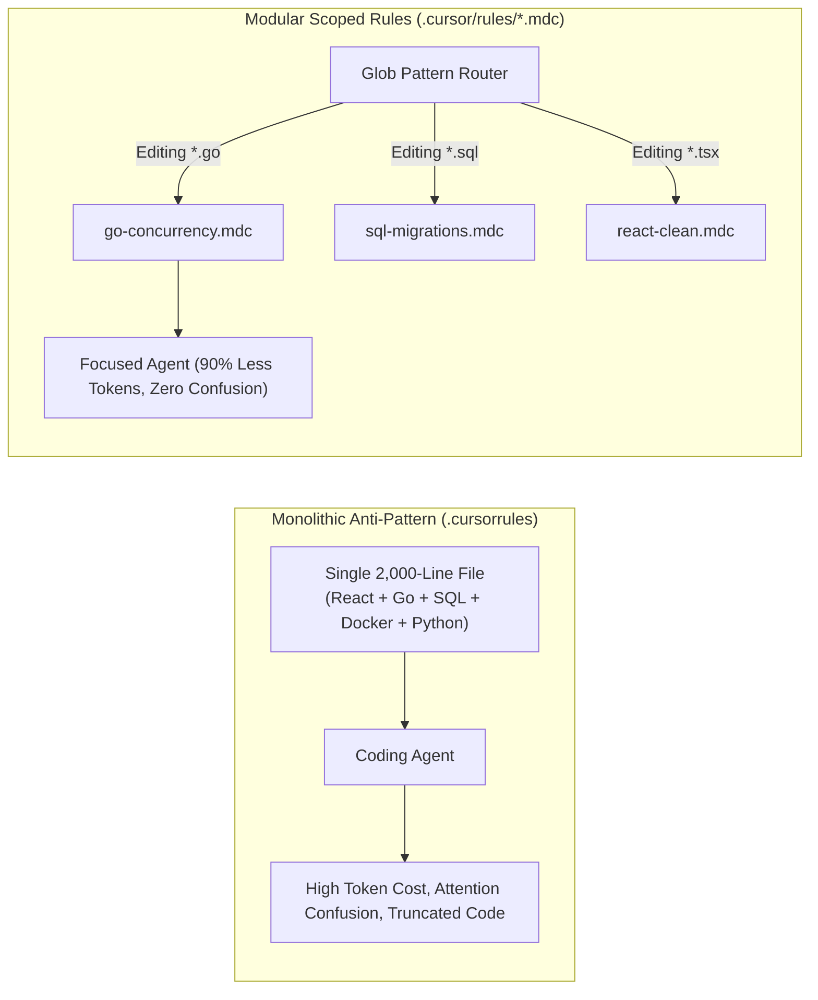
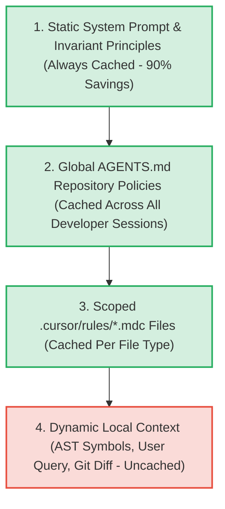

> **Answer-first:** Advanced Context Engineering moves beyond monolithic system prompts by organizing constraints into **modular, glob-scoped `.cursor/rules/*.mdc` files** and standardized **AGENTS.md contracts**. By binding rules dynamically to active file patterns and capitalizing on **prefix prompt caching** (achieving a 90% latency and cost reduction), teams provide coding agents with razor-sharp focus while preventing context window pollution.

---

[📖 Bản tiếng Việt (Vietnamese Edition)](https://learn.tanhdev.com/series/ai-driven-playbook/part-3a-context-engineering-cursor-rules/) | [← Series Hub](/series/ai-driven-playbook/) | [Next Chapter: Part 3A: Enterprise RAG Architecture →](/series/ai-driven-playbook/part-3a-enterprise-rag-architecture/)

---

## 1. The Death of the Monolithic Prompt File

In early AI coding setups, teams placed a massive 2,000-line `.cursorrules` file at the root of their repository containing every guideline imaginable: React component standards, Go concurrency patterns, SQL migration rules, and CSS styling guides.

In production, this naive approach collapses under two primary failure modes:

1. **Instruction Contamination**: While a developer is writing a Go backend microservice, the LLM consumes thousands of tokens of React/TailwindCSS rules, muddying its attention weights and prompting hallucinated JavaScript conventions inside Go files.
2. **Context Window Starvation**: Burning 15,000 tokens on irrelevant rules for every prompt exhausts the model's working memory, forcing it to drop critical AST symbol context or truncate generated code.



---

## 2. The `.cursor/rules/*.mdc` Standard (SOTA 2026)

In modern AI-augmented IDEs, rules are decoupled into standalone markdown files with YAML frontmatter specifying **glob triggers** and **activation priorities**:

### Example: `.cursor/rules/golang-zero-alloc.mdc`

```markdown
---
description: Zero-allocation high-concurrency coding standards for Go microservices
globs: ["**/*.go", "!**/*_test.go"]
alwaysApply: false
---

# Go High-Performance & Concurrency Standards

## Memory Allocation Invariants
- On hot network execution paths (`internal/transport/...`), heap allocations are strictly prohibited.
- Always reuse byte buffers via `sync.Pool` rather than allocating fresh slices inside request loops.
- Prefer passing structs by value when size is <= 64 bytes to permit compiler escape analysis onto the stack.

## Concurrency & Goroutine Safety
- Never spawn naked goroutines (`go func() { ... }()`). Every goroutine MUST be bound to a `sync.WaitGroup` or managed by an errgroup context.
- Channel buffers must have an explicit capacity. Unbuffered channels are only permitted for synchronous handshakes.

```

### Example: `.cursor/rules/postgresql-migrations.mdc`

```markdown
---
description: PostgreSQL migration constraints and transactional schema evolution
globs: ["migrations/*.sql", "internal/db/**/*.sql"]
alwaysApply: false
---

# PostgreSQL Migration Standards

## Lock Contention Guardrails
- `ALTER TABLE ... ADD COLUMN` with a non-null default MUST NOT lock large tables. Use PostgreSQL 11+ metadata defaults or execute multi-step migrations.
- Index creation on production tables MUST use `CREATE INDEX CONCURRENTLY`.
- All migration scripts must set `SET statement_timeout = '5s';` at the top of the transaction.
```

---

## 3. Prompt Caching Economics

Modern frontier models (Anthropic Claude 3.7, DeepSeek-V3/R1, Google Gemini) implement **Prefix Prompt Caching**. When prompt tokens match an exact cached prefix, the provider delivers:
- **90% Discount** on input token billing.
- **80% Reduction** in Time-to-First-Token (TTFT).

To maximize cache hits, Context Engineering enforces strict **lexicographical ordering of prompt elements**:



By placing volatile, dynamic context (e.g., current file diffs, timestamps, conversation turns) at the very bottom of the prompt buffer, the upper 85% of the prompt remains permanently cached in LLM memory.

---

## 4. Real-World Before/After Code Benchmark

Below is an authentic before/after illustration of an agent implementing a high-throughput TCP connection pool:

### ❌ Without Context Engineering (Naive Monolithic Prompt)
The agent allocates unbounded memory, ignores context cancellation, and leaks goroutines:

```go
// BAD: Leaks goroutines, naked channel, heap allocates every read
func HandleRequests(conns chan net.Conn) {
    for conn := range conns {
        go func(c net.Conn) {
            buf := make([]byte, 4096) // Escapes to heap!
            n, _ := c.Read(buf)
            fmt.Println("Received:", string(buf[:n]))
        }(conn)
    }
}
```

### ✅ With Scoped Rule (`golang-zero-alloc.mdc`)
The agent adheres to `sync.Pool` buffer reuse, structured errgroups, and zero heap allocations:

```go
// GOOD: sync.Pool buffer reuse, context-bound worker pool, zero allocs
var bufPool = sync.Pool{
    New: func() any {
        b := make([]byte, 4096)
        return &b
    },
}

func HandleRequestsWithPool(ctx context.Context, conns <-chan net.Conn, eg *errgroup.Group) {
    for {
        select {
        case <-ctx.Done():
            return
        case conn, ok := <-conns:
            if !ok {
                return
            }
            eg.Go(func() error {
                defer conn.Close()
                bufPtr := bufPool.Get().(*[]byte)
                defer bufPool.Put(bufPtr)

                n, err := conn.Read(*bufPtr)
                if err != nil {
                    return err
                }
                return processPayload((*bufPtr)[:n])
            })
        }
    }
}
```

---

## ❓ Frequently Asked Questions (FAQ)


A well-structured production repository typically maintains between 6 and 12 scoped rule files. Rather than creating a rule for every file, create rules centered around technology boundaries (e.g., `backend-go.mdc`, `frontend-react.mdc`, `database-migrations.mdc`, `testing-standards.mdc`).



The root `AGENTS.md` acts as the supreme constitutional document, defining non-negotiable security invariant boundaries and tool access permissions. The `.cursor/rules/*.mdc` files act as operational bylaws that provide domain-specific coding patterns triggered only when relevant files are modified.

