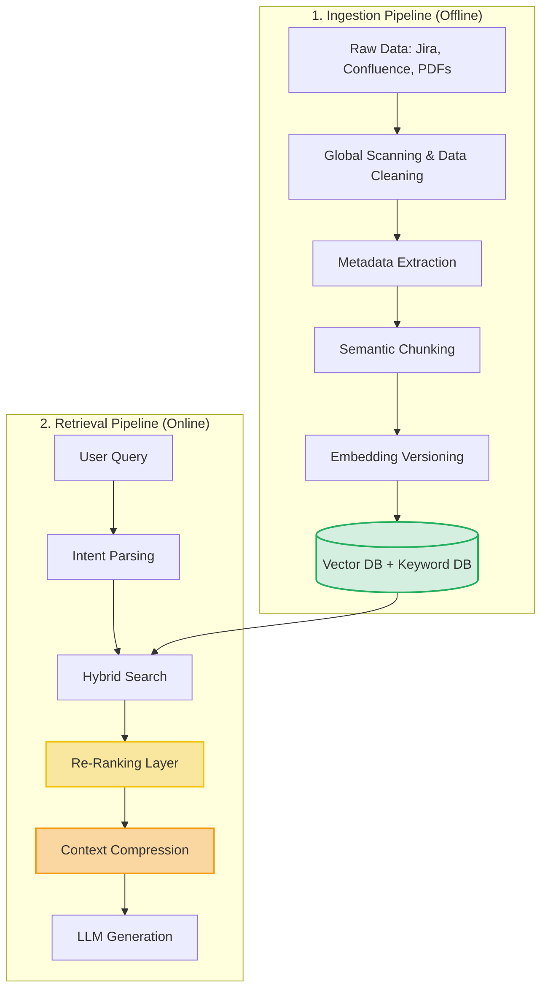

---

title: "Part 3A — Enterprise RAG Architecture: Building the Internal 'Brain'"
date: "2026-05-15T08:00:00+07:00"
lastmod: "2026-05-15T08:00:00+07:00"
draft: false
description: "Building RAG in an Enterprise isn't just dumping PDFs into a VectorDB."
ShowToc: true
TocOpen: true
weight: 4
categories: ["Series", "Enterprise Playbook"]
tags: ["AI", "Enterprise Architecture", "CTO", "Tech Lead"]
cover:
  image: "images/posts/hybrid-ai-pipeline-cover.png"
  alt: "AI-Driven Engineer Enterprise Playbook series: workflows, autonomous pipelines, and tooling"
  relative: false
author: "Lê Tuấn Anh"
canonicalURL: "https://tanhdev.com/series/ai-driven-playbook/part-3a-enterprise-rag-architecture/"
mermaid: true
---

90% of RAG (Retrieval-Augmented Generation) tutorials online are "toy examples": Write 10 lines of Python, read a PDF file, perform naive chunking, stuff it into a Vector Database, and then run a Q&A.

But when you apply that system in an Enterprise reality, it collapses immediately. In an Enterprise environment, RAG is not an AI Problem; inherently, it is a **Data Architecture Problem**.

## 1. The "Plug-and-Play" Illusion & Garbage-In, Garbage-Out

The biggest pain point of Enterprise RAG is "Data Noise" generated from mindless Naive Chunking.

> **[Production Failure Case Study]: The SKU and Quantity Mix-up Disaster**
> A Logistics company used RAG to extract reconciliation data from thousands of scanned PDF invoices. They used a fixed-size chunking algorithm, cutting text every 500 characters.
> When the LLM received the query: *"How many products with the code VNM-2024 did Customer X buy?"*, because the chunking algorithm accidentally sliced a data table in half, the LLM mistook the number `2024` in the SKU code for the "Quantity" column.
> Result: The system automatically dispatched 2,024 products from the warehouse instead of 5. The company suffered heavy financial losses.
> 📊 **Impact Metrics:** Erroneously dispatched 2,019 products, resulting in $45,000 in warehousing and customer compensation damages.
> 📈 **Before/After (Post Semantic Chunking):**
> - **Before:** Table Hallucination rate reached up to 35%.
> - **After:** Semantic Chunking preserved table structures and Headings. Data misread rate plummeted to **< 1%**.

To solve this, we cannot just "shove" data blindly into the system. A complete Data Pipeline is required.

---

## 2. Enterprise RAG Pipeline Architecture

Below is the standard blueprint of an Enterprise-grade RAG processing flow:



---

## 3. Data Ingestion & The "Global Scanning" Technique

Instead of chopping up text by character count (Fixed-size chunking), use the **Global Scanning** technique.

When ingesting an invoice or a Confluence document, the system executes **2 passes**:
*   **Pass 1 (Global Scan):** Use a small model (like Llama 3 8B) to skim the entire document and extract clear, structured fields: `SKU Code`, `Creation Date`, `Author`, `Document Type`.
*   **Pass 2 (Semantic Chunking):** Based on Markdown structure or HTML tags, split the text by "Arguments" (Heading/Paragraph) rather than cutting midway through sentences.

As a result, the invoice data table remains intact with its row/column structure, ensuring the AI never confuses an SKU code with a Quantity.

**Snippet: Extracting Metadata via LLM (Pass 1)**
```python
from pydantic import BaseModel
import instructor
from openai import OpenAI

# Define a strict, deterministic Data Schema
class DocumentMetadata(BaseModel):
    document_type: str
    author: str
    creation_date: str
    sku_codes: list[str]

# Use the Instructor library to force the LLM to return valid Pydantic JSON
client = instructor.from_openai(OpenAI(base_url="https://ai.yourcompany.internal/v1"))

def extract_metadata(raw_text: str) -> DocumentMetadata:
    return client.chat.completions.create(
        model="local-llama3", # Use a free internal model to save global scanning costs
        response_model=DocumentMetadata,
        messages=[
            {"role": "system", "content": "You are a metadata extraction system. Do not add extra text."},
            {"role": "user", "content": f"Extract from the following document: {raw_text[:2000]}"}
        ],
    )
```

**Snippet: Semantic Chunking with LangChain (Pass 2)**
```python
from langchain_text_splitters import MarkdownHeaderTextSplitter

markdown_document = "# Monthly Report\n## Revenue\n100 Billion\n## Costs\n..."

# Split text based on semantic structure (Headings) instead of character counts
headers_to_split_on = [
    ("#", "Header 1"),
    ("##", "Header 2"),
]

markdown_splitter = MarkdownHeaderTextSplitter(
    headers_to_split_on=headers_to_split_on,
    strip_headers=False
)
semantic_chunks = markdown_splitter.split_text(markdown_document)
# Result: Text chunks are never broken mid-table or mid-thought.
```

---

## 4. Metadata Strategy & Hybrid Search

LLM Embeddings are notoriously bad at finding exact keywords (Exact Match). If you search for the error code `"ERR_KAFKA_502"`, a Vector algorithm might return generic HTTP 502 errors because their "semantics" are similar.

This is why Enterprise RAG mandates **Hybrid Search**:
1. **Dense Retrieval (Vector Search):** Used to capture meaning (e.g., "How to set up the dev environment").
2. **Sparse Retrieval (BM25 / Keyword Search):** Used to precisely catch code snippets, UUIDs, and SKU codes.

**Metadata Strategy:** During Ingestion (Pass 1), we extracted `Creation Date` and `Author`. Store these as Metadata in the VectorDB (like Pinecone/Milvus). When a user queries, the system pre-filters Metadata first (e.g., *Only fetch documents from 2026*), and then performs the Vector search. Speed will increase 10-fold.

---

## 5. Knowledge Freshness: Keeping Data "Fresh"

A RAG system becomes a disaster if the AI guides Devs using a Deprecated Docs file from 3 years ago. Architects must have a **Knowledge Freshness** strategy:

1. **Temporal Ranking:** In the results scoring algorithm, documents updated last week must receive a higher weight (decay function) compared to documents from last year.
2. **Stale Embedding Invalidation:** You must integrate Webhooks with Jira/Confluence. When a ticket status moves to `Done` or is deleted, the Pipeline must immediately soft-delete the old vector and embed the new one.
3. **Hot/Cold Knowledge Tier:** Current Config files and Codebases $\rightarrow$ Stored in RAM/Hot DB. Chat logs from 2023 $\rightarrow$ Stored in Cold Storage to save infrastructure costs.

---

## 6. Context Compression & Re-Ranking

Suppose Hybrid Search returns the top 20 chunks of text. If you throw all 20 chunks into a prompt for Claude 3.5, you will burn around 15,000 tokens (costing money) and the AI's focus gets "diluted" (Lost in the Middle).

This is where the **Re-Ranking Layer** steps in. Use a tiny Cross-Encoder model (like `bge-reranker`) to re-score the relevance of those 20 chunks against the original query. It filters down to the 3 most essential chunks.

Next, pass these 3 chunks through a **Context Compression** engine.
> 💡 Instead of sending the full block: *"In the event of a network error, the system will execute a retry 3 times and then call the fallback function"*, the system compresses it to: *"Retry 3x on network error -> fallback"*.
> **Cost Numbers:** Re-Ranking + Compression techniques reduce Prompt Tokens by 70%, saving thousands of USD per month and pushing answer accuracy to absolute perfection.

> ⏱️ **Performance Benchmark (RAG Latency):**
> - **Pure Vector Search:** ~45ms (Fast but noisy).
> - **Hybrid Search (BM25 + Vector) + Metadata Filter:** ~120ms (High accuracy).
> - **Cross-Encoder Re-ranking Layer:** ~200ms (Added latency but extremely worthwhile).
> - **Total Retrieval Time:** **~365ms** $\rightarrow$ 50x faster than dumping thousands of pages of docs into an LLM and forcing it to read (takes ~15s).

---

## 7. Troubleshooting: Diagnosing "RAG Low Accuracy"

Despite a standard architecture, RAG can still encounter issues in production. Below is a System Engineer's diagnostic method when accuracy drops.

> 🛠️ **Troubleshooting: RAG Hallucinations / Low Accuracy**
> - **Symptom:** The rate of wrong or Irrelevant answers spikes to **> 40%**. Users complain the AI is "acting stupid."
> - **Root Cause:** 
>   1. **Poor Chunking:** Rigidly cutting documents by character count breaks context (e.g., slicing a critical data table in half).
>   2. **Insufficient Metadata:** Queries get diluted due to missing metadata. The AI accidentally picks up a 3-year-old document sharing a keyword with the question.
> - **Actionable Solution:** 
>   1. Purge the entire old Index. Reconfigure the Ingestion Pipeline to **Semantic Chunking** (Cut by Heading/Paragraph).
>   2. Enable **Hybrid Search** (Keyword BM25 + Vector) to definitively cure specialized terminology mix-ups.
>   3. Mandate Ingestion with Metadata (`author`, `date`, `version`) to power Pre-filtering.

---

## Conclusion

An **Enterprise RAG Architecture** can never be "Plug-and-Play". It requires the meticulousness of a Data Engineer in data cleaning, the cunning of a Backend Engineer in setting up Hybrid Search, and the vision of a System Architect to maintain the "freshness" of the knowledge lifecycle.

Once this internal "Brain" is loaded with clean, accurate, and real-time data, it is time to bring it out to generate actual Cash Flow (ROI) for the company.

In **Part 3B**, we will see how to use the AI Platform and RAG to solve "money-making" operational problems: *Automated Reconciliation, Excel Report Processing, and freeing up thousands of manual labor hours for the Operations team.*
