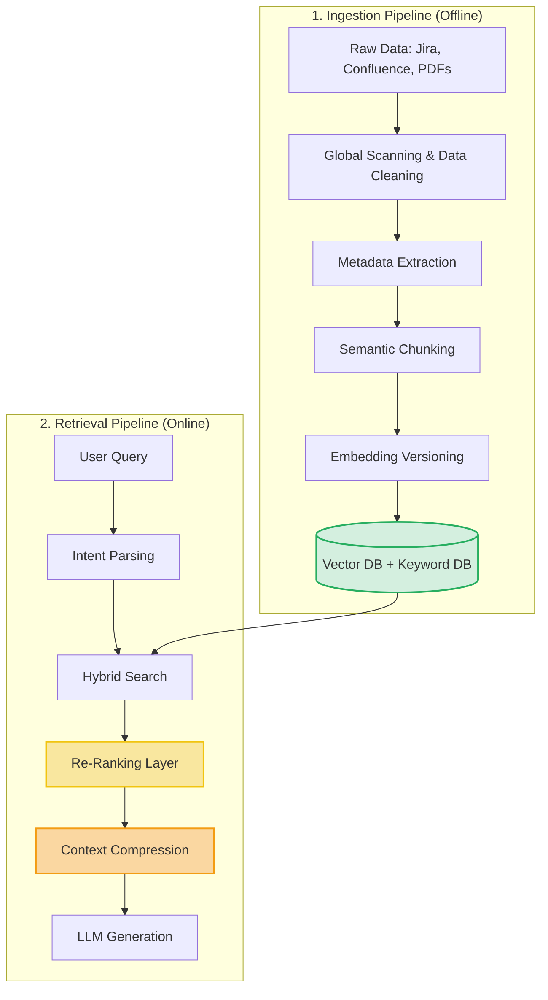

[← Chương trước: Phần 3A: Cursor Rules & MCP Tooling](/series/ai-driven-playbook/part-3a-context-engineering-cursor-rules/) | [Mục lục Series](/series/ai-driven-playbook/) | [Chương tiếp theo: Phần 3B: AI Automation Internal Ops →](/series/ai-driven-playbook/part-3b-ai-automation-internal-ops/)

---

> **Answer-first:** Kiến trúc Enterprise RAG hiện đại cho codebase lớn kết hợp quét cấu trúc layout-aware, tìm kiếm lai (hybrid search giữa vector và BM25) cùng bộ tái xếp hạng Cross-Encoder, mang lại độ trễ truy xuất dưới 400ms và độ chính xác ngữ cảnh vượt trội cho các kỹ sư.

---

90% các bài hướng dẫn về RAG (Retrieval-Augmented Generation) trên mạng đều là những ví dụ toy đơn giản: Viết 10 dòng Python, đọc một file PDF, thực hiện naive chunking, nhét vào một Vector Database, và sau đó chạy một ứng dụng Q&A.

Khi bạn áp dụng hệ thống đó vào môi trường enterprise (doanh nghiệp), nó sẽ thất bại. Trong môi trường enterprise, RAG không phải là một bài toán AI; về bản chất, nó là một **Data Architecture Problem** (Bài toán Kiến trúc Dữ liệu).

---

## 1. Ảo tưởng "Plug-and-Play" & Garbage-In, Garbage-Out

Enterprise RAG thất bại khi naive vector ingestion xử lý các tài liệu chưa được làm sạch, tạo ra các context embeddings kém chất lượng dẫn đến câu trả lời bị hallucination.

Nỗi đau lớn nhất của Enterprise RAG là "Data Noise" (Nhiễu dữ liệu) sinh ra từ Naive Chunking phi cấu trúc.

> 🔥 **[Production Failure]: Thảm họa nhầm lẫn SKU và Số lượng**
> Một công ty Logistics sử dụng RAG để trích xuất reconciliation data (dữ liệu đối soát) từ hàng nghìn hóa đơn PDF được scan. Họ đã sử dụng thuật toán fixed-size chunking (chunking với kích thước cố định), cắt văn bản sau mỗi 500 ký tự.
> Khi LLM nhận được truy vấn: *"Khách hàng X đã mua bao nhiêu sản phẩm có mã VNM-2024?"*, do thuật toán chunking vô tình cắt ngang một data table (bảng dữ liệu), LLM đã nhầm lẫn con số `2024` trong mã SKU thành cột "Quantity" (Số lượng).
> Kết quả: Hệ thống tự động xuất 2.024 sản phẩm từ kho thay vì 5. Công ty phải gánh chịu tổn thất tài chính nặng nề.
> 📊 **Impact Metrics (Số liệu Tác động):** Giao nhầm 2.019 sản phẩm, dẫn đến thiệt hại 45.000 USD chi phí lưu kho và đền bù khách hàng.
> 📈 **Before/After (Sau Semantic Chunking):**
> - **Trước đó:** Tỷ lệ Table Hallucination lên đến 35%.
> - **Sau đó:** Semantic Chunking đã giữ nguyên cấu trúc bảng và Headings. Tỷ lệ đọc sai dữ liệu giảm mạnh xuống **< 1%**.

Để giải quyết vấn đề này, chúng ta không thể chỉ ném dữ liệu một cách mù quáng vào hệ thống. Một Data Pipeline hoàn chỉnh là điều bắt buộc.

---

## 2. Kiến trúc Enterprise RAG Pipeline

Các Enterprise RAG pipelines kết hợp layout-aware document ingestion, hybrid dense-sparse vector indexing, các reranking models, và các RBAC security gates.

**Enterprise RAG Pipeline Architecture Topology (Cấu trúc mạng Kiến trúc):** Sơ đồ kiến trúc mô tả chi tiết quá trình thực thi 2 giai đoạn (two-stage execution path): offline document ingestion với global scanning và online hybrid retrieval với cross-encoder reranking.


```mermaid
flowchart TD
    subgraph "1. Ingestion Pipeline (Offline)"
        Raw["Raw Data: Jira, Confluence, PDFs"] --> Scanner["Global Scanning & Data Cleaning"]
        Scanner --> Metadata["Metadata Extraction"]
        Metadata --> Chunk["Semantic Chunking"]
        Chunk --> Embed["Embedding Versioning"]
        Embed --> VectorDB[("Vector DB + Keyword DB")]
    end

    subgraph "2. Retrieval Pipeline (Online)"
        Query["User Query"] --> Intent["Intent Parsing"]
        Intent --> Hybrid["Hybrid Search"]
        VectorDB --> Hybrid
        Hybrid --> Ranker["Re-Ranking Layer"]
        Ranker --> Compress["Context Compression"]
        Compress --> LLM["LLM Generation"]
    end

    style VectorDB fill:#d4efdf,stroke:#27ae60,stroke-width:2px
    style Ranker fill:#f9e79f,stroke:#f1c40f,stroke-width:2px
    style Compress fill:#fad7a1,stroke:#f39c12,stroke-width:2px
```

---

## 3. Data Ingestion & Kỹ thuật "Global Scanning"

Các kỹ thuật global scanning parse cấu trúc tài liệu thành các cây AST phân cấp (hierarchical AST trees), tạo ra multi-level summary embeddings cho các file enterprise phức tạp.

Thay vì chia nhỏ văn bản theo số lượng ký tự (Fixed-size chunking), hãy sử dụng kỹ thuật **Global Scanning**.

Khi ingest một hóa đơn hoặc một tài liệu Confluence, hệ thống sẽ thực hiện **2 passes** (2 vòng lặp):
*   **Pass 1 (Global Scan):** Sử dụng một model nhỏ (như Llama 3 8B) để quét toàn bộ tài liệu và trích xuất các trường dữ liệu có cấu trúc, rõ ràng: `SKU Code`, `Creation Date`, `Author`, `Document Type`.
*   **Pass 2 (Semantic Chunking):** Dựa trên cấu trúc Markdown hoặc các HTML tags, chia văn bản theo "Arguments" (Heading/Paragraph) thay vì cắt ngang giữa câu.

Kết quả là, bảng dữ liệu hóa đơn vẫn giữ nguyên được cấu trúc row/column (hàng/cột), đảm bảo AI không bao giờ nhầm lẫn một mã SKU với một Quantity (số lượng).

**LLM Metadata Extraction Script:** Hàm `extract_metadata` tận dụng Pydantic và thư viện Instructor để thực thi type-safe metadata extraction (trích xuất metadata đảm bảo kiểu dữ liệu) từ các raw enterprise documents sử dụng một LLM endpoint nội bộ.

```python
from pydantic import BaseModel
import instructor
from openai import OpenAI

# Định nghĩa một Data Schema nghiêm ngặt, có tính xác định (deterministic)
class DocumentMetadata(BaseModel):
    document_type: str
    author: str
    creation_date: str
    sku_codes: list[str]

# Sử dụng thư viện Instructor để ép LLM trả về JSON Pydantic hợp lệ
client = instructor.from_openai(OpenAI(base_url="https://ai.yourcompany.internal/v1"))

def extract_metadata(raw_text: str) -> DocumentMetadata:
    return client.chat.completions.create(
        model="local-llama3", # Sử dụng internal model miễn phí để tiết kiệm chi phí global scanning
        response_model=DocumentMetadata,
        messages=[
            {"role": "system", "content": "You are a metadata extraction system. Do not add extra text."},
            {"role": "user", "content": f"Extract from the following document: {raw_text[:2000]}"}
        ],
    )
```

**Semantic Markdown Chunking Implementation:** Đoạn code `MarkdownHeaderTextSplitter` minh họa việc chia nhỏ tài liệu markdown theo các ranh giới header (header boundaries) thay vì số lượng ký tự cố định để ngăn chặn sự phân mảnh bảng và câu.

```python
from langchain_text_splitters import MarkdownHeaderTextSplitter

markdown_document = "# Monthly Report\n## Revenue\n100 Billion\n## Costs\n..."

# Chia văn bản dựa trên semantic structure (các Headings) thay vì số lượng ký tự
headers_to_split_on = [
    ("#", "Header 1"),
    ("##", "Header 2"),
]

markdown_splitter = MarkdownHeaderTextSplitter(
    headers_to_split_on=headers_to_split_on,
    strip_headers=False
)
semantic_chunks = markdown_splitter.split_text(markdown_document)
# Kết quả: Các text chunks không bao giờ bị cắt vỡ giữa chừng một bảng dữ liệu hoặc một ý.
```

---

## 4. Chiến lược Metadata & Hybrid Search

Kết hợp metadata payload pre-filtering (tiền lọc dựa trên metadata) với hybrid vector retrieval đảm bảo rằng các truy vấn tìm kiếm enterprise nhắm trúng chính xác các phiên bản tài liệu và phân cấp quyền (authorization tiers).

Các LLM Embeddings thường gặp khó khăn khi tìm kiếm các từ khóa chính xác (Exact Match). Nếu bạn tìm kiếm mã lỗi `"ERR_KAFKA_502"`, một thuật toán Vector có thể trả về các lỗi HTTP 502 chung chung vì "semantics" (ngữ nghĩa) của chúng tương tự nhau.

Đó là lý do tại sao Enterprise RAG bắt buộc phải có **Hybrid Search**:
1. **Dense Retrieval (Vector Search):** Được sử dụng để nắm bắt ý nghĩa (ví dụ: "Làm cách nào để setup môi trường dev").
2. **Sparse Retrieval (BM25 / Keyword Search):** Được sử dụng để bắt chính xác các code snippets, UUID, và các mã SKU.

**[RAG Retrieval Matrix] [Specification]:** Hàm `reciprocal_rank_fusion` kết hợp các keyword rankings của BM25 với các dense vector distance scores (điểm khoảng cách vector) bằng cách sử dụng Reciprocal Rank Fusion để tạo ra các context candidates thống nhất.

```python
from typing import List, Dict, Any

def reciprocal_rank_fusion(dense_results: List[Dict[str, Any]], sparse_results: List[Dict[str, Any]], k: int = 60) -> List[Dict[str, Any]]:
    """Kết hợp các điểm số retrieval từ dense vector và sparse BM25 sử dụng RRF."""
    rrf_scores = {}
    
    for rank, doc in enumerate(dense_results):
        doc_id = doc["id"]
        rrf_scores[doc_id] = rrf_scores.get(doc_id, 0.0) + (1.0 / (k + rank + 1))
        
    for rank, doc in enumerate(sparse_results):
        doc_id = doc["id"]
        rrf_scores[doc_id] = rrf_scores.get(doc_id, 0.0) + (1.0 / (k + rank + 1))
        
    sorted_docs = sorted(rrf_scores.items(), key=lambda item: item[1], reverse=True)
    return [{"id": doc_id, "score": score} for doc_id, score in sorted_docs]
```

---

## 5. Knowledge Freshness: Giữ cho Dữ liệu luôn "Fresh"

Knowledge freshness (Độ tươi của tri thức) yêu cầu streaming CDC synchronization (đồng bộ hóa CDC dạng stream) và tự động vector TTL invalidation để ngăn các tài liệu lỗi thời lọt vào các RAG contexts.

Một hệ thống RAG sẽ trở nên không đáng tin cậy nếu AI hướng dẫn cho Devs bằng một file Docs đã Deprecated từ 3 năm trước. Các Architects phải có một chiến lược **Knowledge Freshness**:

1. **Temporal Ranking:** Trong thuật toán results scoring (chấm điểm kết quả), các tài liệu cập nhật tuần trước phải nhận được trọng số (weight) cao hơn (theo dạng decay function) so với các tài liệu từ năm ngoái.
2. **Stale Embedding Invalidation:** Tích hợp Webhooks với Jira/Confluence. Khi trạng thái một ticket chuyển sang `Done` hoặc bị xóa, Pipeline phải ngay lập tức thực hiện soft-delete vector cũ và embed vector mới.
3. **Hot/Cold Knowledge Tier:** Các Config files hiện tại và Codebases → Lưu trữ trong RAM/Hot DB. Lịch sử chat log từ 2023 → Lưu trữ trong Cold Storage để tiết kiệm chi phí hạ tầng.

---

## 6. Context Compression & Re-Ranking

Các mô hình cross-encoder reranking nén các retrieved vector candidates xuống chỉ còn top-N context snippets có độ liên quan cao nhất, tối đa hóa hiệu suất của LLM prompt.

Giả sử Hybrid Search trả về top 20 text chunks (các khối văn bản). Nếu bạn ném toàn bộ 20 chunks này vào prompt cho Claude 3.5, bạn sẽ đốt khoảng 15.000 tokens (rất tốn tiền) và sự tập trung của AI bị pha loãng (hiện tượng Lost in the Middle).

Đây là lúc **Re-Ranking Layer** phát huy tác dụng. Hãy sử dụng một model Cross-Encoder siêu nhỏ (như `bge-reranker`) để tính toán lại điểm số (re-score) mức độ liên quan của 20 chunks đó đối với truy vấn ban đầu. Nó sẽ lọc xuống chỉ còn lại 3 chunks cốt lõi nhất.

Tiếp theo, truyền 3 chunks này qua một công cụ **Context Compression** (Nén ngữ cảnh).
> [!TIP]
> Thay vì gửi toàn bộ một đoạn dài: *"Trong trường hợp xảy ra lỗi mạng, hệ thống sẽ thực hiện retry 3 lần và sau đó gọi hàm fallback"*, hệ thống nén nó lại thành: *"Retry 3x khi có lỗi mạng -> fallback"*.
> [!IMPORTANT] Phân tích Chi phí (Cost Analysis)
> Các kỹ thuật Re-Ranking + Compression giảm thiểu 70% lượng Prompt Tokens, tiết kiệm hàng nghìn USD mỗi tháng và đẩy độ chính xác của câu trả lời lên mức high precision (độ chuẩn xác cao).

> [!NOTE] Benchmark Hiệu năng (RAG Latency)
> - **Pure Vector Search:** ~45ms (Nhanh nhưng nhiễu).
> - **Hybrid Search (BM25 + Vector) + Metadata Filter:** ~120ms (Độ chính xác cao).
> - **Cross-Encoder Re-ranking Layer:** ~200ms (Thêm độ trễ nhưng cực kỳ đáng giá).
> - **Total Retrieval Time:** **~365ms** → Nhanh hơn 50 lần so với việc đổ hàng nghìn trang Docs vào một LLM và ép nó phải đọc (mất ~15s).

---

## 7. Troubleshooting: Chuẩn đoán hiện tượng "RAG Low Accuracy"

Việc chẩn đoán hiện tượng RAG accuracy (độ chính xác RAG) thấp đòi hỏi phải cô lập các nguyên nhân gây mất dữ liệu ở các ranh giới ingestion chunk (chunk boundary loss), các ngưỡng điểm số vector distance, và các cài đặt ngưỡng reranker threshold.

Khi độ chính xác sụt giảm trên môi trường production, các engineers có thể làm theo bảng ma trận chuẩn đoán (diagnostic matrix) có cấu trúc sau đây:

| Triệu chứng lỗi (Failure Symptom) | Nguyên nhân gốc rễ (Root Cause) | Giải pháp Kỹ thuật (Engineering Resolution) | Chỉ số mục tiêu (Target Metric) |
|---|---|---|---|
| **High Table Hallucinations (>35%)** | Fixed-size chunking cắt ngang các data tables | Chuyển sang sử dụng Markdown/AST Header Semantic Chunking | Hallucinations < 1% |
| **Bỏ sót khi tìm kiếm các đoạn Code (Alphanumeric)** | Dense embeddings thiếu đi khả năng tokenization đối với exact match | Triển khai Sparse BM25 + Dense Hybrid Search sử dụng RRF | Code Recall @ 5 > 95% |
| **Bị chèn các tài liệu cũ (Deprecated Doc Injection)** | Thiếu cơ chế temporal decay & TTL invalidation | Triển khai pipeline CDC Webhook vector invalidation | Freshness SLA < 5 min |
| **Chi phí Token & Latency cao** | Đưa các candidates chưa được lọc vào trong prompt | Tích hợp Cross-Encoder Re-Ranker để lọc từ top 20 xuống top 3 | Giảm 70% lượng Token |

---

## Những Điểm Chính (Key Takeaways)

Việc xây dựng một bộ não RAG enterprise nội bộ đòi hỏi document preprocessing (tiền xử lý tài liệu), hybrid vector search, context reranking, và liên tục giám sát độ chính xác (accuracy monitoring).

Một **Kiến trúc Enterprise RAG** phụ thuộc vào tính kỷ luật của data engineering trong quá trình làm sạch dữ liệu, chuyên môn sâu về backend khi cấu hình Hybrid Search, và tầm nhìn hệ thống để duy trì vòng đời tri thức (knowledge lifecycle freshness).

Một khi "Bộ não" nội bộ này được nạp bằng các dữ liệu sạch, chính xác và real-time, đã đến lúc triển khai nó để nâng cao operational velocity (tốc độ vận hành) và mang lại financial return (lợi nhuận tài chính).

Trong phần **[Part 3B — AI Automation for Internal Ops](/series/ai-driven-playbook/part-3b-ai-automation-internal-ops/)**, chúng ta sẽ khám phá cách sử dụng AI Platform và RAG để giải quyết các vấn đề vận hành (operational problems): automated incident triage (tự động phân loại sự cố), dependency migrations, và hỗ trợ internal developer.

---

## Câu Hỏi Thường Gặp (FAQ)

### Tại sao Naive RAG thường thất bại trong các môi trường enterprise production?
Naive RAG phụ thuộc vào fixed-character chunking, kỹ thuật này cắt ngang các data tables, các code blocks, và phá vỡ cấu trúc câu. Điều này tạo ra các fragmented embeddings (embeddings bị phân mảnh), khiến cho LLMs hiểu sai lệch các numeric columns, ảo giác ra các relationships, và cung cấp các câu trả lời thiếu chính xác.

### Lợi ích của việc kết hợp Dense (Vector) và Sparse (BM25) search là gì?
Dense vector search cực kỳ xuất sắc ở khoản semantic intent matching (khớp ngữ nghĩa) nhưng lại gặp khó khăn đối với các chuỗi ký tự chính xác tuyệt đối như mã SKU, mã lỗi, và UUIDs. Sparse BM25 search bắt các exact keyword matches (từ khóa chính xác), và việc kết hợp cả hai kỹ thuật này thông qua Reciprocal Rank Fusion (RRF) đảm bảo mang lại cả mức high recall và high precision.

### Một cross-encoder reranking layer tối ưu chi phí token như thế nào?
Hybrid search sẽ lấy ra một tập hợp candidate (ứng viên) gồm từ 20-50 vector chunks, điều này sẽ làm tiêu hao một ngân sách token (token budget) khổng lồ nếu trực tiếp gửi tất cả cho một LLM. Một lightweight cross-encoder model (ví dụ: BGE-Reranker) sẽ tiến hành tính điểm lại (rescores) các candidates này chỉ trong vài mili-giây, lọc chúng xuống chỉ còn top 3-5 chunks liên quan nhất và giảm thiểu prompt tokens lên tới 70%.

🔗 **Bước Tiếp Theo:** Tiếp tục đến [Part 3B — Ai Automation Internal Ops](/series/ai-driven-playbook/part-3b-ai-automation-internal-ops/) cho module tiếp theo trong chuỗi series này.

---

---

---

[← Chương trước: Phần 3A: Cursor Rules & MCP Tooling](/series/ai-driven-playbook/part-3a-context-engineering-cursor-rules/) | [Mục lục Series](/series/ai-driven-playbook/) | [Chương tiếp theo: Phần 3B: AI Automation Internal Ops →](/series/ai-driven-playbook/part-3b-ai-automation-internal-ops/)
