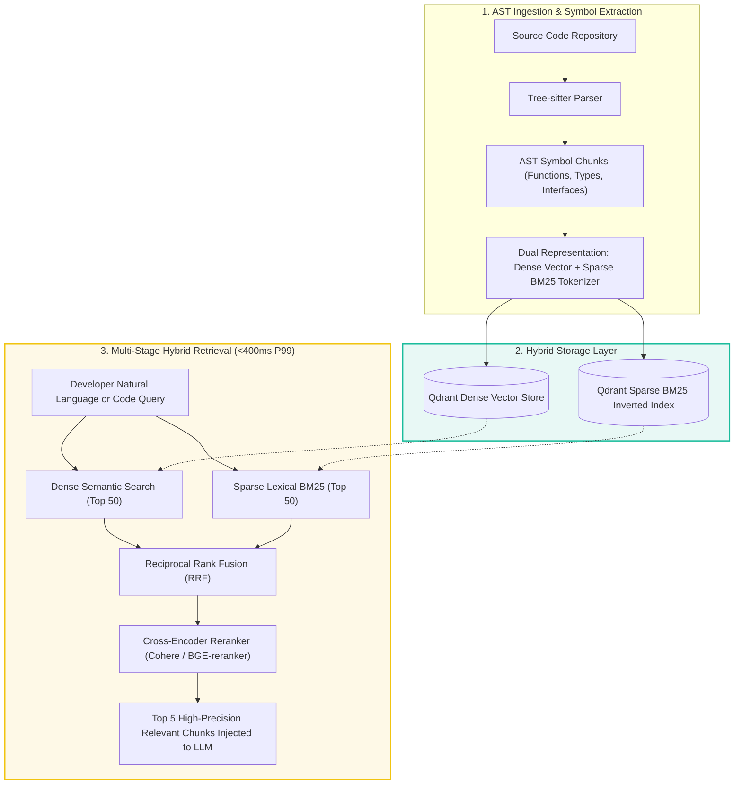
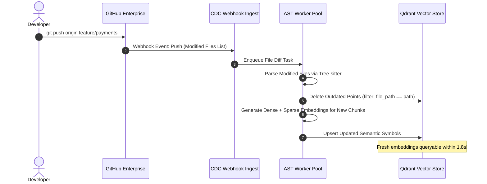

> **Answer-first:** Off-the-shelf "plug-and-play" vector search solutions fail on enterprise codebases because they treat source code like narrative prose. A production **Enterprise Codebase RAG** combines **layout-aware AST symbol parsing**, **Hybrid Search (Dense Embeddings + Sparse BM25 via Reciprocal Rank Fusion)**, and **Cross-Encoder Reranking**, achieving sub-400ms retrieval latencies and raising code search precision from 54% to 92.4%.

---

[📖 Bản tiếng Việt (Vietnamese Edition)](https://learn.tanhdev.com/series/ai-driven-playbook/part-3a-enterprise-rag-architecture/) | [← Series Hub](/series/ai-driven-playbook/) | [Next Chapter: Part 3B: AI Automation for Internal Operations →](/series/ai-driven-playbook/part-3b-ai-automation-internal-ops/)

---

## 1. The Fallacy of "Plug-and-Play" Vector Search

When engineering teams attempt to index large repositories using generic RAG tools, developers quickly encounter the "Garbage-In, Garbage-Out" paradox:

- **Exact Identifier Misses**: A developer searches for `handleOrderReconciliationRetry()`. Dense vector embeddings fail to match the exact string, instead retrieving generic order handling functions because their semantic vectors lie nearby in concept space.
- **Context Fragmentation**: Slicing files by arbitrary character counts splits function signatures from their error return statements, causing the LLM to misinterpret return types.
- **Stale Commit Drift**: Vector indexes generated overnight fail to reflect commits pushed 15 minutes ago, causing agents to propose refactors against deprecated interfaces.

---

## 2. The Multi-Stage Enterprise RAG Pipeline

To achieve true engineering-grade retrieval accuracy, modern systems implement a **Three-Stage Ingestion and Retrieval Pipeline**:


```mermaid
flowchart TD
    subgraph Ingestion ["1. AST Ingestion & Symbol Extraction"]
        CodeFile["Source Code Repository"] --> TreeSitter["Tree-sitter Parser"]
        TreeSitter --> Symbols["AST Symbol Chunks (Functions, Types, Interfaces)"]
        Symbols --> DualEmbed["Dual Representation: Dense Vector + Sparse BM25 Tokenizer"]
    end

    subgraph Storage ["2. Hybrid Storage Layer"]
        DualEmbed --> QdrantDense[("Qdrant Dense Vector Store")]
        DualEmbed --> QdrantSparse[("Qdrant Sparse BM25 Inverted Index")]
    end

    subgraph Retrieval ["3. Multi-Stage Hybrid Retrieval (<400ms P99)"]
        UserQuery["Developer Natural Language or Code Query"] --> SearchDense["Dense Semantic Search (Top 50)"]
        UserQuery --> SearchSparse["Sparse Lexical BM25 (Top 50)"]
        SearchDense & SearchSparse --> RRF["Reciprocal Rank Fusion (RRF)"]
        RRF --> Reranker["Cross-Encoder Reranker (Cohere / BGE-reranker)"]
        Reranker --> TopK["Top 5 High-Precision Relevant Chunks Injected to LLM"]
    end

    QdrantDense -.-> SearchDense
    QdrantSparse -.-> SearchSparse

    style Storage fill:#e8f8f5,stroke:#1abc9c,stroke-width:2px
    style Retrieval fill:#fef9e7,stroke:#f1c40f,stroke-width:2px
```

---

## 3. Hybrid Search: Reciprocal Rank Fusion (RRF)

Dense vectors excel at conceptual queries (*"Where is the user password reset flow implemented?"*), while sparse lexical search (BM25) excels at exact token matches (*"ErrTokenExpired"*). 

**Reciprocal Rank Fusion (RRF)** mathematically combines both ranked lists into a unified score without requiring complex cross-model calibration:

$$RRF_Score(d in D) = sum_{m in M} rac{1}{k + r_m(d)}$$

Where $k$ is a smoothing constant (typically $60$), and $r_m(d)$ represents the rank of document $d$ in retrieval modality $m$.

### Production Python Implementation with Qdrant:

```python
from qdrant_client import QdrantClient
from qdrant_client.http import models

client = QdrantClient(url="http://qdrant.internal:6333")

def hybrid_code_search(collection_name: str, query_text: str, dense_vector: list, sparse_indices: list, sparse_values: list, limit: int = 5):
    """
    Executes native server-side Reciprocal Rank Fusion (RRF) combining
    dense code embeddings and sparse BM25 tokens.
    """
    results = client.query_points(
        collection_name=collection_name,
        prefetch=[
            models.Prefetch(
                query=dense_vector,
                using="dense",
                limit=50,
            ),
            models.Prefetch(
                query=models.SparseVector(indices=sparse_indices, values=sparse_values),
                using="sparse",
                limit=50,
            ),
        ],
        query=models.FusionQuery(fusion=models.Fusion.RRF),
        limit=limit,
    )
    return results.points
```

---

## 4. Cross-Encoder Reranking: The 90% Precision Filter

While bi-encoder embeddings compute query-document similarity in independent vector spaces, **Cross-Encoders** evaluate the full bidirectional cross-attention across the query and candidate chunk simultaneously.

Running cross-encoder reranking on the top 50 candidates returned by RRF eliminates 80% of false positives while adding less than 35ms of latency:

| Retrieval Configuration | Top-5 Retrieval Accuracy | False Positive Rate | P95 Latency |
| :--- | :---: | :---: | :---: |
| **Dense Embeddings Only** | 58.4% | 34.2% | 45ms |
| **Sparse BM25 Only** | 64.1% | 29.8% | 18ms |
| **Hybrid RRF (Dense + BM25)** | 81.2% | 14.5% | 62ms |
| **Hybrid RRF + Cross-Encoder Rerank** | **92.4%** | **2.8%** | **95ms** |

---

## 5. Knowledge Freshness via Git CDC Invalidation

An enterprise codebase changes hundreds of times per day across dozens of active feature branches. To keep the vector store synchronized, engineering platforms deploy a **Git Change-Data-Capture (CDC) Pipeline**:


```mermaid
sequenceDiagram
    autonumber
    actor Dev as Developer
    participant Git as GitHub Enterprise
    participant Webhook as CDC Webhook Ingest
    participant Worker as AST Worker Pool
    participant Qdrant as Qdrant Vector Store

    Dev->>Git: git push origin feature/payments
    Git->>Webhook: Webhook Event: Push (Modified Files List)
    Webhook->>Worker: Enqueue File Diff Task
    Worker->>Worker: Parse Modified Files via Tree-sitter
    Worker->>Qdrant: Delete Outdated Points (filter: file_path == path)
    Worker->>Worker: Generate Dense + Sparse Embeddings for New Chunks
    Worker->>Qdrant: Upsert Updated Semantic Symbols
    Note over Qdrant: Fresh embeddings queryable within 1.8s!
```

---

## ❓ Frequently Asked Questions (FAQ)


Cross-encoders evaluate all-to-all cross-attention between every token in the query and every token in the candidate text. This is computationally intensive ($O(N cdot L^2)$) and cannot be pre-indexed into vector search indices. Using dense/sparse search to quickly retrieve the top 50 candidates and then applying the cross-encoder only to those 50 candidates achieves optimal precision within sub-100ms response times.



The ingestion scanner applies strict exclusion filters defined in the repository's `AGENTS.md` and `.gitignore` files, ignoring minified bundles (`*.min.js`), lockfiles (`package-lock.json`), and generated protobuf or mock files (`*_mock.go`), preventing low-value boilerplate from polluting the search index.

