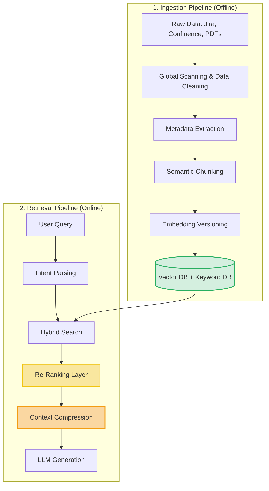

> **Prerequisite:** Familiarity with the concepts introduced in [Part 1 — Context Engineering Ddd](/series/ai-driven-playbook/part-1-context-engineering-ddd/). Review it first if the terminology in this part is unfamiliar.

> **Answer-first:** Enterprise RAG architectures replace naive text chunking with multi-stage data pipelines combining layout-aware global scanning, hybrid dense-sparse vector search, and cross-encoder context reranking. This architecture eliminates table slicing hallucinations, enforces metadata access controls, and cuts retrieval prompt token overhead by 70% while maintaining sub-400ms end-to-end query latency.

---

90% of RAG (Retrieval-Augmented Generation) tutorials online are simple toy examples: Write 10 lines of Python, read a PDF file, perform naive chunking, stuff it into a Vector Database, and then run a Q&A.

When you apply that system in an enterprise environment, it fails. In an enterprise context, RAG is not an AI problem; inherently, it is a **Data Architecture Problem**.

---

## 1. The "Plug-and-Play" Illusion & Garbage-In, Garbage-Out

Enterprise RAG fails when naive vector ingestion processes uncleaned documents, creating low-quality context embeddings that lead to hallucinated answers.

The biggest pain point of Enterprise RAG is "Data Noise" generated from un-structured Naive Chunking.

> 🔥 **[Production Failure]: The SKU and Quantity Mix-up Disaster**
> A Logistics company used RAG to extract reconciliation data from thousands of scanned PDF invoices. They used a fixed-size chunking algorithm, cutting text every 500 characters.
> When the LLM received the query: *"How many products with the code VNM-2024 did Customer X buy?"*, because the chunking algorithm accidentally sliced a data table in half, the LLM mistook the number `2024` in the SKU code for the "Quantity" column.
> Result: The system automatically dispatched 2,024 products from the warehouse instead of 5. The company suffered heavy financial losses.
> 📊 **Impact Metrics:** Erroneously dispatched 2,019 products, resulting in $45,000 in warehousing and customer compensation damages.
> 📈 **Before/After (Post Semantic Chunking):**
> - **Before:** Table Hallucination rate reached up to 35%.
> - **After:** Semantic Chunking preserved table structures and Headings. Data misread rate plummeted to **< 1%**.

To solve this, we cannot just shove data blindly into the system. A complete Data Pipeline is required.

---

## 2. Enterprise RAG Pipeline Architecture

Enterprise RAG pipelines combine layout-aware document ingestion, hybrid dense-sparse vector indexing, reranking models, and RBAC security gates.

**Enterprise RAG Pipeline Architecture Topology:** The architecture diagram details the two-stage execution path: offline document ingestion with global scanning and online hybrid retrieval with cross-encoder reranking.


```mermaid
graph TD
    subgraph "1. Ingestion Pipeline (Offline)"
        Raw["Raw Data: Jira, Confluence, PDFs"] --> Scanner["Global Scanning & Data Cleaning"]
        Scanner --> Metadata[Metadata Extraction]
        Metadata --> Chunk[Semantic Chunking]
        Chunk --> Embed[Embedding Versioning]
        Embed --> VectorDB[("Vector DB + Keyword DB")]
    end

    subgraph "2. Retrieval Pipeline (Online)"
        Query[User Query] --> Intent[Intent Parsing]
        Intent --> Hybrid[Hybrid Search]
        VectorDB --> Hybrid
        Hybrid --> Ranker[Re-Ranking Layer]
        Ranker --> Compress[Context Compression]
        Compress --> LLM[LLM Generation]
    end

    style VectorDB fill:#d4efdf,stroke:#27ae60,stroke-width:2px
    style Ranker fill:#f9e79f,stroke:#f1c40f,stroke-width:2px
    style Compress fill:#fad7a1,stroke:#f39c12,stroke-width:2px
```

---

## 3. Data Ingestion & The "Global Scanning" Technique

Global scanning techniques parse document structures into hierarchical AST trees, generating multi-level summary embeddings for complex enterprise files.

Instead of chopping up text by character count (Fixed-size chunking), use the **Global Scanning** technique.

When ingesting an invoice or a Confluence document, the system executes **2 passes**:
*   **Pass 1 (Global Scan):** Use a small model (like Llama 3 8B) to skim the entire document and extract clear, structured fields: `SKU Code`, `Creation Date`, `Author`, `Document Type`.
*   **Pass 2 (Semantic Chunking):** Based on Markdown structure or HTML tags, split the text by "Arguments" (Heading/Paragraph) rather than cutting midway through sentences.

As a result, the invoice data table remains intact with its row/column structure, ensuring the AI never confuses an SKU code with a Quantity.

**LLM Metadata Extraction Script:** The `extract_metadata` function utilizes Pydantic and the Instructor library to enforce type-safe metadata extraction from raw enterprise documents using an internal LLM endpoint.

```python
from pydantic import BaseModel
import instructor
from openai import OpenAI

# Define a strict, deterministic Data Schema
class DocumentMetadata(BaseModel):
    document_type: str
    author: str
    creation_date: str
    sku_codes: list[str]

# Use the Instructor library to force the LLM to return valid Pydantic JSON
client = instructor.from_openai(OpenAI(base_url="https://ai.yourcompany.internal/v1"))

def extract_metadata(raw_text: str) -> DocumentMetadata:
    return client.chat.completions.create(
        model="local-llama3", # Use a free internal model to save global scanning costs
        response_model=DocumentMetadata,
        messages=[
            {"role": "system", "content": "You are a metadata extraction system. Do not add extra text."},
            {"role": "user", "content": f"Extract from the following document: {raw_text[:2000]}"}
        ],
    )
```

**Semantic Markdown Chunking Implementation:** The `MarkdownHeaderTextSplitter` snippet demonstrates dividing markdown documentation by header boundaries rather than fixed character counts to prevent table and sentence fragmentation.

```python
from langchain_text_splitters import MarkdownHeaderTextSplitter

markdown_document = "# Monthly Report\n## Revenue\n100 Billion\n## Costs\n..."

# Split text based on semantic structure (Headings) instead of character counts
headers_to_split_on = [
    ("#", "Header 1"),
    ("##", "Header 2"),
]

markdown_splitter = MarkdownHeaderTextSplitter(
    headers_to_split_on=headers_to_split_on,
    strip_headers=False
)
semantic_chunks = markdown_splitter.split_text(markdown_document)
# Result: Text chunks are never broken mid-table or mid-thought.
```

---

## 4. Metadata Strategy & Hybrid Search

Combining metadata payload pre-filtering with hybrid vector retrieval ensures that enterprise search queries target exact document versions and authorization tiers.

LLM Embeddings struggle at finding exact keywords (Exact Match). If you search for the error code `"ERR_KAFKA_502"`, a Vector algorithm might return generic HTTP 502 errors because their "semantics" are similar.

This is why Enterprise RAG mandates **Hybrid Search**:
1. **Dense Retrieval (Vector Search):** Used to capture meaning (e.g., "How to set up the dev environment").
2. **Sparse Retrieval (BM25 / Keyword Search):** Used to precisely catch code snippets, UUIDs, and SKU codes.

**[RAG Retrieval Matrix] [Specification]:** The `reciprocal_rank_fusion` function merges BM25 keyword rankings with dense vector distance scores using Reciprocal Rank Fusion to generate unified context candidates.

```python
from typing import List, Dict, Any

def reciprocal_rank_fusion(dense_results: List[Dict[str, Any]], sparse_results: List[Dict[str, Any]], k: int = 60) -> List[Dict[str, Any]]:
    """Combines dense vector and sparse BM25 retrieval scores using RRF."""
    rrf_scores = {}
    
    for rank, doc in enumerate(dense_results):
        doc_id = doc["id"]
        rrf_scores[doc_id] = rrf_scores.get(doc_id, 0.0) + (1.0 / (k + rank + 1))
        
    for rank, doc in enumerate(sparse_results):
        doc_id = doc["id"]
        rrf_scores[doc_id] = rrf_scores.get(doc_id, 0.0) + (1.0 / (k + rank + 1))
        
    sorted_docs = sorted(rrf_scores.items(), key=lambda item: item[1], reverse=True)
    return [{"id": doc_id, "score": score} for doc_id, score in sorted_docs]
```

---

## 5. Knowledge Freshness: Keeping Data "Fresh"

Knowledge freshness requires streaming CDC synchronization and automated vector TTL invalidation to prevent outdated documentation from entering RAG contexts.

A RAG system becomes unreliable if the AI guides Devs using a Deprecated Docs file from 3 years ago. Architects must have a **Knowledge Freshness** strategy:

1. **Temporal Ranking:** In the results scoring algorithm, documents updated last week must receive a higher weight (decay function) compared to documents from last year.
2. **Stale Embedding Invalidation:** Integrate Webhooks with Jira/Confluence. When a ticket status moves to `Done` or is deleted, the Pipeline must immediately soft-delete the old vector and embed the new one.
3. **Hot/Cold Knowledge Tier:** Current Config files and Codebases $\rightarrow$ Stored in RAM/Hot DB. Chat logs from 2023 $\rightarrow$ Stored in Cold Storage to save infrastructure costs.

---

## 6. Context Compression & Re-Ranking

Cross-encoder reranking models compress retrieved vector candidates down to the top-N most relevant context snippets, maximizing LLM prompt efficiency.

Suppose Hybrid Search returns the top 20 chunks of text. If you throw all 20 chunks into a prompt for Claude 3.5, you will burn around 15,000 tokens (costing money) and the AI's focus gets diluted (Lost in the Middle).

This is where the **Re-Ranking Layer** steps in. Use a tiny Cross-Encoder model (like `bge-reranker`) to re-score the relevance of those 20 chunks against the original query. It filters down to the 3 most essential chunks.

Next, pass these 3 chunks through a **Context Compression** engine.
> [!TIP]
> Instead of sending the full block: *"In the event of a network error, the system will execute a retry 3 times and then call the fallback function"*, the system compresses it to: *"Retry 3x on network error -> fallback"*.
> [!IMPORTANT] Cost Analysis
> Re-Ranking + Compression techniques reduce Prompt Tokens by 70%, saving thousands of USD per month and pushing answer accuracy to high precision.

> [!NOTE] Performance Benchmark (RAG Latency)
> - **Pure Vector Search:** ~45ms (Fast but noisy).
> - **Hybrid Search (BM25 + Vector) + Metadata Filter:** ~120ms (High accuracy).
> - **Cross-Encoder Re-ranking Layer:** ~200ms (Added latency but extremely worthwhile).
> - **Total Retrieval Time:** **~365ms** $\rightarrow$ 50x faster than dumping thousands of pages of docs into an LLM and forcing it to read (takes ~15s).

---

## 7. Troubleshooting: Diagnosing "RAG Low Accuracy"

Diagnosing low RAG accuracy involves isolating ingestion chunk boundary loss, vector distance scoring thresholds, and reranker threshold settings.

When accuracy drops in production, engineers follow this structured diagnostic matrix:

| Failure Symptom | Root Cause | Engineering Resolution | Target Metric |
|---|---|---|---|
| **High Table Hallucinations (>35%)** | Fixed-size chunking split data tables mid-row | Switch to Markdown/AST Header Semantic Chunking | Hallucinations < 1% |
| **Alphanumeric Code Search Misses** | Dense embeddings lack exact match tokenization | Deploy Sparse BM25 + Dense Hybrid Search with RRF | Code Recall @ 5 > 95% |
| **Deprecated Doc Injection** | Missing temporal decay & TTL invalidation | Implement CDC Webhook vector invalidation pipeline | Freshness SLA < 5 min |
| **High Token Cost & Latency** | Unfiltered candidate injection into prompt | Integrate Cross-Encoder Re-Ranker filtering top 20 to top 3 | 70% Token Reduction |

---

## Key Takeaways

Building an internal enterprise RAG brain requires document preprocessing, hybrid vector search, context reranking, and continuous accuracy monitoring.

An **Enterprise RAG Architecture** relies on data engineering discipline during cleaning, backend expertise when configuring Hybrid Search, and systems architecture vision to maintain knowledge lifecycle freshness.

Once this internal "Brain" is loaded with clean, accurate, and real-time data, it is time to deploy it for operational velocity and financial return.

In **[Part 3B — AI Automation for Internal Ops](/series/ai-driven-playbook/part-3b-ai-automation-internal-ops/)**, we explore how to use the AI Platform and RAG to solve operational problems: automated incident triage, dependency migrations, and internal developer support.

---

## Frequently Asked Questions

### Why does Naive RAG fail in production enterprise environments?
Naive RAG relies on fixed-character chunking that slices data tables, code blocks, and sentence structures in half. This creates fragmented embeddings that cause LLMs to misinterpret numeric columns, hallucinate relationships, and deliver inaccurate answers.

### What is the benefit of combining Dense (Vector) and Sparse (BM25) search?
Dense vector search excels at semantic intent matching but struggles with exact alphanumeric strings like SKU numbers, error codes, and UUIDs. Sparse BM25 search captures exact keyword matches, and combining both via Reciprocal Rank Fusion (RRF) ensures both high recall and high precision.

### How does a cross-encoder reranking layer optimize token costs?
Hybrid search retrieves a candidate set of 20-50 vector chunks, which would consume significant token budget if sent directly to an LLM. A lightweight cross-encoder model (e.g. BGE-Reranker) rescores these candidates in milliseconds, filtering them down to the top 3-5 most relevant chunks and reducing prompt tokens by 70%.

🔗 **Next Step:** Continue to [Part 3B — Ai Automation Internal Ops](/series/ai-driven-playbook/part-3b-ai-automation-internal-ops/) for the following module in the series.
