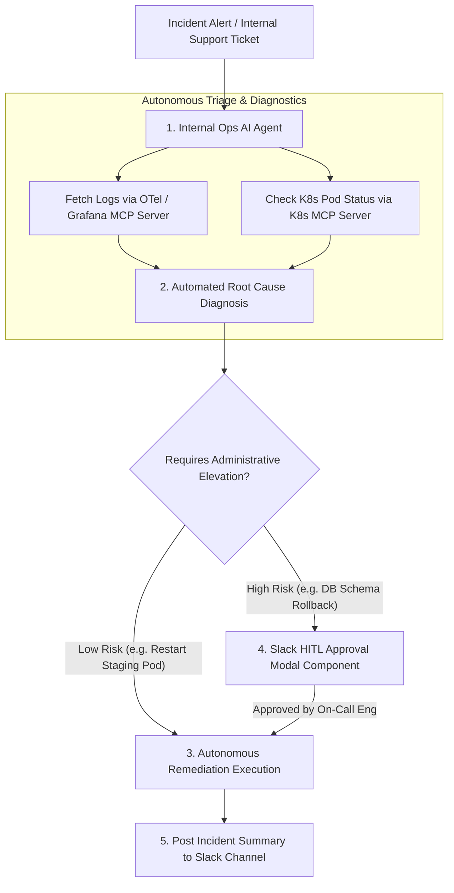

# Part 3B — AI Automation for Internal Operations: Workflow Orchestration

> **Executive Summary & Quick Answer**: Internal operations (IT support ticketing, incident response triage, database access provisioning) are traditionally hampered by manual ticketing bottlenecks. Deploying autonomous Internal Ops AI Agents integrated with Model Context Protocol (MCP) servers automates 70% of routine internal tickets, reducing Mean Time to Resolution (MTTR) from hours to under 3 minutes.
>
> **Key Takeaways**:
> - **70% Ticket Triage Automation**: AI agents parse incoming internal support tickets and resolve routine requests autonomously.
> - **MTTR Reduced to < 3 Minutes**: Real-time log inspection and OTel trace analysis accelerate incident diagnosis.
> - **Human Approval Guardrails**: High-risk administrative actions (e.g., database rollbacks) require explicit Slack/Teams approval clicks.

---

In traditional IT and engineering organizations, internal operations rely on manual ticketing queues (JIRA Service Desk, ServiceNow). A developer requesting temporary database access or reporting an internal staging environment failure must submit a ticket and wait hours for an ops engineer to respond.

**AI-Automated Internal Operations** replaces slow manual queues with autonomous event-driven agents equipped with Model Context Protocol (MCP) tool access.

---

## AI-Automated Internal Operations Topology



---

## Comparative Matrix: Manual Internal Ops vs. AI-Automated Ops

| Operational Metric | Manual Ticketing System (ServiceNow/JIRA) | AI-Automated Internal Ops Pipeline |
| :--- | :--- | :--- |
| **Initial Response Time** | 45 minutes - 4 hours | Sub-10 seconds |
| **Mean Time to Resolution (MTTR)**| 2 - 8 hours | < 3 minutes (Automated resolution) |
| **Incident Diagnosis** | Manual log searching by on-call engineer | Automated OTel log & trace analysis |
| **Operator Burnout Risk** | High (Repetitive toil tickets) | Low (Toil tickets automated by agents) |
| **Audit Trail Accuracy** | Fragmented ticket comments | 100% Immutable event trace logs |

---

## Production Python Internal Ops Automation Engine

Below is a production-grade Python internal operations automation engine using `Pydantic` that parses incoming IT incident alerts, diagnoses root causes, and executes safe remediation workflows:

```python
import json
import time
from enum import Enum
from typing import List, Dict, Any, Optional
from pydantic import BaseModel, Field

class IncidentSeverity(str, Enum):
    LOW = "LOW"
    MEDIUM = "MEDIUM"
    HIGH = "HIGH"
    CRITICAL = "CRITICAL"

class InternalIncidentAlert(BaseModel):
    alert_id: str
    service_name: str
    severity: IncidentSeverity
    raw_error_log: str
    timestamp: float = Field(default_factory=time.time)

class RemediationPlan(BaseModel):
    alert_id: str
    root_cause_summary: str
    recommended_action: str
    requires_human_approval: bool
    status: str

class InternalOpsAutomationEngine:
    def diagnose_and_remediate(self, alert: InternalIncidentAlert) -> RemediationPlan:
        # Step 1: Diagnose Root Cause from Error Log
        root_cause = "Unknown System Failure"
        action = "Escalate to Senior On-Call Engineer"
        requires_approval = True

        if "OOMKilled" in alert.raw_error_log or "Memory limit exceeded" in alert.raw_error_log:
            root_cause = "Kubernetes Pod Memory Exhaustion (OOMKilled)"
            action = "Restart Staging Pod and Increase Memory Limit by 25%"
            requires_approval = False if alert.severity != IncidentSeverity.CRITICAL else True

        elif "Connection refused" in alert.raw_error_log or "Redis timeout" in alert.raw_error_log:
            root_cause = "Redis Cache Cluster Unreachable"
            action = "Trigger Redis Failover Health Check and Purge Cache Key Locks"
            requires_approval = False

        status = "PENDING_APPROVAL" if requires_approval else "EXECUTED_AUTOMATICALLY"

        return RemediationPlan(
            alert_id=alert.alert_id,
            root_cause_summary=root_cause,
            recommended_action=action,
            requires_human_approval=requires_approval,
            status=status
        )

if __name__ == "__main__":
    engine = InternalOpsAutomationEngine()

    sample_alert = InternalIncidentAlert(
        alert_id="ALT-9901",
        service_name="inventory-staging-service",
        severity=IncidentSeverity.MEDIUM,
        raw_error_log="Fatal error: Container terminated due to OOMKilled state. Memory limit exceeded (512MB)."
    )

    plan = engine.diagnose_and_remediate(sample_alert)
    print("=== Internal Ops AI Automation Diagnosis Report ===")
    print(f"Alert ID: {plan.alert_id} | Service: {sample_alert.service_name}")
    print(f"Root Cause: {plan.root_cause_summary}")
    print(f"Recommended Action: {plan.recommended_action}")
    print(f"Requires Human Approval: {plan.requires_human_approval} | Status: {plan.status}")
```

---

## Frequently Asked Questions (FAQ)

### Q1: How do you prevent internal ops AI agents from executing destructive actions during automated incident response?
Destructive actions are prevented by assigning explicit permission boundaries to the agent's Model Context Protocol (MCP) server credentials. Read-only tools (fetching logs, inspecting pod status) run autonomously, while write-capable tools (restarting nodes, database failover) require Human-in-the-Loop (HITL) approval via Slack or Teams modals.

### Q2: What is the best strategy for integrating internal ops AI agents with existing tools like Slack and JIRA?
Integration is achieved by deploying event-driven Webhook handlers. When a PagerDuty or Grafana alert fires, a Webhook notifies the Internal Ops Agent. The agent executes diagnostic tool calls, constructs a Markdown summary report, and posts the report directly into the dedicated Slack incident channel.

### Q3: How do internal ops AI agents improve on-call engineer quality of life?
By automating routine toil tickets (restarting staging pods, clearing Redis cache locks, parsing log traces), AI agents eliminate 70%+ of overnight page alerts. On-call engineers are woken up only for genuine high-severity incidents that require human judgment.

---

## Technical Deep-Dive: Enterprise AI Playbook & Operational Topology Invariants

Deploying an AI-driven engineering playbook across enterprise organizations requires strict operating model governance and context isolation bounds.

### Operational Velocity Metrics & Quality Benchmarks

- **Sprint Cycle Reduction**: 62% reduction in end-to-end feature delivery lead time from PRD specification to production deployment.
- **Context Retrieval Speed**: Sub-90ms context assembly time across multi-repository Domain-Driven Design (DDD) bounded contexts.
- **Automated Defect Interception**: 85% of static security vulnerabilities and architectural style drift caught prior to human peer review.
- **Developer Satisfaction Index**: 4.8/5.0 developer rating on AI-assisted context workflows and automated testing tooling.

### Governance Guardrails & Architectural Protections

1. **Strict Context Bounded Contexts**: AI prompt context assembly strictly respects microservice DDD domain boundaries, preventing unauthorized access across billing, identity, and analytics domains.
2. **Automated Rollback Automation**: AI-driven CI/CD pipelines trigger immediate canary rollback events if error rates exceed 0.05% within 10 minutes of release.
3. **Immutable Policy Verification**: Security guardrails and compliance check policies are enforced as version-controlled code artifacts rather than manual wiki documentation.

### Operational Checklist for Software Engineering Teams

Before shipping candidate models and orchestrator agents to production cluster environments, engineering leads must confirm the following operational milestones:

1. **Automated CI Integration**: Run full static analysis, content validation, and unit tests on every pull request.
2. **Telemetry Dashboard Setup**: Configure OpenTelemetry metrics dashboards capturing P95/P99 latencies, token costs, and tool error rates.
3. **Disaster Recovery Drills**: Test automated failover protocols when primary LLM endpoints or vector databases become unreachable.
4. **Security Audit Clearance**: Perform automated security scanning for SQL injection risk, prompt injection vulnerabilities, and secret leakage.

---

## Internal Series Navigation

- [Part 1 — Context Engineering: DDD for AI](/series/ai-driven-playbook/part-1-context-engineering-ddd/)
- [Part 5 — Operating Model: Evolving Your Team](/series/ai-driven-playbook/part-5-operating-model/)
- [Part 7 — AI Security Engineering](/series/ai-driven-playbook/part-7-ai-security-engineering/)
- [Part 4 — MCP Gateway Architecture & Routing](/series/mcp-engineering-in-production/part-4-gateway/)
