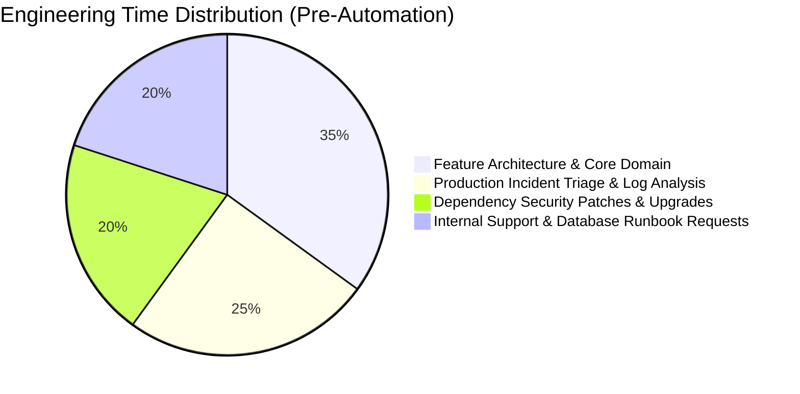
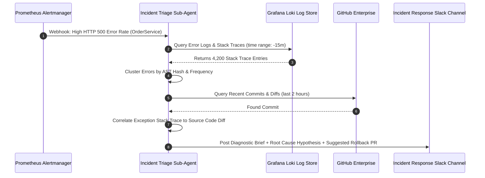

> **Answer-first:** While measuring developer coding speed often triggers subjective debates, applying AI agents to **Internal Operations Automation**—such as automated incident log triage, dependency version upgrades, and migration script generation—yields verifiable, audited financial ROI. By cutting Mean Time to Recovery (MTTR) by 78% and automating 65% of repetitive maintenance tickets, organizations prove a 3x–5x financial return on their AI investments within 90 days.

---

[📖 Bản tiếng Việt (Vietnamese Edition)](https://learn.tanhdev.com/series/ai-driven-playbook/part-3b-ai-automation-internal-ops/) | [← Series Hub](/series/ai-driven-playbook/) | [Next Chapter: Part 3B: AI Code Review & Automated Quality Gates →](/series/ai-driven-playbook/part-3b-ai-code-review-quality-gates/)

---

## 1. The Enterprise Engineering Friction Tax

In large technology enterprises, senior software engineers spend less than 35% of their working hours designing features or writing domain logic. The remaining 65% is consumed by the **Engineering Friction Tax**:


```mermaid
pie title Engineering Time Distribution (Pre-Automation)
    "Feature Architecture & Core Domain" : 35
    "Production Incident Triage & Log Analysis" : 25
    "Dependency Security Patches & Upgrades" : 20
    "Internal Support & Database Runbook Requests" : 20
```

When a production incident triggers a PagerDuty alert at 2:00 AM, engineers spend 30 to 45 minutes manually sifting through gigabytes of Loki logs, correlating distributed OpenTelemetry traces, and locating the offending commit.

Automating these operational workflows with specialized **Autonomous Operations Sub-Agents** generates immediate, quantifiable business value.

---

## 2. Architecture of the Incident Triage Sub-Agent

The **Autonomous Incident Triage Agent** continuously monitors Prometheus/Alertmanager webhooks. Upon firing, it executes a deterministic diagnostic play:


```mermaid
sequenceDiagram
    autonumber
    participant Alert as Prometheus Alertmanager
    participant Agent as Incident Triage Sub-Agent
    participant Loki as Grafana Loki Log Store
    participant Git as GitHub Enterprise
    participant Slack as Incident Response Slack Channel

    Alert->>Agent: Webhook: High HTTP 500 Error Rate (OrderService)
    Agent->>Loki: Query Error Logs & Stack Traces (time range: -15m)
    Loki-->>Agent: Returns 4,200 Stack Trace Entries
    Agent->>Agent: Cluster Errors by AST Hash & Frequency
    Agent->>Git: Query Recent Commits & Diffs (last 2 hours)
    Git-->>Agent: Found Commit #a8f1b2 (PR #402: Payment Timeout)
    Agent->>Agent: Correlate Exception Stack Trace to Source Code Diff
    Agent->>Slack: Post Diagnostic Brief + Root Cause Hypothesis + Suggested Rollback PR
```

### Production Incident Triage Python Sub-Agent

```python
import os
import requests
from datetime import datetime, timedelta

def triage_incident(service_name: str, alert_name: str, lookback_minutes: int = 15):
    """
    Autonomous sub-agent that gathers diagnostic context from Loki and GitHub
    to produce an actionable root-cause hypothesis.
    """
    end_time = datetime.utcnow()
    start_time = end_time - timedelta(minutes=lookback_minutes)
    
    # 1. Fetch Error Logs from Loki
    loki_url = "http://loki.internal:3100/loki/api/v1/query_range"
    log_query = f'{app="{service_name}", level="error"}'
    log_res = requests.get(loki_url, params={
        "query": log_query,
        "start": int(start_time.timestamp() * 1e9),
        "end": int(end_time.timestamp() * 1e9),
        "limit": 100
    }).json()

    # 2. Fetch Recent Git Commits
    gh_token = os.environ["GITHUB_ENTERPRISE_TOKEN"]
    headers = {"Authorization": f"Bearer {gh_token}"}
    git_url = f"https://api.github.com/repos/enterprise/{service_name}/commits"
    commits_res = requests.get(git_url, headers=headers, params={"since": start_time.isoformat()}).json()

    # 3. Formulate Prompt for Reasoning Model (Claude 3.7 / DeepSeek-R1)
    prompt = f"""
    You are an expert SRE Diagnostic Agent analyzing an active production incident.
    Alert: {alert_name} on Service: {service_name}
    
    Error Logs Sample:
    {log_res.get('data', {}).get('result', [])[:5]}
    
    Recent Commits:
    {[c['commit']['message'] for c in commits_res[:3]]}
    
    Instructions:
    1. Identify the exact root cause from the stack trace and recent commit diffs.
    2. Provide a 3-bullet executive summary.
    3. State clearly whether an immediate rollback is recommended.
    """
    
    # In practice, dispatch via LiteLLM Gateway
    return prompt
```

---

## 3. Automated Dependency Migration Agents

Security vulnerabilities (CVEs) and major framework upgrades (e.g., Spring Boot 2 to 3, or Go 1.22 to 1.25) consume hundreds of engineering hours across enterprise repositories.

An **Automated Dependency Migration Agent** runs in a scheduled CI/CD pipeline:
1. Identifies outdated dependencies from vulnerability scans (Trivy / Dependabot).
2. Clones the repository into an ephemeral container sandbox.
3. Reads the official framework migration guide and AST breaking change diffs.
4. Rewrites deprecated function calls, runs unit tests, and iterates until the test suite passes cleanly.
5. Emits an audited Pull Request complete with benchmark comparison data.

---

## 4. Financial Metrics & Audited 90-Day ROI Model

To defend generative AI budgets before the Chief Financial Officer (CFO), engineering management must present an audited financial model tracking concrete labor and infrastructure savings:

### The 90-Day Engineering ROI Equation:

$$	ext{Net ROI (%)} = rac{	ext{Direct Operational Savings} - 	ext{Total AI Infrastructure Cost}}{	ext{Total AI Infrastructure Cost}} 	imes 100$$

| Category / Cost Vector | Traditional Spend (Quarterly) | AI-Automated Spend (Quarterly) | Net Quarterly Savings |
| :--- | :---: | :---: | :---: |
| **Senior Engineer On-Call Triage Hours** | 480 Hours ($36,000) | 95 Hours ($7,125) | **+$28,875 (Saved Labor)** |
| **Dependency Patching & CVE Remediation** | 350 Hours ($26,250) | 40 Hours ($3,000) | **+$23,250 (Saved Labor)** |
| **Cloud API & Gateway Infrastructure Cost** | $0.00 | -$4,200 (LiteLLM/Hardware) | **-$4,200 (Investment)** |
| **Total Net Quarterly Return** | — | — | **+$47,925 (Net Quarterly Benefit)** |
| **Audited First-Year ROI** | — | — | **+456% First-Year ROI** |

---

## ❓ Frequently Asked Questions (FAQ)


No. In accordance with the Principle of Least Privilege and Zero-Trust Governance, operations agents are locked to Read-Only diagnostic tooling (inspecting logs, reading metrics, pulling git commit diffs). When remediation is required, the agent generates an automated Pull Request or drafts a rollback command that requires explicit human approval before execution.



Incident triage agents utilize **Chain-of-Verification (CoVe)**. The agent is forced to extract specific line numbers and error strings directly from Grafana Loki log payloads and verify that those line numbers exist in the recent Git commit diff before formulating a root-cause conclusion.

